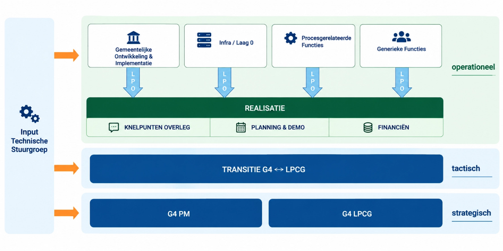
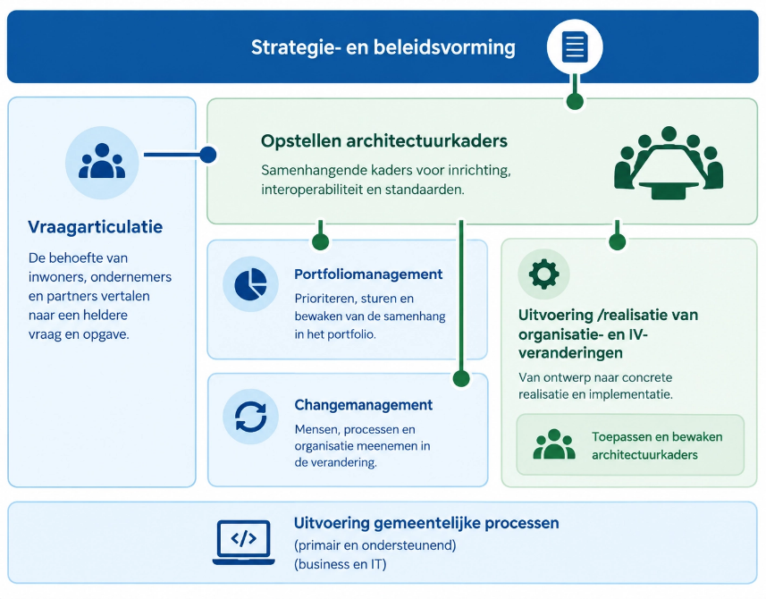

# 3. Governance

## Inleiding

Het Platform Dienstverlening is iteratief ontwikkeld vanuit een samenwerking tussen de vier grote gemeenten (**Amsterdam, Den Haag, Rotterdam en Utrecht**) binnen de Common Ground-beweging. De governance is gedurende de ontwikkeling organisch gegroeid en sluit aan bij de gezamenlijke verantwoordelijkheid voor architectuur, ontwikkeling en beheer van het platform.

Meer uitleg over het proces, en de documentatie van dit proces, staat op:

* Notion – samenwerkruimte Common Ground
  * [Backlog](https://www.notion.so/e9375da1960249bba23c49d038d3c888?pvs=21)
  * [Beschrijving Governance & proces](https://www.notion.so/Proces-backlog-documentatie-21b78b5f4db4804c828fc43bec7b544c?pvs=21)
* GitBook – publieke documentatie Platform Dienstverlening
  * [Introductie | Platform Dienstverlening - Public](https://dienstverleningsplatform.gitbook.io/platform-generieke-dienstverlening-public)

De governance kent verschillende niveaus met elk een eigen verantwoordelijkheid.

### Strategisch niveau

De strategische koers van het platform wordt bepaald door de Common Ground-programma's van de G4. Zij zijn gezamenlijk verantwoordelijk voor de langetermijnvisie, de positionering van het platform, de financiering en de roadmap. Waar relevant vindt afstemming plaats met het **Landelijk Programma Common Ground (LPCG)**, zodat ontwikkelingen aansluiten op landelijke initiatieven en standaarden.

### Tactisch niveau

Op tactisch niveau worden de gezamenlijke ontwikkeling en de samenwerking tussen de G4 en het LPCG georganiseerd. Hier vindt afstemming plaats over prioriteiten, gezamenlijke ontwikkelingen, planning en de transitie van platformonderdelen naar een landelijke governance.

### Operationeel niveau

De dagelijkse ontwikkeling van het platform wordt aangestuurd door de gezamenlijke **Lead Product Owners (LPO's)** van de G4. Iedere LPO is verantwoordelijk voor een afgebakend deel van het platform en stuurt op prioritering, financiering en realisatie van de bijbehorende voorzieningen. Elke LPO vertegenwoordigt ook de stakeholders binnen zijn of haar gemeente. Door deze verdeling kunnen besluiten dichter bij de inhoud worden genomen en wordt de bestuurlijke belasting van het management verminderd. Gezamenlijke afstemming vindt plaats over planning, knelpunten, demonstraties van gerealiseerde functionaliteit en de inzet van beschikbare middelen.

## Architectuurgovernance

De architectuurgovernance wordt uitgevoerd onder verantwoordelijkheid van de **Technische Stuurgroep**, samengesteld uit architecten van de G4. Deze bewaakt de samenhang van de architectuur, geeft richting voor ontwikkelingen op basis van de enterprisearchitectuur en standaarden en adviseert over technische en architectonische keuzes.

Binnen elke individuele gemeente verbindt architectuur strategie en beleid met portfolio, verandering en uitvoering:

Op strategisch niveau draagt architectuur onder meer bij aan:

* **Richting geven aan digitale transformatie** door het formuleren en bewaken van richtinggevende kaders.
* **Bewaken van samenhang en toekomstvastheid** van de informatievoorziening.
* **Adviseren van CIO en management** over de architectuurimpact van strategische keuzes en besluiten.
* **Opstellen van roadmaps** om vastgestelde strategische doelen te vertalen naar concrete ontwikkelingen.
* **Fungeren als escalatiepunt** bij architectuurvraagstukken, waaronder het beoordelen en registreren van afwijkingen van architectuurkaders.

Deze **Enterprise Architectuur Common Ground vormt het o**verkoepelende kader voor architectuur binnen het thema en de scope van Common Ground.

## Doorontwikkeling van de governance

De governance van het Platform Dienstverlening ontwikkelt zich mee met de groei van het platform en de landelijke samenwerking. In 2026 zijn gesprekken gestart om onderdelen van de governance geleidelijk onder te brengen bij het **Landelijk Programma Common Ground (LPCG)**. Doel hiervan is de gezamenlijke verantwoordelijkheid voor generieke voorzieningen verder te versterken, de samenwerking tussen gemeenten te vereenvoudigen en de doorontwikkeling van het platform duurzaam te organiseren.
