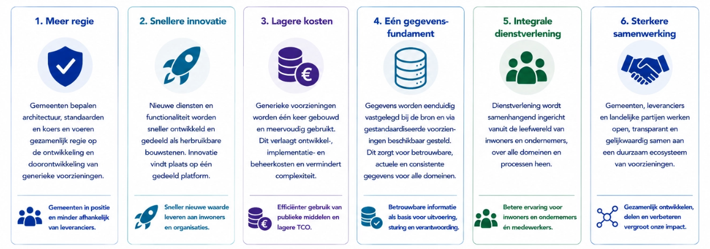
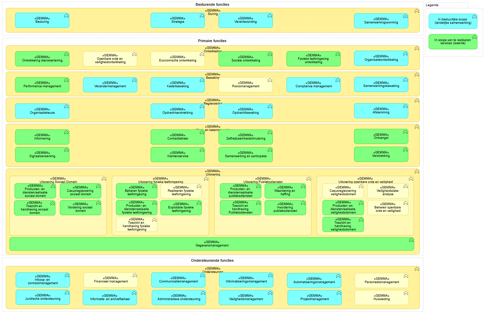

# 5. Visie, principes, scope

| **Compact:**                                                                                                                                                                                                                                                                                                                                                                                                                       |
| ---------------------------------------------------------------------------------------------------------------------------------------------------------------------------------------------------------------------------------------------------------------------------------------------------------------------------------------------------------------------------------------------------------------------------------- |
| Hier wordt bepaald waar we naartoe willen en volgens welke spelregels. De visie draait om dienstverlening die meer samenhangend, informatiegericht, herbruikbaar en minder afhankelijk van individuele leveranciers is. De architectuurprincipes vertalen dat naar concrete uitgangspunten, zoals data bij de bron, data-autonomie, hergebruik, Open Source, generiek vóór specifiek en portabiliteit. Ook wordt de scope bepaald. |

## Inleiding

Dit onderdeel vormt de overgang van **waarom** (de motivatie) naar **wat**. Het beschrijft de visie, doelen en principes van het Platform Dienstverlening. Dit samen geeft richting aan alle daaropvolgende architectuurkeuzes en vormt het gezamenlijke referentiekader voor ontwerp, ontwikkeling, implementatie en beheer. De visie beschrijft de gewenste eindsituatie, de uitgangspunten waarop de architectuur is gebaseerd en de afbakening van het architectuurwerk. Daarmee ontstaat een gemeenschappelijk beeld van wat het Platform Dienstverlening beoogt te realiseren en welke ontwerpprincipes daarbij leidend zijn.

## Visie

Deze architectuur staat niet op zichzelf, maar dient een bredere maatschappelijke doelstelling. De overheid moet inwoners en ondernemers als één samenhangende overheid kunnen bedienen, ongeacht de interne organisatie, processen of het aantal betrokken uitvoeringsorganisaties. Dienstverlening is toegankelijk, begrijpelijk en waar mogelijk proactief, waarbij de menselijke maat centraal blijft staan. Tegelijkertijd vraagt dit om een overheid die zorgvuldig omgaat met persoonsgegevens, transparant is over het gebruik van gegevens en inwoners inzicht en invloed geeft op de informatie die over hen wordt verwerkt. Een moderne informatievoorziening moet deze publieke waarden niet alleen ondersteunen, maar actief mogelijk maken.

Volgens de visie van het Platform Dienstverlening beschikken gemeenten gezamenlijk over één samenhangend digitaal ecosysteem dat de gemeentelijke publieke dienstverlening als geheel ondersteunt en is ingericht om duurzaam antwoord te geven op de uitdagingen die in de motivatie van deze architectuur zijn beschreven. Inwoners, ondernemers en uitvoerend professionals staan daarbij centraal; de informatievoorziening ondersteunt hun werkzaamheden in plaats van deze te beperken. Dienstverlening is integraal, gegevens worden eenmalig vastgelegd en veilig hergebruikt, en nieuwe functionaliteit kan snel worden toegevoegd zonder het gehele informatielandschap te wijzigen.

De relatie tussen gemeenten en leveranciers verschuift van het afnemen van gesloten softwareproducten naar het gezamenlijk ontwikkelen en toepassen van open platformvoorzieningen. Gemeenten voeren gezamenlijk regie op de generieke architectuur en software, terwijl leveranciers concurreren op implementatie, diensten, innovatie en specifieke functionaliteit. Doordat de generieke voorzieningen als Open Source beschikbaar zijn, ontstaat een transparante markt met lagere toetredingsdrempels en meer innovatie voor gemeenten.

## Doelen

De visie beschrijft de gewenste eindsituatie van het Platform Dienstverlening. Om deze visie richting te geven aan architectuur, ontwikkeling en implementatie is zij vertaald naar een aantal strategische doelstellingen. Deze doelen vormen het toetsingskader voor de verdere uitwerking van de architectuur en de keuzes die in de volgende hoofdstukken worden gemaakt.

De doelstellingen bestrijken verschillende dimensies van de gemeentelijke informatievoorziening. Zij richten zich niet uitsluitend op software of techniek, maar ook op dienstverlening, samenwerking, governance en de inrichting van de gemeentelijke softwaremarkt. Gezamenlijk beschrijven zij de beoogde maatschappelijke en organisatorische effecten van het Platform Dienstverlening.

#### Meer regie

Gemeenten voeren gezamenlijk regie op de ontwikkeling van generieke software, architectuur en standaarden. Hierdoor ontstaat meer grip op de inrichting en doorontwikkeling van de gemeentelijke informatievoorziening en neemt de afhankelijkheid van individuele leveranciers af.

#### Snellere innovatie

Nieuwe functionaliteit wordt ontwikkeld als herbruikbare bouwsteen en kan daardoor sneller beschikbaar worden gesteld voor alle deelnemende gemeenten. Innovaties worden gezamenlijk ontwikkeld en continu doorontwikkeld.

#### Lagere maatschappelijke kosten

Door generieke voorzieningen éénmaal te ontwikkelen en meervoudig te gebruiken nemen ontwikkel-, implementatie-, beheer- en migratiekosten af. Investeringen worden gedeeld en publieke middelen doelmatiger ingezet.

#### Eén gegevensfundament

Gegevens worden eenduidig beheerd en vormen een betrouwbare basis voor dienstverlening, besluitvorming en gegevensuitwisseling. Hierdoor ontstaat één consistente informatiebasis voor de gehele gemeentelijke organisatie. Autorisatie, logging en auditing worden als generieke voorzieningen rondom deze gegevenslaag ingericht, waardoor inzichtelijk blijft wie welke gegevens heeft geraadpleegd of gewijzigd en op basis waarvan besluiten tot stand zijn gekomen. Dit versterkt het vertrouwen van de inwoner in de overheid.

#### Integrale dienstverlening

Dienstverlening wordt ingericht vanuit de leefwereld van inwoners, ondernemers en uitvoerend professionals, in plaats van vanuit afzonderlijke applicaties of organisatorische grenzen. Hierdoor ontstaat een samenhangende dienstverlening over domeinen en processen heen. De overheid treedt daarbij zoveel mogelijk op als één overheid: inwoners ervaren één herkenbare dienstverlening, ongeacht de interne organisatie, en uitvoerend professionals beschikken over een integraal beeld om maatwerk te kunnen leveren met behoud van de menselijke maat.

#### Sterkere samenwerking

Gemeenten, leveranciers en landelijke organisaties werken samen aan een open ecosysteem van architectuur, software en standaarden. Door gezamenlijk te ontwikkelen en kennis te delen ontstaat een duurzame basis voor verdere digitalisering van de overheid.

## Architectuurprincipes

De strategische doelstellingen beschrijven wat het Platform Dienstverlening wil bereiken. Dit onderdeel beschrijft de overkoepelende architectuurprincipes, nodig om deze doelstellingen op een consistente en samenhangende manier te realiseren.

Deze principes zijn een samenhangende selectie en concretisering van bestaande uitgangspunten uit landelijke architecturen, gemeentelijk beleid en de praktijk van het Platform Dienstverlening.

De principes zijn afgeleid uit onder meer:

* De informatiekundige visie Common Ground;
* De Nederlandse Digitaliseringsstrategie (NDS);
* Vastgestelde architectuurbesluiten (Architecture Decision Records (ADR's));
* Bestaande platformarchitectuur en technische standaarden;
* Praktijkervaringen uit de ontwikkeling en implementatie van het Platform Dienstverlening binnen G4 en Dimpact.

Deze zijn bewust hoog-over en selectief. Zij zijn gekozen omdat zij de belangrijkste strategische dimensies van het Platform Dienstverlening vertegenwoordigen. Tijdens het opstellen van deze architectuur zijn de principes iteratief gevalideerd met de Technische Stuurgroep, Platformmanagement en architecten van de deelnemende gemeenten.

### Principe: Architectuurgedreven vernieuwing

#### Uitgangspunt

Ontwikkeling begint niet bij de keuze voor een applicatie, maar bij de gewenste dienstverlening, de onderliggende waardestroom en de behoeften van inwoners, ondernemers en uitvoerend professionals. Architectuur bepaalt welke generieke businessfunctionaliteit en voorzieningen nodig zijn om deze dienstverlening te realiseren; software is daarvan de implementatie.

#### Implicaties

* Nieuwe ontwikkelingen starten vanuit de publieke opgave en de businessbehoefte, niet vanuit een applicatie.
* De waardestroom voor inwoners, ondernemers en uitvoerend professionals is leidend bij het ontwerpen van functionaliteit.
* Functionaliteit wordt eerst beoordeeld op generieke toepasbaarheid.
* Hergebruik gaat vóór nieuwbouw.
* Applicaties volgen de architectuur en bepalen deze niet.

**Uitwerking:** Business- en applicatiearchitectuur.

### Principe: Informatiegericht werken

#### Uitgangspunt

Informatie vormt het verbindende element tussen dienstverlening, processen, applicaties en organisatie. Gegevens worden onafhankelijk van individuele processen en applicaties beheerd, zodat zij meervoudig kunnen worden gebruikt. Daarbij wordt niet alleen de gegevensinhoud vastgelegd, maar ook de context die nodig is om de betekenis, herkomst, betrouwbaarheid en samenhang van informatie te begrijpen en te verantwoorden. Implicaties

* Gegevens worden éénmaal vastgelegd en meervoudig gebruikt.
* Processen en dienstverlening geven aanleiding voor het ontstaan en wijzigen van gegevens; ze zijn ook afnemer van informatie; de regie op informatie ligt bij registraties.
*   Registraties bevatten naast gegevens ook de context die nodig is om informatie te interpreteren, zoals bron, actor, tijdstip, aanleiding, doelbinding, status en onderlinge relaties.

    Herkomst, gebruik en wijzigingen van informatie zijn herleidbaar door middel van metadata, contextregistratie en datalineage. Informatie kan domeinoverstijgend worden toegepast.
* Consistentie, kwaliteit en herleidbaarheid van gegevens worden centraal geborgd.
* Nieuwe vormen van dienstverlening kunnen worden gerealiseerd zonder gegevens opnieuw te organiseren.

**Uitwerking:** Businessarchitectuur, Informatiearchitectuur.

### Principe: (Micro) servicearchitectuur

#### Uitgangspunt

Het Platform Dienstverlening bestaat uit kleine, zelfstandige services die onafhankelijk ontwikkeld, uitgerold en beheerd kunnen worden.

#### Implicaties

* Services zijn autonoom inzetbaar.
* Services hebben een gestandaardiseerde interface.
* Teams kunnen onafhankelijk ontwikkelen.
* Schaalbaarheid vindt plaats per service.
* Geautomatiseerd testen en deployment zijn onderdeel van iedere service.

**Uitwerking:** Applicatie- en technologiearchitectuur.

### Principe: Expliciete bedrijfslogica

#### Uitgangspunt

Bedrijfsprocessen, beslisregels en gegevens worden als afzonderlijke architectuurelementen gemodelleerd. Beslisregels worden waar mogelijk centraal beheerd en herbruikbaar vastgelegd, zodat zij consistent kunnen worden toegepast in meerdere processen, BusinessServices en kanalen.

Dit principe anticipeert o.a. op [RegelRecht: van wet naar digitale werking](https://regelrecht.rijks.app/).

#### Implicaties

* Beslisregels worden niet hard gecodeerd in applicaties wanneer zij generiek toepasbaar zijn.
* Processen beschrijven de volgorde van activiteiten; beslisregels beschrijven de inhoud van beslissingen.
* Beslisregels zijn herbruikbaar door meerdere BusinessServices en processen.
* Beslisregels zijn versieerbaar en historisch reproduceerbaar.
* Beslisregels zijn begrijpelijk voor beleidsmedewerkers, juristen en uitvoerende professionals.
* Wijzigingen in beleid of regelgeving leiden primair tot aanpassing van beslisregels en niet van procesmodellen of applicaties.

**Uitwerking:** Business-, informatie- en applicatiearchitectuur.

### Principe: Kwaliteit by Design

#### Uitgangspunt

Niet-functionele kwaliteitseisen worden vanaf het ontwerp integraal meegenomen in architectuur, software en dienstverlening. Aspecten zoals informatiebeveiliging, privacy, toegankelijkheid, informatiebeheer, archivering, logging, auditing en beheerbaarheid zijn geen afzonderlijke voorzieningen achteraf, maar vormen een integraal onderdeel van iedere platformvoorziening.

#### Implicaties

* Privacy, informatiebeveiliging en informatiebeheer worden vanaf het ontwerp meegenomen.
* Logging, auditing en recordmanagement zijn standaard onderdeel van iedere voorziening.
* Componenten voldoen aantoonbaar aan geldende wet- en regelgeving en architectuurkaders.
* Niet-functionele kwaliteitseisen worden centraal vastgesteld en door generieke platformvoorzieningen ingevuld.
* Nieuwe functionaliteit wordt uitsluitend gerealiseerd wanneer ook de benodigde kwaliteitsaspecten integraal zijn ontworpen.

**Uitwerking:** Technologiearchitectuur, Informatiearchitectuur en Governance.

### Principe: Generiek vóór specifiek

#### Uitgangspunt

Nieuwe functionaliteit wordt generiek ontwikkeld wanneer deze in meerdere processen, domeinen of gemeenten toepasbaar is. Domeinspecifieke oplossingen worden alleen ontwikkeld wanneer generieke realisatie aantoonbaar niet passend is.

#### Implicaties

* Generieke functionaliteit wordt centraal ontwikkeld.
* Domeinen bouwen voort op generieke voorzieningen.
* Duplicatie wordt voorkomen.
* Alleen specifieke functionaliteit wordt domeinspecifiek gerealiseerd.

**Uitwerking:** Business- en applicatiearchitectuur.

### Principe: Beleidsruimte als basis

#### Uitgangspunt

Wendbaarheid is een bestuurlijke kwaliteit. Een gemeente die verantwoordelijk blijft voor haar besluiten moet ook tijdig kunnen handelen wanneer wetgeving, lokaal beleid of maatschappelijke omstandigheden veranderen. Waar de aard van de taak en bevoegdheidsverdeling ruimte bieden voor vergaande standaardisatie kan die ruimte worden benut; waar de gemeentelijke verantwoordelijkheid aantoonbaar lokale keuzes vraagt, moet de generieke functionaliteit die keuzes tijdig en uitvoerbaar kunnen ondersteunen.

#### Implicaties

* Legitieme wettelijke en lokale keuzeruimte wordt in het IT-ontwerp ingebouwd, inclusief extensiepunten voor maatwerk;
* Voor ingebruikname toetsen op
  * Ondersteunt de voorziening de beleidsruimte en de menselijke maat
  * Is de oplossing lokaal voldoende wendbaar bij wetswijzigingen
  * Geen normatieve beleidskeuze afgedwongen door technische standaardisatie
* Bedrijfszekerheid en omkeerbaarheid (exit mogelijkheid)

**Uitwerking:** Business- en applicatiearchitectuur.

### Principe: Hergebruik

#### Uitgangspunt

Generieke functionaliteit wordt éénmaal ontwikkeld en meervoudig toegepast.

#### Implicaties

Hergebruik vindt plaats op verschillende niveaus:

* Services;
* Applicatiefuncties;
* BusinessServices;
* Infrastructuur;
* Platformvoorzieningen.

Nieuwe ontwikkeling vindt uitsluitend plaats wanneer bestaande voorzieningen aantoonbaar niet voldoen.

**Uitwerking:** Business-, applicatie- en technologiearchitectuur.

### Principe: Data bij de bron

#### Uitgangspunt

Gegevens worden beheerd door de daarvoor aangewezen bronhouder en worden vanuit die bron beschikbaar gesteld. Processen en applicaties gebruiken gegevens, maar zijn daarvan geen eigenaar.

#### Implicaties

* Registraties vormen de primaire bron voor gemeentelijke gegevens.
* Bestaande [(landelijke, authentieke) bronnen](https://www.noraonline.nl/wiki/Stelsel_van_het_heden_\(basisregistraties_als_elementaire_bouwstenen)) blijven leidend.
* Gegevens worden niet onnodig gedupliceerd.

**Uitwerking:** Informatiearchitectuur.

### Principe: Data-autonomie

#### Uitgangspunt

Gemeenten en inwoners behouden zeggenschap over hun gegevens en kunnen bepalen hoe deze worden vastgelegd, gebruikt, gedeeld en beheerd.

**Implicaties**

* Gegevens volgen gestandaardiseerde semantiek.
* Gegevens zijn overdraagbaar.
* Gemeenten bepalen toegang en gebruik.
* Leveranciers beperken de beschikbaarheid of overdraagbaarheid van gegevens niet.
* Inwoners en ondernemers kunnen erop vertrouwen dat hun gegevens zorgvuldig, transparant en uitsluitend voor het beoogde doel worden gebruikt, waarbij inzichtelijk is welke gegevens worden verwerkt en door wie.

**Uitwerking:** Informatiearchitectuur.

### Principe: Open Source

#### Uitgangspunt

Alle generieke software die binnen het Platform Dienstverlening wordt ontwikkeld of gefinancierd, wordt als Open Source beschikbaar gesteld.

#### Implicaties

* Broncode is openbaar beschikbaar.
* Ontwikkeling vindt transparant plaats.
* Intellectueel eigendom wordt onafhankelijk ondergebracht.
* Hergebruik staat centraal.

**Uitwerking:** Governance.

### Principe: Portabiliteit en compatibiliteit

#### Uitgangspunt

Platformcomponenten zijn overdraagbaar, reproduceerbaar en interoperabel binnen het Platform Dienstverlening.

#### Implicaties

* Componenten worden als container-images geleverd.
* Buildprocessen zijn reproduceerbaar.
* Componenten sluiten aan op platformstandaarden.
* Integraties en afhankelijkheden worden expliciet beschreven.

**Uitwerking:** Technologiearchitectuur.

## Scope

Dit onderdeel betreft de functionele scope van het Platform Dienstverlening als software- en platformvoorziening. Zij beschrijft welke onderdelen van de gemeentelijke dienstverlening met het platform kunnen worden gerealiseerd.

Door de generieke opzet van de platformvoorzieningen bestrijkt deze scope een zeer groot deel van de gemeentelijke informatievoorziening. Vrijwel alle gemeentelijke producten en diensten maken gebruik van dezelfde generieke functies waardoor het platform een belangrijk deel van de gemeentelijke dienstverlening ondersteunen, ongeacht het beleidsdomein waarin deze plaatsvindt.

De scope kan worden geduid aan de hand van de GEMMA-bedrijfsfuncties. Deze indeling maakt zichtbaar op welke onderdelen van de gemeentelijke organisatie het platform zich primair richt, welke functies gezamenlijk op landelijk niveau worden ingevuld en welke onderdelen buiten de directe scope vallen.

Binnen GEMMA wordt onderscheid gemaakt tussen besturende, primaire en ondersteunende functies. Het platform richt zich primair op de uitvoering van dienstverlening en de bijbehorende informatievoorziening, en in mindere mate op sturing en bedrijfsvoering.

* **Groene** elementen zijn onderdeel van de bedrijfsarchitectuur in scope
* **Blauwe** elementen die in de landelijke realisatie gezamenlijk worden ingevuld door het platformmanagement

#### Besturende functies

De besturende functies omvatten onder andere strategie, sturing, verantwoording en samenwerkingsvorming. Deze functies vallen grotendeels buiten de directe scope van het platform. Het platform levert hier wel een bijdrage door het beschikbaar stellen van informatie voor monitoring, verantwoording en beleidsvorming, maar ondersteunt deze functies niet als zodanig.

#### Primaire functies

De primaire functies vormen de kern van de scope. Binnen deze laag zijn drie samenhangende onderdelen te onderscheiden.

#### Interactie en dienstverlening

Het platform ondersteunt de interactie met inwoners en organisaties via omnichannel dienstverlening (MijnServices). Dit omvat onder meer:

* Ontvangst en verstrekking van informatie
* Klantcontact en klantenservice
* Zelfbedieningskanalen
* Signalering en informering

Deze functies vormen de voorkant van de dienstverlening en verbinden de leefwereld van de inwoner met de onderliggende processen en gegevens.

#### Uitvoering van gemeentelijke taken

De feitelijke uitvoering van dienstverlening vormt het zwaartepunt van het platform. Dit betreft processen binnen meerdere domeinen:

* Sociaal domein (inwonergericht werken, casusregie, ondersteuning)
* Fysiek domein (objectgericht werken, beheer en ontwikkeling van de leefomgeving)
* Publieksdienstverlening (aanvragen, verstrekken en beheren van producten en diensten)
* Openbare orde en veiligheid (regie, toezicht en handhaving)

#### Ondersteunende functies

Ondersteunende functies, zoals financiën, HR, juridische ondersteuning, communicatie en huisvesting, vallen daarom grotendeels buiten de directe scope van het platform. Voor deze domeinen bestaan veelal volwassen standaardoplossingen (commodities) die geen onderdeel vormen van de gezamenlijke platformontwikkeling.

Dit sluit niet uit dat platformvoorzieningen ook binnen ondersteunende functies kunnen worden toegepast. Waar relevant ondersteunt het platform deze functies direct of indirect, bijvoorbeeld via gegevensbeschikbaarheid, integraties of beveiligingsvoorzieningen.
