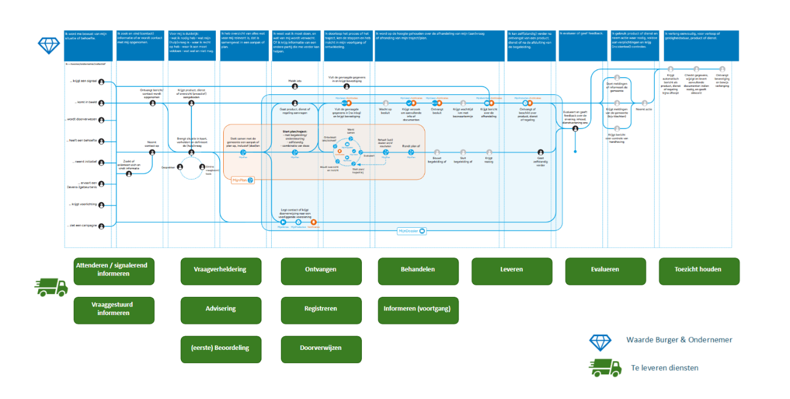
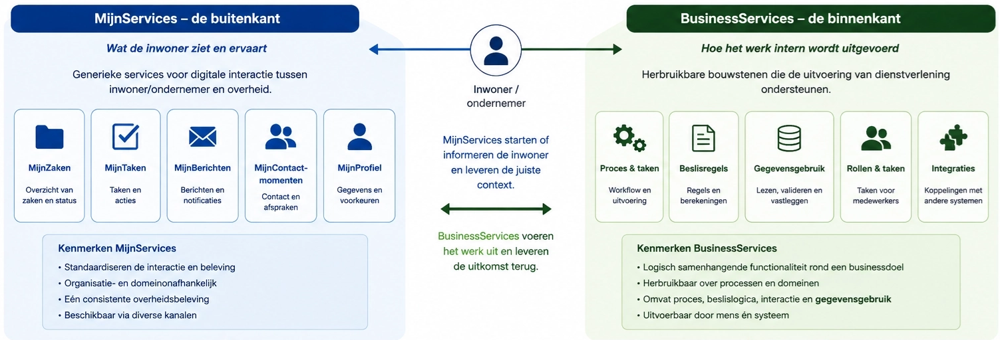
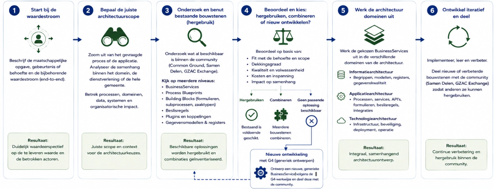

# 6. Businessarchitectuur

| **Abstract/TL;DR** |
|----|
| Dit hoofdstuk verplaatst de aandacht van architectuur naar van “welke applicatie hebben we?” naar “welke dienstverlening willen we leveren?” De bestaande verkokering moet plaatsmaken voor samenhangende waardestromen en herbruikbare BusinessServices. Domain-Driven Design helpt om verantwoordelijkheden, domeinen en grenzen scherp te krijgen. De bedoeling is dat gemeenten niet voor ieder probleem opnieuw een maatwerkoplossing optuigen, maar eerst kijken wat al generiek kan. Dat vraagt overigens niet alleen nieuwe software, maar ook een andere manier van organiseren, sturen en samenwerken. |

## Inleiding

De businessarchitectuur beschrijft hoe het Platform Dienstverlening de
gemeentelijke dienstverlening ondersteunt en welke businesscapabilities,
bedrijfsfuncties en waardestromen daarbij centraal staan. TOGAF
beschouwt de businessarchitectuur als de beschrijving van de
organisatie, haar dienstverlening, processen en businesscapabilities.
Voor gemeenten is dit op zeker niveau vastgelegd binnen de
GEMMA-architectuur. In het onderdeel [Visie, principes,
scope](../05-visie-principes-scope/README.md#visie-principes-scope) is de scope van het Platform
Dienstverlening daarom afgezet tegen de GEMMA-bedrijfsfuncties.

Deze businessarchitectuur richt zich op de gemeenschappelijke structuur
van de dienstverlening: de generieke businesscapabilities, waardestromen
en architectuurprincipes die voor alle gemeentelijke domeinen gelden. De
verdere uitwerking naar concrete gemeentelijke processen,
dienstverleningsconcepten en implementaties vindt plaats binnen
project-, programma- of solutionarchitecturen. Daar worden de generieke
platformvoorzieningen toegepast op specifieke vraagstukken en domeinen.

Om samenhang te waarborgen, geeft dit onderdeel wel richtlijnen en
methodiek voor het modelleren de businessarchitectuur. Hierdoor ontstaan
lokaal uitgewerkte architecturen die onderling consistent zijn en
aansluiten op de Enterprisearchitectuur van het Platform
Dienstverlening.

## Van verkokering naar samenhang

De huidige gemeentelijke informatievoorziening weerspiegelt de
verkokerde inrichting van de overheid zoals beschreven. Historisch
gegroeide afdelingen, beleidsdomeinen en verantwoordelijkheden zijn
veelal één-op-één vertaald naar processen, applicaties en
gegevensstructuren. Dit sluit aan bij [Conway's
Law](https://en.wikipedia.org/wiki/Conway%27s_law), die stelt dat
informatiesystemen de organisatiestructuur weerspiegelen waaruit zij
zijn ontstaan. De werkelijkheid van inwoners en ondernemers speelt zich
juist over deze organisatorische grenzen heen af.

Het Platform Dienstverlening biedt de mogelijkheid deze verkokering
bewust te doorbreken. Organisatiegrenzen vormen niet langer het
uitgangspunt voor de inrichting van de informatievoorziening. In plaats
daarvan worden dienstverlening, gegevens en waardestromen expliciet
ontworpen vanuit de maatschappelijke opgave en de behoeften van
inwoners, ondernemers en uitvoerend professionals. De
organisatiestructuur kan daarmee de uitvoering blijven ondersteunen,
zonder de inrichting van de informatievoorziening te dicteren.

## Nieuwe mogelijkheden voor dienstverlening

Doordat gegevens, processen en applicaties van elkaar zijn ontkoppeld,
ontstaat ruimte om dienstverlening fundamenteel anders te organiseren.
Gegevens worden éénmaal vastgelegd en via gestandaardiseerde autorisatie
beschikbaar gesteld aan processen, medewerkers en inwoners. Hierdoor
ontstaat één gedeelde informatiebasis waarop verschillende vormen van
dienstverlening kunnen voortbouwen.

Voor inwoners betekent dit dat gegevens niet steeds opnieuw hoeven te
worden aangeleverd en dat dienstverlening samenhangend kan worden
aangeboden, ongeacht de betrokken organisatieonderdelen. Voor uitvoerend
professionals ontstaat een integraal en actueel beeld van de situatie,
waardoor sneller en beter onderbouwde besluiten kunnen worden genomen.

Het Platform Dienstverlening ondersteunt verschillende, naast elkaar
bestaande manieren van werken. Deze sluiten aan bij de ontwikkeling naar
een responsieve, informatiegedreven overheid.

### Informatiegericht werken

Informatiegericht werken vormt het verbindende principe tussen alle
werkvormen en sluit aan op het [Principe: Informatiegericht
werken](../05-visie-principes-scope/README.md#principe-informatiegericht-werken). Gegevens worden
onafhankelijk van processen en applicaties beheerd en vormen de gedeelde
basis voor dienstverlening, besluitvorming en samenwerking. Hierdoor
kunnen verschillende manieren van werken naast elkaar bestaan, terwijl
zij gebruikmaken van dezelfde informatievoorziening en gegevenslaag. Dit
opent een scala aan mogelijkheden om de dienstverlening te verbeteren.

Binnen het kader van informatiegericht werken kunnen verschillende
‘manieren’ van werken onderscheiden:

- **Inwonergericht werken**

  - Inwonergericht werken richt dienstverlening in vanuit de leefwereld
    van inwoners en ondernemers. Gegevens worden éénmaal uitgevraagd en
    vervolgens hergebruikt. Uitvoerend professionals beschikken over een
    integraal beeld van de situatie, waardoor maatwerk mogelijk wordt en
    dienstverlening over organisatorische grenzen heen kan worden
    georganiseerd.

- **Objectgericht werken**

  - Objectgericht werken organiseert dienstverlening rondom objecten in
    de fysieke leefomgeving, zoals adressen, gebouwen en percelen.
    Gegevens over deze objecten vormen de basis voor processen, waardoor
    informatie duurzaam kan worden beheerd en eenvoudig tussen domeinen
    kan worden gedeeld.

- **Zaakgericht werken**

  - Zaakgericht werken is binnen gemeenten een breed toegepaste manier
    om dienstverlening gestructureerd uit te voeren, te volgen en te
    verantwoorden. Het Platform Dienstverlening ondersteunt deze
    werkwijze en versterkt deze door zaakgerichte processen te
    combineren met een informatiegerichte architectuur. De zaak blijft
    het procesmatige construct voor het uitvoeren en standaardiseren van
    een groot deel van de dienstverlening. Tegelijkertijd wordt
    onderkend dat een groot deel van de informatie waarmee gemeenten
    werken de grenzen van individuele zaken overstijgt en een eigen
    levenscyclus, context en betekenis heeft. Daarom worden gegevens,
    documenten, gebeurtenissen en andere informatieobjecten niet
    uitsluitend binnen een zaak beheerd, maar ondergebracht in
    zelfstandige registraties die ook buiten de context van één
    specifieke zaak kunnen worden gebruikt. Zaken verwijzen naar deze
    informatie en brengen deze samen in de context van een
    dienstverleningsproces.

  - Zaakgericht werken is niet het enige organiserende principe van de
    informatievoorziening, maar één van de manieren waarop
    dienstverlening kan worden gerealiseerd.

### Werken vanuit publieke waarde en waardestromen

De verschillende vormen van werken zijn geen doel op zichzelf. Het
vertrekpunt van dienstverlening is de maatschappelijke behoefte van
inwoners, ondernemers en de samenleving. Vanuit die behoefte wordt
bepaald welke [publieke
waarde](https://vng.nl/sites/default/files/documenten/werken-aan-de-publieke-waarde_20181015.pdf)
moet worden gerealiseerd en welke dienstverlening daarvoor nodig is.

Een
[waardestroom](https://begrippen.noraonline.nl/basisbegrippen/nl/page/waardestroom)
beschrijft het geheel aan activiteiten, informatie, beslissingen en
samenwerkingsrelaties dat leidt tot een maatschappelijk waardevol
resultaat voor inwoners, ondernemers en de gemeente.

#### Wanneer is iets een waardestroom? Een proces of bundeling van diensten is een waardestroom als het voldoet aan de volgende voorwaarden:

- Het creëert waarde voor **een specifieke doelgroep**;

- Het bundelt meerdere producten en diensten in **een logische keten**;

- Het ondersteunt **een end-to-end klantreis**;

- Het vraagt samenwerking **tussen afdelingen en ketenpartners**;

- Het gebruikt **data en zaakgericht werken** voor betere
  dienstverlening;

- Het is toegankelijk via **meerdere kanalen** en houdt rekening met
  digitale toegankelijkheid;

- Het wordt continu **gemonitord en verbeterd** op basis van KPI’s en
  gebruikersfeedback;

- Het voldoet aan **wettelijke en ethische eisen.**

Binnen een waardestroom kunnen verschillende vormen van werken naast
elkaar voorkomen. Sommige onderdelen lenen zich voor product- en
zaakgerichte afhandeling, terwijl andere onderdelen vragen om integraal
casusmanagement, projectmatige samenwerking of gegevensgestuurde
opvolging van signalen. De informatievoorziening moet daarom ruimte
bieden aan meerdere werkvormen binnen dezelfde waardestroom.

Deze benadering sluit aan op de gemeentelijke beweging naar publieke
waarde en de door de VNG ontwikkelde [generieke
klantroutes](https://vng.nl/sites/default/files/2025-09/klantroutes-dienstverlening-voor-gemeenten.pdf).
De klantroutes beschrijven hoe inwoners en ondernemers dienstverlening
ervaren vanuit hun eigen perspectief. Waardestromen vormen de
organisatorische en informatiekundige inrichting waarmee deze
klantreizen worden gerealiseerd. Het Platform Dienstverlening
ondersteunt beide perspectieven: de beleving van de inwoner aan de
buitenkant en de samenhangende uitvoering aan de binnenkant.

## Bedrijfsarchitectuur als schakel tussen platform, inwoner en organisatie

De bedrijfsarchitectuur vormt de eerste concrete uitwerking van de
overkoepelende architectuurprincipes uit de visie. Waar deze principes
richting geven aan de architectuur als geheel, beschrijft dit hoofdstuk
hoe zij worden toegepast bij het ontwerpen van gemeentelijke
dienstverlening.

In het bijzonder worden de volgende principes uitgewerkt:

- **[Principe: Architectuurgedreven
  vernieuwing](../05-visie-principes-scope/README.md#principe-architectuurgedreven-vernieuwing):** nieuwe
  dienstverlening wordt ontworpen vanuit de gewenste waardestroom,
  businesscapabilities en architectuur, niet vanuit bestaande
  applicaties.

- **[Principe: Expliciete
  bedrijfslogica](../05-visie-principes-scope/README.md#principe-expliciete-bedrijfslogica):**
  Bedrijfsprocessen, beslisregels en gegevens worden als afzonderlijke
  architectuurelementen gemodelleerd. Beslisregels worden waar mogelijk
  centraal beheerd en herbruikbaar vastgelegd, zodat zij consistent
  kunnen worden toegepast in meerdere processen, BusinessServices en
  kanalen.

- **[Principe: Generiek vóór
  specifiek](../05-visie-principes-scope/README.md#principe-generiek-vóór-specifiek):** generieke
  BusinessServices, procesfragmenten en voorzieningen worden eerst
  hergebruikt voordat domeinspecifieke oplossingen worden ontwikkeld.

- **[Principe: Beleidsruimte als
  basis](../05-visie-principes-scope/README.md#principe-beleidsruimte-als-basis):** waar de gemeentelijke
  verantwoordelijkheid aantoonbaar lokale keuzes vraagt, moet de
  generieke functionaliteit die keuzes tijdig en uitvoerbaar kunnen
  ondersteunen.

- **[Principe: Hergebruik](../05-visie-principes-scope/README.md#principe-hergebruik):** zowel software,
  gegevens, procesinrichting als bedrijfslogica worden ontworpen voor
  meervoudig gebruik binnen verschillende processen, domeinen en
  gemeenten.

Het Platform Dienstverlening biedt de technische mogelijkheden om
gemeentelijke dienstverlening fundamenteel anders in te richten.
Centrale gegevensopslag, herbruikbare services, expliciete beslisregels
en fijnmazige autorisatie maken het mogelijk om dienstverlening
domeinoverstijgend te organiseren. Deze mogelijkheden leiden echter niet
vanzelf tot betere dienstverlening. Zij vragen om een
bedrijfsarchitectuur die de inrichting van processen, rollen en
verantwoordelijkheden afstemt op de mogelijkheden van het platform.

Dit betekent onder meer dat:

- Processen worden ontworpen rondom gedeelde gegevens en
  dienstverlening, in plaats van rondom teams of applicaties;

- Verantwoordelijkheden verschuiven van eigenaarschap van systemen naar
  regie op gegevens, besluiten en dienstverlening;

- Samenwerking over domeinen heen de norm wordt, omdat dezelfde
  informatiebasis wordt gebruikt;

- Autorisatie wordt gebaseerd op de grondslag voor het gebruik van
  informatie en niet uitsluitend op de applicatie of de organisatorische
  rol of functie van een medewerker.

De bedrijfsarchitectuur vormt daarmee de verbinding tussen de
informatiearchitectuur en de dagelijkse uitvoering. Zij vertaalt de
mogelijkheden van het platform naar samenhangende dienstverlening,
eenduidige verantwoordelijkheden en consistente werkprocessen.

### MijnServices

[MijnServices](https://vng.nl/MijnServices) is een initiatief binnen VNG
dat zich richt op het ontwikkelen van herbruikbare servicedesigns. Een
servicedesign
([voorbeeld](https://nl-design-system.github.io/mijn-services/?path=/story/mijn-profiel-1--default))
is de gestandaardiseerde beschrijving van de gewenste gebruikerservaring
en interacties rondom een overheidsdienst. De bron voor de MijnServices
is de implementatie van het Platform Dienstverlening in de Gemeente Den
Haag. Dit is in een landelijk programma opgeschaald naar overheidsbrede
servicedesigns.

Voorbeelden zijn MijnZaken, MijnTaken, MijnBerichten,
MijnContactmomenten en MijnProfiel. Gezamenlijk bieden zij een
consistente manier waarop inwoners hun zaken met de overheid kunnen
regelen, ongeacht de onderliggende organisatie of het beleidsdomein.

MijnServices zijn nadrukkelijk ontwikkeld vanuit het perspectief van de
inwoner. Zij standaardiseren de **buitenkant** van de dienstverlening:
de manier waarop informatie wordt aangeboden, aanvragen worden ingediend
en de voortgang van dienstverlening inzichtelijk wordt gemaakt. Daarmee
leveren zij een belangrijke bijdrage aan één herkenbare digitale
overheid.

Voor de bedrijfsarchitectuur zijn MijnServices echter niet voldoende.
Zij beschrijven wat een inwoner ziet en ervaart, maar niet hoe de
dienstverlening intern wordt georganiseerd en uitgevoerd. Aspecten zoals
proceslogica, besluitvorming, taakverdeling, gegevensgebruik en
samenwerking tussen medewerkers en domeinen vallen buiten de scope van
MijnServices.

Om ook deze interne samenhang te kunnen modelleren introduceert het
Platform Dienstverlening het concept **BusinessService**. Waar
MijnServices de interactie met inwoners standaardiseren, structureren
BusinessServices de uitvoering van het werk. Samen vormen zij de
verbinding tussen de buitenwereld en de interne bedrijfsvoering.

### BusinessServices als ontwerpprincipe

Om samenhang tussen het interne proces en de presentatie ervan aan de
inwoner te realiseren introduceert het Platform Dienstverlening het
concept **BusinessService**. Een BusinessService vormt de herbruikbare
functionele bouwsteen waaruit gemeentelijke dienstverlening wordt
samengesteld. Het wordt hier met twee hoofdletters geschreven om het te
onderscheiden van – bijvoorbeeld – het businessserviceconcept in
Archimate. Het concept wordt verder concreet gemaakt in de bijlage
[BusinessServices](#bijlage---businessservices).

Een BusinessService omvat een logisch samenhangend geheel van gegevens,
beslisregels, proceslogica en interactie rondom één processtap. Zij
verbindt de verschillende architectuurlagen: gegevens uit registraties,
proces- en beslislogica, interactie met inwoners en medewerkers en de
uiteindelijke vastlegging van resultaten

Op de interactielaag verzorgt zij bijvoorbeeld formulieren of
klantinteractie, op de proceslaag workflow en beslislogica, op de
servicelaag API's en validaties en op de gegevenslaag de consistente
vastlegging in generieke registraties en domeinregistraties.

Hierdoor verschuift het ontwerp van de bedrijfsarchitectuur van
end-to-end processen naar een verzameling herbruikbare bouwblokken die
in verschillende processen kunnen worden toegepast. Processen worden
niet langer volledig op maat ontworpen, maar samengesteld uit
BusinessServices die ieder een duidelijke verantwoordelijkheid hebben.

Dit betekent onder andere dat:

- Processen worden samengesteld uit BusinessServices;

- Iedere BusinessService expliciet vastlegt welke gegevens worden
  gebruikt, gewijzigd en geregistreerd;

- Beslisregels, validaties en interacties éénmaal worden ingericht en
  vervolgens breed worden hergebruikt;

  - Beslisregels vormen een expliciet onderdeel van de dienstverlening
    en beschrijven hoe wetgeving en beleid worden toegepast. Door
    beslisregels los van processen vast te leggen, kunnen zij
    onafhankelijk worden beheerd, hergebruikt en gewijzigd;

- Dezelfde BusinessService in meerdere processen, domeinen en vormen van
  dienstverlening kan worden toegepast.

### BusinessServices als herbruikbare bouwstenen

BusinessServices zijn nadrukkelijk bedoeld als **herbruikbare
bouwstenen**. Niet alleen de onderliggende softwarecomponenten worden
gezamenlijk ontwikkeld, maar ook de inrichting daarvan. Gemeenten hoeven
veel voorkomende dienstverleningsprocessen daardoor niet telkens opnieuw
te ontwerpen.

Een BusinessService kan bestaan uit een combinatie van:

- Procesblauwdrukken (Process Blueprints);

- Herbruikbare bouwblokken, zoals formulieren, subprocessen, zaaktypen
  of configuraties;

- Beslisregels;

- Plugins voor generieke uitbreidingen en koppelingen;

- Document- en archiefconfiguraties.

Deze artefacten kunnen tussen gemeenten worden gedeeld via voorzieningen
zoals **Samen Delen** en de **GZAC Exchange**. Gemeenten kunnen
bestaande inrichting hergebruiken, lokaal configureren en waar nodig
uitbreiden met eigen functionaliteit. Hierdoor ontstaat niet alleen
hergebruik van software, maar ook van kennis, procesontwerpen en bewezen
implementaties.

Hiermee krijgt het principe **Hergebruik** een bredere betekenis dan
uitsluitend softwarehergebruik. Gemeenten delen niet alleen broncode,
maar ook de inrichting van processen, formulieren, beslisregels,
configuraties en businessservices. De bedrijfsarchitectuur ontwikkelt
zich daardoor tot een gezamenlijke, levende bibliotheek van herbruikbare
dienstverleningspatronen die continu wordt verbeterd op basis van
implementaties in de praktijk.

## Instructie voor bedrijfsarchitectuur en realisatie

De bedrijfsarchitectuur vormt het vertrekpunt voor de verdere uitwerking
van project- en solutionarchitecturen. Zij bepaalt de gewenste
waardestroom, de BusinessServices en de samenhang tussen
dienstverlening, processen en informatie. De onderliggende
architectuurdomeinen – informatie-, applicatie- en
technologiearchitectuur – werken deze keuzes vervolgens verder uit
binnen hun eigen verantwoordelijkheidsgebied.

Voor de ontwikkeling van software betekent dit een andere manier van
werken. De volgende ontwerpstappen gelden:

1.  **Start bij de maatschappelijke opgave en de waardestroom**

    Beschrijf eerst welke publieke waarde moet worden geleverd, welke
    gebeurtenis of behoefte van een inwoner of ondernemer centraal staat
    en welke waardestroom daarbij hoort. Pas daarna worden processen,
    gegevens en software beschouwd.

2.  **Bepaal de juiste architectuurscope**

    Project- en solutionarchitecturen worden vaak gestart vanuit een
    concrete vraag, zoals de vervanging van een applicatie of de
    verbetering van één bedrijfsproces. Deze afbakening is begrijpelijk
    vanuit projectsturing, maar vormt niet vanzelfsprekend de juiste
    architectuurscope.

    De architect onderzoekt daarom eerst de samenhang met de bredere
    dienstverlening. Dit vraagt om abstraheren en uitzoomen: welke
    waardestroom wordt ondersteund, welke andere processen, domeinen of
    organisatieonderdelen raken hetzelfde vraagstuk, en welke gegevens
    of BusinessServices worden gedeeld?

    Het doel is te voorkomen dat een lokaal vraagstuk leidt tot een
    lokale oplossing, terwijl een generieke voorziening of bredere
    architectuurkeuze leidt tot een betere dienstverlening voor de
    inwoner en meerwaarde biedt voor meerdere processen, domeinen of
    gemeenten.

3.  **Onderzoek bestaande bouwstenen**

    Voordat nieuwe functionaliteit wordt ontworpen, wordt onderzocht
    welke voorzieningen reeds beschikbaar zijn binnen het Platform
    Dienstverlening en de bredere Common Ground-community. Dit onderzoek
    omvat meerdere niveaus van hergebruik:

- Bestaande BusinessServices;

- Procesblauwdrukken (Process Blueprints, MijnServices);

- Building Blocks, formulieren en subprocessen;

- Beslisregels;

- Plugins en generieke koppelingen;

- Bestaande gegevensmodellen en registraties.

4.  **Modelleer de business**

    Vertaal de waardestroom naar samenhangende BusinessServices en
    bepaal welke verantwoordelijkheden, rollen en bedrijfsobjecten
    daarbij horen. Identificeer welke functionaliteit generiek is en
    welke domeinspecifiek blijft. BusinessServices vormen de logische
    bouwstenen waaruit processen worden samengesteld.

5.  **Werk de architectuurdomeinen uit**

    De gekozen BusinessServices vormen vervolgens het uitgangspunt voor
    de verdere uitwerking binnen de overige architectuurdomeinen:

- Informatiearchitectuur: begrippen, informatiemodellen, registraties en
  gegevenskwaliteit. Dit is ook de fase waarin Duurzame Toegankelijkheid
  en Rapportage wordt voorbereid, ingericht en getoetst.

- Applicatiearchitectuur: procesinrichting, services, API's,
  formulieren, beslisregels en integraties.

- Technologiearchitectuur: infrastructuur, beveiliging, deployment en
  operationele voorzieningen.

  Hierdoor blijven alle architectuurdomeinen consistent met dezelfde
  bedrijfsarchitectuur en waardestroom.

6.  **Ontwikkel iteratief**

    BusinessServices worden iteratief ontwikkeld, toegepast en verbeterd
    op basis van praktijkervaring. Implementaties leveren nieuwe
    inzichten op die kunnen leiden tot verbeteringen van de
    businessarchitectuur, waarna deze opnieuw beschikbaar worden gesteld
    aan de community. Zo ontstaat een levende referentiearchitectuur die
    zich continu ontwikkelt.

    

## Domain-Driven Design als ontwerppraktijk

*[Domain-Driven
Design](https://www.bol.com/nl/nl/f/domain-driven-design/9200000002151217/)
(DDD)* vormt binnen het Platform Dienstverlening de
**voorkeursontwerppraktijk** voor het toepassen van het
architectuurprincipe **Architectuurgedreven vernieuwing (4.4.1)**. Waar
het architectuurprincipe richting geeft aan het *wat*, biedt DDD de
methodiek voor het *hoe*: het identificeren, afbakenen en ontwerpen van
BusinessServices vanuit de werkelijkheid van het domein.

DDD wordt niet alleen gebruikt om grenzen tussen services te ontdekken,
maar ook om onderscheid te maken tussen generieke, domeinoverstijgende
concepten en domeinspecifieke verantwoordelijkheden. Dit voorkomt dat
ieder domein eigen varianten van dezelfde dienstverleningsconcepten
introduceert en bevordert hergebruik, interoperabiliteit en een
consistente gebruikerservaring binnen het platform.

Het dienstverleningsdomein, met concepten zoals **klant**, **zaak**,
**taak** **en** **bericht**, vormt zo'n metadomein. Deze concepten
behoren niet tot één specifiek beleids- of uitvoeringsdomein, maar
ondersteunen dienstverlening in brede zin.

De afbakening van deze metadomeinen geldt als uitgangspunt voor de
inrichting van het platform. Binnen die kaders behouden domeinspecifieke
implementaties de vrijheid om eigen bounded contexts, domeinmodellen en
bedrijfsobjecten te definiëren die aansluiten bij de behoeften van het
betreffende vakgebied.

Centraal daarin staat het ontwikkelen van een **gedeelde taal
(ubiquitous language)** tussen beleid, uitvoering en IT. Dit sluit
direct aan op het uitgangspunt van Common Ground: dat feiten, begrippen
en beslissingen eenduidig en herleidbaar moeten zijn. Door deze gedeelde
taal te hanteren in zowel processen, gegevensmodellen als services,
ontstaat consistentie over de gehele keten.

DDD helpt om BusinessServices op een natuurlijke en samenhangende manier
te identificeren en af te bakenen. Door het domein op te delen in
*bounded contexts* wordt duidelijk:

- Welke concepten bij elkaar horen,

- Waar verantwoordelijkheden liggen, en

- Waar logische grenzen tussen services moeten worden getrokken.

Deze afbakening voorkomt dat services te groot, te klein of te
afhankelijk worden. Het ondersteunt daarmee direct de principes uit de
BusinessService-benadering, zoals cohesie, herbruikbaarheid en
duidelijke verantwoordelijkheid.

## Implicaties voor de bestaande organisatie

De invoering van Common Ground en het Platform Dienstverlening betekent
meer dan een verandering van de technische architectuur. Het
introduceert een andere manier van kijken naar gemeentelijke
dienstverlening, waarbij publieke waarde, generieke BusinessServices en
intergemeentelijke samenwerking het uitgangspunt vormen. Dit heeft
gevolgen voor de manier waarop beleid, architectuur, analyse,
ontwikkeling, beheer en governance worden ingericht.

De volledige organisatorische en bestuurlijke impact van deze transitie
valt buiten de scope van deze architectuur. Dit hoofdstuk schetst daarom
uitsluitend de belangrijkste implicaties op hoofdlijnen voor de rollen
en verantwoordelijkheden die direct raken aan de ontwikkeling,
realisatie en het beheer van het Platform Dienstverlening. De verdere
organisatorische inrichting, governance en veranderkundige implementatie
vragen om een afzonderlijke uitwerking.

### Directie, proceseigenaren en opdrachtgevers

De invoering van een platformbenadering verandert ook de wijze waarop
gemeenten investeren in digitalisering. Waar de nadruk traditioneel ligt
op het selecteren, aanbesteden en implementeren van afzonderlijke
applicaties, verschuift de aandacht naar de gezamenlijke ontwikkeling en
doorontwikkeling van generieke functionaliteit.

Voor directeuren, proceseigenaren en andere opdrachtgevers betekent dit
dat zij:

- Ontwikkelingen primair beoordelen vanuit de bijdrage aan de
  gezamenlijke dienstverlening;

- Vaker investeren in gezamenlijke ontwikkeling met andere gemeenten dan
  in individuele aanbestedingen;

- Hergebruik en standaardisatie meewegen als volwaardig onderdeel van
  businesscases;

- Gezamenlijk prioriteiten stellen voor de doorontwikkeling van het
  platform.

Hierdoor verschuift de focus van het verwerven van software naar het
gezamenlijk ontwikkelen en beheren van publieke digitale voorzieningen.

### Concern- en thema-architecturen

Deze werkwijze heeft ook consequenties voor gemeentelijke thema- en
concernarchitecturen. Deze zijn van nature domeinoverstijgend, maar
binnen Common Ground gaan ze niet langer primair over applicaties of
systemen, maar over registraties, bedrijfsobjecten en gegevensstromen.

Dit betekent bijvoorbeeld dat eisen aan autorisatie, metadata, logging,
auditing, archivering of datakwaliteit niet op applicatieniveau worden
uitgewerkt, maar moeten aansluiten op een landschap waarin gegevens en
functionaliteit verdeeld zijn over meerdere samenwerkende services.

### Project- en solutionarchitecten

Voor project- en solutionarchitecten verschuift de focus van
applicatiegericht ontwerpen naar bedrijfsarchitectuur als vertrekpunt.
Nieuwe initiatieven worden niet langer primair afgebakend vanuit een
project, applicatie of organisatorisch domein, maar vanuit de
onderliggende waardestroom en de BusinessServices die daarvoor nodig
zijn.

Dit betekent dat architecten:

- Nieuwe vraagstukken eerst toetsen aan de bestaande
  bedrijfsarchitectuur;

- Actief zoeken naar bestaande BusinessServices en andere herbruikbare
  bouwstenen;

- De architectuurscope verbreden wanneer meerdere processen of domeinen
  hetzelfde vraagstuk raken;

- Alleen nieuwe functionaliteit ontwerpen wanneer bestaande
  voorzieningen aantoonbaar onvoldoende aansluiten.

Hierdoor verschuift de rol van projectarchitect van het ontwerpen van
individuele oplossingen naar het bewaken van samenhang binnen het
platform.

### Informatiebeveiliging en privacy

Ook de rol van informatiebeveiligings- en privacyfunctionarissen
verandert. Doordat generieke platformvoorzieningen centraal worden
ontwikkeld en beheerd, kunnen beveiligings- en privacymaatregelen steeds
vaker platformbreed worden ingericht en beoordeeld.

Voor privacy officers en informatieadviseurs betekent dit dat de
aandacht verschuift van het afzonderlijk toetsen van iedere applicatie
naar het beoordelen en bewaken van de generieke platformvoorzieningen en
de daarop gebaseerde architectuur.

Nieuwe oplossingen hoeven daardoor niet telkens opnieuw volledig op
dezelfde generieke aspecten te worden beoordeeld, maar kunnen
voortbouwen op reeds gevalideerde voorzieningen voor bijvoorbeeld
authenticatie, autorisatie, logging, auditing, gegevensuitwisseling en
beveiliging. Hierdoor ontstaat meer uniformiteit, neemt de kwaliteit van
de toetsing toe en wordt dubbel werk voorkomen.

### Businessanalisten

Ook voor businessanalisten verandert de manier van analyseren. De nadruk
verschuift van het beschrijven van bestaande processen naar het
modelleren van de onderliggende dienstverlening.

Businessanalisten richten zich daarom nadrukkelijk op:

- Het identificeren van de maatschappelijke opgave en de gewenste
  waardestroom;

- Het ontwikkelen van een gedeelde taal tussen beleid, uitvoering en IT;

- Het identificeren van BusinessServices en bedrijfsobjecten;

- Het identificeren van beslisregels: beslisregels vormen een expliciet
  onderdeel van de dienstverlening en beschrijven hoe wetgeving en
  beleid worden toegepast;

- Het onderscheiden van generieke en domeinspecifieke functionaliteit;

- Het modelleren van processen als samenstelling van bestaande
  BusinessServices.

Hierdoor ontstaat een stabielere bedrijfsarchitectuur die minder
afhankelijk is van de inrichting van individuele applicaties.

### Functioneel en technisch beheer

Ook de inrichting van beheer verandert. Binnen een componentgebaseerde
architectuur verschuift het beheer van complete applicaties naar het
beheren van platformvoorzieningen, generieke services en configuraties.

Dit betekent onder meer dat:

- Functioneel beheer zich meer richt op de inrichting van generieke
  voorzieningen, formulieren, beslisregels, procesmodellen en
  configuraties dan op afzonderlijke applicaties;

- Technisch beheer zich ontwikkelt van applicatiebeheer naar
  platformbeheer, waarbij aandacht verschuift naar generieke
  infrastructuur, deployment, monitoring, beveiliging en beschikbaarheid
  van platformdiensten;

- Wijzigingen vaker plaatsvinden binnen gedeelde voorzieningen en
  daardoor een bredere impact kunnen hebben;

- Samenwerking tussen beheerteams belangrijker wordt, omdat meerdere
  gemeenten en meerdere BusinessServices gebruikmaken van dezelfde
  platformcomponenten.

Hierdoor verschuift het beheer geleidelijk van een applicatiegerichte
naar een servicegerichte organisatie.

### Ontwikkeling van gemeentelijke IV-organisaties

Op langere termijn ondersteunt de platformarchitectuur ook een andere
inrichting van de gemeentelijke IV-organisatie. Doordat gemeenten steeds
vaker gebruikmaken van dezelfde architectuur, standaarden en
platformvoorzieningen, ontstaat een meer uniforme manier van
ontwikkelen, beheren en doorontwikkelen.

Hierdoor wordt het eenvoudiger om kennis, software en capaciteit tussen
gemeenten uit te wisselen. Ontwikkelaars, architecten, beheerders en
andere IV-professionals kunnen gemakkelijker samenwerken aan dezelfde
voorzieningen en hun expertise breder inzetten. Dit vergroot niet alleen
de continuïteit van het platform, maar draagt ook bij aan een
efficiënter gebruik van schaarse IV-capaciteit binnen de gemeentelijke
sector.

### Doorontwikkeling van de governance

De ontwikkeling van het Platform Dienstverlening vindt plaats binnen een
groeiend samenwerkingsverband van gemeenten. Daarbij wordt toegewerkt
naar een meer landelijke inrichting van ontwikkeling, beheer en
governance.

De inrichting van een structurele landelijke beheerorganisatie maakt
onderdeel uit van de roadmap. De exacte invulling hiervan is nog
onderwerp van verdere uitwerking. Gemeenten doen er daarom goed aan om
bij nieuwe ontwikkelingen rekening te houden met toekomstige landelijke
samenwerking, bijvoorbeeld door gebruik te maken van open standaarden,
generieke voorzieningen en gezamenlijke ontwikkelprocessen.

Tegelijkertijd is terughoudendheid gewenst om vooruit te lopen op
governancekeuzes die nog niet zijn gemaakt. De huidige architectuur is
daarom zo ingericht dat zij zowel binnen de bestaande G4-samenwerking
als binnen een toekomstige landelijke beheerorganisatie toepasbaar
blijft. Hierdoor kan de governance zich geleidelijk ontwikkelen zonder
dat fundamentele architectuurkeuzes opnieuw hoeven te worden gemaakt.
