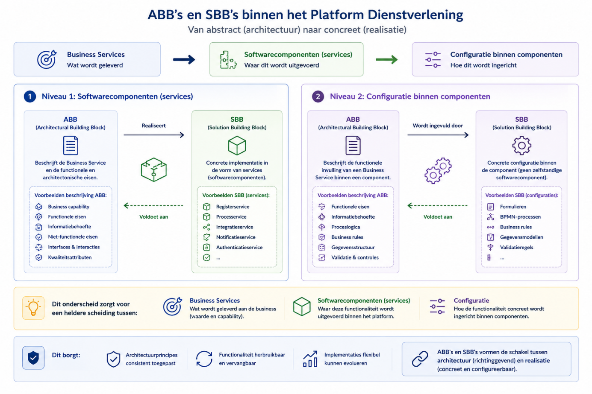
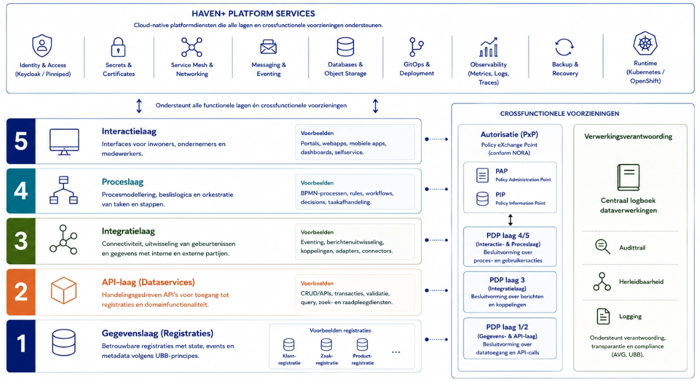
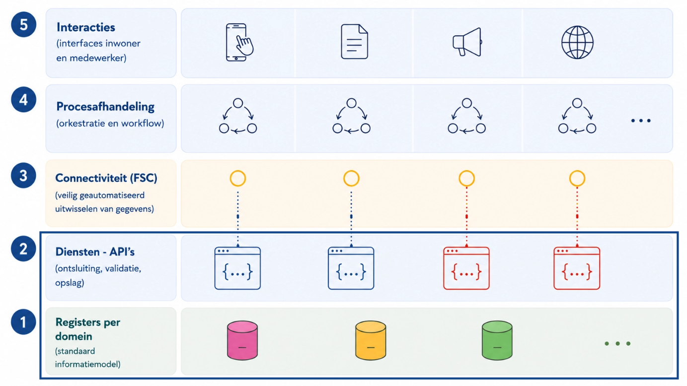
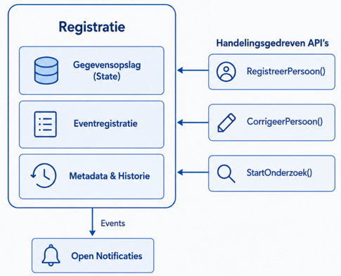

# 8. Applicatiearchitectuur

| **Compact:** |
|----|
| Hier wordt het allemaal wat technischer. De applicatiearchitectuur vertaalt de eerdere uitgangspunten naar services, API’s, events en componenten. Het vijf-lagenmodel onderscheidt interactie, proces, connectiviteit, diensten en gegevens. Functionaliteit wordt zoveel mogelijk opgebouwd uit zelfstandige, herbruikbare componenten met een duidelijke verantwoordelijkheid. De kernboodschap: geen monolithische alleskunner die tegelijk je registratie, proces, formulier, API en koffieautomaat wil zijn, maar kleinere bouwstenen die netjes samenwerken. |

## Inleiding

Binnen TOGAF beschrijft de applicatiearchitectuur hoe de bedrijfs-,
informatie- en data-architectuur worden gerealiseerd met behulp van
samenwerkende softwarecomponenten. Waar de voorgaande hoofdstukken
beschrijven **wat** de dienstverlening is, **welke** informatie wordt
beheerd en **hoe** gegevens logisch zijn georganiseerd, beschrijft dit
hoofdstuk hoe deze uitgangspunten worden geïmplementeerd in applicaties,
services en interfaces.

Dit hoofdstuk vormt daarmee de concrete uitwerking van de
architectuurprincipes:

- [**Principe: Architectuurgedreven
  vernieuwing**](../05-visie-principes-scope/README.md#principe-architectuurgedreven-vernieuwing)

- [**Principe: (Micro)
  servicearchitectuur**](../05-visie-principes-scope/README.md#principe-micro-servicearchitectuur)

- [**Principe: Expliciete
  bedrijfslogica**](../05-visie-principes-scope/README.md#principe-expliciete-bedrijfslogica)

- [**Principe: Generiek vóór
  specifiek**](../05-visie-principes-scope/README.md#principe-generiek-vóór-specifiek)

- [**Principe: Beleidsruimte als
  basis**](../05-visie-principes-scope/README.md#principe-beleidsruimte-als-basis)

- [**Principe: Hergebruik**](../05-visie-principes-scope/README.md#principe-hergebruik)

Binnen het Platform Dienstverlening is de applicatiearchitectuur
gebaseerd op een componentgebaseerde opzet. Functionaliteit wordt
gerealiseerd als zelfstandige, herbruikbare componenten met een
duidelijke verantwoordelijkheid, die via gestandaardiseerde API's en
events samenwerken. Hierdoor kunnen onderdelen onafhankelijk worden
ontwikkeld, vervangen en doorontwikkeld, terwijl de samenhang van het
platform behouden blijft.

Dit hoofdstuk beschrijft de applicatiearchitectuur op hoofdlijnen en
werkt de verschillende applicatielagen en hun onderlinge samenhang uit.

## Het Vijf-lagen model

Conform de [Informatiekundige visie Common
Ground](https://www.gemmaonline.nl/wiki/Thema-architectuur_Common_Ground)
maakt de applicatie-architectuur van het Platform onderscheid tussen:

- **Interactie** (gebruikersinterface)

- **Proces** (afhandeling van het proces)

- **Connectiviteit** (aansluiting van afnemers en diensten)

- **Diensten** (API’s)

- **Gegevens** (registraties).

  

  Deze lagen, hun betekenis en betrokken (applicatie)capabilities worden
  in [Architectural Building Blocks (ABB’s) en
  clusters](README.md#architectural-building-blocks-abbs-en-clusters) verder
  toegelicht.

#### Interpretatie van het lagenmodel

Het lagenmodel geeft op hoofdlijnen de verdeling van
verantwoordelijkheden binnen de applicatiearchitectuur weer. Het is een
**conceptueel architectuurmodel** en geen letterlijk implementatiemodel.
De plaats van een component in een laag geeft aan **waar de primaire
verantwoordelijkheid ligt**, niet dat de component uitsluitend
functionaliteit uit die laag bevat.

In de praktijk bevatten componenten ook ondersteunende functionaliteit
uit andere lagen. Zo kent een registratie bijvoorbeeld validaties en
beperkte proceslogica, beschikt een integratievoorziening vaak over een
beheerinterface en bevatten processervices gegevens of configuratie die
noodzakelijk zijn voor hun werking. Deze functies zijn echter
ondersteunend; de component wordt ingedeeld op basis van zijn dominante
verantwoordelijkheid binnen de architectuur. Bij de ontwikkeling van
nieuwe componenten geldt daarom het uitgangspunt dat functionaliteit
wordt geplaatst in de laag waarvoor zij primair verantwoordelijk is.

## Architectuurstijl: (micro)services

Binnen de (historische) ontwikkeling van applicatie-architecturen zijn
verschillende stijlen te onderscheiden:

- **Monolithische architectuur:** Eén codebase en deployment. Eenvoudig
  te starten, maar beperkt schaalbaar en lastig aanpasbaar.

- **Modulaire monoliet:** Logische scheiding binnen één applicatie.
  Beter gestructureerd, maar nog steeds één deploybare eenheid.

- **Service-georiënteerde architectuur (SOA):** Services met centrale
  orkestratie (bijv. via ESB). Flexibeler, maar vaak complex door
  centrale afhankelijkheden.

<!-- -->

- **Microservice-architectuur:** Kleine, zelfstandige services die
  onafhankelijk deploybaar zijn en gericht zijn op wendbaarheid en
  schaalbaarheid.

Er bestaan verschillende manieren om de architectuur van het Platform
Dienstverlening te beschrijven, zoals *microservice-architectuur* of
*composable architecture*. Ook wordt soms gesproken over een
*distributed monolith* wanneer de technische ontkoppeling onvoldoende is
gerealiseerd. Binnen deze architectuur wordt bewust gekozen voor de term
(**micro)service-architectuur** als referentiemodel voor de verdere
uitwerking, omdat deze aansluit bij de eisen rondom flexibiliteit,
schaalbaarheid en snelle aanpasbaarheid (bijv. door beveiligingseisen).

### Kenmerken van services

Binnen het platform vormen services de centrale bouwstenen. Dit is de
realisatie van het [**Principe: (Micro)
servicearchitectuur**](../05-visie-principes-scope/README.md#principe-micro-servicearchitectuur). Een service
wordt gekenmerkt door:

- **Single Responsibility Boundary:** Een service ondersteunt één
  duidelijke business capability

- **Autonomie:** Services zijn zelfstandig te ontwikkelen, testen en
  deployen

### Afbakening van services

De grootte en grenzen van services worden bepaald aan de hand van
meerdere perspectieven:

- **Domain-Driven Design (bounded contexts):** Diensten worden gebaseerd
  op betekenisvolle domeinen

- **Business capabilities:** Wat de dienstverlening moet leveren vormt
  de basis

- **Performance en belasting:** Verschillende loadprofielen → aparte
  services

- **Foutisolatie:** Kritische onderdelen worden gescheiden.

De set van services binnen het platform is niet statisch. Op basis van
nieuwe inzichten en gebruik kan de architectuur worden aangepast, door
het:

- Samenvoegen van services

- Opsplitsen van services en

- Introduceren van nieuwe services.

Dit maakt onderdeel uit van het architecturaal continuüm, waarin de
architectuur meegroeit met de organisatie en het platform.

### Criteria voor services

Elke service in het platform moet voldoen aan de volgende criteria:

- **Single purpose (één duidelijke verantwoordelijkheid) -** Elke
  service heeft één afgebakende taak of business capability. Dit
  voorkomt dat logica onnodig wordt verweven met andere functionaliteit

- **Hergebruik binnen het platform -** Services interacteren met
  bestaande services in het landschap en introduceren geen reeds
  aanwezige functionaliteit. Dit voorkomt duplicatie, bevordert
  consistent gedrag, faciliteert dat je kunt standaardiseren op
  services/capabilities en verlaagt beheer- en onderhoudslast binnen het
  platform.

- **Aansluiten op het platform -** Services sluiten volledig aan op de
  applicatie infrastructuur (waaronder technische notificaties, logging,
  authorisatie, identificatie)

- De [Patronen en API-specificaties](../11-toegepaste-patronen/README.md#toegepaste-patronen) worden
  gevolgd.

### Voordelen van de gekozen architectuur

De microservice-architectuur biedt de volgende voordelen:

- Single purpose (één duidelijke verantwoordelijkheid): Elke service
  heeft een afgebakende taak

- Technologische flexibiliteit: Teams kiezen zelf technologie per
  service

- Onafhankelijke deployability: Services kunnen los uitgerold worden

- Schaalbaarheid: Alleen zwaar belaste onderdelen worden opgeschaald

- Veerkracht en foutisolatie: Storingen blijven beperkt tot één service

- Beheersbare codebases: Kleinere systemen zijn beter te begrijpen

- Autonome teams: Teams zijn eigenaar van hun service

- Continue levering (CI/CD): Snelle en veilige releases

- Experimenteerbaarheid: Nieuwe functionaliteit kan geïsoleerd
  ontwikkeld worden.

De gekozen architectuur stelt ook eisen aan de organisatie en techniek:

- Sterke automatisering: CI/CD, testing en monitoring zijn essentieel

- Volwassen DevOps-teams: Teams zijn verantwoordelijk voor de volledige
  lifecycle

- Gestandaardiseerde interfaces: API’s en events moeten uniform zijn

- Observability: Logging, monitoring en tracing zijn noodzakelijk

- Governance op architectuurprincipes: Zonder kaders ontstaat
  fragmentatie.

## Samenwerking tussen services

Binnen een microservice-architectuur is de manier waarop services
samenwerken een cruciale ontwerpkeuze. De architectuur schrijft niet één
mechanisme voor, maar een set van gestandaardiseerde interactiepatronen,
die afhankelijk van de situatie worden toegepast.

### Basisvormen van samenwerking

Er zijn drie hoofdvormen van interactie tussen services:

- **Synchroon (request/response)**

  - Services communiceren direct via API’s en wachten op een antwoord.
    Toepasbaar bij:

    - directe validatie en

    - opvragen van actuele gegevens.

<!-- -->

- **Asynchroon (event-driven)**

  - Services communiceren via notificaties, berichten of events, zonder
    directe afhankelijkheid. Toepasbaar bij:

    - procesafhandeling

    - ketens van verwerking en

    - losgekoppelde samenwerking.

<!-- -->

- **API-compositie**

  - Meerdere services worden gecombineerd tot één samenhangende
    response. Toepasbaar bij:

    - Gebruikersinterfaces en

    - integrale beelden

  - Belangrijke patronen hierbij zijn:

    - API Gateway (centrale toegang, routing, beveiliging) en

    - Backend-for-Frontend (BFF) (specifieke API per frontend).

Binnen het Platform Dienstverlening ligt de nadruk op asynchrone,
eventgedreven samenwerking, aangevuld met synchrone en
compositiepatronen waar nodig.

### Toegepaste patronen binnen het platform

Binnen het platform worden verschillende patronen gecombineerd:

- Event-driven: Een service registreert data en publiceert een
  notificatie; andere services reageren hierop (bijvoorbeeld het
  Verzoekenpatroon)

- Request/response interacties: Voor directe interacties tussen services
  (bijv. GZAC ↔ OpenZaak)

- Compositiepatronen (BFF / aggregatie): Voor het samenstellen van
  gegevens voor gebruikers of systemen (bijv. IKO - Integraal Klant en
  Objectbeeld).

Deze combinatie zorgt voor:

- Losse koppeling

- Schaalbaarheid

- Flexibiliteit in procesinrichting

Net als bij services zelf zijn interactiepatronen niet statisch. Het
kiezen en ontwikkelen van patronen maakt onderdeel uit van het
architecturaal continuüm, waarbij de samenwerking tussen services wordt
verbeterd op basis van praktijkervaring. De concrete toepassing van
patronen in betekenisvolle orkestratie wordt beschreven in [Toegepaste
patronen](../11-toegepaste-patronen/README.md#toegepaste-patronen).

## Overzicht architecturale stijl

De applicatiearchitectuur van het Platform Dienstverlening is gebaseerd
op een samenhangend ecosysteem van kleine, zelfstandige en herbruikbare
services. Door functionaliteit op te delen in duidelijk afgebakende
verantwoordelijkheden, generieke voorzieningen te hergebruiken en
gestandaardiseerde interactiepatronen toe te passen, ontstaat een
wendbaar en schaalbaar platform dat zich geleidelijk kan ontwikkelen. De
precieze invulling van individuele services zal daarbij in de tijd
veranderen; de architectuurprincipes en verantwoordelijkheidsverdeling
blijven leidend.

Om deze samenhang duurzaam te borgen, is een gemeenschappelijke
beschrijving van applicatiefuncties nodig die onafhankelijk is van
concrete softwareproducten. Daarom wordt binnen het Platform
Dienstverlening gewerkt met logische bouwstenen die de functionele
verantwoordelijkheden binnen de applicatiearchitectuur beschrijven en
als referentie dienen voor de ontwikkeling, selectie en samenstelling
van softwarecomponenten: building blocks.

## Building blocks (architectureel en solution)

Binnen (enterprise) architectuur wordt onderscheid gemaakt tussen
**Architectural Building Blocks (ABB’s)** en **Solution Building Blocks
(SBB’s)**. Dit is een generiek architectuurprincipe dat ook binnen het
Platform Dienstverlening wordt toegepast.

Een **Architectural Building Block (ABB)** beschrijft een generieke of
abstracte specificatie van functionaliteit. ABB’s definiëren de
benodigde capabilities in termen van business-, informatie-, applicatie-
en technologie-architectuur. Binnen dit kader wordt functionaliteit
primair uitgedrukt als een **BusinessService**: een logisch afgebakende
dienst die waarde levert aan de business, onafhankelijk van de
onderliggende implementatie.

De concrete invulling van deze BusinessServices vindt plaats in
**Solution Building Blocks (SBB’s)**. Dit zijn de gerealiseerde
componenten binnen het platform, bestaande uit softwarecomponenten en/of
configuraties die gezamenlijk de BusinessService implementeren.

ABB’s worden binnen het platform op twee niveaus toegepast:

1.  **Op het niveau van softwarecomponenten (services)**

- ABB’s beschrijven hier de BusinessService en de bijbehorende
  functionele en architectonische eisen.

- SBB’s zijn de concrete implementaties hiervan in de vorm van services
  (bijv. registraties, proces- of integratieservices).

2.  **Op het niveau van configuratie binnen componenten**

- ABB’s beschrijven hier de functionele invulling van een
  BusinessService binnen een component.

- SBB’s zijn de concrete configuraties, zoals:

  - Formulieren

  - BPMN-processen

  - Business rules

  - Gegevensmodellen.

Deze configuraties vormen geen zelfstandige softwarecomponenten, maar
zijn een invulling van functionaliteit binnen bestaande services.

Door dit onderscheid ontstaat een heldere scheiding tussen:

- BusinessServices (wat wordt geleverd)

- Softwarecomponenten (waar dit wordt uitgevoerd)

- Configuratie (hoe dit concreet wordt ingericht binnen componenten)

Hiermee wordt geborgd dat:

- Architectuurprincipes consistent worden toegepast

- Functionaliteit herbruikbaar en vervangbaar blijft

- Implementaties flexibel kunnen evolueren.

ABB’s en SBB’s vormen daarmee de schakel tussen architectuur
(richtinggevend) en realisatie (concreet en configureerbaar).

### Voorbeeld – Aanvragen van een uitkering

De BusinessService **"Beoordelen uitkeringsaanvraag"** is een
**Architectural Building Block (ABB)**. Deze beschrijft wat de
dienstverlening moet leveren: beoordelen van een aanvraag, vastleggen
van gegevens, toepassen van beslisregels en informeren van de inwoner.

De concrete invulling bestaat uit **Solution Building Blocks (SBB's)**:

- **Niveau 1: Softwarecomponenten:** GZAC, OpenZaak, OpenKlant, DMN
  Engine en Open Formulieren.

- **Niveau 2: Configuratie:** het aanvraagformulier, het BPMN-proces, de
  DMN-beslisregels, zaaktype, producttype en validatieregels.

Hierdoor blijft de BusinessService hetzelfde, terwijl de
softwarecomponenten of configuratie in de tijd kunnen veranderen zonder
de architectuur aan te passen.

## Architectural Building Blocks (ABB’s) en clusters

Architectural Building Blocks (ABB's) beschrijven generieke capabilities
binnen het Platform Dienstverlening. Ze moeten tenslotte invulling geven
aan de hele gemeentelijke dienstverlening. Een uitgangspunt voor de
gemeentelijke processen zijn GEMMA’s applicatieservices. GEMMA biedt een
overzicht van
[referentiecomponenten](https://www.gemmaonline.nl/wiki/Overzicht_alle_referentiecomponenten)
en de bijbehorende services die gerealiseerd kunnen worden. Waar
GEMMA‑services vooral concrete softwarefuncties beschrijven, richten
ABB’s zich op de onderliggende capabilities die in *alle* gemeentelijke
domeinen terugkomen.

### ABB’s per functionele laag

De architectuur maakt het mogelijk om generiek te ontwerpen en
domeinoverstijgend te sturen. We clusteren functionaliteiten globaal op
het vijflagenmodel.

#### Laag 5 – Interactie

- **Functionaliteit:** Portalen, formulieren, klant- en objectbeelden,
  medewerkerinterfaces, en beheerinterfaces.

- **Doel:** Faciliteren van de interactie tussen inwoners, ondernemers,
  medewerkers en het platform.

- **Functionele eisen:**

  - Ondersteunt verschillende gebruikersgroepen en kanalen.

  - Verzamelt invoer en presenteert informatie, status en voortgang.

  - Begeleidt gebruikers bij het uitvoeren van taken en aanvragen.

  - Maakt gebruik van onderliggende proces- en dataservices, zonder deze
    te dupliceren.

#### Laag 4 – Procesinrichting

- **Functionaliteit:** Workflow, procesorkestratie, taakafhandeling,
  casusregie, besluitvorming en business rules.

- **Doel:** Uitvoeren, coördineren en bewaken van gemeentelijke
  dienstverlening.

- **Functionele eisen:**

  - Orkestreert processtappen en workflow.

  - Past wet- en regelgeving en businessregels toe.

  - Ondersteunt besluitvorming, taakafhandeling en casusregie.

  - Bewaakt voortgang en samenhang van processen.

  - Maakt uitsluitend gebruik van gegevens uit de registraties en
    dataservices.

#### Laag 3 – Connectiviteit

- **Functionaliteit**: API's, FSC, events, notificaties, omnichannel
  communicatie.

- **Doel**: Verbinden van services en realiseren van veilige,
  gestandaardiseerde gegevensuitwisseling.

- **Functionele eisen:**

  - Ondersteunt synchrone en asynchrone communicatie.

  - Verzorgt notificaties, events en berichtuitwisseling.

  - Faciliteert federatieve gegevensuitwisseling en integratie.

  - Borgt interoperabiliteit door gebruik van open standaarden.

#### Laag 2 – Diensten

- **Functionaliteit**: Dataservices voor klanten, zaken, producten,
  verzoeken, berichten, taken en referentiegegevens.

- **Doel**: Valideren, ontsluiten en beschikbaar stellen van gegevens en
  businessfunctionaliteit.

- **Functionele eisen:**

  - Valideert en verwerkt mutaties op gegevens.

  - Biedt gestandaardiseerde API's voor raadpleging en mutatie.

  - Voorkomt duplicatie van gegevens en businesslogica.

  - Ontsluit gegevens onafhankelijk van de onderliggende registratie.

#### Laag 1 – Registraties

- **Functionaliteit**: Klant-, zaak-, product- en domeinregistraties,
  referentielijsten en externe bronnen.

- **Doel**: Duurzaam vastleggen en beheren van gegevens als bron voor
  het platform.

- **Functionele eisen:**

  - Vormen de bron voor de aan hen toegewezen gegevens.

  - Beheren gegevens, relaties, historie en metadata.

  - Bieden een consistente en herleidbare gegevensbasis.

  - Stellen gegevens uitsluitend beschikbaar via gestandaardiseerde
    dataservices.

### Crossfunctionele Architectural Building Blocks (ABB’s) 

Naast de vijf lagen kent het platform een aantal doorsnijdende
Architectural Building Blocks. Deze leveren generieke functionaliteit
die door meerdere lagen wordt gebruikt en zijn daarom niet aan één
specifieke laag toe te wijzen. Dit gaat om: Identity & Accessmanagement,
Autorisatie, Logging, Auditing, Security,Privacy, Monitoring en
Observability. Deze worden deels in de technische architectuur
gerealiseerd (Haven+) en deels in ABB’s die haaks op het vijflagenmodel
staan.

#### Functionele eisen:

- Borgen authenticatie, autorisatie en beveiliging.

- Verzorgen logging, auditing en observability.

- Ondersteunen duurzame toegankelijkheid, archivering en
  recordmanagement.

- Faciliteren omnichannel communicatie, notificaties en generieke
  platformdiensten.

  

### Specificatie ABB’s niveau 2 

Op niveau 2 worden ABB’s uitgewerkt als configuraties binnen
componenten, waarmee de generieke services uit niveau 1 concreet worden
ingevuld. Het gaat hier om de vertaling van een BusinessService naar
configureerbare elementen zoals formulieren, BPMN-processen, business
rules en gegevensmodellen.

Het is mogelijk deze ABB’s structureel te mappen op de
GEMMA-applicatieservices, zie daarvoor [BIJLAGE - ABB’s GEMMA en
Platform
Dienstverlening](#bijlage---abbs-gemma-en-platform-dienstverlening).

## Solution Building Blocks (SBB’s) en mapping op ABB’s

Solution Building Blocks (SBB’s) vormen de concrete implementatie in het
platform van de generieke capabilities zoals gedefinieerd in de ABB’s
(niveau 1).

Ondanks het uitgangspunt dat er geen functionele dubbelingen zijn, hoeft
de relatie tussen ABB’s en SBB’s niet 1:1 te zijn:

- Één ABB kan door één of meerdere SBB’s worden gerealiseerd
  (bijvoorbeeld bij functionele opsplitsing of specialisatie)

- Één SBB kan meerdere ABB’s realiseren (bijvoorbeeld bij
  platformcomponenten met bredere functionaliteit).

Per cluster en ABB bestaat - op moment van schrijven - de volgende
conceptuele mapping:

#### Laag 5 – Interactie

| **ABB (service die…)** | **Primaire SBB** |
|----|----|
| Gebruikersinteractie via portalen faciliteert | NL Portal |
| Self-service functionaliteit biedt voor inwoners en ondernemers | NL Portal |
| Digitale formulieren aanbiedt en verwerkt | Open Formulieren |
| Geïntegreerde klant- en objectbeelden toont | IKO |
| Procesuitvoering en werkvoorraad visualiseert voor medewerkers | GZAC (UI) |
| Functioneel beheer en configuratie ondersteunt | OpenBeheer |

#### Laag 4 – Procesinrichting

| **ABB (service die…)**             | **Primaire SBB**    |
|------------------------------------|---------------------|
| Procesflows orkestreert en bewaakt | GZAC                |
| Besluitvorming ondersteunt         | GZAC                |
| Business rules beheert en uitvoert | DMN Studio & Engine |
| Werkvoorraad en taken organiseert  | Taak & Workflow     |
| Casus- en procesregie ondersteunt  | GZAC                |

#### 

#### Laag 3 – Connectiviteit

| **ABB (service die…)**                               | **Primaire SBB** |
|------------------------------------------------------|------------------|
| Gegevensuitwisseling tussen organisaties faciliteert | OpenFSC          |
| Notificaties publiceert en distribueert              | OpenNotificaties |
| Omnichannel communicatie verzorgt                    | NotifyNL OMC     |
| Logging, auditing en tracing faciliteert             | Platform         |

#### Laag 2 – Diensten

| **ABB (service die…)**                | **Primaire SBB**      |
|---------------------------------------|-----------------------|
| Klantgegevens valideert en ontsluit   | OpenKlant API         |
| Zaakgegevens valideert en ontsluit    | OpenZaak API          |
| Productgegevens valideert en ontsluit | OpenProduct API       |
| Verzoeken beheert                     | Verzoeken (VTB)       |
| Taken beheert                         | Taken (VTB)           |
| Berichten beheert                     | Berichten (VTB)       |
| Referentiegegevens ontsluit           | Referentielijsten API |
| Generieke objecten ontsluit           | Objects API           |

#### Laag 1 – Registraties

| **ABB (service die…)**                          | **Primaire SBB**        |
|-------------------------------------------------|-------------------------|
| Personen en organisaties registreert            | OpenKlant Registratie   |
| Zaken en procescontext vastlegt                 | OpenZaak Registratie    |
| Producten en diensten registreert               | OpenProduct Registratie |
| Organisaties en medewerkers beheert             | OpenOrganisatie         |
| Domeinspecifieke gegevens beheert               | Domeinregistraties      |
| Verzoeken, taken en berichten duurzaam vastlegt | VTB-registraties        |
| Referentiegegevens beheert                      | Referentielijsten       |

#### Doorsnijdende voorzieningen

| **ABB (service die…)** | **Primaire SBB** |
|----|----|
| Duurzame toegankelijkheid en bewaartermijnen beheert | Registraties, OpenArchiefBeheer |
| Authenticatie en autorisatie verzorgt | Keycloak / Autorisatieservice |
| Monitoring en observability ondersteunt | Platformvoorzieningen |
| Privacy, security en compliance ondersteunt | Platformvoorzieningen |

De SBB’s op niveau 1 staan ook verzameld onder [BIJLAGE - Overzicht
services](#bijlage---overzicht-services). Een voorbeeldmapping:

De bovenstaande mapping maakt inzichtelijk hoe de verschillende
capabilities in de huidige situatie zijn belegd over componenten.
Daarbij valt op dat GZAC een duidelijk zwaartepunt vormt binnen het
procescluster, waar het meerdere ABB’s rondom processturing,
taakafhandeling en besluitvorming realiseert. Dit sluit aan bij het
uitgangspunt dat het onderliggende Operaton-framework modellering biedt
voor een breed scala aan usecases.

Tegelijkertijd is in de praktijk zichtbaar dat GZAC als
interactiecomponent beperkingen kent, bijvoorbeeld op het gebied van
casusregie. Dit leidt tot de ontwikkeling van aanvullende SBB’s en een
verdere specificatie van ABB’s om deze functionaliteit beter en
explicieter te beleggen.

Een vergelijkbare ontwikkeling speelt binnen de Doorsnijdende
voorzieningen, waar op het gebied van eventgedreven architectuur,
autorisatie en logging verdere doorontwikkeling op de roadmap staat.
Deze doorontwikkeling raakt niet alleen de doorsnijdende voorzieningen,
maar ook processervices en de registraties in de gegevenslaag. Deze
mapping is daarmee geen eindbeeld, maar een hulpmiddel om de
architectuur gericht door te ontwikkelen en verantwoordelijkheden verder
te verduidelijken.

#### SBB’s niveau 2

De identificatie en realisatie van SBB’s op niveau 2 (vertaling van een
BusinessService naar configureerbare elementen zoals formulieren,
BPMN-processen, business rules en gegevensmodellen) gebeurt op basis van
businessbehoefte. Zie ook [Samenwerking en uitwisseling
bouwstenen](../15-bijlagen/README.md#samenwerking-en-uitwisseling-bouwstenen).

## Configuratie vs. softwareontwikkeling

Binnen het Platform Dienstverlening is het onderscheid tussen
**configuratie** en **softwareontwikkeling (code)** essentieel voor het
realiseren van hergebruik en beheersbaarheid.

Er wordt onderscheid gemaakt tussen:

- **Configuratie:** Het instellen of aanpassen van bestaande software
  door middel van opties, parameters of instellingen, zonder wijziging
  van de onderliggende broncode

- **Coderen (pro-code):** Het ontwikkelen of aanpassen van broncode om
  nieuwe functionaliteit te realiseren of bestaand gedrag te wijzigen.

#### Voorkeursrichting: configuratie boven maatwerk

Binnen services wordt variatie in processen, gegevens en gedrag bij
voorkeur gerealiseerd via configuratie en als low-code voorzieningen.
Hiermee blijft functionaliteit:

- Consistent met de capabilities van de service

- Eenvoudiger te beheren en te updaten

- Herbruikbaar binnen meerdere implementaties.

Dit volgt het **[Principe: Expliciete
bedrijfslogica](../05-visie-principes-scope/README.md#principe-expliciete-bedrijfslogica):**
Bedrijfsprocessen, beslisregels en gegevens worden als afzonderlijke
architectuurelementen gemodelleerd. Beslisregels worden waar mogelijk
centraal beheerd en herbruikbaar vastgelegd, zodat zij consistent kunnen
worden toegepast in meerdere processen, BusinessServices en kanalen.

Aanvullend geeft configuratie invulling aan het [**Principe:
Beleidsruimte als basis**](../05-visie-principes-scope/README.md#principe-beleidsruimte-als-basis). Door
beleidsregels, termijnen, procesvarianten en andere bestuurlijke keuzes
configureerbaar te maken, kunnen gemeenten hun wettelijke en lokale
beleidsruimte benutten zonder broncode aan te passen. Hierdoor blijft de
voorziening wendbaar bij beleids- en wetswijzigingen, terwijl
tegelijkertijd wordt voorkomen dat technische standaardisatie onbedoeld
normatieve beleidskeuzes afdwingt. Configuratie is daarmee een prima
instrument om variatie tussen gemeenten te ondersteunen binnen een
generieke oplossing.

### Toepassing van beslisregels

Beslisregels worden beschouwd als een zelfstandige capability binnen de
proceslaag van het vijf-lagenmodel. Beslisregels bepalen hoe een besluit
tot stand komt; processen bepalen wanneer een beslissing wordt genomen
en registraties leveren de gegevens waarop de beslissing wordt
gebaseerd.

Het expliciet modelleren van beslisregels draagt bij aan de kern van
Common Ground: transparantie, uitlegbaarheid, herbruikbaarheid en
scheiding van verantwoordelijkheden. Hierdoor kan voor iedere beslissing
worden herleid welke gegevens, regels en processtappen zijn toegepast.
Dit anticipeert o.a. op [RegelRecht: van wet naar digitale
werking](https://regelrecht.rijks.app/).

Beslisregels worden daarom niet in applicatiecode opgenomen wanneer zij
generiek toepasbaar zijn, maar ondergebracht in een centrale
beslisservice.

#### Decision Model and Notation (DMN)

Voor het modelleren van beslisregels wordt gebruikgemaakt van Decision
Model and Notation (DMN), de internationale OMG-standaard voor het
modelleren en uitvoeren van beslislogica.

DMN maakt het mogelijk om:

- Beslisregels begrijpelijk vast te leggen voor beleid, uitvoering en
  IT;

- Beslisregels centraal te beheren en te versioneren;

- Regels meervoudig toe te passen binnen verschillende BusinessServices;

- Besluitvorming reproduceerbaar en uitlegbaar te maken;

- Wijzigingen in wet- en regelgeving door te voeren zonder
  procesmodellen of softwarecomponenten aan te passen.

  Hierdoor ontstaat een duidelijke scheiding:

- BPMN beschrijft de proceslogica;

- DMN beschrijft de beslislogica;

- Registraties leveren de benodigde gegevens;

- BusinessServices orkestreren de samenwerking.

#### Functionele eisen

De beslisvoorziening binnen het Platform Dienstverlening voldoet
minimaal aan de volgende uitgangspunten:

- Beslisregels worden vastgelegd conform de DMN-standaard;

- Beslisregels zijn als zelfstandige service (Rules as a Service) via
  API's beschikbaar;

- Beslisregels zijn versieerbaar en historisch reproduceerbaar;

- Beslisregels zijn herbruikbaar door meerdere processen en services;

- Beslisregels zijn begrijpelijk voor domeinspecialisten en juristen en
  niet uitsluitend voor ontwikkelaars;

- Beslisregels kunnen onafhankelijk van applicaties worden beheerd en
  gepubliceerd;

- Uitgevoerde beslissingen zijn herleidbaar naar de gebruikte regelset
  en versie;

- De voorziening sluit aan op de generieke platformvoorzieningen voor
  autorisatie, logging en deployment.

#### Toepassing binnen het Platform

De centrale beslisservice kan door uiteenlopende services binnen het
Platform Dienstverlening worden aangeroepen, bijvoorbeeld voor:

- Het bepalen van de vervolgstap in een proces;

- Het toetsen van wettelijke voorwaarden;

- Het uitvoeren van gemeentelijke beleidsregels;

- Het berekenen van bedragen of tarieven;

- Het bepalen van rechten of verplichtingen;

- Het aansturen van dynamische formulieren en gebruikersinterfaces.

  Hierdoor ontstaat één centrale plaats waar beslislogica wordt beheerd,
  terwijl processen, registraties en gebruikersinterfaces hiervan
  onafhankelijk kunnen evolueren.

### Toepassing van ‘maatwerk’ (pro-code)

Wanneer configuratie onvoldoende is en maatwerk noodzakelijk blijkt,
wordt eerst beoordeeld of de functionaliteit generiek toepasbaar is en
herbruikbaar is binnen meerdere gemeenten of services. Op basis daarvan
wordt bepaald of de oplossing wordt gerealiseerd als:

- Uitbreiding van een bestaande service

- Nieuwe service of

- Plugin.

#### Plugins als extensiemechanisme

Plugins vormen een gecontroleerd mechanisme om functionaliteit uit te
breiden zonder de kern van een service aan te passen.

Een plugin is geschikt wanneer deze:

- **Functioneel afgebakend** is (klein tot middelgroot en gericht op één
  specifieke uitbreiding

- **Beperkt complex** is (aansluit op bestaande extensiepunten)

- **Herbruikbaar** is (toepasbaar binnen meerdere implementaties)

- **Beperkte impact op updates** heeft (onafhankelijk van de kern te
  ontwikkelen en te deployen).

Voor plugins geldt dat een **helder contract** noodzakelijk is, waarin
de interactie tussen plugin en service formeel is vastgelegd. Dit maakt
het mogelijk om:

- Plugins onafhankelijk te ontwikkelen

- Updates gecontroleerd door te voeren

- Functionaliteit te vervangen zonder impact op de kern.

## Architectuur van registraties

Registraties vormen de basis van de gegevensvoorziening binnen het
Platform Dienstverlening. Een registratie is een zelfstandige
softwarecomponent die verantwoordelijk is voor het duurzaam vastleggen,
beheren en beschikbaar stellen van gegevens over een afgebakend domein
of objecttype.

Registraties realiseren de informatiekundige uitgangspunten uit de
informatie- en data-architectuur, waaronder **data bij de bron**,
**data-autonomie** en **duurzame toegankelijkheid**. Zij vormen de
authentieke bron voor de gegevens waarvoor zij verantwoordelijk zijn en
zijn onafhankelijk van de processen waarin deze gegevens worden
gebruikt.

Binnen de applicatiearchitectuur bestaat een registratie uit twee
logisch gescheiden onderdelen:

- De **registratie**, waarin gegevens duurzaam worden beheerd;

- De **dataservice (API)** waarmee deze gegevens gestandaardiseerd
  beschikbaar worden gesteld.

  

Processen communiceren uitsluitend met de dataservice; de registratie
blijft verantwoordelijk voor de kwaliteit, integriteit en historie van
de gegevens.

### Referentiearchitectuur van een registratie

Hoewel registraties verschillende gegevens beheren, volgen zij binnen
het Platform Dienstverlening dezelfde referentiearchitectuur. Een
registratie is een zelfstandige softwarecomponent die bestaat uit een
**registratie** (laag 1) en een **dataservice** (laag 2).

De **registratie** bestaat uit:

- **State**

  - De actuele en historische toestand van de geregistreerde gegevens.
    Iedere wijziging resulteert in een nieuwe state, waardoor zowel de
    actuele situatie als de formele en materiële historie behouden
    blijven.

- **Events**

  - Iedere betekenisvolle wijziging wordt vastgelegd als gebeurtenis.
    Events beschrijven welke handeling heeft plaatsgevonden en vormen de
    basis voor notificaties, auditing en herleidbaarheid.

- **Metadata**

  - Bij iedere registratie en gebeurtenis wordt context vastgelegd,
    zoals bron, actor, tijdstip, aanleiding, doelbinding en
    betrouwbaarheid. Hiermee wordt invulling gegeven aan
    verwerkingsverantwoording en de beoordeling van de kwaliteit en
    herkomst van gegevens.

    De **dataservice (API)** vormt de gestandaardiseerde toegang tot de
    registratie. Naast het raadplegen van gegevens biedt zij
    handelingsgedreven API-acties voor betekenisvolle mutaties op de
    registratie. Iedere API-actie valideert de handeling, autoriseert de
    uitvoering, legt de bijbehorende gebeurtenis en metadata vast,
    creëert indien nodig een nieuwe state en publiceert notificaties. De
    architectuur van deze API's wordt verder uitgewerkt in [Architectuur
    van API's](README.md#architectuur-van-apis).

    

### Functionele eisen aan registraties

Om gegevens duurzaam, betrouwbaar en herbruikbaar beschikbaar te
stellen, moeten alle registraties binnen het Platform Dienstverlening
aan dezelfde functionele eisen voldoen:

#### Enkelvoudige bron en standaardisatie

Registraties:

- Vormen de enige bron voor de gegevens waarvoor zij verantwoordelijk
  zijn.

- Leggen gegevens eenduidig en gestandaardiseerd vast.

- Voorzien ieder object van een unieke identiteit.

#### Betrouwbaarheid

Registraties:

- Leggen iedere wijziging duurzaam vast.

- Ondersteunen volledige historie en reproduceerbaarheid.

- Maken de herkomst van gegevens inzichtelijk.

- Borgen de integriteit en consistentie van gegevens.

#### Herbruikbaarheid

Registraties:

- Ondersteunen meerdere BusinessServices.

- Zijn onafhankelijk van processen en gebruikersinterfaces.

- Voorkomen duplicatie van gegevens.

- Stellen gegevens op uniforme wijze beschikbaar.

#### Interoperabiliteit

Registraties moeten:

- Beschikken over één generieke en gestandaardiseerde aansluitingsvorm

- Zowel protocollair (bijv. API-standaarden, eventformaten) als qua type
  aanroep (raadplegen, muteren, events) uniform zijn

- Volgen de vastgestelde semantische en technische standaarden van het
  platform.

- Aansluiten op de integratiestandaarden van het platform (o.a. via
  FSC), zodat services in de proces- en interactielaag (laag 4/5) zonder
  maatwerk kunnen koppelen.

### Betrouwbare registratie

Een registratie moet niet alleen gegevens opslaan, maar ook aantoonbaar
kunnen verantwoorden wat is geregistreerd, wanneer, door wie, op basis
van welke grondslag en hoe een registratie zich in de tijd heeft
ontwikkeld. Betrouwbare registraties zijn essentieel voor rechtmatige
besluitvorming, transparante dienstverlening, toezicht, auditing en het
duurzaam gebruik van gegevens binnen de overheid.

Het project [**Uit Betrouwbare Bron
(UBB)**](https://uitbetrouwbarebron.rijks.app/handreiking-respec/)
beschrijft de eigenschappen waaraan overheidsregistraties moeten voldoen
om als betrouwbare bron te kunnen functioneren. UBB biedt hiervoor een
referentiemodel met uitgangspunten voor onder meer historie,
herleidbaarheid, verwerkingsverantwoording, betrouwbaarheid en de
context van registraties.

De registratiearchitectuur sluit aan bij deze uitgangspunten. De
verschillende UBB-concepten worden niet als afzonderlijke administraties
geïmplementeerd, maar gerealiseerd door de samenhang tussen
**handelingsgedreven API-acties**, **events**, **states** en
**metadata**.

#### Handelingsgedreven API-acties

Mutaties op een registratie vinden plaats via expliciete, betekenisvolle
API-acties. Iedere handeling resulteert in een gecontroleerde wijziging
van de registratie en legt de bijbehorende gebeurtenis en metadata vast.

Voorbeelden van gestandaardiseerde handelingen zijn:

- **Registreren** (aanmaken van een nieuw object);

- **Wijzigen** (actualiseren van gegevens);

- **Corrigeren** (herstellen van onjuiste gegevens zonder verlies van
  historie);

- **Herzien** (herstellen van één of meer historische states);

- **Ongedaan maken** (terugdraaien van een eerder uitgevoerde
  handeling);

- **Archiveren** (overbrengen naar een e-depot of vernietiging).

Deze API-acties vormen de technische invulling van betekenisvolle
domeinhandelingen en sluiten aan op de handelingsgedreven
API-architectuur zoals beschreven in [Architectuur van
API's](README.md#architectuur-van-apis).

#### Historie en reproduceerbaarheid

Doordat iedere wijziging resulteert in een nieuwe state en een
bijbehorend event, kunnen historische situaties volledig worden
gereconstrueerd. Hiermee wordt inzichtelijk welke gegevens op een
bepaald moment geldig waren en welke handelingen daartoe hebben geleid.

#### Verwerkingsverantwoording

Iedere wijziging legt vast:

- Welke handeling is uitgevoerd;

- Welke gegevens zijn gewijzigd;

- Door welke actor;

- Op welk moment;

- Op basis van welke aanleiding en grondslag.

#### Betrouwbaarheid en herkomst

Metadata leggen aanvullende informatie vast over de kwaliteit en
herkomst van gegevens, waaronder:

- De bron.

- De onderzoekstatus.

- De betrouwbaarheid of het zekerheidsniveau.

- De aanleiding van registratie.

Hierdoor kan niet alleen worden vastgesteld *wat* is geregistreerd, maar
ook *hoe betrouwbaar* die informatie op een bepaald moment werd geacht.

#### Leveringen en notificaties

Gegevens worden beschikbaar gesteld via gestandaardiseerde dataservices
en notificaties. Leveringen zijn projecties op de onderliggende
registratie; de registratie houdt daarom geen afzonderlijke
leveringenadministratie bij. Hierdoor kunnen dezelfde gegevens vanuit
verschillende perspectieven worden ontsloten zonder duplicatie van
informatie.

### Datamodelleringseisen

Een betrouwbare registratie begint bij een eenduidig informatiemodel.
Alleen wanneer objecten, eigenschappen en relaties op een consistente
wijze zijn gemodelleerd, kunnen gegevens betrouwbaar worden
uitgewisseld, hergebruikt en geïnterpreteerd door verschillende
processen, applicaties en organisaties. Datamodellering vormt daarmee de
basis voor interoperabiliteit, semantische consistentie en duurzame
gegevensuitwisseling.

Binnen het Platform Dienstverlening wordt waar mogelijk aangesloten op
het [**Metamodel Informatie Modellering
(MIM)**](https://docs.geostandaarden.nl/mim/mim/), de landelijke
standaard voor het modelleren van informatiemodellen binnen de overheid.
MIM biedt een uniforme manier om objecttypen, attributen, relaties,
begrippen en regels vast te leggen, waardoor informatiemodellen
onderling vergelijkbaar, uitwisselbaar en herbruikbaar worden.

Voor elke registratie moet een datamodel worden opgesteld dat zich
conformeert aan het MIM**:**

- Het informatiemodel beschrijft primair de werkelijkheid (objecten,
  eigenschappen en relaties) en niet de technische implementatie.
  Technische structuren zoals tabellen, JSON of API’s zijn een afgeleide
  van dit model.

<!-- -->

- Data wordt gemodelleerd in termen van objecttypen, attribuutsoorten en
  relaties. Data-objecten in registraties corresponderen met
  objecttypen; attributen en relaties worden expliciet en betekenisvol
  vastgelegd.

- Relaties tussen objecten worden expliciet gemodelleerd als onderdeel
  van het informatiemodel en niet alleen impliciet via technische
  koppelingen zoals foreign keys.

- Alle modelelementen (objecttypen, attributen, relaties) hebben een
  eenduidige naam en een formele definitie. Deze definities zijn leidend
  voor de interpretatie van de gegevens.

- Het datamodel wordt uitgewerkt op meerdere niveaus:

  - Een conceptueel model (betekenis en samenhang)

  - Een logisch model (structuur van gegevens)

  <!-- -->

  - Een fysiek/technisch datamodel (implementatie).

Modellering start op conceptueel niveau en wordt daarna pas technisch
uitgewerkt.

- De **semantiek (betekenis van begrippen)** wordt expliciet vastgelegd
  en is niet alleen af te leiden uit veldnamen of technische structuren.
  Waar mogelijk wordt aangesloten op een begrippenkader.

- **Constraints en validatieregels** maken onderdeel uit van het
  datamodel. Dit betreft zowel structurele regels (zoals cardinaliteit
  en verplichtheid) als inhoudelijke regels. Deze worden niet
  uitsluitend in applicatielogica geïmplementeerd.

- Het datamodel is **technologie-onafhankelijk opgesteld**. Keuzes voor
  databases, datastructuren of uitwisselingsformaten beïnvloeden het
  model niet, maar volgen eruit.

- Het model is ingericht op **interoperabiliteit en herbruikbaarheid**.
  Dit betekent dat het model begrijpelijk en toepasbaar moet zijn buiten
  de context van één specifieke registratie of implementatie.

- Het datamodel moet **zelfstandig interpreteerbaar** zijn, zonder
  afhankelijkheid van kennis van de technische implementatie of
  applicatielogica.

Deze uitgangspunten zorgen ervoor dat datamodellen binnen registraties
consistent, uitwisselbaar en duurzaam toepasbaar zijn binnen het
Platform.

## Architectuur van API's

API's vormen de gestandaardiseerde contractlaag tussen services binnen
het Platform Dienstverlening. Zij bepalen hoe gegevens en
functionaliteit beschikbaar worden gesteld aan processen,
gebruikersinterfaces en externe afnemers.

### Typen API's

Binnen de literatuur worden verschillende typen API's onderscheiden. De
terminologie verschilt enigszins tussen leveranciers en
architectuurmethoden, maar de gehanteerde indeling is grotendeels
vergelijkbaar. Binnen het Platform Dienstverlening worden de volgende
typen onderscheiden.

- **System API**

  - Een System API ontsluit één registratie of bronvoorziening. Zij
    vormt de gestandaardiseerde toegang tot gegevens binnen één
    afgebakend domein.

  - Binnen deze architectuur worden twee varianten onderscheiden:

    - CRUD API's;

    - Handelingsgedreven API's.

- **Process API**

  - Een Process API combineert meerdere bronnen of registraties om
    processtappen of samengestelde gegevens aan te bieden.

  - Binnen het Platform Dienstverlening wordt deze architectuurstijl
    niet toegepast. Procesorkestratie behoort tot de proceslaag
    (BusinessServices, BPMN en DMN) en niet tot de API-laag. Hierdoor
    blijft de scheiding tussen data, handelingen en processen behouden.

- **Experience API**

  - Een Experience API presenteert gegevens in een vorm die aansluit op
    een specifiek kanaal of gebruikersgroep. Zij combineert bestaande
    API's zonder eigenaar te worden van gegevens of proceslogica.

  - Er is – vooralsnog – geen usecase voor experience API’s op
    registraties; via IKO (Integraal Klant- en Objectbeeld) kan via de
    BFF wel een experience-API opgebouwd worden.

### Handelingsgedreven API's

Het Platform Dienstverlening kiest voor **handelingsgedreven API's** als
standaard voor mutaties op registraties. Waar traditionele CRUD-API's
zich richten op technische operaties (*Create*, *Read*, *Update*,
*Delete*), beschrijven handelingsgedreven API's expliciet de
betekenisvolle handeling die binnen het domein wordt uitgevoerd.

Voorbeelden zijn:

- Registreer contactmoment

- Start zaak

- Publiceer document

- Sluit zaak

Hierdoor sluit het contract van de API aan op de taal van de business en
niet op de interne structuur van het datamodel. Deze architectuurkeuze
ondersteunt meerdere uitgangspunten van het Platform Dienstverlening.
Handelingsgedreven API's:

- Maken de businessintentie expliciet.

- Centraliseren validaties, statustransities en businessregels binnen
  één handeling.

- Verminderen het aantal technische interacties tussen afnemer en
  platform.

- Ondersteunen fijnmazige autorisatie op betekenisvolle handelingen.

- Sluiten direct aan op BusinessServices uit de bedrijfsarchitectuur.

- Leveren betere auditbaarheid en verwerkingsverantwoording op.
