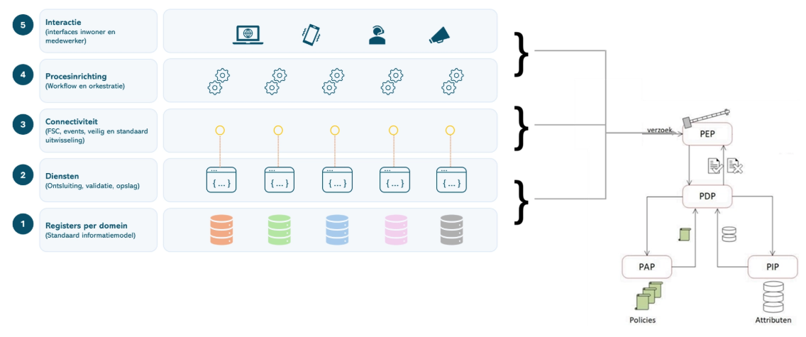

# 10. Identificatie, authenticatie en autorisatie

Binnen het Platform wordt een scheiding aangebracht tussen
identificatie/authenticatie en autorisatie:

- **Identificatie en authenticatie** worden gerealiseerd met Keycloak
  als standaard bouwblok (Identity Provider).

- **Autorisatie** wordt gerealiseerd via een externe autorisatielaag
  volgens een PxP-architectuur (Policy x Point).

## Identificatie en authenticatie (Keycloak, DigiD)

Authenticatie wordt centraal verzorgd door Keycloak als Identity
Provider (IdP). Dit omvat:

- Authenticatie van gebruikers (bijv. via DigiD, eHerkenning of andere
  IdP’s)

- Uitgifte van tokens (bijv. OAuth2 / OpenID Connect)

- Identity federation

- Beheer van gebruikers, rollen en attributen

Applicaties vertrouwen op de door Keycloak uitgegeven tokens voor het
vaststellen van de identiteit van de gebruiker (subject).

Voor **eindgebruikers** (burgers en bedrijven) vindt authenticatie
plaats via erkende landelijke voorzieningen. Inwoners loggen in met
DigiD en bedrijven met eHerkenning, bijvoorbeeld bij gebruik van
OpenFormulieren en portalen (zoals een MijnOmgeving).

Daarnaast wordt het gebruik van de **European Digital Identity Wallet
(EUDI-wallet)** momenteel verder uitgewerkt als toekomstige voorziening
voor digitale identificatie en attributenuitwisseling binnen Europa.

## Autorisatie (huidige situatie)

Autorisatie *tussen* services wordt primair gerealiseerd op **laag 3
(integratie- en servicelaag)** via de FSC. Binnen de FSC worden
afspraken (contracten) vastgelegd tussen dienstaanbieders en afnemers.
Toegang tot API’s wordt daarbij gecontroleerd op basis van deze
contracten en technisch afgedwongen met behulp van tokens (bijvoorbeeld
JWT). Hierdoor is geborgd dat alleen geautoriseerde afnemers gebruik
kunnen maken van specifieke services.

Binnen afnemende services op **laag 4 en 5** — zoals KISS en GZAC —
wordt aanvullende autorisatie ingericht op basis van rollen en rechten.
Dit betekent dat gebruikers binnen deze applicaties alleen toegang
hebben tot functionaliteiten en gegevens die passen bij hun rol.
Tegelijkertijd worden binnen deze applicaties auditlogs gegenereerd,
waarin gebruikershandelingen worden vastgelegd ten behoeve van
verantwoording en controle.

## Policy Based Access Control (PBAC) en FTV

In de doelarchitectuur wordt autorisatie
[ingericht](https://www.notion.so/PBAC-11278b5f4db48015873bd4e4502a5b89?pvs=21)
volgens een **externalized authorization model** gebaseerd op het
PxP-concept. Hierbij worden verantwoordelijkheden gescheiden over
meerdere componenten:

- **PEP (Policy Enforcement Point)** Bevindt zich in API-gateways of
  services en dwingt autorisatie af.

- **PDP (Policy Decision Point)** Neemt autorisatiebeslissingen op basis
  van policies.

- **PAP (Policy Administration Point)** Beheert en publiceert
  autorisatieregels.

- **PIP (Policy Information Point)** Levert contextinformatie (bijv. uit
  registraties of andere bronnen).

Het AuthZEN-initiatief van de OpenID Foundation beschrijft hoe deze
componenten samenwerken. AuthZEN definieert een gestandaardiseerde
Authorization API waarmee een PEP een autorisatievraag kan stellen aan
een PDP. De specificatie stelt dat de PDP deze API aanbiedt en dat de
PEP deze gebruikt om beslissingen op te vragen. In een verzoek worden
bijvoorbeeld het subject (wie), de resource (waarop), de actie (wat) en
contextinformatie meegestuurd. De PDP evalueert deze gegevens tegen
policies en retourneert een beslissing zoals *permit* of *deny*.

Dit model ondersteunt externalized authorization: autorisatielogica
bevindt zich niet in applicaties zelf, maar in een aparte service. De
gekozen architectuur ondersteunt federatieve samenwerking tussen
organisaties. Dit betekent dat:

- Autorisatiebeslissingen gebaseerd zijn op context uit meerdere
  domeinen

- Policies organisatie-overstijgend kunnen worden toegepast

- Toegang tot informatieobjecten consistent en herleidbaar wordt
  beoordeeld

  Deze aanpak sluit aan bij initiatieven zoals [**Federatieve
  Toegangsverlening (FTV)**](https://vng-realisatie.github.io/ftv/) en
  de referentie-implementatie
  [OpenFTV](https://vng-realisatie.github.io/ftv/actueel/nieuws/20251014updateopenftv/)
  en is ook vastgelegd als (kandidaat) **toegepast patroon** in het
  onderdeel [Toegepaste patronen](../11-toegepaste-patronen/README.md#toegepaste-patronen).

