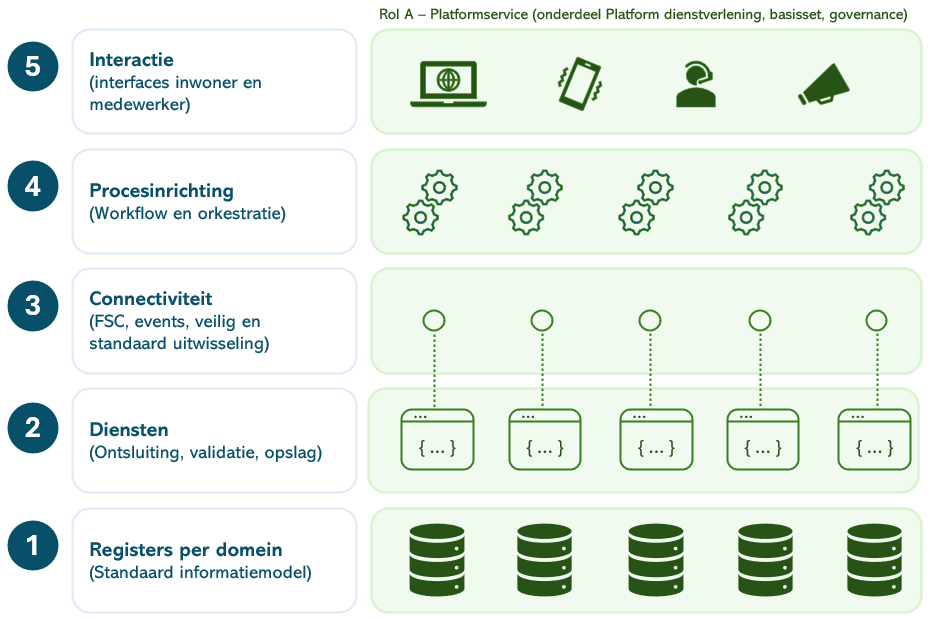
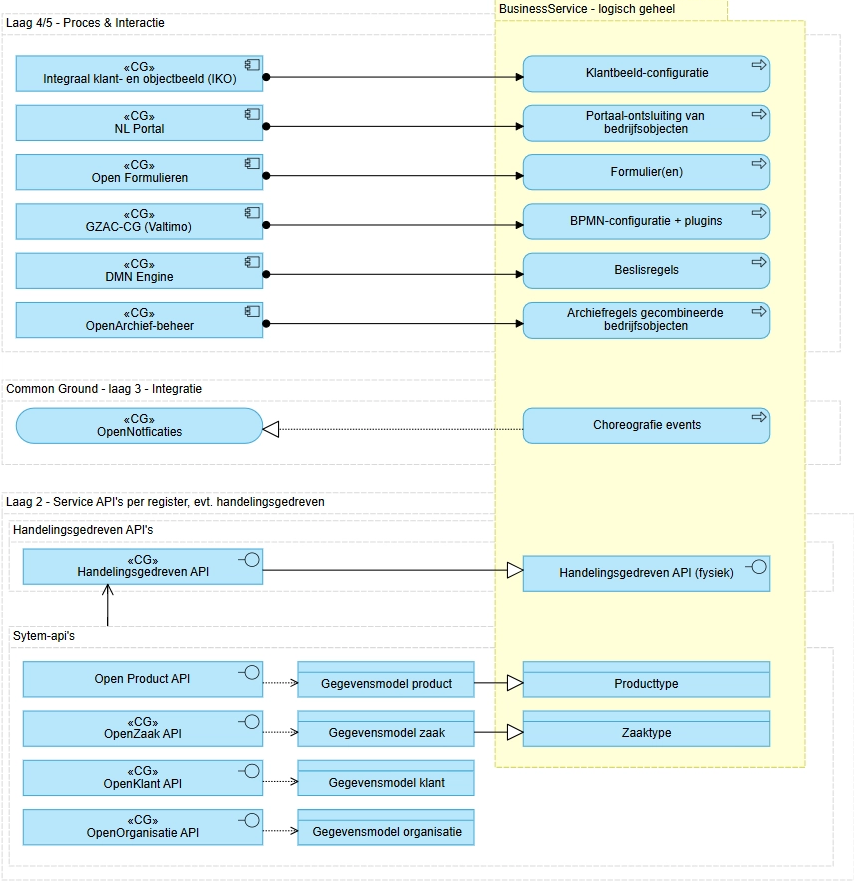

# 15. BIJLAGEN

## BIJLAGE – In te vullen gaps in de Enterprisearchitectuur

Formeel kan de hoofdstukindeling en opbouw heroverwogen worden. Sommige
onderdelen zijn te zwaar, anderen te licht.

Inhoudelijk:

- **Informatiebeheer**, Security- en compliance-uitwerking

  - Beveiliging, privacy en compliance (zoals BIO, CBW, AI Act en AVG en
    toekomstige regelgeving) zijn randvoorwaardelijk voor architectuur,
    maar worden in dit document alleen schetsmatig uitgewerkt.

  - Datzelfde geldt voor het principe ‘Duurzame toegankelijkheid by
    design’.

- **Strategie, businessarchitectuur – Capabilities**

  - Het architectuurconcept ‘Capabilities’ is in deze architectuur niet
    uitgewerkt. Dat kan wel een ankerpunt zijn om de architectuur te
    verbinden aan bijv. NDS.

- **Datakwaliteit**

  - Wordt beperkt uitgewerkt. Overweeg <a href="https://www.noraonline.nl/wiki/Raamwerk_gegevenskwaliteit" target="_blank" rel="noopener noreferrer">NORA’s Framework voor
    datakwaliteit</a>
    te gebruiken.

- **Beheer en gevolgen voor IT-ondersteuning binnen gemeenten**

  - Technisch, infrastructureel en functioneel beheer is momenteel per
    gemeente ingericht. Dit is niet op Enterprisearchitectuurniveau
    uitgewerkt.

- **Relaties met ketenpartners en overheidsbrede dienstverlening**

  - Relaties en patronen met ketenpartners en overheidsbrede
    dienstverlening zijn – buiten de verhandeling over FSC – niet
    uitgewerkt.

## BIJLAGE - Korte geschiedenis van gemeentelijke informatisering

#### Historische ontwikkeling van gemeentelijke automatisering

De gemeentelijke informatievoorziening is historisch opgebouwd rond
afzonderlijke werkprocessen. Lange tijd gold het uitgangspunt: *“elk
proces zijn eigen pakket.”* Deze aanpak sloot aan bij de behoefte om
specifieke processen met gespecialiseerde software te ondersteunen.
Naarmate de onderlinge afhankelijkheid tussen processen toenam, leidde
dit echter tot een groeiend aantal koppelingen tussen systemen, met als
gevolg toenemende complexiteit, beheerslast en kosten.

Deze ontwikkeling past binnen een bredere bestuurlijke logica waarin
processen, afdelingen en verantwoordelijkheden gescheiden zijn
georganiseerd. Precies deze verkokering is kenmerkend voor de
traditionele, postindustriële inrichting van de overheid.

#### Opkomst van suites per domein

Als reactie hierop zijn gemeenten overgegaan op een nieuwe benadering:
het bundelen van functies en koppelingen in zogenaamde suites. Grote
leveranciers introduceerden geïntegreerde softwareoplossingen voor
bijvoorbeeld het sociaal domein of vergunningverlening in de fysieke
leefomgeving. Deze suites boden voordelen zoals vooraf ingerichte
interne koppelingen, een vermindering van het aantal
aanbestedingstrajecten en administratieve lastenverlichting. Gemeenten
hebben deze ontwikkeling actief ondersteund door hun aanbestedingen
hierop aan te passen.

#### Grenzen aan de suite-benadering

Hoewel de suite-aanpak aanvankelijk effectief bleek, staat deze
inmiddels onder druk. Door technologische innovaties is een steeds hoger
tempo van vernieuwing noodzakelijk. Tegelijkertijd stijgt de behoefte
aan onderlinge koppelingen tussen systemen om integraal en kwalitatief
hoogwaardige dienstverlening mogelijk te maken. Suites blijken hierin
steeds vaker een belemmering.

Daarnaast leidt de sterke afhankelijkheid van een enkele leverancier tot
beperkte flexibiliteit. Migratie naar een andere aanbieder is voor
gemeenten complex en kostbaar, waardoor reële keuzevrijheid ontbreekt.
Nieuwe toetreders tot de markt kunnen de concurrentie nauwelijks
aangaan, gezien de hoge investeringsdrempels voor het ontwikkelen van
een concurrerende suite. Dit leidt tot marktconcentratie en afnemende
innovatiekracht. De balans tussen efficiëntie en wendbaarheid is
zoekgeraakt.

Deze situatie weerspiegelt een breder probleem: systemen zijn leidend
geworden, terwijl gegevens en publieke waarden dat zouden moeten zijn.
Hierdoor ontstaat een informatiehuishouding die onvoldoende aansluit op
de behoeften van uitvoering en samenleving.

## BIJLAGE - BusinessServices

De ‘BusinessService’ is een belangrijk concept in architectuur van het
Platform. ‘BusinessService’ is een begrip dat contextgevoelig is en
daardoor in architectuurdiscussies regelmatig langs elkaar heen wordt
gebruikt. (zie onderaan voor ambiguïteit).

In het Platform Dienstverlening is een BusinessService een logisch
geheel dat businessobjecten en -regels encapsuleert in herbruikbare
functionaliteit. Het wordt hier met twee hoofdletters geschreven om het
te onderscheiden van andere concepten.

### BusinessService: een generiek concept

Het Platform Dienstverlening is een (micro)servicearchitectuur en een
BusinessService is **een logisch geheel dat businessobjecten en -regels
encapsuleert met een vastgestelde in - en output en herbruikbare
functionaliteit.**

De service is een *logisch* geheel, maar bestaat binnen het platform
*fysiek* uit verschillende services:

#### BusinessService in het vijflaagsmodel van Common Ground

| **Common Ground-laag** | **Rol van de laag** | **BusinessService (SOA/IT-definitie)** |
|----|----|----|
| **5. Interactie-laag** | Afhandeling van gebruikers- of kanaalinteractie | De BusinessService manifesteert zich hier als één samenhangende functionaliteit voor het kanaal (bijv. “aanvraag indienen”), of het proces (bijv. ‘vastleggen Inkomen) |
| **4. Proces-laag** | Orkestratie van stappen en volgorde | De BusinessService bestaat hier uit BPMN-fragmenten per processtap, die samen het end-to-end gedrag vormen maar zelfstandig uitvoerbaar zijn. |
| De BusinessServices worden aangestuurd door DMN-modellen\* die valideren en orkestreren op basis van beslis- en procesregels. |  |  |
| **3. Integratie-laag** | Uitwisseling data |  |
| **2. Toegang tot data** | Technische ontsluiting en validatie | De BusinessService interacteert met specifieke **API-calls,** verantwoordelijk voor extra validatie, verwerking en het wegschrijven van data. |
| **1. Data / Registratie-laag** | Duurzame vastlegging van gegevens | De BusinessService heeft geen eigen database maar gebruikt een registratie waarin de door de service beheerde gegevens consistent, leidend en deelbaar worden vastgelegd. |

> \* Voorbeeld DMN-tabel: op basis van het type proces, de huidige fase,
> en nieuwe gebeurtenissen en de inhoud van die gebeurtenissen wordt een
> logische vervolgstap bepaald en gestart.

### BusinessService: voorbeeld

**Laag 5**

Een BusinessService ‘vaststellen’ persoon bestaat op de interactie-laag
uit een formulier voor de behandelaar dat met de volgende
functionaliteit:

- Het formulier toont de persoonsgegevens uit de aanvraag (BSN, naam,
  geboortedatum).

- Daarnaast worden de bijbehorende persoonsgegevens uit de BRP getoond,
  indien beschikbaar.

- De gebruiker beoordeelt of de BRP-gegevens overeenkomen met de
  aanvraag.

- Als BRP-gegevens beschikbaar zijn, moet de gebruiker kiezen of deze
  wel of niet gebruikt mogen worden.

- Bij de keuze *nee* moet een ander (gewenst) BSN worden ingevoerd.

- Als BRP-gegevens niet beschikbaar zijn, wordt direct gevraagd om een
  BSN in te voeren.

- De gebruiker moet een toelichting geven op de gemaakte keuze.

- Het formulier kan pas worden ingediend wanneer alle verplichte keuzes
  en invoer zijn gedaan.

**Laag 4**

Op laag 2 vindt het proces plaats waarin bovenstaande (het formulier)
één gebruikerstaak is.

- Het proces start met het ophalen van relevante invoer uit de aanvraag
  en eerdere vastleggingen (persoon, BRP-keuze, toelichting).

- Deze gegevens worden voorbereid en samengebracht als input voor
  vaststelling.

- Vervolgens wordt een subproces “vaststelling persoon” aangeroepen
  waarin de beoordeling plaatsvindt (zie bovenstaand formulier)

- In dit subproces wordt vastgelegd of de persoon is vastgesteld, met
  datum, toelichting en gebruikte BRP-gegevens.

- Het proces onderscheidt expliciet handmatige beoordeling van
  automatische vaststelling.

- Na afronding worden de resultaten weggeschreven:

  - Vastgestelde persoonsgegevens,

  - Aanvullende vastleggingsvelden,

  - En brondata uit de brp.

- De vastlegging gebeurt op vaste locaties voor de gegevens

- Het proces eindigt wanneer de persoon van de aanvrager definitief is
  vastgesteld.

#### Laag 2

Op laag 2 wordt de data consistent vastgelegd met gebruik van een
API-call, die er als volgt uit kan zien:

{

"identificatie": "string",

"bronorganisatie": "string",

"omschrijving": "Vaststelling persoon aanvrager",

"toelichting": "Motivatie van de consulent bij het vaststellen van de
persoon",

"vaststellingstype": "persoon",

"registratiedatum": "2019-08-24",

"datumVastgesteld": "2019-08-24T14:15:22Z",

"handmatigVastgesteld": true,

"vastgesteldePersoon": {

"bsn": "string",

"voornamen": "string",

"voorletters": "string",

"voorvoegsel": "string",

"achternaam": "string",

"geboortedatum": "2019-08-24"

},

"brongegevensPersoon": {

"bron": "BRP",

"bsn": "string",

"voornamen": "string",

"voorletters": "string",

"voorvoegsel": "string",

"achternaam": "string",

"geboortedatum": "string",

"onvolledigeGeboortedatum": true

},

"beoordeling": {

"brpGegevensGebruikt": true,

"toelichtingConsulent": "Korte onderbouwing van de gemaakte keuze"

},

"herkomst": {

"proces": "BSB-211 Vaststelling persoon",

"taak": "Vaststellen persoon aanvrager"

},

"archivering": {

"archiefstatus": "nog_te_archiveren",

"archiefactiedatum": "2019-08-24",

"archiefnominatie": "blijvend_bewaren"

}

}

#### 

#### Laag 1

Op laag 1 worden de door de service beheerde gegevens consistent,
leidend en deelbaar vastgelegd. Op het niveau van businessobjecten zijn
registraties beschikbaar (’Common Ground-registraties’) voor Zaken,
Producten, Klanten.

Voor specifieke (domeingebonden gegevens) zoals bijvoorbeeld Burgerzaken
of processen in het Sociaal Domein worden Domeinregistraties gebruikt.

**Granulariteit van BusinessServices**

Hoe groot of klein een BusinessService moet zijn, wordt bepaald door een
samenhang van functionele en inhoudelijke overwegingen. Daarbij zijn met
name de volgende factoren leidend:

- **Herbruikbaarheid van de service.** Een BusinessService moet logisch
  herbruikbaar zijn over meerdere processen en contexten. In het
  voorbeeld is de service *vaststellen persoon* generiek toepasbaar,
  omdat deze functionaliteit in veel processen terugkomt. Wanneer aan
  deze service ook proces- of domeinspecifieke functionaliteit wordt
  toegevoegd — zoals het toekennen van een paspoort — neemt de
  herbruikbaarheid af. Dergelijke functionaliteit hoort daarom thuis in
  een aparte BusinessService die een ander businessdoel dient.

- **Herhaalbaarheid van de service.** Een BusinessService moet meerdere
  keren op dezelfde wijze kunnen worden uitgevoerd, met vergelijkbare
  invoer en uitkomsten. Als een handeling slechts éénmalig of sterk
  contextafhankelijk is, is deze minder geschikt als zelfstandige
  BusinessService.

- **Niveau en scope van datavalidatie.** De benodigde mate van validatie
  en consistentiebewaking bepaalt mede de omvang van de BusinessService.
  Als een bedrijfsobject groot is en de vereiste consistentie zich
  uitstrekt over alle attributen (bijvoorbeeld identiteit, naam en
  geboortedatum in samenhang), is het logisch om deze validatie binnen
  één BusinessService te concentreren. Hierdoor kan de service als
  consistente eenheid optreden richting afnemers.

- **Cohesie van het businessconcept.** Een BusinessService moet één
  duidelijk businessconcept vertegenwoordigen.

### Blauwdruk gebruik van BusinessServices

Bovenstaand voorbeeld komt uit het proces Aanvraag Leefonderhoud. Dit
proces leent zich goed voor standaardisatie in de vorm van
BusinessServices omdat er een breedgedragen ontologie is geformuleerd
(<https://github.com/VNG-Realisatie/Ontologie-Inkomen/>).

Op basis van wat er ‘bestaat’ in het domein (concepten, relaties,
handelingen) worden BusinessServices geïdentificeerd. Een
**informatiemodel**, waarbij de Ontologie Inkomen een heel gedetailleerd
en gereviseerd voorbeeld betreft, is voorwaardelijk.

#### BusinessService - Ambiguïteit.

| **Context** |  | **Betekenis** | **Definitie** |
|----|----|----|----|
| **Businessarchitectuur** |  | Waarde voor een externe afnemer | Een *businessservice* is een door de organisatie geleverde, extern waarneembare dienst die een specifieke behoefte van een afnemer vervult, onafhankelijk van interne processen en technologie. |
| **ArchiMate (business layer)** |  | Formeel gedefinieerd architectuurconcept | Een *businessservice* is een service die vanuit de businesslaag wordt aangeboden aan een business actor of role, en die wordt gerealiseerd door businessprocessen en/of businessfuncties. |
| **SOA / IT-architectuur (informeel gebruik)** |  | IT-service met businesssemantiek | Een *BusinessService* is een applicatieservice die businessobjecten en -regels encapsuleert en herbruikbare functionaliteit biedt aan andere applicaties of kanalen. - in platformcontext: **een logisch geheel dat businessobjecten en -regels encapsuleert met een vastgestelde in - en output en herbruikbare functionaliteit.** |
| **Capability-gebaseerde architectuur** |  | Concretisering van een capability | Een *businessservice* is een afgebakende levering van waarde die laat zien hoe een capability extern of intern wordt benut door de organisatie. |
| **Product-georiënteerde organisaties** |  | Markt- of productdienst | Een *businessservice* is een door een team of product aangeboden dienst met een duidelijke scope, eigenaar en prestatieafspraken, gericht op continue waardecreatie voor gebruikers of klanten. |
| **Operating-model / service-management** |  | Organisatorische dienst | Een *businessservice* is een stabiel gedefinieerde organisatorische dienst waarvoor afspraken bestaan over kwaliteit, kosten en beschikbaarheid, vaak vastgelegd in SLA’s. |

### Samenwerking en uitwisseling bouwstenen

<https://samendelen.opengem.nl/> - Samen Delen is de plek waar de
inrichting van applicaties gedeeld kan worden met elkaar. Als een
applicatie een exportfunctie heeft, kunnen deze exports hier worden
geüpload. Anderen kunnen deze exports weer downloaden en importeren in
hun applicatie.

Voor **GZAC** is een Exchange.gzac.nl beschikbaar, met daarop:

<a href="https://exchange.gzac.nl/" target="_blank" rel="noopener noreferrer">App</a>

- **Process Blue Prints** – Startklare basisprocessen; altijd lokaal te
  configureren en soms uit te breiden met maatwerk (bijv. een plugin).

- **Building Blocks** – Herbruikbare onderdelen zoals formulieren,
  zaakdefinities en subprocessen.

- **Plugins** – Uitbreidingen voor extra functionaliteit, vaak voor
  generieke koppelingen met andere systemen.

## BIJLAGE - Overzicht services

Overzicht van services en link naar documentatie binnen Platform
Dienstverlening.

**Laag 1/2 – Registraties & API-laag (Data & Services)**

**OpenZaak**

Moderne open-source implementatie van de ZGW-API’s voor zaak- en
documentbeheer.

<https://github.com/open-zaak/open-zaak>

**OpenKlant**

Registratiecomponent voor opslag en ontsluiting van klantgegevens
volgens de Klantinteracties-API-specificaties.

<https://github.com/maykinmedia/open-klant>

**OpenOrganisatie**

Component voor beheer van medewerkers, teams en organisaties met
API-toegang en o.a. SCIM-integratie.

<https://github.com/maykinmedia/open-organisatie>

**OpenProduct**

Centrale API voor producttypen en producten, bedoeld voor hergebruik in
andere applicaties.

<https://github.com/maykinmedia/open-product>

**Registraties VTB (Verzoeken, taken berichten)**

Componenten voor (resp.) Verzoeken, Taken en Berichten als
gestandaardiseerde informatie-objecten, voor communicatie- en
interactiepatronen over het platform.

<a href="https://github.com/maykinmedia/open-vtb" target="_blank" rel="noopener noreferrer">maykinmedia/open-vtb: Open Verzoeken, Taken en
Berichten</a>

**Objects API**

API en beheerinterface voor het registreren en beheren van generieke
objecten binnen Common Ground.

<https://github.com/maykinmedia/objects-api>

**Objecttypes API**

API voor het definiëren en beheren van objecttypen die gebruikt worden
door Objects API-implementaties.

<https://github.com/maykinmedia/objecttypes-api>

**Referentielijsten API**

API voor generieke en herbruikbare referentielijsten binnen het Common
Ground-landschap.

<https://github.com/maykinmedia/referentielijsten>

**OpenNotificaties**

API voor het routeren en publiceren van notificaties tussen applicaties
binnen een Common Ground-architectuur.

<https://github.com/open-zaak/open-notificaties>

**OpenArchiefbeheer**

Component voor recordmanagement en vernietigingslijsten conform
archiefwet- en ZGW-principes.

<https://github.com/maykinmedia/open-archiefbeheer>

**Open API Framework**

Gedeeld framework met basisfunctionaliteit en configuratie voor meerdere
Open-componenten.

<https://github.com/maykinmedia/open-api-framework>

**Laag 4/5 – Interactie & Toepassingen (Portalen & UI)**

**GZAC**

Zaakafhandelcomponent gericht op proces- en taakondersteuning bovenop
ZGW-API’s.

<https://github.com/generiekzaakafhandelcomponent>

Het onderliggende framework (Operaton) wordt tevens ingezet voor de
uitvoering van beslislogica via DMN. Op basis van de DMN-engine(s) wordt
regelbeheer voor verschillende services centraal uitgevoerd en afgedekt
via configuratie, zonder dat hiervoor maatwerk per proces nodig is.

**ZAC**

Zaakafhandelcomponent gericht op proces- en taakondersteuning bovenop
ZGW-API’s.

<https://github.com/infonl/dimpact-zaakafhandelcomponent>

**DMN Studio**

Beheercomponent voor inrichting van beslisregels in Operaton
DMN-instances.

<https://github.com/SynTouchNL/dmn-studio-backend>

**NL Portal**

Portaaloplossing voor inwoner- en medewerkersinteractie binnen een
Common Ground-architectuur.

<https://github.com/nl-portal>

**OpenInwonerPortaal**

Gemeentelijk platform voor producten en diensten met integraties naar
Common Ground-componenten.

<https://github.com/maykinmedia/open-inwoner>

**IKO – Integraal Klant- en Objectbeeld**

Integreert klant- en objectgegevens tot één overzicht voor
case-medewerkers

*Doc pagina (functieomschrijving):*
<https://docs.valtimo.nl/features/iko>

**Open Formulieren**

Faciliteert het modelleren, aanbieden en verwerken van digitale
formulieren voor inwoners en organisaties. Het component verzorgt de
gestructureerde uitvraag van gegevens, valideert invoer en legt
inzendingen vast via gestandaardiseerde API’s.

<https://github.com/open-formulieren/open-forms/>

**OpenBeheer**

Biedt een centrale beheerinterface voor het beheren van gegevens uit
meerdere registraties binnen samenhangende processen, zonder dat deze
registraties zelf worden aangepast.

<https://github.com/maykinmedia/open-beheer>

**Faciliterende voorzieningen**

Aanvullend op de bovenstaande kerncomponenten bevat het platform een
aantal ondersteunende voorzieningen die noodzakelijk zijn voor de
volledige inrichting van de dienstverlening:

- **Toegang en beveiliging**: authenticatie- en autorisatievoorzieningen
  (o.a. DigiD, eHerkenning, eIDAS, machtigingen, Keycloak/OpenID
  Connect, met (optionele) koppeling met Azure AD)

- **Communicatie en output**: integratie met e-mailafhandeling (SMTP
  relay, mailbox/outbox), documentgeneratie (templates, PDF) en
  printvoorzieningen

- **Gegevensontsluiting en externe bronnen**: koppelingen met landelijke
  registraties en externe databronnen (zoals BRP, BAG, KvK, Kadaster via
  HaalCentraal)

- **Monitoring en logging**: centrale voorzieningen voor observability
  (o.a. Grafana, Loki) ten behoeve van beheer, auditing en
  betrouwbaarheid (onderdeel van Haven+).

Deze voorzieningen zijn integraal onderdeel van het platform, maar
worden ingezet als generieke capabilities die door meerdere services en
processen worden gebruikt.

## BIJLAGE - ABB’s GEMMA en Platform Dienstverlening

GEMMA biedt een overzicht van
<a href="https://www.gemmaonline.nl/wiki/Overzicht_alle_referentiecomponenten" target="_blank" rel="noopener noreferrer">referentiecomponenten</a>
en de bijbehorende services die gerealiseerd kunnen worden. Per service
kan worden bepaald in hoeverre het Platform Dienstverlening deze
functionaliteit invult.

Per service (linkt door naar GEMMA-definitie) is aangegeven of die in
scope is, met als onderscheid:

- **Expliciet in scope**: functionaliteit die momenteel wordt
  gerealiseerd in het Platform, of staat op relatief korte termijn (1-2
  jaar) op de roadmap

- **Potentieel in scope**: functionaliteit die niet op de roadmap staat,
  maar inhoudelijk geschikt is om te worden ondergebracht binnen
  generieke services van het Platform.

| **Services** | **Expliciet in Scope** | **Potentieel in scope** |
|----|----|----|
| <a href="https://www.gemmaonline.nl/wiki/GEMMA/id-fe1dd64a-90d9-4d5c-bc2e-bab3ba42bc76" target="_blank" rel="noopener noreferrer">Kunstmatige intelligentie</a> | x |  |
| <a href="https://www.gemmaonline.nl/wiki/GEMMA/id-17352034-a310-11e5-11ba-005056a85f9c" target="_blank" rel="noopener noreferrer">Ondersteunen van gebouw-, ruimte- en locatietoegang.</a> |  | x |
| <a href="https://www.gemmaonline.nl/wiki/GEMMA/id-b2738bc8-8c74-11e5-1099-005056a83192" target="_blank" rel="noopener noreferrer">Beheren van accommodaties</a> |  | x |
| <a href="https://www.gemmaonline.nl/wiki/GEMMA/id-c7d90e6f-dec6-11e5-11ba-005056a85f9c" target="_blank" rel="noopener noreferrer">Beheren van afspraken</a> | x |  |
| <a href="https://www.gemmaonline.nl/wiki/GEMMA/id-e812b86b-70e9-11e5-1099-005056a83192" target="_blank" rel="noopener noreferrer">Aanmaken, raadplegen, bijwerken en verwijderen van afspraken</a> | x |  |
| <a href="https://www.gemmaonline.nl/wiki/GEMMA/id-6e4e6f73-304c-11e5-1099-005056a83192" target="_blank" rel="noopener noreferrer">Genereren van berichten mbt afspraken</a> | x |  |
| <a href="https://www.gemmaonline.nl/wiki/GEMMA/id-857ffb0d-da88-11e1-7023-0050568a1905" target="_blank" rel="noopener noreferrer">Maken van afspraken</a> | x |  |
| <a href="https://www.gemmaonline.nl/wiki/GEMMA/id-9590eb24-63e5-422e-9775-e95d3c40fd98" target="_blank" rel="noopener noreferrer">Ondersteunen van afvalopslag en -verwerking</a> |  |  |
| <a href="https://www.gemmaonline.nl/wiki/GEMMA/id-eb8e8447-a6fc-4c92-a14f-17f6433585e0" target="_blank" rel="noopener noreferrer">Ondersteunen afvalinzameling</a> |  |  |
| <a href="https://www.gemmaonline.nl/wiki/GEMMA/id-4adc69ea-d707-11e5-11ba-005056a85f9c" target="_blank" rel="noopener noreferrer">Ondersteunen van registreren agressiegevallen</a> | x |  |
| <a href="https://www.gemmaonline.nl/wiki/GEMMA/id-7388053d-8ce5-4aae-8e7b-7cd8239230b3" target="_blank" rel="noopener noreferrer">Netwerkbescherming</a> |  |  |
| <a href="https://www.gemmaonline.nl/wiki/GEMMA/id-e6aab46b-c6f5-4308-a7cc-d7a0e97c9016" target="_blank" rel="noopener noreferrer">Beschermen tegen malware</a> | x |  |
| <a href="https://www.gemmaonline.nl/wiki/GEMMA/id-8e89a47b-3f82-484a-95ba-a747c597d6f8" target="_blank" rel="noopener noreferrer">Gegevensbescherming en onderzoek</a> | x |  |
| <a href="https://www.gemmaonline.nl/wiki/GEMMA/id-185d3047-0d24-4743-82f6-d695766294fc" target="_blank" rel="noopener noreferrer">Beheren media</a> |  |  |
| <a href="https://www.gemmaonline.nl/wiki/GEMMA/id-ec34138c-a62a-48f4-b36f-f090ee3a10bd" target="_blank" rel="noopener noreferrer">Mobiele apparaten beveiliging</a> |  |  |
| <a href="https://www.gemmaonline.nl/wiki/GEMMA/id-daa156d3-a752-4419-bc7b-a74e5be61040" target="_blank" rel="noopener noreferrer">Ondersteunen van forensisch onderzoek</a> |  |  |
| <a href="https://www.gemmaonline.nl/wiki/GEMMA/id-266cb309-e977-44bc-a157-6443b7041b30" target="_blank" rel="noopener noreferrer">Spam-filtering</a> |  |  |
| <a href="https://www.gemmaonline.nl/wiki/GEMMA/id-45fdcf8f-4d8b-4b87-bfff-3b5c9a76e74f" target="_blank" rel="noopener noreferrer">Ondersteunen van archeologie</a> | x |  |
| <a href="https://www.gemmaonline.nl/wiki/GEMMA/id-2d0f6cb7-16c9-11e3-284c-08002700d457" target="_blank" rel="noopener noreferrer">Archiveren van informatieobjecten</a> | x |  |
| <a href="https://www.gemmaonline.nl/wiki/GEMMA/id-7d7b8604-bf58-11e1-7023-0050568a1905" target="_blank" rel="noopener noreferrer">Beheren gearchiveerde informatieobjecten</a> | x |  |
| <a href="https://www.gemmaonline.nl/wiki/GEMMA/id-36bb3359-70f3-11e5-1099-005056a83192" target="_blank" rel="noopener noreferrer">Documenteren van beheer van informatieobjecten</a> | x |  |
| <a href="https://www.gemmaonline.nl/wiki/GEMMA/id-36bb333f-70f3-11e5-1099-005056a83192" target="_blank" rel="noopener noreferrer">Tonen en zoeken van informatieobjecten</a> | x |  |
| <a href="https://www.gemmaonline.nl/wiki/GEMMA/id-36bb3345-70f3-11e5-1099-005056a83192" target="_blank" rel="noopener noreferrer">Beschikbaarstellen van informatieobjecten</a> | x |  |
| <a href="https://www.gemmaonline.nl/wiki/GEMMA/id-77f4c2e0-b562-11e5-11ba-005056a85f9c" target="_blank" rel="noopener noreferrer">Aanbieden informatieobjecten als download</a> | x |  |
| <a href="https://www.gemmaonline.nl/wiki/GEMMA/id-30381010-b55b-11e5-11ba-005056a85f9c" target="_blank" rel="noopener noreferrer">Online beschikbaarstellen informatieobjecten</a> | x |  |
| <a href="https://www.gemmaonline.nl/wiki/GEMMA/id-36bb333a-70f3-11e5-1099-005056a83192" target="_blank" rel="noopener noreferrer">Duurzaam opslaan en ontsluiten informatieobjecten</a> | x |  |
| <a href="https://www.gemmaonline.nl/wiki/GEMMA/id-05f40152-b54b-11e5-11ba-005056a85f9c" target="_blank" rel="noopener noreferrer">Converteren informatieobject naar duurzaam formaat</a> | x |  |
| <a href="https://www.gemmaonline.nl/wiki/GEMMA/id-36bb3342-70f3-11e5-1099-005056a83192" target="_blank" rel="noopener noreferrer">Opslaan en ontsluiten data informatieobjecten</a> | x |  |
| <a href="https://www.gemmaonline.nl/wiki/GEMMA/id-8a67b6c5-c2da-11e5-11ba-005056a85f9c" target="_blank" rel="noopener noreferrer">Opslaan en ontsluiten metagegevens informatieobjecten</a> | x |  |
| <a href="https://www.gemmaonline.nl/wiki/GEMMA/id-36bb334d-70f3-11e5-1099-005056a83192" target="_blank" rel="noopener noreferrer">Valideren van informatieobjecten</a> | x |  |
| <a href="https://www.gemmaonline.nl/wiki/GEMMA/id-36bb3356-70f3-11e5-1099-005056a83192" target="_blank" rel="noopener noreferrer">Verwijderen/vernietigen van informatieobjecten</a> | x |  |
| <a href="https://www.gemmaonline.nl/wiki/GEMMA/id-c953c4e0-d71a-11e5-11ba-005056a85f9c" target="_blank" rel="noopener noreferrer">Beheren van architectuurmodellen</a> |  |  |
| <a href="https://www.gemmaonline.nl/wiki/GEMMA/id-3ff4ac94-b730-4d19-96fc-3200db14b507" target="_blank" rel="noopener noreferrer">Beheren van BAG gegevens</a> | x |  |
| <a href="https://www.gemmaonline.nl/wiki/GEMMA/id-ffa140e7-09a7-490d-91b5-28203cbda688" target="_blank" rel="noopener noreferrer">Beheren van BGT gegevens</a> | x |  |
| <a href="https://www.gemmaonline.nl/wiki/GEMMA/id-8280288e-da88-11e1-7023-0050568a1905" target="_blank" rel="noopener noreferrer">Beheren van managementinformatie</a> |  |  |
| <a href="https://www.gemmaonline.nl/wiki/GEMMA/id-257894d2-2b22-11e5-1099-005056a83192" target="_blank" rel="noopener noreferrer">Analyseren van gegevens</a> |  |  |
| <a href="https://www.gemmaonline.nl/wiki/GEMMA/id-568b6348-29d8-48aa-92a3-6d10fcdb326b" target="_blank" rel="noopener noreferrer">Analyseren van geo-gegevens</a> |  |  |
| <a href="https://www.gemmaonline.nl/wiki/GEMMA/id-05e0f151-641b-11e4-67ab-0050568a6153" target="_blank" rel="noopener noreferrer">Integreren van gegevens</a> |  |  |
| <a href="https://www.gemmaonline.nl/wiki/GEMMA/id-48c06f9c-bf77-11e1-7023-0050568a1905" target="_blank" rel="noopener noreferrer">Maken en tonen van rapportages</a> |  |  |
| <a href="https://www.gemmaonline.nl/wiki/GEMMA/id-d4eabc21-dfba-11e1-7023-0050568a1905" target="_blank" rel="noopener noreferrer">Maken en tonen van trendanalyses</a> |  |  |
| <a href="https://www.gemmaonline.nl/wiki/GEMMA/id-800a829b-db4e-11e1-7023-0050568a1905" target="_blank" rel="noopener noreferrer">Tonen van standaard selecties</a> |  |  |
| <a href="https://www.gemmaonline.nl/wiki/GEMMA/id-2eb9a95b-3a91-446e-b862-b6fa5fe9bceb" target="_blank" rel="noopener noreferrer">Verwerven en transformeren van data</a> |  |  |
| <a href="https://www.gemmaonline.nl/wiki/GEMMA/id-4285a7ae-17cc-452e-99b2-5249cd742734" target="_blank" rel="noopener noreferrer">Ondersteunen curatief beheer</a> |  |  |
| <a href="https://www.gemmaonline.nl/wiki/GEMMA/id-10a4ab11-9ec7-46ca-9d5f-d0f832baf29f" target="_blank" rel="noopener noreferrer">Ondersteunen preventief beheer</a> |  |  |
| <a href="https://www.gemmaonline.nl/wiki/GEMMA/id-e812b877-70e9-11e5-1099-005056a83192" target="_blank" rel="noopener noreferrer">Aanmaken en geautomatiseerd uitvoeren processen</a> | x |  |
| <a href="https://www.gemmaonline.nl/wiki/GEMMA/id-e812b87f-70e9-11e5-1099-005056a83192" target="_blank" rel="noopener noreferrer">Aanmaken, delen, bijwerken en verwijderen van processen</a> | x |  |
| <a href="https://www.gemmaonline.nl/wiki/GEMMA/id-e812b882-70e9-11e5-1099-005056a83192" target="_blank" rel="noopener noreferrer">Monitoren en loggen van procesuitvoering</a> | x |  |
| <a href="https://www.gemmaonline.nl/wiki/GEMMA/id-4e099407-da8d-11e1-7023-0050568a1905" target="_blank" rel="noopener noreferrer">Uitvoeren processen</a> | x |  |
| <a href="https://www.gemmaonline.nl/wiki/GEMMA/id-9dc22a80-fc84-48e1-a5ba-55c754fb4da0" target="_blank" rel="noopener noreferrer">Beheren en inwinnen BRO-gegevens</a> | x |  |
| <a href="https://www.gemmaonline.nl/wiki/GEMMA/id-b2738be2-8c74-11e5-1099-005056a83192" target="_blank" rel="noopener noreferrer">Ondersteunen van baliedienstverlening</a> | x |  |
| <a href="https://www.gemmaonline.nl/wiki/GEMMA/id-7bc33993-21ee-492a-8632-1c525bc32bee" target="_blank" rel="noopener noreferrer">Bedrijfscontinuïteitsplanning</a> |  |  |
| <a href="https://www.gemmaonline.nl/wiki/GEMMA/id-8280287e-da88-11e1-7023-0050568a1905" target="_blank" rel="noopener noreferrer">Beheren van processen</a> | x |  |
| <a href="https://www.gemmaonline.nl/wiki/GEMMA/id-eb5cb7da-c5b6-11e5-11ba-005056a85f9c" target="_blank" rel="noopener noreferrer">Analyseren processen</a> | x |  |
| <a href="https://www.gemmaonline.nl/wiki/GEMMA/id-4e09940f-da8d-11e1-7023-0050568a1905" target="_blank" rel="noopener noreferrer">Definiëren processen</a> | x |  |
| <a href="https://www.gemmaonline.nl/wiki/GEMMA/id-4e09940b-da8d-11e1-7023-0050568a1905" target="_blank" rel="noopener noreferrer">Monitoren processen</a> | x |  |
| <a href="https://www.gemmaonline.nl/wiki/GEMMA/id-9f1cee85-dc61-11e5-11ba-005056a85f9c" target="_blank" rel="noopener noreferrer">Aanmaken, delen, verwijderen en wijzigen van bedrijven- en instellingengegevens</a> | x |  |
| <a href="https://www.gemmaonline.nl/wiki/GEMMA/id-7b0e775f-7852-4d2c-b213-f196ad83c2b8" target="_blank" rel="noopener noreferrer">Ondersteunen van belasting subject- en objectregistratie</a> | x |  |
| <a href="https://www.gemmaonline.nl/wiki/GEMMA/id-b2738be0-8c74-11e5-1099-005056a83192" target="_blank" rel="noopener noreferrer">Ondersteunen van belastingheffing</a> | x |  |
| <a href="https://www.gemmaonline.nl/wiki/GEMMA/id-a0b50b5f-ab07-4c12-a84d-333d2eb81094" target="_blank" rel="noopener noreferrer">Ondersteunen van kwijtschelding</a> | x |  |
| <a href="https://www.gemmaonline.nl/wiki/GEMMA/id-fd66da7c-94c1-4045-9580-fefe1219219b" target="_blank" rel="noopener noreferrer">Maken van bestekken</a> |  |  |
| <a href="https://www.gemmaonline.nl/wiki/GEMMA/id-257894e8-2b22-11e5-1099-005056a83192" target="_blank" rel="noopener noreferrer">Besluitvormingsproces transparantie</a> | x |  |
| <a href="https://www.gemmaonline.nl/wiki/GEMMA/id-364554c6-8ab0-469d-a66a-46973d1e336b" target="_blank" rel="noopener noreferrer">Politieke data-analyse</a> |  |  |
| <a href="https://www.gemmaonline.nl/wiki/GEMMA/id-a13af283-8c52-11e5-1099-005056a83192" target="_blank" rel="noopener noreferrer">Uitzenden van vergaderingen</a> |  |  |
| <a href="https://www.gemmaonline.nl/wiki/GEMMA/id-a13af289-8c52-11e5-1099-005056a83192" target="_blank" rel="noopener noreferrer">Bestuurlijk overleg en besluitvorming</a> |  |  |
| <a href="https://www.gemmaonline.nl/wiki/GEMMA/id-a13af27f-8c52-11e5-1099-005056a83192" target="_blank" rel="noopener noreferrer">Archiveren van vergadering en besluiten</a> |  |  |
| <a href="https://www.gemmaonline.nl/wiki/GEMMA/id-a13af281-8c52-11e5-1099-005056a83192" target="_blank" rel="noopener noreferrer">Opstellen en distribueren van agenda en stukken</a> |  |  |
| <a href="https://www.gemmaonline.nl/wiki/GEMMA/id-a13af287-8c52-11e5-1099-005056a83192" target="_blank" rel="noopener noreferrer">Vastleggen van vergaderingen en besluiten</a> |  |  |
| <a href="https://www.gemmaonline.nl/wiki/GEMMA/id-76339b62-d7c6-4bd8-bcab-969269044746" target="_blank" rel="noopener noreferrer">Voorbereidingsproces bestuurlijke besluiten</a> |  |  |
| <a href="https://www.gemmaonline.nl/wiki/GEMMA/id-3a047a27-312f-4c25-bf71-4481b50969d9" target="_blank" rel="noopener noreferrer">Ondersteunen bewaking bestuurlijke activiteiten</a> |  |  |
| <a href="https://www.gemmaonline.nl/wiki/GEMMA/id-7ba4b0b2-b37a-4c21-86cc-bfb6f46668fb" target="_blank" rel="noopener noreferrer">Beheren en implementeren van beveiligingsmaatregelen</a> | x |  |
| <a href="https://www.gemmaonline.nl/wiki/GEMMA/id-7c11ebd7-3504-4696-ac1e-2d458ac2895c" target="_blank" rel="noopener noreferrer">Ondersteunen van bezwaar- en beroep</a> | x |  |
| <a href="https://www.gemmaonline.nl/wiki/GEMMA/id-b42f487d-da8a-4393-9907-dd85cbd774ae" target="_blank" rel="noopener noreferrer">Beheren van bodemgegevens</a> |  | x |
| <a href="https://www.gemmaonline.nl/wiki/GEMMA/id-62f02946-86e4-11e5-1099-005056a83192" target="_blank" rel="noopener noreferrer">Beheren van budgetbeheer</a> |  | x |
| <a href="https://www.gemmaonline.nl/wiki/GEMMA/id-04e68515-89bc-11e3-67ab-0050568a6153" target="_blank" rel="noopener noreferrer">Beheren van zaken</a> | x |  |
| <a href="https://www.gemmaonline.nl/wiki/GEMMA/id-fd760383-6418-11e4-67ab-0050568a6153" target="_blank" rel="noopener noreferrer">Aanmaken zaak</a> | x |  |
| <a href="https://www.gemmaonline.nl/wiki/GEMMA/id-fd460824-e70a-11e1-7023-0050568a1905" target="_blank" rel="noopener noreferrer">Agenderen van zaken</a> | x |  |
| <a href="https://www.gemmaonline.nl/wiki/GEMMA/id-d2420b9e-2b06-11e5-1099-005056a83192" target="_blank" rel="noopener noreferrer">Monitoren zaken</a> | x |  |
| <a href="https://www.gemmaonline.nl/wiki/GEMMA/id-dbace431-754d-11e4-67ab-0050568a6153" target="_blank" rel="noopener noreferrer">Ondersteunen zaakafhandeling</a> | x |  |
| <a href="https://www.gemmaonline.nl/wiki/GEMMA/id-3efd83d6-80d4-4e71-a37d-0c38fd11e03c" target="_blank" rel="noopener noreferrer">Plannen van zaken</a> | x |  |
| <a href="https://www.gemmaonline.nl/wiki/GEMMA/id-56a3ac10-82fa-11e5-1099-005056a83192" target="_blank" rel="noopener noreferrer">Relateren van contactmomenten aan zaken</a> | x |  |
| <a href="https://www.gemmaonline.nl/wiki/GEMMA/id-3d6a02a0-e6f1-11e1-7023-0050568a1905" target="_blank" rel="noopener noreferrer">Tonen en bijwerken zaakdocumenten</a> | x |  |
| <a href="https://www.gemmaonline.nl/wiki/GEMMA/id-9d9db8d1-db0e-11e1-7023-0050568a1905" target="_blank" rel="noopener noreferrer">Tonen en bijwerken zaakgegevens</a> | x |  |
| <a href="https://www.gemmaonline.nl/wiki/GEMMA/id-6f9190b3-82f4-11e5-1099-005056a83192" target="_blank" rel="noopener noreferrer">Uitwisselen van berichten met ketenpartners</a> | x |  |
| <a href="https://www.gemmaonline.nl/wiki/GEMMA/id-fe815613-17e9-471b-961d-749993122b60" target="_blank" rel="noopener noreferrer">Ondersteunen van Nederlanderschap diensten</a> | x |  |
| <a href="https://www.gemmaonline.nl/wiki/GEMMA/id-0821fe1a-77e3-44f6-bfaf-dde08b3d4794" target="_blank" rel="noopener noreferrer">Ondersteunen van burgerlijke stand diensten</a> | x |  |
| <a href="https://www.gemmaonline.nl/wiki/GEMMA/id-2421774a-f228-4bf6-9c2e-77a1db8f4678" target="_blank" rel="noopener noreferrer">Ondersteunen van documenten verstrekking</a> | x |  |
| <a href="https://www.gemmaonline.nl/wiki/GEMMA/id-4ea3c3f8-89b8-11e3-67ab-0050568a6153" target="_blank" rel="noopener noreferrer">Matchen van vraag en aanbod</a> |  | x |
| <a href="https://www.gemmaonline.nl/wiki/GEMMA/id-4ea3c3fc-89b8-11e3-67ab-0050568a6153" target="_blank" rel="noopener noreferrer">Tonen van sociale kaart</a> |  | x |
| <a href="https://www.gemmaonline.nl/wiki/GEMMA/id-fd20af0a-1737-4f26-b079-6a2914e41cfd" target="_blank" rel="noopener noreferrer">Ondersteunen slachtoffer registratie</a> |  | x |
| <a href="https://www.gemmaonline.nl/wiki/GEMMA/id-b2738be8-8c74-11e5-1099-005056a83192" target="_blank" rel="noopener noreferrer">Ondersteunen van callcenterwerkzaamheden</a> | x |  |
| <a href="https://www.gemmaonline.nl/wiki/GEMMA/id-430023c6-13ee-4a98-aeaa-8305c8e71385" target="_blank" rel="noopener noreferrer">Ondersteunen van handhaving</a> |  | x |
| <a href="https://www.gemmaonline.nl/wiki/GEMMA/id-798139ea-4554-4166-80c0-ce7521c167f1" target="_blank" rel="noopener noreferrer">Ondersteunen van toezicht</a> |  | x |
| <a href="https://www.gemmaonline.nl/wiki/GEMMA/id-af5f8651-7ecf-11e3-67ab-0050568a6153" target="_blank" rel="noopener noreferrer">Ondersteunen van burgerparticipatie</a> |  | x |
| <a href="https://www.gemmaonline.nl/wiki/GEMMA/id-5f1eb6eb-78aa-11e5-1099-005056a83192" target="_blank" rel="noopener noreferrer">Input vragen voor beleid</a> |  | x |
| <a href="https://www.gemmaonline.nl/wiki/GEMMA/id-708b40cf-827f-4d8d-9bb3-38cf07d250cd" target="_blank" rel="noopener noreferrer">Ondersteunen van burgerinitiatieven</a> |  | x |
| <a href="https://www.gemmaonline.nl/wiki/GEMMA/id-5f1eb6ee-78aa-11e5-1099-005056a83192" target="_blank" rel="noopener noreferrer">Peilen van meningen bij inwoners en ondernemers</a> |  | x |
| <a href="https://www.gemmaonline.nl/wiki/GEMMA/id-2148f40d-0c73-4588-a61a-eb51dbb12807" target="_blank" rel="noopener noreferrer">Beheren contracten</a> |  | x |
| <a href="https://www.gemmaonline.nl/wiki/GEMMA/id-1f9b69f7-89bd-11e3-67ab-0050568a6153" target="_blank" rel="noopener noreferrer">Ondersteunen van contracten- en SLA-beheer</a> |  | x |
| <a href="https://www.gemmaonline.nl/wiki/GEMMA/id-3d19033c-2c3d-47e5-b1ae-bbae6a2438f7" target="_blank" rel="noopener noreferrer">Ondersteunen coördinatie crises en rampen</a> |  |  |
| <a href="https://www.gemmaonline.nl/wiki/GEMMA/id-d84592ad-8fbd-4b1b-b0be-58ef895a7633" target="_blank" rel="noopener noreferrer">Analyseren van grote hoeveelheden criminaliteitsdata</a> |  |  |
| <a href="https://www.gemmaonline.nl/wiki/GEMMA/id-a51221c4-4e87-4116-962e-970bd67c3d02" target="_blank" rel="noopener noreferrer">Berekenen van relatienetwerken</a> |  |  |
| <a href="https://www.gemmaonline.nl/wiki/GEMMA/id-c989f4fd-9d73-430a-99ba-87b890546d49" target="_blank" rel="noopener noreferrer">Machine learning criminaliteitsdata</a> |  |  |
| <a href="https://www.gemmaonline.nl/wiki/GEMMA/id-65a4e23a-54e9-49dc-b654-c2947f8ee4ea" target="_blank" rel="noopener noreferrer">Beheren backup</a> | x |  |
| <a href="https://www.gemmaonline.nl/wiki/GEMMA/id-11c6f30f-db79-4e66-a79f-e7935baec1c4" target="_blank" rel="noopener noreferrer">Risicobeheer en continuïteit</a> |  |  |
| <a href="https://www.gemmaonline.nl/wiki/GEMMA/id-87722827-5910-47c2-8d40-a2a20414f4c3" target="_blank" rel="noopener noreferrer">Beheren risico’s</a> |  |  |
| <a href="https://www.gemmaonline.nl/wiki/GEMMA/id-bafa0219-44ba-11e4-67ab-0050568a6153" target="_blank" rel="noopener noreferrer">Registreren en delen van gegevenssets</a> | x |  |
| <a href="https://www.gemmaonline.nl/wiki/GEMMA/id-b7b0f990-6779-11e4-67ab-0050568a6153" target="_blank" rel="noopener noreferrer">Delen van gegevenssets</a> | x |  |
| <a href="https://www.gemmaonline.nl/wiki/GEMMA/id-05e0f14e-641b-11e4-67ab-0050568a6153" target="_blank" rel="noopener noreferrer">Inzamelen en transformeren van gegevens</a> |  |  |
| <a href="https://www.gemmaonline.nl/wiki/GEMMA/id-05e0f15e-641b-11e4-67ab-0050568a6153" target="_blank" rel="noopener noreferrer">Opslaan van gegevenssets</a> | x |  |
| <a href="https://www.gemmaonline.nl/wiki/GEMMA/id-1d2f7bf9-64c4-4f23-8383-dac60d7737c5" target="_blank" rel="noopener noreferrer">Ontwikkelen van ruimtelijk ontwerpen</a> |  |  |
| <a href="https://www.gemmaonline.nl/wiki/GEMMA/id-b86d3928-e6f4-11e1-7023-0050568a1905" target="_blank" rel="noopener noreferrer">Digitaal ondertekenen documenten</a> |  | x |
| <a href="https://www.gemmaonline.nl/wiki/GEMMA/id-857ffaf7-da88-11e1-7023-0050568a1905" target="_blank" rel="noopener noreferrer">Beheren van documenten</a> | x |  |
| <a href="https://www.gemmaonline.nl/wiki/GEMMA/id-622a01e0-ca76-11e5-11ba-005056a85f9c" target="_blank" rel="noopener noreferrer">Aanmaken van documenten</a> | x |  |
| <a href="https://www.gemmaonline.nl/wiki/GEMMA/id-1090751d-bf5a-11e1-7023-0050568a1905" target="_blank" rel="noopener noreferrer">Maken en beheren templates</a> | x |  |
| <a href="https://www.gemmaonline.nl/wiki/GEMMA/id-5bc57455-db4c-11e1-7023-0050568a1905" target="_blank" rel="noopener noreferrer">Metadateren documenten</a> | x |  |
| <a href="https://www.gemmaonline.nl/wiki/GEMMA/id-eb5cb7ca-c5b6-11e5-11ba-005056a85f9c" target="_blank" rel="noopener noreferrer">Ondersteunen van versiebeheer</a> | x |  |
| <a href="https://www.gemmaonline.nl/wiki/GEMMA/id-7d7b85ec-bf58-11e1-7023-0050568a1905" target="_blank" rel="noopener noreferrer">Tonen en bijwerken van documenten</a> | x |  |
| <a href="https://www.gemmaonline.nl/wiki/GEMMA/id-b83683b6-70da-11e5-1099-005056a83192" target="_blank" rel="noopener noreferrer">Genereren van documenten</a> | x |  |
| <a href="https://www.gemmaonline.nl/wiki/GEMMA/id-5108d100-70d7-11e5-1099-005056a83192" target="_blank" rel="noopener noreferrer">Registreren en delen van documenten</a> | x |  |
| <a href="https://www.gemmaonline.nl/wiki/GEMMA/id-b83683bf-70da-11e5-1099-005056a83192" target="_blank" rel="noopener noreferrer">Aanmaken, delen, verwijderen en wijzigen van documenten</a> | x |  |
| <a href="https://www.gemmaonline.nl/wiki/GEMMA/id-b83683c2-70da-11e5-1099-005056a83192" target="_blank" rel="noopener noreferrer">Aanmaken, delen, verwijderen en wijzigen van dossiers</a> | x |  |
| <a href="https://www.gemmaonline.nl/wiki/GEMMA/id-b83683bc-70da-11e5-1099-005056a83192" target="_blank" rel="noopener noreferrer">Versiebeheer van documenten</a> | x |  |
| <a href="https://www.gemmaonline.nl/wiki/GEMMA/id-c80a4c5c-89b9-11e3-67ab-0050568a6153" target="_blank" rel="noopener noreferrer">Aanvragen van producten en diensten</a> | x |  |
| <a href="https://www.gemmaonline.nl/wiki/GEMMA/id-1dbdb3d3-2b39-11e5-1099-005056a83192" target="_blank" rel="noopener noreferrer">Indienen aanvraag en tonen ontvangstbevestiging</a> | x |  |
| <a href="https://www.gemmaonline.nl/wiki/GEMMA/id-1dbdb3d9-2b39-11e5-1099-005056a83192" target="_blank" rel="noopener noreferrer">Ondersteunen van vraag-antwoord dialoog</a> | x |  |
| <a href="https://www.gemmaonline.nl/wiki/GEMMA/id-9a9e7398-ce8f-4f6f-8673-968c43ffc8c5" target="_blank" rel="noopener noreferrer">Toetsen van voorwaarden</a> | x |  |
| <a href="https://www.gemmaonline.nl/wiki/GEMMA/id-cf6b78c7-5ff6-4d0e-98ff-60f827d79e55" target="_blank" rel="noopener noreferrer">Beheren van e-formulieren</a> | x |  |
| <a href="https://www.gemmaonline.nl/wiki/GEMMA/id-6b81251d-f958-438c-b5c0-9a1a3bd7b5b9" target="_blank" rel="noopener noreferrer">Beheren van erfpachtrechten</a> | x |  |
| <a href="https://www.gemmaonline.nl/wiki/GEMMA/id-8683ad61-d4af-11e5-11ba-005056a85f9c" target="_blank" rel="noopener noreferrer">Ondersteunen van uitlenen facilitaire middelen</a> |  |  |
| <a href="https://www.gemmaonline.nl/wiki/GEMMA/id-fd1337ac-2bbb-463f-9bd7-abc73566ce22" target="_blank" rel="noopener noreferrer">Beheren van bruto c.q. netto verwerking</a> |  |  |
| <a href="https://www.gemmaonline.nl/wiki/GEMMA/id-9a7ec620-d716-11e5-11ba-005056a85f9c" target="_blank" rel="noopener noreferrer">Ondersteunen van financiële processen</a> |  |  |
| <a href="https://www.gemmaonline.nl/wiki/GEMMA/id-20ce6b29-a4db-11e5-11ba-005056a85f9c" target="_blank" rel="noopener noreferrer">Beheren budgettering</a> |  |  |
| <a href="https://www.gemmaonline.nl/wiki/GEMMA/id-20ce6b23-a4db-11e5-11ba-005056a85f9c" target="_blank" rel="noopener noreferrer">Beheren crediteuren</a> |  |  |
| <a href="https://www.gemmaonline.nl/wiki/GEMMA/id-20ce6b25-a4db-11e5-11ba-005056a85f9c" target="_blank" rel="noopener noreferrer">Beheren debiteuren</a> |  |  |
| <a href="https://www.gemmaonline.nl/wiki/GEMMA/id-1f9b69fb-89bd-11e3-67ab-0050568a6153" target="_blank" rel="noopener noreferrer">Beheren declaraties en facturen</a> |  |  |
| <a href="https://www.gemmaonline.nl/wiki/GEMMA/id-20ce6b21-a4db-11e5-11ba-005056a85f9c" target="_blank" rel="noopener noreferrer">Beheren grootboek</a> |  |  |
| <a href="https://www.gemmaonline.nl/wiki/GEMMA/id-20ce6b2b-a4db-11e5-11ba-005056a85f9c" target="_blank" rel="noopener noreferrer">Beheren projectboekhouding</a> |  |  |
| <a href="https://www.gemmaonline.nl/wiki/GEMMA/id-20ce6b2d-a4db-11e5-11ba-005056a85f9c" target="_blank" rel="noopener noreferrer">Beheren uitgavenbeheer</a> |  |  |
| <a href="https://www.gemmaonline.nl/wiki/GEMMA/id-20ce6b27-a4db-11e5-11ba-005056a85f9c" target="_blank" rel="noopener noreferrer">Beheren vaste activa</a> |  |  |
| <a href="https://www.gemmaonline.nl/wiki/GEMMA/id-1f9b69ff-89bd-11e3-67ab-0050568a6153" target="_blank" rel="noopener noreferrer">Ondersteunen budgetbewaking</a> |  |  |
| <a href="https://www.gemmaonline.nl/wiki/GEMMA/id-7f57ac1c-556c-4afc-bf5a-43052fd299f8" target="_blank" rel="noopener noreferrer">Beheren netwerkverkeer</a> | x |  |
| <a href="https://www.gemmaonline.nl/wiki/GEMMA/id-e2d3c9ca-789c-11e5-1099-005056a83192" target="_blank" rel="noopener noreferrer">Beheren van persoons gerelateerde gegevens (BRP)</a> | x |  |
| <a href="https://www.gemmaonline.nl/wiki/GEMMA/id-af7319ff-9b8e-4e2b-9e06-30b9cdd75331" target="_blank" rel="noopener noreferrer">Ondersteunen van gebouwinstallatiebeheer</a> |  |  |
| <a href="https://www.gemmaonline.nl/wiki/GEMMA/id-53c598bd-8af5-4007-80ca-7d4acbd874fa" target="_blank" rel="noopener noreferrer">ICT Toegangsbeveiliging</a> | x |  |
| <a href="https://www.gemmaonline.nl/wiki/GEMMA/id-0dfb5167-6910-414a-9a18-ae16fd0ee8ae" target="_blank" rel="noopener noreferrer">Beheren wachtwoorden</a> | x |  |
| <a href="https://www.gemmaonline.nl/wiki/GEMMA/id-1f0cf037-89be-11e3-67ab-0050568a6153" target="_blank" rel="noopener noreferrer">Registreren en delen van identiteiten en autorisaties</a> | x |  |
| <a href="https://www.gemmaonline.nl/wiki/GEMMA/id-81efe2f1-70e2-11e5-1099-005056a83192" target="_blank" rel="noopener noreferrer">Beheren gebruikers</a> | x |  |
| <a href="https://www.gemmaonline.nl/wiki/GEMMA/id-81efe2f4-70e2-11e5-1099-005056a83192" target="_blank" rel="noopener noreferrer">Beheren toegangsrechten</a> | x |  |
| <a href="https://www.gemmaonline.nl/wiki/GEMMA/id-1f0cf02b-89be-11e3-67ab-0050568a6153" target="_blank" rel="noopener noreferrer">Distribueren en synchroniseren van gegevens</a> | x |  |
| <a href="https://www.gemmaonline.nl/wiki/GEMMA/id-9345b053-a8ab-11e5-11ba-005056a85f9c" target="_blank" rel="noopener noreferrer">Configureren distributieregels</a> | x |  |
| <a href="https://www.gemmaonline.nl/wiki/GEMMA/id-3d6a029c-e6f1-11e1-7023-0050568a1905" target="_blank" rel="noopener noreferrer">Configureren van abonnementen</a> | x |  |
| <a href="https://www.gemmaonline.nl/wiki/GEMMA/id-612763bb-da91-11e1-7023-0050568a1905" target="_blank" rel="noopener noreferrer">Configureren van bronnen en afnemers</a> | x |  |
| <a href="https://www.gemmaonline.nl/wiki/GEMMA/id-4e099431-da8d-11e1-7023-0050568a1905" target="_blank" rel="noopener noreferrer">Distribueren van gegevens</a> | x |  |
| <a href="https://www.gemmaonline.nl/wiki/GEMMA/id-257894d7-2b22-11e5-1099-005056a83192" target="_blank" rel="noopener noreferrer">Inwinnen van gegevens</a> | x |  |
| <a href="https://www.gemmaonline.nl/wiki/GEMMA/id-612763b7-da91-11e1-7023-0050568a1905" target="_blank" rel="noopener noreferrer">Synchroniseren van gegevens</a> | x |  |
| <a href="https://www.gemmaonline.nl/wiki/GEMMA/id-bafa0216-44ba-11e4-67ab-0050568a6153" target="_blank" rel="noopener noreferrer">Registreren en delen van basisgegevens</a> | x |  |
| <a href="https://www.gemmaonline.nl/wiki/GEMMA/id-4887a46e-a8c9-11e5-11ba-005056a85f9c" target="_blank" rel="noopener noreferrer">Delen van basisgegevens</a> | x |  |
| <a href="https://www.gemmaonline.nl/wiki/GEMMA/id-4887a468-a8c9-11e5-11ba-005056a85f9c" target="_blank" rel="noopener noreferrer">Registreren van basisgegevens</a> | x |  |
| <a href="https://www.gemmaonline.nl/wiki/GEMMA/id-8683ad5f-d4af-11e5-11ba-005056a85f9c" target="_blank" rel="noopener noreferrer">Beheren van gemeentelijke eigendommen</a> |  | x |
| <a href="https://www.gemmaonline.nl/wiki/GEMMA/id-d143a216-02dc-11e6-11ba-005056a85f9c" target="_blank" rel="noopener noreferrer">Aanleveren bericht door bron</a> | x |  |
| <a href="https://www.gemmaonline.nl/wiki/GEMMA/id-5db0cf80-83a1-11e5-1099-005056a83192" target="_blank" rel="noopener noreferrer">Routeren en transformeren van berichten</a> | x |  |
| <a href="https://www.gemmaonline.nl/wiki/GEMMA/id-5db0cf97-83a1-11e5-1099-005056a83192" target="_blank" rel="noopener noreferrer">Beveiligen van berichtenverkeer</a> | x |  |
| <a href="https://www.gemmaonline.nl/wiki/GEMMA/id-5db0cf94-83a1-11e5-1099-005056a83192" target="_blank" rel="noopener noreferrer">Loggen van berichtenverkeer</a> | x |  |
| <a href="https://www.gemmaonline.nl/wiki/GEMMA/id-5db0cf91-83a1-11e5-1099-005056a83192" target="_blank" rel="noopener noreferrer">Monitoren van berichtenverkeer</a> | x |  |
| <a href="https://www.gemmaonline.nl/wiki/GEMMA/id-5db0cf85-83a1-11e5-1099-005056a83192" target="_blank" rel="noopener noreferrer">Ontvangen van berichten</a> | x |  |
| <a href="https://www.gemmaonline.nl/wiki/GEMMA/id-5db0cf8e-83a1-11e5-1099-005056a83192" target="_blank" rel="noopener noreferrer">Orkestreren van berichten</a> | x |  |
| <a href="https://www.gemmaonline.nl/wiki/GEMMA/id-5db0cf8b-83a1-11e5-1099-005056a83192" target="_blank" rel="noopener noreferrer">Routeren van berichten</a> | x |  |
| <a href="https://www.gemmaonline.nl/wiki/GEMMA/id-5db0cf88-83a1-11e5-1099-005056a83192" target="_blank" rel="noopener noreferrer">Transformeren van berichten</a> | x |  |
| <a href="https://www.gemmaonline.nl/wiki/GEMMA/id-5dbdc95a-02f9-11e6-11ba-005056a85f9c" target="_blank" rel="noopener noreferrer">Servicebuscomponentservice</a> |  |  |
| <a href="https://www.gemmaonline.nl/wiki/GEMMA/id-d143a21c-02dc-11e6-11ba-005056a85f9c" target="_blank" rel="noopener noreferrer">Verzenden bericht naar afnemers</a> | x |  |
| <a href="https://www.gemmaonline.nl/wiki/GEMMA/id-afd166c9-6dc6-4500-8a56-8811f284bcdc" target="_blank" rel="noopener noreferrer">Inwinnen en verwerken van geometrische gegevens</a> |  |  |
| <a href="https://www.gemmaonline.nl/wiki/GEMMA/id-b2738bd8-8c74-11e5-1099-005056a83192" target="_blank" rel="noopener noreferrer">Beheren van aangiften van verloren en gevonden voorwerpen</a> |  | x |
| <a href="https://www.gemmaonline.nl/wiki/GEMMA/id-cbd93886-2f12-4008-a825-1e95801f158f" target="_blank" rel="noopener noreferrer">Beheren van grafrechten</a> |  |  |
| <a href="https://www.gemmaonline.nl/wiki/GEMMA/id-1b2a3bbb-a19d-4b0d-8f49-9efa00392180" target="_blank" rel="noopener noreferrer">Ondersteunen exploiteren van havens</a> |  |  |
| <a href="https://www.gemmaonline.nl/wiki/GEMMA/id-8683ad63-d4af-11e5-11ba-005056a85f9c" target="_blank" rel="noopener noreferrer">Ondersteunen van helpdeskwerkzaamheden</a> |  |  |
| <a href="https://www.gemmaonline.nl/wiki/GEMMA/id-1b73db85-e6cc-4e43-9d61-2ca1c6bcf2e2" target="_blank" rel="noopener noreferrer">Inbraakdetectie en signalering</a> |  |  |
| <a href="https://www.gemmaonline.nl/wiki/GEMMA/id-8683ad59-d4af-11e5-11ba-005056a85f9c" target="_blank" rel="noopener noreferrer">Ondersteunen van IT-objectenbeheer</a> |  |  |
| <a href="https://www.gemmaonline.nl/wiki/GEMMA/id-18cca752-136b-416e-bad0-f5e6a472bdb2" target="_blank" rel="noopener noreferrer">Beheren van ingediende ideeën</a> |  |  |
| <a href="https://www.gemmaonline.nl/wiki/GEMMA/id-7b100353-c9bd-43c8-83b5-3978c03e2767" target="_blank" rel="noopener noreferrer">Beheren van levensonderhoud en inkomensondersteuning</a> | x |  |
| <a href="https://www.gemmaonline.nl/wiki/GEMMA/id-065ff639-8c51-11e5-1099-005056a83192" target="_blank" rel="noopener noreferrer">Beheren van de besluitvorming levensonderhoud</a> | x |  |
| <a href="https://www.gemmaonline.nl/wiki/GEMMA/id-065ff64c-8c51-11e5-1099-005056a83192" target="_blank" rel="noopener noreferrer">Beheren van inkomensbeslaglegging derden</a> | x |  |
| <a href="https://www.gemmaonline.nl/wiki/GEMMA/id-065ff620-8c51-11e5-1099-005056a83192" target="_blank" rel="noopener noreferrer">Beheren van leveren inkomensondersteuning</a> | x |  |
| <a href="https://www.gemmaonline.nl/wiki/GEMMA/id-2a5b634e-4e24-402f-b207-f69807aea4e4" target="_blank" rel="noopener noreferrer">Beheren van signaleringen en taken</a> | x |  |
| <a href="https://www.gemmaonline.nl/wiki/GEMMA/id-550fc0ca-8c56-11e5-1099-005056a83192" target="_blank" rel="noopener noreferrer">Beheren van uitvoering instrumenten</a> | x |  |
| <a href="https://www.gemmaonline.nl/wiki/GEMMA/id-54a50676-4354-4edd-9be5-aedba94b99b6" target="_blank" rel="noopener noreferrer">Collectief beheren van levensonderhoud en inkomensondersteuning</a> | x |  |
| <a href="https://www.gemmaonline.nl/wiki/GEMMA/id-1e9dfbb6-e0fb-45b9-8d12-08d30e8c8f5d" target="_blank" rel="noopener noreferrer">Verantwoorden levensonderhoud en inkomensondersteuning</a> | x |  |
| <a href="https://www.gemmaonline.nl/wiki/GEMMA/id-fa3b15ca-81ec-4a60-9ba8-4e84926ae762" target="_blank" rel="noopener noreferrer">Beheren van acquisities</a> |  |  |
| <a href="https://www.gemmaonline.nl/wiki/GEMMA/id-9a7ec600-d716-11e5-11ba-005056a85f9c" target="_blank" rel="noopener noreferrer">Ondersteunen van inkoop en contractmanagement</a> |  |  |
| <a href="https://www.gemmaonline.nl/wiki/GEMMA/id-102ec127-d716-11e5-11ba-005056a85f9c" target="_blank" rel="noopener noreferrer">Ondersteunen van innen van vorderingen</a> |  |  |
| <a href="https://www.gemmaonline.nl/wiki/GEMMA/id-949039a6-69e4-4086-9eee-8472aa46caba" target="_blank" rel="noopener noreferrer">Ondersteunen van inspectie</a> |  |  |
| <a href="https://www.gemmaonline.nl/wiki/GEMMA/id-8683ad53-d4af-11e5-11ba-005056a85f9c" target="_blank" rel="noopener noreferrer">Publiceren van informatie voor medewerkers</a> | x |  |
| <a href="https://www.gemmaonline.nl/wiki/GEMMA/id-c50551d4-dfab-11e5-11ba-005056a85f9c" target="_blank" rel="noopener noreferrer">Beheren van jeugdzorg</a> |  | x |
| <a href="https://www.gemmaonline.nl/wiki/GEMMA/id-c50551d2-dfab-11e5-11ba-005056a85f9c" target="_blank" rel="noopener noreferrer">Ontvangen notificaties en zorgsignalen</a> |  | x |
| <a href="https://www.gemmaonline.nl/wiki/GEMMA/id-c50551d0-dfab-11e5-11ba-005056a85f9c" target="_blank" rel="noopener noreferrer">Opstellen verzoek tot onderzoek (VTO)</a> |  | x |
| <a href="https://www.gemmaonline.nl/wiki/GEMMA/id-1e4732b7-8d2f-11e5-1099-005056a83192" target="_blank" rel="noopener noreferrer">Beheren van casusregievoering</a> | x |  |
| <a href="https://www.gemmaonline.nl/wiki/GEMMA/id-04e68525-89bc-11e3-67ab-0050568a6153" target="_blank" rel="noopener noreferrer">Beheren van groepstraject</a> |  | x |
| <a href="https://www.gemmaonline.nl/wiki/GEMMA/id-62f02940-86e4-11e5-1099-005056a83192" target="_blank" rel="noopener noreferrer">Beheren van voorzieningenverstrekkingen</a> | x |  |
| <a href="https://www.gemmaonline.nl/wiki/GEMMA/id-04e6851d-89bc-11e3-67ab-0050568a6153" target="_blank" rel="noopener noreferrer">Bieden van triage- en diagnose-instrumenten</a> | x |  |
| <a href="https://www.gemmaonline.nl/wiki/GEMMA/id-c7ab7023-0b89-4d65-b02e-9f4529ccac06" target="_blank" rel="noopener noreferrer">Ondersteunen van grondroeren en KLIC-meldingen</a> |  |  |
| <a href="https://www.gemmaonline.nl/wiki/GEMMA/id-102ec121-d716-11e5-11ba-005056a85f9c" target="_blank" rel="noopener noreferrer">Ondersteunen van kantoorautomatisering</a> |  |  |
| <a href="https://www.gemmaonline.nl/wiki/GEMMA/id-5f1eb6f6-78aa-11e5-1099-005056a83192" target="_blank" rel="noopener noreferrer">Offline betalen van producten en diensten</a> |  |  |
| <a href="https://www.gemmaonline.nl/wiki/GEMMA/id-ccda2fab-1420-4253-b508-f26e27453c62" target="_blank" rel="noopener noreferrer">Ondersteunen van bedrijfsadvies en ondersteuning</a> |  |  |
| <a href="https://www.gemmaonline.nl/wiki/GEMMA/id-102ec125-d716-11e5-11ba-005056a85f9c" target="_blank" rel="noopener noreferrer">Ondersteunen van kennisbeheer</a> | x |  |
| <a href="https://www.gemmaonline.nl/wiki/GEMMA/id-a50f2e57-0388-4503-8293-95203e1735f1" target="_blank" rel="noopener noreferrer">Ontsluiten van kennis</a> | x |  |
| <a href="https://www.gemmaonline.nl/wiki/GEMMA/id-c7d90e52-dec6-11e5-11ba-005056a85f9c" target="_blank" rel="noopener noreferrer">Aanleveren van informatie</a> | x |  |
| <a href="https://www.gemmaonline.nl/wiki/GEMMA/id-bafa0200-44ba-11e4-67ab-0050568a6153" target="_blank" rel="noopener noreferrer">Aanleveren van statistische informatie</a> | x |  |
| <a href="https://www.gemmaonline.nl/wiki/GEMMA/id-bafa0203-44ba-11e4-67ab-0050568a6153" target="_blank" rel="noopener noreferrer">Aanleveren van verantwoordingsinformatie</a> | x |  |
| <a href="https://www.gemmaonline.nl/wiki/GEMMA/id-bafa0206-44ba-11e4-67ab-0050568a6153" target="_blank" rel="noopener noreferrer">Aanleveren van zaakinformatie</a> | x |  |
| <a href="https://www.gemmaonline.nl/wiki/GEMMA/id-f7f24d72-ecf6-11e5-11ba-005056a85f9c" target="_blank" rel="noopener noreferrer">Authenticeren ketenpartner</a> | x |  |
| <a href="https://www.gemmaonline.nl/wiki/GEMMA/id-bafa01fd-44ba-11e4-67ab-0050568a6153" target="_blank" rel="noopener noreferrer">Ondersteunen van factuur en declaratieindiening</a> | x |  |
| <a href="https://www.gemmaonline.nl/wiki/GEMMA/id-a506a89c-8d66-4854-bc65-935638365028" target="_blank" rel="noopener noreferrer">Ondersteunen van keuringen</a> |  |  |
| <a href="https://www.gemmaonline.nl/wiki/GEMMA/id-b2738bd0-8c74-11e5-1099-005056a83192" target="_blank" rel="noopener noreferrer">Beheren van klachten en meldingen</a> | x |  |
| <a href="https://www.gemmaonline.nl/wiki/GEMMA/id-b2738bde-8c74-11e5-1099-005056a83192" target="_blank" rel="noopener noreferrer">Geleiden van klanten</a> | x |  |
| <a href="https://www.gemmaonline.nl/wiki/GEMMA/id-51ca21e5-01ae-4582-b9e3-57639401777b" target="_blank" rel="noopener noreferrer">Beantwoorden van zoekvragen</a> | x |  |
| <a href="https://www.gemmaonline.nl/wiki/GEMMA/id-56823ee5-7e3b-4ac4-9cd4-0e2c1b120d82" target="_blank" rel="noopener noreferrer">Klanttevredenheidsmeting en analyse</a> | x |  |
| <a href="https://www.gemmaonline.nl/wiki/GEMMA/id-62f02943-86e4-11e5-1099-005056a83192" target="_blank" rel="noopener noreferrer">Beheren van kredietverstrekking</a> |  |  |
| <a href="https://www.gemmaonline.nl/wiki/GEMMA/id-ab46e407-9e45-11e5-11ba-005056a85f9c" target="_blank" rel="noopener noreferrer">Beheren van leerlingenadministratie</a> |  | x |
| <a href="https://www.gemmaonline.nl/wiki/GEMMA/id-ab46e40a-9e45-11e5-11ba-005056a85f9c" target="_blank" rel="noopener noreferrer">Beheren van leerlingenvervoer</a> |  | x |
| <a href="https://www.gemmaonline.nl/wiki/GEMMA/id-96c48866-c66f-11e5-11ba-005056a85f9c" target="_blank" rel="noopener noreferrer">Aanmaken, delen, verwijderen en wijzigen van medewerkergegevens</a> | x |  |
| <a href="https://www.gemmaonline.nl/wiki/GEMMA/id-4adc69e6-d707-11e5-11ba-005056a85f9c" target="_blank" rel="noopener noreferrer">Monitoren, plaatsen en analyseren van social media berichten</a> |  | x |
| <a href="https://www.gemmaonline.nl/wiki/GEMMA/id-4c121695-31e1-459f-9369-6dd729dfa40b" target="_blank" rel="noopener noreferrer">Verwerken meldingen openbare ruimte</a> | x |  |
| <a href="https://www.gemmaonline.nl/wiki/GEMMA/id-c80a4c5e-89b9-11e3-67ab-0050568a6153" target="_blank" rel="noopener noreferrer">Tonen en bijwerken lopende zaken en mijn gegevens</a> | x |  |
| <a href="https://www.gemmaonline.nl/wiki/GEMMA/id-5f1eb6e6-78aa-11e5-1099-005056a83192" target="_blank" rel="noopener noreferrer">Beheren en verwerken van persoonlijke voorkeuren</a> | x |  |
| <a href="https://www.gemmaonline.nl/wiki/GEMMA/id-6e4e6f70-304c-11e5-1099-005056a83192" target="_blank" rel="noopener noreferrer">Tonen berichten</a> | x |  |
| <a href="https://www.gemmaonline.nl/wiki/GEMMA/id-aa2d675c-dfc1-11e1-7023-0050568a1905" target="_blank" rel="noopener noreferrer">Tonen en bijwerken mijn gegevens (bedrijf)</a> | x |  |
| <a href="https://www.gemmaonline.nl/wiki/GEMMA/id-aa2d6758-dfc1-11e1-7023-0050568a1905" target="_blank" rel="noopener noreferrer">Tonen en bijwerken mijn gegevens (burger)</a> | x |  |
| <a href="https://www.gemmaonline.nl/wiki/GEMMA/id-aa2d6754-dfc1-11e1-7023-0050568a1905" target="_blank" rel="noopener noreferrer">Tonen lopende & afgesloten zaken</a> | x |  |
| <a href="https://www.gemmaonline.nl/wiki/GEMMA/id-c15615a1-6f84-4c1a-bb28-c6593a9b0e9e" target="_blank" rel="noopener noreferrer">Tonen persoonsgegevens gebruik</a> | x |  |
| <a href="https://www.gemmaonline.nl/wiki/GEMMA/id-7aaa6ebb-2b66-45b7-aba3-237f99a26a9d" target="_blank" rel="noopener noreferrer">Beheren van algoritmen en modellen</a> |  | x |
| <a href="https://www.gemmaonline.nl/wiki/GEMMA/id-925586b1-83c6-11e5-1099-005056a83192" target="_blank" rel="noopener noreferrer">Beheren van monumentgegevens</a> |  | x |
| <a href="https://www.gemmaonline.nl/wiki/GEMMA/id-cccccc34-b342-4523-97a7-527970151592" target="_blank" rel="noopener noreferrer">Uitzenden van doelgroep-specifieke informatie</a> | x |  |
| <a href="https://www.gemmaonline.nl/wiki/GEMMA/id-83b9035b-e3a7-4e8d-9236-6969ddecb9cf" target="_blank" rel="noopener noreferrer">Beheren netwerk</a> |  |  |
| <a href="https://www.gemmaonline.nl/wiki/GEMMA/id-153dca79-c5bd-11e5-11ba-005056a85f9c" target="_blank" rel="noopener noreferrer">Inwinnen en routeren van notificaties</a> | x |  |
| <a href="https://www.gemmaonline.nl/wiki/GEMMA/id-87c9a685-2f8a-11e5-1099-005056a83192" target="_blank" rel="noopener noreferrer">Ontvangen van notificaties</a> | x |  |
| <a href="https://www.gemmaonline.nl/wiki/GEMMA/id-612763b3-da91-11e1-7023-0050568a1905" target="_blank" rel="noopener noreferrer">Routeren van notificaties</a> | x |  |
| <a href="https://www.gemmaonline.nl/wiki/GEMMA/id-5689f256-8504-4c7a-86c7-a7b909cd1769" target="_blank" rel="noopener noreferrer">Statusupdate lopende zaken</a> | x |  |
| <a href="https://www.gemmaonline.nl/wiki/GEMMA/id-b834cddd-ec24-4a35-8d7e-764742fd315f" target="_blank" rel="noopener noreferrer">Ondersteunen omgevingsbeleid</a> |  |  |
| <a href="https://www.gemmaonline.nl/wiki/GEMMA/id-41b08177-1494-4542-9c56-59db0370430a" target="_blank" rel="noopener noreferrer">Ondersteunen omgevingsstrategie</a> |  |  |
| <a href="https://www.gemmaonline.nl/wiki/GEMMA/id-3c793c37-235d-4fd7-bb0a-51d01973e8f6" target="_blank" rel="noopener noreferrer">Ondersteunen besluitvorming omgevingsdocumenten</a> |  |  |
| <a href="https://www.gemmaonline.nl/wiki/GEMMA/id-5f1eb6f3-78aa-11e5-1099-005056a83192" target="_blank" rel="noopener noreferrer">Online betalen van producten en diensten</a> | x |  |
| <a href="https://www.gemmaonline.nl/wiki/GEMMA/id-1f0cf031-89be-11e3-67ab-0050568a6153" target="_blank" rel="noopener noreferrer">Verzamelen en ontsluiten van open data</a> | x |  |
| <a href="https://www.gemmaonline.nl/wiki/GEMMA/id-81efe2e9-70e2-11e5-1099-005056a83192" target="_blank" rel="noopener noreferrer">Delen van open data</a> | x |  |
| <a href="https://www.gemmaonline.nl/wiki/GEMMA/id-81efe2e6-70e2-11e5-1099-005056a83192" target="_blank" rel="noopener noreferrer">Inwinnen van open data</a> | x |  |
| <a href="https://www.gemmaonline.nl/wiki/GEMMA/id-03ceb5af-c675-11e5-11ba-005056a85f9c" target="_blank" rel="noopener noreferrer">Transformeren van open data</a> | x |  |
| <a href="https://www.gemmaonline.nl/wiki/GEMMA/id-dad70cdc-b44c-4064-861d-3f092086993b" target="_blank" rel="noopener noreferrer">Formatteren en routeren van procesoutput</a> | x |  |
| <a href="https://www.gemmaonline.nl/wiki/GEMMA/id-e5e47ec8-9c6e-4ff7-aabc-be1ca55ab2af" target="_blank" rel="noopener noreferrer">Opmaken van procesoutput</a> | x |  |
| <a href="https://www.gemmaonline.nl/wiki/GEMMA/id-03c3ca72-507c-449a-b302-a9b53e14614d" target="_blank" rel="noopener noreferrer">Routeren van procesoutput naar berichtenbox (inwoners en ondernemers)</a> | x |  |
| <a href="https://www.gemmaonline.nl/wiki/GEMMA/id-1dd30435-b725-4cb0-9e3b-86f52cada892" target="_blank" rel="noopener noreferrer">Routeren van procesoutput naar e-mail</a> | x |  |
| <a href="https://www.gemmaonline.nl/wiki/GEMMA/id-216e034a-c3bb-482d-b471-e912efb49fa0" target="_blank" rel="noopener noreferrer">Routeren van procesoutput naar printer</a> | x |  |
| <a href="https://www.gemmaonline.nl/wiki/GEMMA/id-bc54adec-bd54-4d20-af42-aead1b64eb03" target="_blank" rel="noopener noreferrer">Beheren van parkeerdiensten</a> |  | x |
| <a href="https://www.gemmaonline.nl/wiki/GEMMA/id-4887a462-a8c9-11e5-11ba-005056a85f9c" target="_blank" rel="noopener noreferrer">Ondersteunen van personeelsmanagement</a> |  |  |
| <a href="https://www.gemmaonline.nl/wiki/GEMMA/id-6ab64fba-5303-4a6e-8efb-92c5e5cd2746" target="_blank" rel="noopener noreferrer">Ondersteunen van planning en control</a> |  |  |
| <a href="https://www.gemmaonline.nl/wiki/GEMMA/id-2986d05f-35ed-4fff-9287-728a933d7d45" target="_blank" rel="noopener noreferrer">Gevoelige data-monitoring</a> | x |  |
| <a href="https://www.gemmaonline.nl/wiki/GEMMA/id-bc879678-2e75-4c2a-aad5-0cd10516904a" target="_blank" rel="noopener noreferrer">Privacy</a> | x |  |
| <a href="https://www.gemmaonline.nl/wiki/GEMMA/id-6d966b4a-5956-4590-b1de-6d6fcb715431" target="_blank" rel="noopener noreferrer">Bijhouding (AVG) verwerkingenregister</a> | x |  |
| <a href="https://www.gemmaonline.nl/wiki/GEMMA/id-153dca8b-c5bd-11e5-11ba-005056a85f9c" target="_blank" rel="noopener noreferrer">Registreren en delen van AVG logging</a> | x |  |
| <a href="https://www.gemmaonline.nl/wiki/GEMMA/id-c32fd761-da8a-11e1-7023-0050568a1905" target="_blank" rel="noopener noreferrer">Beheren van producten en diensten</a> | x |  |
| <a href="https://www.gemmaonline.nl/wiki/GEMMA/id-dbace43d-754d-11e4-67ab-0050568a6153" target="_blank" rel="noopener noreferrer">Publiceren gemeentelijke producten en diensten</a> | x |  |
| <a href="https://www.gemmaonline.nl/wiki/GEMMA/id-5bc57451-db4c-11e1-7023-0050568a1905" target="_blank" rel="noopener noreferrer">Vertalen behoefte naar productvraag</a> | x |  |
| <a href="https://www.gemmaonline.nl/wiki/GEMMA/id-82802894-da88-11e1-7023-0050568a1905" target="_blank" rel="noopener noreferrer">Tonen van (web)content</a> | x |  |
| <a href="https://www.gemmaonline.nl/wiki/GEMMA/id-257894f8-2b22-11e5-1099-005056a83192" target="_blank" rel="noopener noreferrer">Publiceren algemene content</a> | x |  |
| <a href="https://www.gemmaonline.nl/wiki/GEMMA/id-257894f0-2b22-11e5-1099-005056a83192" target="_blank" rel="noopener noreferrer">Publiceren nieuwsberichten en blogs</a> | x |  |
| <a href="https://www.gemmaonline.nl/wiki/GEMMA/id-257894fa-2b22-11e5-1099-005056a83192" target="_blank" rel="noopener noreferrer">Publiceren van bekendmakingen</a> | x |  |
| <a href="https://www.gemmaonline.nl/wiki/GEMMA/id-257894ec-2b22-11e5-1099-005056a83192" target="_blank" rel="noopener noreferrer">Publiceren van evenementen</a> | x |  |
| <a href="https://www.gemmaonline.nl/wiki/GEMMA/id-49c22f47-1847-4f2f-ab58-753aa702c021" target="_blank" rel="noopener noreferrer">Publiceren van regelgeving</a> | x |  |
| <a href="https://www.gemmaonline.nl/wiki/GEMMA/id-97bcd06e-c8d6-4cbb-87e2-903710a8c4b4" target="_blank" rel="noopener noreferrer">Publiceren van subsidies</a> | x |  |
| <a href="https://www.gemmaonline.nl/wiki/GEMMA/id-b8a08cb8-6830-46c3-8ba9-eedd0c1ef59a" target="_blank" rel="noopener noreferrer">Publiceren van vraag- antwoordcombinaties</a> | x |  |
| <a href="https://www.gemmaonline.nl/wiki/GEMMA/id-6b0de7d5-1ec4-4f4e-81ca-f61e65dd7dd9" target="_blank" rel="noopener noreferrer">Project-, programma-, portfoliobeheer</a> |  |  |
| <a href="https://www.gemmaonline.nl/wiki/GEMMA/id-3e90ea0e-939e-4bd2-9d54-53859dddded7" target="_blank" rel="noopener noreferrer">Ontvangen van (vroeg)signalen</a> | x |  |
| <a href="https://www.gemmaonline.nl/wiki/GEMMA/id-ae894a91-7ecf-11e3-67ab-0050568a6153" target="_blank" rel="noopener noreferrer">Beheren van klantcontacten</a> | x |  |
| <a href="https://www.gemmaonline.nl/wiki/GEMMA/id-e812b865-70e9-11e5-1099-005056a83192" target="_blank" rel="noopener noreferrer">Aanmaken, raadplegen, bijwerken en verwijderen van klantcontacten</a> | x |  |
| <a href="https://www.gemmaonline.nl/wiki/GEMMA/id-1f8c18f6-7a22-11e5-1099-005056a83192" target="_blank" rel="noopener noreferrer">Onderhouden van relaties</a> | x |  |
| <a href="https://www.gemmaonline.nl/wiki/GEMMA/id-d4eabc1d-dfba-11e1-7023-0050568a1905" target="_blank" rel="noopener noreferrer">Toevoegen klantcontacten aan lopende zaken</a> | x |  |
| <a href="https://www.gemmaonline.nl/wiki/GEMMA/id-6a37b4a5-ff1e-4145-981f-a1357e98388d" target="_blank" rel="noopener noreferrer">Uitzetten en opvolgen van terugbelverzoeken</a> | x |  |
| <a href="https://www.gemmaonline.nl/wiki/GEMMA/id-d0243e29-9a57-48ee-8b3c-a586015235c5" target="_blank" rel="noopener noreferrer">Ondersteunen van city marketing</a> |  |  |
| <a href="https://www.gemmaonline.nl/wiki/GEMMA/id-23d843b7-39ad-46c7-9aed-f1f234d8cb9b" target="_blank" rel="noopener noreferrer">Ondersteunen van economische aquisitie en accountmanagement</a> |  |  |
| <a href="https://www.gemmaonline.nl/wiki/GEMMA/id-550fc0c2-8c56-11e5-1099-005056a83192" target="_blank" rel="noopener noreferrer">Beheren van arbeidsbemiddeling</a> |  |  |
| <a href="https://www.gemmaonline.nl/wiki/GEMMA/id-f07d020c-ffc7-4f59-aa8e-a107bd9205c8" target="_blank" rel="noopener noreferrer">Ondersteunen van roosterbeheer</a> |  |  |
| <a href="https://www.gemmaonline.nl/wiki/GEMMA/id-2f7655f4-26cb-4b77-9009-7cacb18f68f0" target="_blank" rel="noopener noreferrer">Actieve netwerkmonitoring</a> |  |  |
| <a href="https://www.gemmaonline.nl/wiki/GEMMA/id-63784d61-cad3-440e-b68e-5138089e447e" target="_blank" rel="noopener noreferrer">Ondersteunen van salarisadministratie en verwerking</a> |  |  |
| <a href="https://www.gemmaonline.nl/wiki/GEMMA/id-988128fa-d686-11e3-67ab-0050568a6153" target="_blank" rel="noopener noreferrer">Ondersteunen van digitaal samenwerken</a> |  |  |
| <a href="https://www.gemmaonline.nl/wiki/GEMMA/id-985ca49e-bf51-11e1-7023-0050568a1905" target="_blank" rel="noopener noreferrer">Digitaliseren van documenten</a> |  |  |
| <a href="https://www.gemmaonline.nl/wiki/GEMMA/id-850fa4f0-8c77-11e5-1099-005056a83192" target="_blank" rel="noopener noreferrer">Afhandelen van schade</a> |  | x |
| <a href="https://www.gemmaonline.nl/wiki/GEMMA/id-065ff630-8c51-11e5-1099-005056a83192" target="_blank" rel="noopener noreferrer">Beheren van schuldhulpverleningen</a> |  | x |
| <a href="https://www.gemmaonline.nl/wiki/GEMMA/id-356bc3b3-d3be-11e5-11ba-005056a85f9c" target="_blank" rel="noopener noreferrer">Registreren en delen van servicebeschrijvingen</a> |  |  |
| <a href="https://www.gemmaonline.nl/wiki/GEMMA/id-257894f4-2b22-11e5-1099-005056a83192" target="_blank" rel="noopener noreferrer">Publiceren social media feeds</a> |  |  |
| <a href="https://www.gemmaonline.nl/wiki/GEMMA/id-62f0295b-86e4-11e5-1099-005056a83192" target="_blank" rel="noopener noreferrer">Beheren van sociale werkvoorziening</a> |  | x |
| <a href="https://www.gemmaonline.nl/wiki/GEMMA/id-3e1b9937-a92a-4290-9592-1007fdc7d05b" target="_blank" rel="noopener noreferrer">Beheren softwarelicenties</a> |  |  |
| <a href="https://www.gemmaonline.nl/wiki/GEMMA/id-2c4db9d2-3f7a-4f3f-9d11-f82992bcbf54" target="_blank" rel="noopener noreferrer">Ontwikkelen van applicaties</a> | x |  |
| <a href="https://www.gemmaonline.nl/wiki/GEMMA/id-67d1ab35-6851-4dca-86af-3cef1b2df051" target="_blank" rel="noopener noreferrer">Coördineren van releases</a> | x |  |
| <a href="https://www.gemmaonline.nl/wiki/GEMMA/id-572af569-41d8-4c42-8767-2ae053a6c1f1" target="_blank" rel="noopener noreferrer">Testen van applicaties</a> | x |  |
| <a href="https://www.gemmaonline.nl/wiki/GEMMA/id-b2738bd6-8c74-11e5-1099-005056a83192" target="_blank" rel="noopener noreferrer">Beheren van subsidies</a> | x |  |
| <a href="https://www.gemmaonline.nl/wiki/GEMMA/id-55a0f5b8-9c0a-44c6-b950-9e87cf82d3fd" target="_blank" rel="noopener noreferrer">Registreren en delen technische logging</a> | x |  |
| <a href="https://www.gemmaonline.nl/wiki/GEMMA/id-98a19634-1196-498f-9d03-b9614e1cd6d0" target="_blank" rel="noopener noreferrer">Ondersteunen exploiteren van terreinen</a> |  |  |
| <a href="https://www.gemmaonline.nl/wiki/GEMMA/id-dbace435-754d-11e4-67ab-0050568a6153" target="_blank" rel="noopener noreferrer">Registreren en delen van terugmeldingen</a> | x |  |
| <a href="https://www.gemmaonline.nl/wiki/GEMMA/id-4887a464-a8c9-11e5-11ba-005056a85f9c" target="_blank" rel="noopener noreferrer">Aanmaken, delen, verwijderen en wijzigen terugmelding</a> | x |  |
| <a href="https://www.gemmaonline.nl/wiki/GEMMA/id-9bebb671-c669-11e5-11ba-005056a85f9c" target="_blank" rel="noopener noreferrer">Configureren bronhouders</a> | x |  |
| <a href="https://www.gemmaonline.nl/wiki/GEMMA/id-4887a466-a8c9-11e5-11ba-005056a85f9c" target="_blank" rel="noopener noreferrer">Routeren van terugmelding naar bronhouder</a> | x |  |
| <a href="https://www.gemmaonline.nl/wiki/GEMMA/id-102ec11f-d716-11e5-11ba-005056a85f9c" target="_blank" rel="noopener noreferrer">Ondersteunen van tijdregistratie</a> |  |  |
| <a href="https://www.gemmaonline.nl/wiki/GEMMA/id-3e29af1c-be66-4862-823d-73fbd7a13ea9" target="_blank" rel="noopener noreferrer">Ondersteunen beheer toepasbare regels</a> | x |  |
| <a href="https://www.gemmaonline.nl/wiki/GEMMA/id-60d4e1bc-cfe6-11e5-11ba-005056a85f9c" target="_blank" rel="noopener noreferrer">Uitwisselen van berichten met het GBA-netwerk</a> | x |  |
| <a href="https://www.gemmaonline.nl/wiki/GEMMA/id-24e5b553-664c-4c41-bc68-7a58f8fb58ff" target="_blank" rel="noopener noreferrer">Beheer van VPN-verbindingen</a> | x |  |
| <a href="https://www.gemmaonline.nl/wiki/GEMMA/id-a2bc28d4-d044-4e91-a87d-05346cf27417" target="_blank" rel="noopener noreferrer">Ondersteunen vastgoedexploitatie</a> |  | x |
| <a href="https://www.gemmaonline.nl/wiki/GEMMA/id-593847d4-d70f-11e5-11ba-005056a85f9c" target="_blank" rel="noopener noreferrer">Ondersteunen beheren van veiligheidsrisico's</a> | x |  |
| <a href="https://www.gemmaonline.nl/wiki/GEMMA/id-f55c7a71-83c6-11e5-1099-005056a83192" target="_blank" rel="noopener noreferrer">Beheren van BW- en APV-vergunningen</a> |  |  |
| <a href="https://www.gemmaonline.nl/wiki/GEMMA/id-428493d1-08c4-4c69-ae32-8bda1e8cdabb" target="_blank" rel="noopener noreferrer">Beheren van winkels, markt en straathandel</a> |  |  |
| <a href="https://www.gemmaonline.nl/wiki/GEMMA/id-0977b286-ff4e-451d-8304-8c6158d0de96" target="_blank" rel="noopener noreferrer">Ondersteunen handhaving vergunningen openbare orde en veiligheid</a> |  | x |
| <a href="https://www.gemmaonline.nl/wiki/GEMMA/id-f88d9226-a2f3-46d9-818e-487566323d1b" target="_blank" rel="noopener noreferrer">Ondersteunen handhaving vergunningen evenementen</a> |  | x |
| <a href="https://www.gemmaonline.nl/wiki/GEMMA/id-5bbaab3d-5977-4db0-8809-2f1ec2f33757" target="_blank" rel="noopener noreferrer">Ondersteunen handhaving vergunningen horeca</a> | x |  |
| <a href="https://www.gemmaonline.nl/wiki/GEMMA/id-ce7df38b-687a-4c7d-ba86-141cdd7160aa" target="_blank" rel="noopener noreferrer">Ondersteunen vergunningverlening openbare orde en veiligheid</a> | x |  |
| <a href="https://www.gemmaonline.nl/wiki/GEMMA/id-03e1d8a0-f59a-44f9-b6ce-baa5ac078887" target="_blank" rel="noopener noreferrer">Ondersteunen vergunningverlening evenementen</a> | x |  |
| <a href="https://www.gemmaonline.nl/wiki/GEMMA/id-2aefebdf-3ecc-46d4-b6be-88c556e10f61" target="_blank" rel="noopener noreferrer">Ondersteunen vergunningverlening horeca</a> | x |  |
| <a href="https://www.gemmaonline.nl/wiki/GEMMA/id-5a754baf-68d8-4daa-b61b-d7415474d420" target="_blank" rel="noopener noreferrer">Ondersteunen van vergunningverlening</a> | x |  |
| <a href="https://www.gemmaonline.nl/wiki/GEMMA/id-954b6124-0c64-48fd-a809-4b2a99824561" target="_blank" rel="noopener noreferrer">Beheren van verkeersprognoses</a> |  |  |
| <a href="https://www.gemmaonline.nl/wiki/GEMMA/id-2f243221-83c7-11e5-1099-005056a83192" target="_blank" rel="noopener noreferrer">Beheren van verkeersregelinstallaties</a> |  |  |
| <a href="https://www.gemmaonline.nl/wiki/GEMMA/id-b2738bec-8c74-11e5-1099-005056a83192" target="_blank" rel="noopener noreferrer">Ondersteunen van verkiezingen</a> |  |  |
| <a href="https://www.gemmaonline.nl/wiki/GEMMA/id-1fa3fabf-0a6d-4354-ad4a-3e0f1bf7878c" target="_blank" rel="noopener noreferrer">Logging en ontsluiting van verwerkingen</a> | x |  |
| <a href="https://www.gemmaonline.nl/wiki/GEMMA/id-545c08db-ccbe-45e5-8b14-001c8368dfda" target="_blank" rel="noopener noreferrer">Loggen verwerkingenlogging</a> | x |  |
| <a href="https://www.gemmaonline.nl/wiki/GEMMA/id-9d6934c3-a922-4100-8b23-f5d8e598ae18" target="_blank" rel="noopener noreferrer">Opvragen verwerkingenlogging</a> | x |  |
| <a href="https://www.gemmaonline.nl/wiki/GEMMA/id-3c98ecc5-26e9-496e-bca6-daad6b82c6d3" target="_blank" rel="noopener noreferrer">Verwijderen verwerkingenlogging</a> | x |  |
| <a href="https://www.gemmaonline.nl/wiki/GEMMA/id-705c75e6-4442-4436-ad91-3c5787557e50" target="_blank" rel="noopener noreferrer">Wijzigen verwerkingenlogging</a> | x |  |
| <a href="https://www.gemmaonline.nl/wiki/GEMMA/id-31688236-c5c5-11e5-11ba-005056a85f9c" target="_blank" rel="noopener noreferrer">Configureren van loggingbronnen</a> | x |  |
| <a href="https://www.gemmaonline.nl/wiki/GEMMA/id-3168823c-c5c5-11e5-11ba-005056a85f9c" target="_blank" rel="noopener noreferrer">Delen loggegevens</a> | x |  |
| <a href="https://www.gemmaonline.nl/wiki/GEMMA/id-31688232-c5c5-11e5-11ba-005056a85f9c" target="_blank" rel="noopener noreferrer">Registreren loggegevens</a> | x |  |
| <a href="https://www.gemmaonline.nl/wiki/GEMMA/id-f5bccb8c-02d2-4f19-9b69-483e0755b357" target="_blank" rel="noopener noreferrer">Ondersteunen van vooraadbeheer</a> |  |  |
| <a href="https://www.gemmaonline.nl/wiki/GEMMA/id-b65de818-97ca-4e38-8b32-3da768f7e318" target="_blank" rel="noopener noreferrer">Netwerkscanning</a> | x |  |
| <a href="https://www.gemmaonline.nl/wiki/GEMMA/id-f19ca84e-0037-4322-8cbd-4630769011eb" target="_blank" rel="noopener noreferrer">Beheren onroerende zaakgegevens</a> |  |  |
| <a href="https://www.gemmaonline.nl/wiki/GEMMA/id-b072c274-cf88-40d8-bcf1-c41de38c8b57" target="_blank" rel="noopener noreferrer">Ondersteunen van waardering</a> |  |  |
| <a href="https://www.gemmaonline.nl/wiki/GEMMA/id-20ba2795-f4b1-4531-ae57-8c52e416fdd7" target="_blank" rel="noopener noreferrer">Tonen WOZ-objectkenmerken met correctiefunctie</a> |  | x |
| <a href="https://www.gemmaonline.nl/wiki/GEMMA/id-bbaba779-44fe-43cc-b200-899c442f75d7" target="_blank" rel="noopener noreferrer">Beheren van Wro-plannen</a> |  |  |
| <a href="https://www.gemmaonline.nl/wiki/GEMMA/id-5937af2e-0049-4218-aab2-4c632ffdae82" target="_blank" rel="noopener noreferrer">Publiceren van Wro-plannen</a> |  |  |
| <a href="https://www.gemmaonline.nl/wiki/GEMMA/id-868d737f-da88-11e1-7023-0050568a1905" target="_blank" rel="noopener noreferrer">Beheren van webcontent</a> | x |  |
| <a href="https://www.gemmaonline.nl/wiki/GEMMA/id-1f0cf022-89be-11e3-67ab-0050568a6153" target="_blank" rel="noopener noreferrer">Registreren en delen van zaken</a> | x |  |
| <a href="https://www.gemmaonline.nl/wiki/GEMMA/id-98097fd1-db0e-11e1-7023-0050568a1905" target="_blank" rel="noopener noreferrer">Aanmaken, delen, verwijderen en wijzigen van zaken</a> | x |  |
| <a href="https://www.gemmaonline.nl/wiki/GEMMA/id-622a01e5-ca76-11e5-11ba-005056a85f9c" target="_blank" rel="noopener noreferrer">Automatisch configureren van zaken</a> | x |  |
| <a href="https://www.gemmaonline.nl/wiki/GEMMA/id-622a01e3-ca76-11e5-11ba-005056a85f9c" target="_blank" rel="noopener noreferrer">Genereren unieke zaakaanduidingen</a> | x |  |
| <a href="https://www.gemmaonline.nl/wiki/GEMMA/id-70e22ce7-5be7-11e2-7023-0050568a1905" target="_blank" rel="noopener noreferrer">Registreren en delen van zaaktypen</a> | x |  |
| <a href="https://www.gemmaonline.nl/wiki/GEMMA/id-c80a4c42-89b9-11e3-67ab-0050568a6153" target="_blank" rel="noopener noreferrer">Ondersteunen van zelfdiagnose</a> |  | x |
| <a href="https://www.gemmaonline.nl/wiki/GEMMA/id-62f02949-86e4-11e5-1099-005056a83192" target="_blank" rel="noopener noreferrer">Beheren van zelfredzaamheidontwikkeling</a> |  | x |

## BIJLAGE – Verwijzingen

Voor de totstandkoming van dit document zijn publicaties, documentatie,
websites en GitHub-repositories geraadpleegd. De bronnen zijn opgenomen
in de onderstaande bronnenlijst, waarbij per bron een verwijzing naar de
betreffende URL is opgenomen. Alle bronnen zijn geraadpleegd in oktober
2026.

| **Verwijzing** | **Onderwerp** | **URL** |
|----|----|----|
| \[L001\] | NORA | [<u>\[link\]</u>](https://www.digitaleoverheid.nl/overzicht-van-alle-onderwerpen/nora/) |
| \[L002\] | GDI Domeinarchitectuur | [<u>\[link\]</u>](https://www.digitaleoverheid.nl/overzicht-van-alle-onderwerpen/mido/generieke-digitale-infrastructuur-gdi/) |
| \[L003\] | GEMMA | [<u>\[link\]</u>](https://www.gemmaonline.nl/wiki/Hoofdpagina) |
| \[L004\] | TOGAF Standard | [<u>\[link\]</u>](https://www.opengroup.org/togaf) |
| \[L005\] | Architecture Development Method (ADM) | [<u>\[link\]</u>](http://www.togaf.com/admref/_welcome.html) |
| \[L006\] | backlog van G4 | [<u>\[link\]</u>](https://app.notion.com/p/platformvoordienstverlening/e9375da1960249bba23c49d038d3c888?v=2b078b5f4db4808da728000c21a96e11) |
| \[L007\] | Dwars door de Orde | [<u>\[link\]</u>](https://www.open-overheid.nl/documenten/2025/04/16/dwars-door-de-orde) |
| \[L008\] | onderzoek van de Inspectie Overheidsinformatie | [<u>\[link\]</u>](https://www.inspectie-oe.nl/actueel/nieuws/2021/04/22/rapport-toeslagen) |
| \[L009\] | Gemeenten zetten koers naar collectieve digitalisering   \| VNG | [<u>\[link\]</u>](https://vng.nl/nieuws/gemeenten-zetten-koers-naar-collectieve-digitalisering) |
| \[L010\] | Backlog | [<u>\[link\]</u>](https://www.notion.so/e9375da1960249bba23c49d038d3c888?pvs=21) |
| \[L011\] | Beschrijving Governance & proces | [<u>\[link\]</u>](https://www.notion.so/Proces-backlog-documentatie-21b78b5f4db4804c828fc43bec7b544c?pvs=21) |
| \[L012\] | Introductie \| Platform Dienstverlening - Public | [<u>\[link\]</u>](https://dienstverleningsplatform.gitbook.io/platform-generieke-dienstverlening-public) |
| \[L013\] | Nederlandse Digitaliseringsstrategie | [<u>\[link\]</u>](https://www.digitaleoverheid.nl/wp-content/uploads/sites/8/2025/07/108.201-NDS-publicatie_v19-WEB.pdf) |
| \[L014\] | Architectuur Digitale Overheid 2030 | [<u>\[link\]</u>](https://pgdi.nl/file/download/8e2cdce9-5f23-451d-9537-946d2086c557/20251103-architectuur-digitale-overheid-2030-versie-102.pdf) |
| \[L015\] | Domeinarchitectuur Interactie | [<u>\[link\]</u>](https://file.notion.com/f/f/8b8dc544-81d0-40fc-90e8-ce6ddba9548c/12b9b5ee-d397-4829-9bce-4539a783b1a9/20251110_AR_08_Domeinarchitectuur_Interactie.pdf?table=block&id=3d578b5f-4db4-80f5-b367-fbbb11c3653d&spaceId=8b8dc544-81d0-40fc-90e8-ce6ddba9548c&expirationTimestamp=1790899200000&signature=5bi9pZ0-sM3KZ6VhtHhXNCdSIvFNG_-57KF8tZHh3x8&downloadName=20251110+AR+08+Domeinarchitectuur+Interactie.pdf) |
| \[L016\] | Federatief Datastelsel (FDS) | [<u>\[link\]</u>](https://federatief.datastelsel.nl/) |
| \[L017\] | OpenFTV/AuthZEN | [<u>\[link\]</u>](https://vng-realisatie.github.io/ftv/) |
| \[L018\] | MijnServices | [<u>\[link\]</u>](https://vng.nl/MijnServices) |
| \[L019\] | Website Common Ground | [<u>\[link\]</u>](https://commonground.nl/) |
| \[L020\] | RegelRecht: van wet naar digitale werking | [<u>\[link\]</u>](https://regelrecht.rijks.app/) |
| \[L021\] | (landelijke, authentieke) bronnen | [<u>\[link\]</u>](https://www.noraonline.nl/wiki/Stelsel_van_het_heden_(basisregistraties_als_elementaire_bouwstenen)) |
| \[L022\] | Conway's Law | [<u>\[link\]</u>](https://en.wikipedia.org/wiki/Conway%27s_law) |
| \[L023\] | publieke waarde | [<u>\[link\]</u>](https://vng.nl/sites/default/files/documenten/werken-aan-de-publieke-waarde_20181015.pdf) |
| \[L024\] | waardestroom | [<u>\[link\]</u>](https://begrippen.noraonline.nl/basisbegrippen/nl/page/waardestroom) |
| \[L025\] | generieke klantroutes | [<u>\[link\]</u>](https://vng.nl/sites/default/files/2025-09/klantroutes-dienstverlening-voor-gemeenten.pdf) |
| \[L026\] | voorbeeld | [<u>\[link\]</u>](https://nl-design-system.github.io/mijn-services/?path=/story/mijn-profiel-1--default) |
| \[L027\] | Domain-Driven Design | [<u>\[link\]</u>](https://www.bol.com/nl/nl/f/domain-driven-design/9200000002151217/) |
| \[L028\] | MIM (Metamodel Informatie Modellering) | [<u>\[link\]</u>](https://docs.geostandaarden.nl/mim/mim/) |
| \[L029\] | NL-SBB | [<u>\[link\]</u>](https://docs.geostandaarden.nl/nl-sbb/nl-sbb/) |
| \[L030\] | DICTU | [<u>\[link\]</u>](https://www.dictu.nl/sites/default/files/bestanden/website/DICTU%20Toetsingsinstrument%20Soevereiniteit%20Clouddiensten%20v1.0.1.pdf) |
| \[L031\] | Nederlands recht | [<u>\[link\]</u>](https://uitspraken.rechtspraak.nl/details?id=ECLI:NL:RBAMS:2023:2540&showbutton=true&keyword=ECLI%253aNL%253aRBAMS%253a2023%253a2540&idx=1) |
| \[L032\] | GIBIT | [<u>\[link\]</u>](https://vng.nl/sites/default/files/2026-03/gibit-2025-artikelen.pdf) |
| \[L033\] | Domeinarchitectuur Gegevensuitwisseling - NORA | [<u>\[link\]</u>](https://www.noraonline.nl/wiki/Domeinarchitectuur_Gegevensuitwisseling) |
| \[L034\] | DAMA | [<u>\[link\]</u>](https://dama-nl.org/wp-content/uploads/2022/09/Two-pager-Data-Governance-2-DAMA-NL.pdf) |
| \[L035\] | Bronhouder | [<u>\[link\]</u>](https://www.noraonline.nl/wiki/Rollen_Domeinarchitectuur_Gegevensuitwisseling) |
| \[L036\] | DUTO-raamwerk | [<u>\[link\]</u>](https://www.nationaalarchief.nl/archiveren/kennisbank/duto-raamwerk) |
| \[L037\] | DUTO-functiemodel | [<u>\[link\]</u>](https://www.nationaalarchief.nl/archiveren/kennisbank/duto-functiemodel) |
| \[L038\] | Wet open overheid (Woo) | [<u>\[link\]</u>](https://www.rijksoverheid.nl/themas/overheid-en-democratie/wet-open-overheid-woo/hoofdlijnen-woo) |
| \[L039\] | OpenWoo | [<u>\[link\]</u>](https://www.conduction.nl/solutions/openwoo/) |
| \[L040\] | de Generieke Publicatievoorziening Woo (GPP-Woo) | [<u>\[link\]</u>](https://www.gpp-woo.nl/) |
| \[L041\] | Generieke Woo-voorziening (GWV) | [<u>\[link\]</u>](https://www.koopoverheid.nl/voor-overheden/rijksoverheid/open-overheid) |
| \[L042\] | Baseline Informatiebeveiliging Overheid (BIO) | [<u>\[link\]</u>](https://www.digitaleoverheid.nl/overzicht-van-alle-onderwerpen/cybersecurity/bio-en-ensia/baseline-informatiebeveiliging-overheid/) |
| \[L043\] | Security by default in de Haven+ architectuur | [<u>\[link\]</u>](https://havenplus.commonground.nl/docs/haven-plus-architecture-principles/) |
| \[L044\] | ISO/IEC 25012 | [<u>\[link\]</u>](https://mail.iso25000.com/index.php/en/iso-25000-standards/iso-25012) |
| \[L045\] | Wet Inburgering - CBS | [<u>\[link\]</u>](https://www.cbs.nl/nl-nl/deelnemers-enquetes/decentrale-overheden/overzicht/wet-inburgering) |
| \[L046\] | BIO2 §12.2 | [<u>\[link\]</u>](https://www.bio-overheid.nl/bio2/bio-producten/baseline-informatiebeveiliging-overheid-2-bio2/) |
| \[L047\] | Informatiekundige visie Common Ground | [<u>\[link\]</u>](https://www.gemmaonline.nl/wiki/Thema-architectuur_Common_Ground) |
| \[L048\] | referentiecomponenten | [<u>\[link\]</u>](https://www.gemmaonline.nl/wiki/Overzicht_alle_referentiecomponenten) |
| \[L049\] | Uit Betrouwbare Bron (UBB) | [<u>\[link\]</u>](https://uitbetrouwbarebron.rijks.app/handreiking-respec/) |
| \[L050\] | Logboek Dataverwerkingen (LDV) | [<u>\[link\]</u>](https://logius-standaarden.github.io/logboek-dataverwerkingen/) |
| \[L051\] | Suwinet | [<u>\[link\]</u>](https://bkwi.nl/standaarden/privacy-beveiliging/suwinet-guidance-2025-voor-de-toepassing-van-de-bio) |
| \[L052\] | Bewaartermijn BRP-V van 20 jaar (Wet) | [<u>\[link\]</u>](https://wetten.overheid.nl/BWBR0034327/2026-07-01/0) |
| \[L053\] | Selectielijst \| VNG | [<u>\[link\]</u>](https://vng.nl/artikelen/selectielijst) |
| \[L054\] | Project PBAC | [<u>\[link\]</u>](https://www.notion.so/PBAC-11278b5f4db48015873bd4e4502a5b89?pvs=21) |
| \[L055\] | OpenFTV | [<u>\[link\]</u>](https://vng-realisatie.github.io/ftv/actueel/nieuws/20251014updateopenftv/) |
| \[L056\] | Haven + | [<u>\[link\]</u>](https://havenplus.commonground.nl/docs/overview) |
| \[L057\] | NORA | [<u>\[link\]</u>](https://www.noraonline.nl/wiki/Nederlandse_Overheid_Referentie_Architectuur_(NORA)) |
| \[L058\] | BPMN 2.0 | [<u>\[link\]</u>](https://www.omg.org/spec/BPMN) |
| \[L059\] | DMN 1.5 | [<u>\[link\]</u>](https://www.omg.org/spec/DMN) |
| \[L060\] | Domain-Driven Design (DDD) | [<u>\[link\]</u>](https://www.domainlanguage.com/ddd/) |
| \[L061\] | RGBZ | [<u>\[link\]</u>](https://vng-realisatie.github.io/RGBZ/) |
| \[L062\] | ZGW API-standaarden | [<u>\[link\]</u>](https://vng-realisatie.github.io/gemma-zaken/) |
| \[L063\] | REST API Design Rules | [<u>\[link\]</u>](https://logius-standaarden.github.io/API-Design-Rules/) |
| \[L064\] | OpenAPI Specification 3.x | [<u>\[link\]</u>](https://spec.openapis.org/oas/latest.html) |
| \[L065\] | JSON Schema | [<u>\[link\]</u>](https://json-schema.org/) |
| \[L066\] | CloudEvents NL-profiel | [<u>\[link\]</u>](https://www.gemmaonline.nl/wiki/De_CloudEvents_standaard) |
| \[L067\] | FSC (Federatieve Service Connectiviteit) | [<u>\[link\]</u>](https://fsc-standaard.nl/) |
| \[L068\] | OpenTelemetry (OTel) | [<u>\[link\]</u>](https://opentelemetry.io/docs/what-is-opentelemetry/) |
| \[L069\] | W3C Trace Context | [<u>\[link\]</u>](https://www.w3.org/TR/trace-context/) |
| \[L070\] | OAuth 2.0 | [<u>\[link\]</u>](https://oauth.net/2/) |
| \[L071\] | OpenID Connect | [<u>\[link\]</u>](https://openid.net/developers/specs) |
| \[L072\] | AuthZEN | [<u>\[link\]</u>](https://openid.github.io/authzen) |
| \[L073\] | NL Design System | [<u>\[link\]</u>](https://www.nldesignsystem.nl/) |
| \[L074\] | EUPL | [<u>\[link\]</u>](https://eupl.eu/1.2/en/) |
| \[L075\] | Haven + | [<u>\[link\]</u>](https://havenplus.commonground.nl/docs/overview/) |
| \[L078\] | Federatieve Service Connectiviteit (FSC). | [<u>\[link\]</u>](https://docs.open-fsc.nl/introduction) |
| \[L079\] | github.com/open-zaak/open-notificaties | [<u>\[link\]</u>](https://github.com/open-zaak/open-notificaties) |
| \[L080\] | Logboek Dataverwerkingen | [<u>\[link\]</u>](https://github.com/Logius-standaarden/logboek-dataverwerkingen) |
| \[L081\] | Enterprisearchitectuur Platform Dienstverlening. | [<u>\[link\]</u>](https://dienstverleningsplatform.gitbook.io/platform-generieke-dienstverlening-public/introductie/enterprise-architectuur/applicatiearchitectuur/architectuur-van-registraties-en-api-laag-1-2) |
| \[L082\] | opengitops.dev | [<u>\[link\]</u>](https://opengitops.dev/) |
| \[L083\] | yaml.org/spec/ | [<u>\[link\]</u>](https://yaml.org/spec/) |
| \[L084\] | fluxcd.io | [<u>\[link\]</u>](https://fluxcd.io/) |
| \[L085\] | argo-cd.readthedocs.io | [<u>\[link\]</u>](https://argo-cd.readthedocs.io/) |
| \[L086\] | helm.sh | [<u>\[link\]</u>](https://helm.sh/) |
| \[L087\] | helm.sh/docs/chart_best_practices/ | [<u>\[link\]</u>](https://helm.sh/docs/chart_best_practices/) |
| \[L088\] | semver.org | [<u>\[link\]</u>](https://semver.org/) |
| \[L089\] | www.cve.org | [<u>\[link\]</u>](https://www.cve.org/) |
| \[L090\] | edu.chainguard.dev/chainguard/chainguard-images/about/ | [<u>\[link\]</u>](https://edu.chainguard.dev/chainguard/chainguard-images/about/) |
| \[L091\] | trivy.dev | [<u>\[link\]</u>](https://trivy.dev/) |
| \[L092\] | (OIDC) | [<u>\[link\]</u>](https://openid.net/developers/how-connect-works/) |
| \[L093\] | Gateway API | [<u>\[link\]</u>](https://gateway-api.sigs.k8s.io/) |
| \[L094\] | Grafana | [<u>\[link\]</u>](https://grafana.com/) |
| \[L095\] | Kubernetes Pod Security Standards – Restricted | [<u>\[link\]</u>](https://kubernetes.io/docs/concepts/security/pod-security-standards/) |
| \[L096\] | Twelve-Factor App | [<u>\[link\]</u>](https://12factor.net/) |
| \[L097\] | NORA’s Framework voor datakwaliteit | [<u>\[link\]</u>](https://www.noraonline.nl/wiki/Raamwerk_gegevenskwaliteit) |
| \[L098\] | Domeinregistraties | [<u>\[link\]</u>](https://www.notion.so/Samenvatting-Domeinregisters-23a78b5f4db4808893e9c0d54d319fbd?pvs=21) |
| \[L099\] | github.com/VNG-Realisatie/Ontologie-Inkomen/ | [<u>\[link\]</u>](https://github.com/VNG-Realisatie/Ontologie-Inkomen/) |
| \[L100\] | samendelen.opengem.nl/ | [<u>\[link\]</u>](https://samendelen.opengem.nl/) |
| \[L101\] | GZAC | [<u>\[link\]</u>](https://exchange.gzac.nl/) |
| \[L102\] | github.com/open-zaak/open-zaak | [<u>\[link\]</u>](https://github.com/open-zaak/open-zaak) |
| \[L103\] | github.com/maykinmedia/open-klant | [<u>\[link\]</u>](https://github.com/maykinmedia/open-klant) |
| \[L104\] | github.com/maykinmedia/open-organisatie | [<u>\[link\]</u>](https://github.com/maykinmedia/open-organisatie) |
| \[L105\] | github.com/maykinmedia/open-product | [<u>\[link\]</u>](https://github.com/maykinmedia/open-product) |
| \[L106\] | maykinmedia/open-vtb: Open Verzoeken, Taken en Berichten | [<u>\[link\]</u>](https://github.com/maykinmedia/open-vtb) |
| \[L107\] | github.com/maykinmedia/objects-api | [<u>\[link\]</u>](https://github.com/maykinmedia/objects-api) |
| \[L108\] | github.com/maykinmedia/objecttypes-api | [<u>\[link\]</u>](https://github.com/maykinmedia/objecttypes-api) |
| \[L109\] | github.com/maykinmedia/referentielijsten | [<u>\[link\]</u>](https://github.com/maykinmedia/referentielijsten) |
| \[L110\] | github.com/maykinmedia/open-archiefbeheer | [<u>\[link\]</u>](https://github.com/maykinmedia/open-archiefbeheer) |
| \[L111\] | github.com/maykinmedia/open-api-framework | [<u>\[link\]</u>](https://github.com/maykinmedia/open-api-framework) |
| \[L112\] | github.com/generiekzaakafhandelcomponent | [<u>\[link\]</u>](https://github.com/generiekzaakafhandelcomponent) |
| \[L113\] | github.com/infonl/dimpact-zaakafhandelcomponent | [<u>\[link\]</u>](https://github.com/infonl/dimpact-zaakafhandelcomponent) |
| \[L114\] | github.com/SynTouchNL/dmn-studio-backend | [<u>\[link\]</u>](https://github.com/SynTouchNL/dmn-studio-backend) |
| \[L115\] | github.com/nl-portal | [<u>\[link\]</u>](https://github.com/nl-portal) |
| \[L116\] | github.com/maykinmedia/open-inwoner | [<u>\[link\]</u>](https://github.com/maykinmedia/open-inwoner) |
| \[L117\] | docs.valtimo.nl/features/iko | [<u>\[link\]</u>](https://docs.valtimo.nl/features/iko) |
| \[L118\] | github.com/open-formulieren/open-forms/ | [<u>\[link\]</u>](https://github.com/open-formulieren/open-forms/) |
| \[L119\] | github.com/maykinmedia/open-beheer | [<u>\[link\]</u>](https://github.com/maykinmedia/open-beheer) |
