# Enterprise Architectuur Common Ground & Platform Dienstverlening

Dit is de Enterprise Architectuur voor Common Ground en het Platform Dienstverlening. 

## Beschikbare vormen

- **GitBook** — de architectuur is links op deze pagina per hoofdstuk en onderdeel ontsloten.
- **PDF** — [de volledige Enterprise Architectuur als één document](Enterprisearchitectuur%20Common%20Ground%20%26%20Platform%20Dienstverlening.pdf), geschikt om te lezen, te delen en te archiveren.
- **Volledige Markdown** — [Enterprisearchitectuur-GPT.md](Enterprisearchitectuur-GPT.md) bevat de volledige architectuur in één Markdown-bestand en kan bijvoorbeeld worden gebruikt als context voor GPT of andere AI-toepassingen.

**Versie 0.9.2 - Overzicht van wijzigingen ten opzichte van de vorige
versie**

Er heeft afstemming plaatsgevonden met de vakgroep Informatiebeheer en
de Data-architect van Utrecht. De review van het Architectuurboard is
verwerkt. Het data-hoofdstuk is aangescherpt. Informatiebeheer is nu
beter gepositioneerd als integraal onderdeel van de architectuur. De
verantwoordelijkheid is bovendien concreet vertaald naar
architectuurprincipes, bouwblokken, capabilities, en verwerkt in de
aansluitvoorwaarden. Ook de review vanuit Gemeente Rotterdam is
verwerkt.

Het hoofdstuk ‘Logging’ is aangepast met een concrete doelarchitectuur
(voorbereiding op het te starten project om de doelarchitectuur ook te
realiseren).

Daarnaast zijn bij grote hoofdstukken korte abstracts toegevoegd voor
wie geen tijd of zin heeft om de hele tekst te lezen, zodat in ieder
geval duidelijk wat de hoofdgedachte en relevantie van het onderdeel is.

**Versie 0.9.1 - Overzicht van wijzigingen ten opzichte van de vorige
versie**

De tweede versie is op verschillende onderdelen aangepast en uitgebreid
op basis van review in Utrecht (o.a. Domeinboard Dienstverlening) en Den
Haag. Onderstaand overzicht geeft de belangrijkste wijzigingen weer,
gegroepeerd naar verschillende dimensies.

| **Dimensie** | **Belangrijkste wijzigingen** |
|----|----|
| Structuur | Herindeling volgens TOGAF ADM, uitbreiding van hoofdstukken en verfijning van de documentstructuur. |
| Inhoud | Uitbreiding van governance, businessarchitectuur, data-architectuur, applicatiearchitectuur en implementatiekaders. |
| Stijl | Meer toelichtende tekst, explicietere argumentatie en consistentere terminologie. |
| Vormgeving | Toevoeging van visualisaties, overzichtstabellen en een uitgebreidere leeswijzer. |

#### Structurele wijzigingen

De documentstructuur is aangepast en sluit explicieter aan op de opbouw
van de TOGAF Architecture Development Method (ADM).

Belangrijkste wijzigingen:

- Toevoeging van een managementsamenvatting;

- Afzonderlijk hoofdstuk over governance;

- Uitbreiding van de strategische hoofdstukken (motivatie, visie en
  positionering);

- Fijnmazigere hoofdstuk- en paragraafindeling;

- Uitbreiding van de bijlagen;

- Toevoeging van een begrippenlijst en leeswijzer per doelgroep.

Daarnaast zijn verschillende onderwerpen die eerder onderdeel waren van
grotere hoofdstukken als zelfstandige paragrafen uitgewerkt.

#### Inhoudelijke wijzigingen

Op meerdere onderdelen is de architectuur inhoudelijk herzien en verder
uitgewerkt. Bestaande uitgangspunten zijn verduidelijkt, aangescherpt en
consequenter doorvertaald naar de verschillende architectuurdomeinen.

#### Strategische positionering

De strategische context is uitgebreid met een explicietere onderbouwing
van de aanleiding voor de architectuur. Daarbij is meer aandacht besteed
aan:

- De maatschappelijke en bestuurlijke context;

- De ontwikkeling van gemeentelijke informatievoorziening;

- De businesscase;

- De positionering van Platform Dienstverlening binnen Common Ground;

- De relatie met landelijke ontwikkelingen (onder andere NDS, FDS, FTV
  en GGM).

Hierdoor worden architectuurkeuzes explicieter herleid naar de
onderliggende strategische doelstellingen.

#### Architectuurprincipes

De architectuurprincipes zijn inhoudelijk herzien en consistenter
uitgewerkt.

Onder andere:

- Principes zijn explicieter gekoppeld aan de visie;

- Ieder principe is voorzien van een duidelijkere toelichting;

- Principes worden vaker doorvertaald naar concrete ontwerpkeuzes;

De onderlinge samenhang tussen principes is verduidelijkt. De volgende
principes zijn anders geformuleerd, of uitgebreider uitgewerkt:

- Architectuurgedreven vernieuwing;

- Informatiegericht werken;

- Expliciete bedrijfslogica;

- Kwaliteit by design

- Data bij de bron;

- Data-autonomie;

- Hergebruik;

- Open Source;

- Generiek vóór specifiek;

- Portabiliteit en compatibiliteit.

#### Businessarchitectuur

De businessarchitectuur is inhoudelijk verbreed. Nieuwe of verder
uitgewerkte onderwerpen zijn onder meer:

- Informatiegericht werken als uitgangspunt;

- Positionering van BusinessServices en beslisregels

- Toepassing van Domain-Driven Design (DDD);

- Implicaties voor rollen, verantwoordelijkheden en de inrichting van de
  organisatie.

De nadruk verschuift daarmee van een beschrijving van functionaliteit
naar de inrichting van dienstverlening en bedrijfsvoering.

#### Informatie- en data-architectuur

De informatie- en data-architectuur is op meerdere onderdelen verdiept.
Belangrijke uitbreidingen zijn:

- Scherpere uitwerking van het principe Data bij de bron, inclusief
  rollen, verantwoordelijkheden en ontwerpimplicaties;

- Uitwerking van principe ‘Kwaliteit by design’ in de context van
  Informatiebeheer (‘Duurzame toegankelijkheid by design)’, in
  afstemming met vakgroep Utrecht

- Expliciete uitwerking van Data-autonomie als architectuurprincipe;

  - Hierbij is ook de informatiepositie van de inwoner betrokken

- Duidelijkere scheiding tussen registraties, dataservices en processen;

- Verdere positionering van duurzame toegankelijkheid binnen de
  architectuur;

- Uitbreiding van datakwaliteit, rapportages en gegevensuitwisseling;

Hierdoor verschuift de focus van algemene uitgangspunten naar concrete
architectuurkaders voor gegevensbeheer.

#### Applicatiearchitectuur

De applicatiearchitectuur is inhoudelijk verder geconcretiseerd. Onder
andere zijn toegevoegd of uitgebreid:

- Het vijf-lagenmodel;

- Criteria voor services;

- Architectuurpatronen;

- Architectural Building Blocks (ABB's);

- Solution Building Blocks (SBB's);

- Doorsnijdende voorzieningen;

- Referentiearchitectuur voor registraties;

- Functionele eisen aan registraties;

- Architectuur van API's.

Daarnaast zijn ontwerpkeuzes vaker voorzien van argumentatie en
consequenties voor implementatie.

#### Governance

Governance is uitgewerkt als zelfstandig architectuurdomein.

Hierin zijn onder andere opgenomen:

- Verantwoordelijkheden op strategisch, tactisch en operationeel niveau;

- Architectuurgovernance;

- Besluitvorming;

- Doorontwikkeling van architectuur en platform.

#### Implementatie en aansluiting

Ook de implementatiegerichte onderdelen zijn verder uitgewerkt.

**Hieronder vallen onder meer:**

- Implementatiepatronen;

- Logging;

- Identificatie, authenticatie en autorisatie;

- Standaarden;

- Aansluitvoorwaarden voor oplossingen die gebruik maken van het
  Platform Dienstverlening.

#### Stilistische wijzigingen

De schrijfstijl is op verschillende punten aangepast.

Opvallende wijzigingen zijn:

- Meer doorlopende, toelichtende tekst;

- Duidelijkere scheiding tussen aanleiding, uitgangspunten en
  uitwerking;

- Consistentere terminologie;

- Uniforme opbouw van hoofdstukken met inleiding, uitwerking en
  conclusie;

- Minder gebruik van losse opsommingen ten gunste van samenhangende
  tekst.

#### Visuele wijzigingen

De presentatie van het document is eveneens aangepast. Wijzigingen
omvatten onder meer:

- Uitbreiding van het aantal figuren en diagrammen;

- Toevoeging van overzichtstabellen;

- Meer ondersteunende visualisaties;

- Consistentere hoofdstukopmaak;

- Uitgebreidere inhoudsopgave en navigatiestructuur.

#### Redactionele wijzigingen

Daarnaast zijn verschillende redactionele verbeteringen doorgevoerd.
Hieronder vallen onder andere:

- Aanscherping van hoofdstuktitels;

- Consistentere nummering;

- Verduidelijking van definities;

- Explicitering van scope en afbakening;

- Uitbreiding van de verantwoording en documentstatus.

**  **

**Enterprisearchitectuur Common Ground & Platform Dienstverlening**

Gemeente Utrecht, 2026

**In opdracht van**

Programmamanagers Common Ground G4

**Opgesteld door**

Ilja Vorstenbosch

**Dit document**

Versie: 2.0 / Oktober 2026

Status: Definitief

# Managementsamenvatting

Gemeenten staan voor een fundamentele vernieuwing van hun
informatievoorziening. Toenemende maatschappelijke verwachtingen, nieuwe
wet- en regelgeving, hogere eisen aan transparantie en digitale
dienstverlening vragen om een informatievoorziening die wendbaar,
samenhangend en duurzaam is. Common Ground biedt hiervoor de richting.
Deze Enterprisearchitectuur beschrijft de architectuur van Common Ground
binnen de gezamenlijke ontwikkeling van de G4-gemeenten. De architectuur
vormt het richtinggevende kader voor de gezamenlijke ontwikkeling van
generieke voorzieningen en de toepassing daarvan binnen de deelnemende
gemeenten.

Het **Platform Dienstverlening** is de referentie-implementatie van
Common Ground: een gezamenlijk door de G4 ontwikkelde combinatie van
architectuur, visie en softwarevoorzieningen. Het platform bestaat uit
een samenhangend geheel van herbruikbare softwarecomponenten,
registraties, API's en infrastructuur waarmee gemeenten hun
dienstverlening realiseren. Daarmee vertaalt het Common Ground naar een
concreet en toepasbaar software-ecosysteem en vormt het een praktische
invulling van landelijke ontwikkelingen zoals de Nederlandse
Digitaliseringsstrategie (NDS).

De architectuur heeft een organisatiebrede scope binnen de
G4-samenwerking en biedt richting voor zowel de ontwikkeling als de
toepassing van het Platform Dienstverlening. Daarbij worden kaders
gegeven voor:

- De businessarchitectuur;

- De informatie- en data-architectuur;

- De applicatiearchitectuur;

- De technische architectuur;

- Implementatiepatronen;

- Governance en doorontwikkeling.

Werken onder architectuur betekent dat business, programmamanagement en
realisatie werken vanuit een gedeelde set van architectuurprincipes,
kaders en ontwerpkeuzes. De architectuur vormt daarbij het
gemeenschappelijke afwegingskader voor strategische keuzes,
investeringsbeslissingen, prioritering en de ontwikkeling van
voorzieningen binnen de G4.

#### Organisatorische transitie

De realisatie van Common Ground betekent een organisatorische
verandering. De nadruk verschuift van applicatiegericht werken naar het
gezamenlijk ontwikkelen en beheren van generieke voorzieningen.

Dit vraagt om een stevige rol van de business, waarbij gemeenten vanuit
het perspectief van één overheid sturen op gezamenlijke dienstverlening.
Innovatie, de maatschappelijke opgave en de waardestroom voor inwoners
en ondernemers staan centraal, en dit heeft gevolgen voor bestaande
rollen verantwoordelijkheden binnen gemeenten.

####  

#  Over dit document

| **Compact:** |
|----|
| Dit hoofdstuk legt uit wat dit document is, waarom het bestaat en hoe je het moet lezen. Het is de gezamenlijke enterprise-architectuur voor het Platform Dienstverlening van de G4 en geeft richting aan de ontwikkeling van generieke voorzieningen binnen Common Ground. De architectuur volgt de TOGAF-werkwijze en verbindt business, informatie, applicaties en techniek. Ook wordt afgebakend wat dit document wel en niet pretendeert te zijn. |

Het Statement of Architecture Work vormt de formele opdracht voor de
architectuurontwikkeling. Het beschrijft de aanleiding, doelstelling,
scope, werkwijze, betrokken partijen en de verwachte
architectuurproducten.

De Enterprisearchitectuur beschrijft de gezamenlijke architectuur voor
het Platform Dienstverlening zoals ontwikkeld door de G4-gemeenten
(Amsterdam, Den Haag, Rotterdam en Utrecht). Zij vormt het
richtinggevende kader voor de ontwikkeling van generieke voorzieningen
binnen Common Ground en ondersteunt besluitvorming over de verdere
ontwikkeling van het platform.

## Relatie met andere architecturen

Deze architectuur staat niet op zichzelf, maar is een specialisatie van
een reeks landelijke en sectorale kaders:

| **Kader** | **Niveau** | **Kernbijdrage aan de architectuur** |
|----|----|----|
| [NORA](https://www.noraonline.nl/wiki/Nederlandse_Overheid_Referentie_Architectuur_(NORA)) | Landelijk | Overheidsbrede kernwaarden en kwaliteitsdoelen; basis voor alle onderliggende kaders. |
| [GDI Domeinarchitectuur](https://open.overheid.nl/documenten/2496672b-3d8b-4894-818f-abaaced60d5f/file) | Landelijk | Interactiedoelen en capabilities (vermogens die de overheid moet bezitten, ontwikkelen of versterken) om de beleidsdoelen te realiseren, vastgesteld door de Architectuurraad Digitale Overheid. |
| [GEMMA](https://www.gemmaonline.nl/wiki/Hoofdpagina) | Gemeentelijk (landelijk) | Gemeentelijke referentiearchitectuur en vertaling van NORA/GDI-principes, incl. Omnichannel-referentiearchitectuur. |

## Opdracht en opdrachtgever

Deze Enterprisearchitectuur is opgesteld in opdracht van de
programmamanagers Common Ground van de G4.

De opdracht is het ontwikkelen van een gezamenlijke
Enterprisearchitectuur die:

- Richting geeft aan de gezamenlijke ontwikkeling van het Platform
  Dienstverlening;

- Een gemeenschappelijk referentiekader biedt voor architecten,
  ontwikkelteams en leveranciers;

- De samenhang beschrijft tussen business-, informatie-, applicatie- en
  technische architectuur;

- Aansluit bij de Nederlandse Digitaliseringsstrategie.

## Werkwijze

De opbouw van deze Enterprisearchitectuur volgt de **TOGAF® Architecture
Development Method (ADM)**.

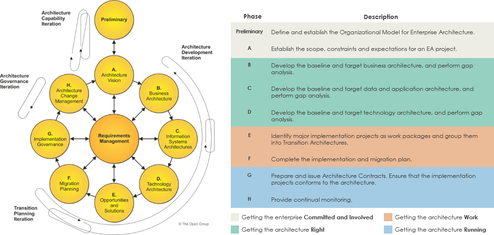

[TOGAF](https://www.opengroup.org/togaf) is een internationaal erkende
methode voor het ontwikkelen en beheren van enterprise-architecturen. De
kern van TOGAF wordt gevormd door de [**Architecture Development Method
(ADM)**](http://www.togaf.com/admref/_welcome.html): een iteratief
proces waarmee organisaties op gestructureerde wijze architecturen
ontwikkelen, implementeren en beheren.

De ADM onderscheidt opeenvolgende architectuurfasen, waaronder:

- Architecture Vision;

- Business Architecture;

- Information Systems Architecture (informatie- en
  applicatiearchitectuur);

- Technology Architecture;

- Opportunities & Solutions;

- Migration Planning;

- Implementation Governance;

- Architecture Change Management.

De fasen bouwen logisch op elkaar voort. De Architecture Vision bepaalt
de strategische richting en vormt het uitgangspunt voor de uitwerking
van de business-, informatie-, applicatie- en technische architectuur.
Vanuit deze architectuurdomeinen worden implementatiemogelijkheden,
migratie en governance uitgewerkt. Tijdens de realisatie kunnen nieuwe
inzichten ontstaan die aanleiding geven om eerdere architectuurkeuzes te
heroverwegen of verder te verfijnen.

De ADM is daarmee geen lineair proces, maar een iteratieve methode
waarin de verschillende architectuurdomeinen elkaar voortdurend
beïnvloeden. Ontwikkeling, implementatie en wijzigingsbeheer vormen een
doorlopende cyclus, zodat de architectuur kan meebewegen met
veranderende wetgeving, bestuurlijke prioriteiten, technologische
ontwikkelingen en voortschrijdend inzicht.

Deze Enterprisearchitectuur volgt deze logische opbouw. Niet iedere
ADM-fase resulteert in een afzonderlijk hoofdstuk, maar de structuur van
dit document sluit aan op de opeenvolgende architectuurdomeinen zoals
TOGAF die onderscheidt. Hierdoor is de architectuur systematisch
opgebouwd, zijn ontwerpkeuzes herleidbaar tot de oorspronkelijke
doelstellingen en biedt het document een consistente basis voor zowel
doorontwikkeling als implementatie.

Deze Enterprise architectuur is een product met een organisatiebrede
scope. Het geeft kaders en richtlijnen voor het platform. Het platform
wordt uitgewerkt aan de hand van visie. Op basis hiervan worden de
leidende specifieke principes beschreven. De gewenste inrichting (op
hoofdlijnen) wordt beschreven in een aantal modellen, zowel voor de
businesskant als voor software en infrastructuur op de volgende
dimensies:

- **Breedte**: de scope van de architectuur, gericht op samenhang,
  consistentie en herbruikbaarheid van principes, patronen en
  componenten.

- **Diepte**: verdieping (tot detailniveau) van de architectuur tot
  concrete implementaties. Dit laat zien hoe abstracte keuzes vertaald
  worden naar operationele oplossingen.

- **Tijd**: de ontwikkeling en roadmap van de architectuur, inclusief de
  gewenste situatie op termijn en beslissingsprocessen; op dit vlak
  wordt deels verwezen naar externe bronnen waar de actuele backlog en
  roadmap is vastgelegd.

  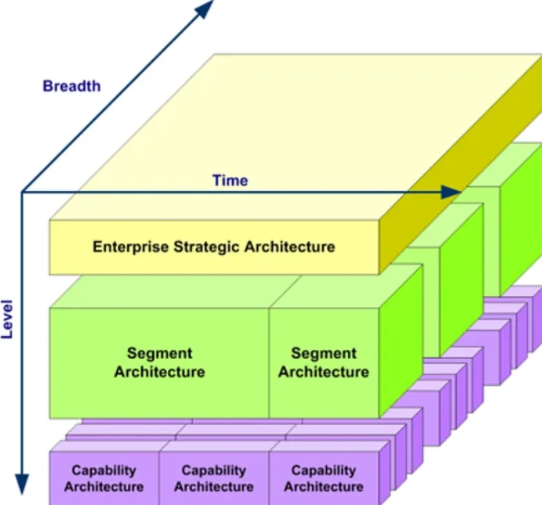

Waar mogelijk sluit deze architectuur expliciet aan bij relevante
standaarden voor gegevensuitwisseling en modellering. In gevallen waar
deze aansluiting niet expliciet is uitgewerkt, kan worden aangenomen dat
nadere concretisering plaatsvindt binnen implementaties of
vervolgarchitectuur.

## Leeswijzer

Dit document is bedoeld voor verschillende doelgroepen. Afhankelijk van
de rol van de lezer zijn niet alle hoofdstukken even relevant.

Bij grote hoofdstukken zijn korte abstracts toegevoegd voor wie geen
tijd of zin heeft om de hele tekst te lezen, zodat in ieder geval
duidelijk is wat de hoofdgedachte en relevantie van het onderdeel is.

| **Doelgroep** | **Aanbevolen hoofdstukken** |
|----|----|
| **Bestuurders, opdrachtgevers en programmamanagers** | Managementsamenvatting, hoofdstuk 2 t/m 5. Deze hoofdstukken beschrijven de aanleiding, strategische doelen, architectuurvisie, uitgangspunten, governance en scope van het Platform Dienstverlening. Daarnaast is in het bijzonder paragraaf **6.7. Implicaties voor de bestaande organisatie** relevant. |
| **Enterprise- en domeinarchitecten** | Het volledige document. De architectuur is opgebouwd volgens de TOGAF Architecture Development Method (ADM) en beschrijft de samenhang tussen business-, informatie-, applicatie- en technische architectuur. |
| **Solution- en softwarearchitecten** | Hoofdstuk 4 t/m 14. Deze hoofdstukken beschrijven de architectuurprincipes, architectuurpatronen, bouwstenen, API's, technische architectuur en implementatiepatronen. |
| **Ontwikkelteams en leveranciers** | Hoofdstuk 5 t/m 14. Deze hoofdstukken bevatten de architectuurkaders voor de ontwikkeling van businessanalyse, softwarecomponenten, registraties, API's, infrastructuur en technische implementaties. |
| **Projectleiders en implementatiemanagers** | Hoofdstuk 4, 5, 6, 8, 9, 13 en 14. Deze hoofdstukken beschrijven de architectuurkaders waarbinnen implementatieprojecten worden uitgevoerd en wijzigingen worden beheerd. |

### Leesvolgorde

Eerst worden aanleiding, doelstellingen en architectuurvisie beschreven.
Vervolgens worden de verschillende architectuurdomeinen uitgewerkt:
business-, informatie-, applicatie- en technologiearchitectuur. Het
document sluit af met implementatiepatronen, generieke bouwstenen en de
governance voor doorontwikkeling en wijzigingsbeheer. Hierdoor kan het
document zowel sequentieel als thematisch worden gebruikt, afhankelijk
van de informatiebehoefte van de lezer. Waar mogelijk is redundantie
voorkomen; op enkele plaatsen is bewust gekozen voor beperkte herhaling
om afzonderlijke hoofdstukken zelfstandig leesbaar en bruikbaar te
houden.

### Begrippenlijst

Waar mogelijk worden begrippen toegelicht op de plaats waar zij voor het
eerst worden geïntroduceerd of wordt verwezen naar de onderliggende
standaarden en referentiearchitecturen waarin de achterliggende
concepten en ontwerpkeuzes uitgebreider zijn beschreven.

Voor overige architectuur- en softwarebegrippen bestaat veel algemeen
beschikbare documentatie. Deze begrippenlijst beperkt zich daarom tot
termen die binnen het Platform Dienstverlening een specifieke betekenis
hebben:

#### Service (ook wel: component)

Een **service** is een zelfstandig softwarecomponent binnen het Platform
Dienstverlening met een duidelijk afgebakende verantwoordelijkheid.
Services communiceren uitsluitend via gestandaardiseerde API's en
notificaties en kunnen onafhankelijk worden ontwikkeld, uitgerold en
beheerd.

Binnen de architectuur worden de volgende typen services onderscheiden,
binnen een lagenmodel dat wordt toegelicht in [Het Vijf-lagen
model](#het-vijf-lagen-model) (in het hoofdstuk
Applicatie-architectuur):

- **Interactieservice** – een service in **laag 5 (Interactie)** die de
  communicatie met inwoners, ondernemers of medewerkers ondersteunt,
  bijvoorbeeld via portalen, formulieren of werkvoorraadschermen.

- **Processervice** – een service in **laag 4 (Proces)** die processen
  orkestreert, beslisregels toepast, taken beheert en de voortgang van
  dienstverlening bewaakt.

- **Connectiviteitsservice** – een service in **laag 3
  (Connectiviteit)** die de communicatie tussen componenten faciliteert,
  bijvoorbeeld via notificaties, events of federatieve
  serviceconnectiviteit (FSC).

- **Dataservice** – een service in **laag 2 (Diensten)** die gegevens
  uit registraties ontsluit via gestandaardiseerde, handelingsgerichte
  API's en daarbij validatie, autorisatie en publicatie van
  gebeurtenissen verzorgt.

- **Registratie** – een service in **laag 1 (Registraties)** die
  verantwoordelijk is voor het duurzaam vastleggen, beheren en
  beschikbaar stellen van gegevens binnen een afgebakend domein. Ook
  wel: register. **Domein**registers zijn een specialisatie van
  registraties in de context van een domein.

  Dit kunnen *logische* of *fysieke* bouwblokken zijn; op zeker niveau
  zijn Registraties en Dataservices gecombineerd, net als interactie- en
  processervices.

- **BusinessService -** Een BusinessService omvat een logisch
  samenhangend geheel van gegevens, beslisregels, proceslogica en
  interactie rondom één businesscapaciteit. Zij verbindt de
  verschillende architectuurlagen: gegevens uit registraties, proces- en
  beslislogica, interactie met inwoners en medewerkers en de
  uiteindelijke vastlegging van resultaten. Hierdoor ontstaat een
  verzameling herbruikbare businesscapaciteiten die in verschillende
  processen en dynamisch kan worden toegepast.

## Grenzen en positionering van dit document

Om de leesbaarheid, focus en toepasbaarheid te waarborgen, is een aantal
onderwerpen bewust beperkt of buiten scope gelaten.

#### Roadmap

Dit document bevat geen uitgewerkte roadmap of gefaseerde
transitie-architecturen (plateaus). De reden hiervoor is dat de
ontwikkeling van het Platform Dienstverlening plaatsvindt binnen een
continu architecturaal proces, waarin:

- Prioritering en fasering worden bepaald via een gezamenlijke [backlog
  van
  G4](https://app.notion.com/p/platformvoordienstverlening/e9375da1960249bba23c49d038d3c888?v=2b078b5f4db4808da728000c21a96e11)
  en betrokken partners;

- Keuzes iteratief worden gemaakt op basis van voortschrijdend inzicht
  en implementatie-ervaring;

<!-- -->

- Architectuur en realisatie gelijktijdig evolueren.

#### 

#### Beheer, financiën

De inrichting van beheer, financiering en exploitatie is in deze versie
van de architectuur heel beperkt beschreven. Dit hangt samen met de
lopende ontwikkeling naar een landelijke beheer- en ontwikkelorganisatie
voor generieke voorzieningen binnen Common Ground. Waar relevant zijn
wel architectuurprincipes en randvoorwaarden opgenomen (zoals
containerisatie en portabiliteit), zodat toekomstige invulling
consistent kan plaatsvinden.

#### Informatie-architectuur (detailniveau)

De informatie-architectuur beschrijft principes, kaders en methodieken
(zoals MIM en begrippenkaders), maar bevat geen volledig uitgewerkte
domeinmodellen.

Dit is een keuze, omdat:

- Semantiek en datamodellen sterk domeinafhankelijk zijn;

- Modellering plaatsvindt binnen concrete implementaties en
  ontwikkelingen;

- Domain-Driven Design (DDD) wordt toegepast om modellen iteratief en
  contextspecifiek te ontwikkelen.

Het document biedt daarmee het raamwerk voor modellering, niet de
uitwerking ervan.

#### Security- en compliance-uitwerking

Beveiliging, privacy en compliance (zoals BIO, CBW, AI Act en AVG en
toekomstige regelgeving) zijn randvoorwaardelijk voor architectuur, maar
worden in dit document niet volledig uitgewerkt. In plaats daarvan zijn
relevante aspecten opgenomen binnen specifieke onderdelen (zoals
identificatie, autorisatie en omgang met persoonsgegevens). Dit is een
bewuste gap die in later stadium wordt ingevuld.

## Verantwoording en totstandkoming

#### In opdracht van

Programmamanagers Common Ground G4

#### Opgesteld door

Ilja Vorstenbosch

#### Dit document

Versie: 2.0 / oktober 2026

Dit architectuurdocument is opgesteld op basis van een iteratief
ontwerpproces waarin architectuur, praktijkervaring en bestuurlijke
afstemming samenkomen. De inhoud is tot stand gekomen in nauwe
samenwerking met de **Technische Stuurgroep** (architecten) en het
**Platformmanagement** (programmamanagers) van de samenwerking tussen G4
en Dimpact. Daarnaast zijn meerdere reviewrondes uitgevoerd met
architecten, informatieadviseurs en andere specialisten uit deelnemende
gemeenten. De beschreven architectuur weerspiegelt daarmee zowel de
gezamenlijke ontwerpkeuzes als de praktijkervaringen uit de
gemeentelijke uitvoering. Voor de redactionele ondersteuning bij het
opstellen van dit document is gedeeltelijk gebruikgemaakt van GPT-5. De
uiteindelijke tekst is door mensen vastgesteld en geverifieerd.

De opgenomen schema's, illustraties en infographics zijn gebaseerd op de
inhoud van dit document en dienen ter ondersteuning van de leesbaarheid
en communicatie. Een deel van deze afbeeldingen is met behulp van GPT-5
gegenereerd op basis van tekstuele beschrijvingen en vervolgens
redactioneel beoordeeld en waar nodig aangepast. De afbeeldingen zijn
bedoeld als informatieve visualisaties en bouwstenen voor presentaties
en communicatie richting verschillende doelgroepen; de tekst van dit
document is leidend.

Dit document is een levend architectuurproduct en maakt onderdeel uit
van de doorlopende architectuurgovernance van het Platform
Dienstverlening. Nieuwe inzichten uit ontwerp, implementatie,
gemeentelijke toepassing en bestuurlijke besluitvorming worden periodiek
verwerkt. Naar verwachting wordt het document **elk kwartaal tot
halfjaarlijks** geactualiseerd, of eerder wanneer belangrijke
ontwikkelingen daarom vragen. Per versie worden inhoudelijke wijzigingen
geregistreerd, zodat besluitvorming en de ontwikkeling van de
architectuur in de tijd navolgbaar en herleidbaar blijven.

Voor zover dit document met een externe organisatie of met een
leverancier gedeeld is, geldt dat aan dit document geen rechten ontleend
kunnen worden. De auteur aanvaardt geen aansprakelijkheid voor schade
als gevolg van mogelijke onjuistheden of onvolledigheden in de
aangeboden informatie. Leverancier dient tijdens de initiatie- of
inventarisatiefase van het (implementatie)project de aangeboden
informatie te verifiëren en ontbrekende informatie op te halen.

# Motivatie, strategie, uitkomst

| **Compact:** |
|----|
| De gemeentelijke informatievoorziening is in de loop der jaren complex geworden, met veel applicaties, leveranciersafhankelijkheden en historisch gegroeide oplossingen. Common Ground en het Platform Dienstverlening maken daarom de beweging naar een overheid die eenvoudiger, samenhangender en beter herbruikbaar kan werken |

## Inleiding

Dit hoofdstuk beschrijft de strategische context van het Platform
Dienstverlening en vormt de aanleiding voor de Architecture Vision zoals
bedoeld in de TOGAF Architecture Development Method (ADM). Het maakt
duidelijk waarom de architectuur is ontwikkeld, welke maatschappelijke
en organisatorische ontwikkelingen hieraan ten grondslag liggen en welke
veranderingen zij beoogt te realiseren.

Achtereenvolgens worden de ontwikkeling van de gemeentelijke
informatievoorziening, de aanleiding voor Common Ground, de
belangrijkste interne en externe drijfveren, de businesscase en de
beoogde uitkomst van de architectuur beschreven. Samen vormen deze
onderdelen de onderbouwing voor de architectuurkeuzes die in de volgende
hoofdstukken worden uitgewerkt.

## Motivatie

#### Gemeentelijke context

Gemeenten leveren zo’n 450 producten voor burgers en bedrijven, en
voeren daarnaast honderden interne processen uit voor projecten,
bedrijfsvoering en samenwerking met ketenpartners. In totaal gaat het om
ruim 1000 bedrijfsprocessen, ondersteund door circa 100
gestandaardiseerde gegevensuitwisselingen. Ondanks de inhoudelijke
verschillen tussen domeinen, zijn veel processen en benodigde
softwarefuncties generiek van aard.

De huidige gemeentelijke informatievoorziening is het resultaat van een
ontwikkeling die zich over meerdere decennia heeft voltrokken.
Oorspronkelijk werden afzonderlijke werkprocessen ondersteund met
gespecialiseerde applicaties volgens het principe *"elk proces zijn
eigen pakket"*. Toen de behoefte aan samenwerking tussen processen
toenam, ontstond een groeiend netwerk van koppelingen tussen systemen.
Als reactie daarop maakten gemeenten de overstap naar geïntegreerde
suites per domein, waarin meerdere functies werden samengebracht binnen
één leveranciersoplossing.

Deze ontwikkeling heeft gemeenten jarenlang geholpen om processen te
standaardiseren en beheersbaar te houden. Tegelijkertijd heeft zij
geleid tot een informatievoorziening waarin gegevens en functionaliteit
sterk zijn verweven met applicaties en leveranciers. Nu de behoefte aan
integrale, gegevensgedreven en proactieve dienstverlening toeneemt,
blijken deze architectuurkeuzes steeds vaker een beperking voor
wendbaarheid, samenwerking en innovatie. Een uitgebreidere beschrijving
van deze historische ontwikkeling is opgenomen in [**BIJLAGE - Korte
geschiedenis van gemeentelijke
informatisering**](#bijlage---korte-geschiedenis-van-gemeentelijke-informatisering).

De behoefte aan integrale, proactieve dienstverlening – zoals één
klantbeeld, een herkenbaar digitaal loket, omnichannel-benadering en
datagedreven werken – vraagt om een andere inrichting van de
informatievoorziening. De huidige suite-architecturen sluiten
onvoldoende aan op deze ambities.

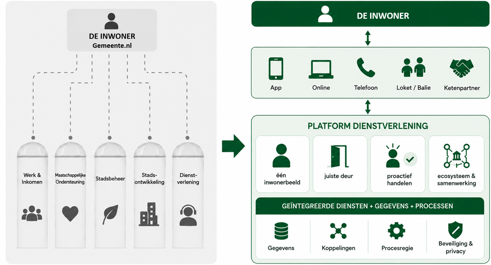

#### Breder kader 

Dit probleem beperkt zich niet tot gemeenten, architectuur of software.
Informatievoorziening is een essentieel onderdeel van hoe de overheid
functioneert. Deze gedachte wordt scherp uitgewerkt in het rapport
[*Dwars door de
Orde*](https://www.open-overheid.nl/documenten/2025/04/16/dwars-door-de-orde)
van Arre Zuurmond, opgesteld in zijn rol als regeringscommissaris
Informatiehuishouding. In dit rapport analyseert hij waarom de overheid
structureel moeite heeft om publieke waarde te leveren in een
gedigitaliseerde samenleving.

Zuurmond laat zien dat informatie geen ondersteunend middel is, maar een
volwaardige productiefactor – naast bevoegdheden, geld en mensen. De
huidige inrichting van de overheid, gebaseerd op verkokering en
systemen, sluit daar onvoldoende op aan. Daardoor ontstaan problemen met
samenhang, transparantie en uitvoerbaarheid van beleid. Het rapport
maakt duidelijk dat keuzes in informatiearchitectuur direct raken aan
het functioneren van de overheid zelf.

Een concreet illustratief voorbeeld is de kinderopvangtoeslagaffaire.
Uit [onderzoek van de Inspectie
Overheidsinformatie](https://www.inspectie-oe.nl/actueel/nieuws/2021/04/22/rapport-toeslagen)
bleek dat niet alleen documenten ontbraken, maar dat de
informatiehuishouding zelf structurele tekortkomingen kende.
Dossiervorming was onvolledig, informatie was verspreid over
verschillende systemen, de sturing op informatiebeheer was beperkt en
besluiten bleken achteraf moeilijk of niet volledig te reconstrueren.
Dit had directe gevolgen voor burgers, de mogelijkheid om verantwoording
af te leggen en de informatievoorziening aan de Tweede Kamer.

Het huidige herstelproces van de affaire laat zien hoe fundamenteel deze
problematiek is. Om individuele dossiers opnieuw op te bouwen, moeten
gegevens worden verzameld uit uiteenlopende bronnen, waaronder
verschillende informatiesystemen, e-mails, telefoonnotities, scans,
interne documenten en papieren archieven. Pas door deze informatie
achteraf opnieuw samen te brengen kan worden gereconstrueerd hoe
besluiten tot stand zijn gekomen en welke informatie daarbij beschikbaar
was.

Hoewel de toeslagenaffaire zich afspeelde binnen de Belastingdienst, is
de onderliggende informatiekundige problematiek niet uniek. Binnen
gemeenten is de informatievoorziening historisch ingericht rondom
afzonderlijke processen, applicaties en organisatieonderdelen. Gegevens
worden op meerdere plaatsen vastgelegd, verschillende systemen bevatten
elk een deel van de werkelijkheid en samenhang ontstaat vaak pas
achteraf via koppelingen, rapportages of handmatige reconstructie. De
toeslagenaffaire maakt daarmee zichtbaar welke risico's ontstaan wanneer
de informatiehuishouding onvoldoende integraal is ingericht.

### Businesscase

Gemeenten zijn voor het uitvoeren van wettelijke taken nagenoeg volledig
afhankelijk van enkele honderden private eigenaren van software. De
private sector investeert risicodragend in softwareontwikkeling.
Gemeenten nemen deze software af via licenties, SaaS-diensten of
implementatieprojecten.

De huidige gemeentelijke informatievoorziening bestaat uit een groot
aantal afzonderlijke applicaties, ieder met een eigen gegevensmodel,
technische architectuur, beveiligingsmodel en beheerorganisatie. Om deze
applicaties gezamenlijk gemeentelijke dienstverlening te laten
ondersteunen, is een omvangrijk netwerk van koppelingen noodzakelijk.
Iedere koppeling vraagt om afspraken over semantiek, techniek,
beveiliging, beheer en versiebeheer. Naarmate het aantal applicaties
groeit, neemt ook de complexiteit van het totale landschap exponentieel
toe.

De kosten beperken zich daarbij niet tot softwarelicenties. Iedere
afzonderlijke applicatie vraagt gedurende haar gehele levenscyclus om
architectuur, informatiebeheer, informatiebeveiliging,
contractmanagement, implementatie, functioneel beheer, technisch beheer,
projectleiding en opleidingen. Ook wijzigingen in wet- en regelgeving
moeten per applicatie opnieuw worden ontworpen, ontwikkeld, getest en
geïmplementeerd. Hierdoor worden dezelfde werkzaamheden binnen gemeenten
en leveranciers steeds opnieuw uitgevoerd.

Daarnaast brengen aanbestedingen en leveranciersmanagement aanzienlijke
organisatorische kosten met zich mee. Voor vrijwel iedere grotere
applicatie worden afzonderlijke aanbestedingstrajecten doorlopen,
contracten beheerd en implementaties uitgevoerd. De sterke
afhankelijkheid van individuele leveranciers leidt bovendien tot vendor
lock-in: gegevens, processen en functionaliteit zijn vaak nauw verweven
met één specifieke oplossing, waardoor migratie naar een alternatief
complex, risicovol en kostbaar is. Dit beperkt de concurrentie, remt
innovatie en verzwakt de onderhandelingspositie van gemeenten.

Vanuit bedrijfseconomisch perspectief ontstaat hierdoor een situatie
waarin zowel ontwikkelcapaciteit als publieke middelen versnipperd
worden ingezet. Schaarse expertise op het gebied van architectuur,
informatievoorziening, security en softwareontwikkeling wordt verdeeld
over honderden grotendeels vergelijkbare oplossingen, terwijl veel
functionaliteit – zoals zaakafhandeling, klantregistratie, autorisatie,
berichtenverkeer, documentgeneratie en logging – in de kern generiek van
aard is.

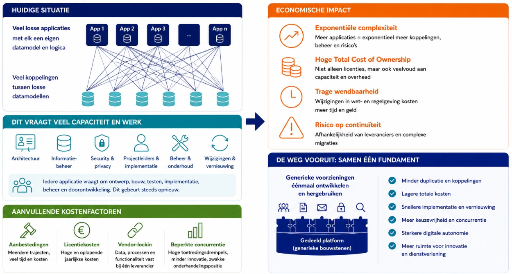

### Overzicht drijfveren

Bovenstaande ontwikkelingen kunnen worden samengevat in een aantal
samenhangende interne en externe drijfveren. Gezamenlijk maken zij
duidelijk waarom een fundamenteel andere inrichting van de gemeentelijke
informatievoorziening noodzakelijk is.

De onderstaande overzichten brengen deze drijfveren samen en laten zien
hoe zij leiden tot concrete architectuurkundige knelpunten. Deze vormen
gezamenlijk de onderbouwing voor de architectuurprincipes en
ontwerpkeuzes die in de volgende hoofdstukken worden uitgewerkt.

#### Interne drijfveren

De interne drijfveren komen voort uit de wijze waarop gemeenten hun
informatievoorziening en dienstverlening historisch hebben ingericht.
Versnipperde applicatielandschappen, monolithische systemen, beperkte
regie op informatie en oplopende beheerkosten leiden gezamenlijk tot een
informatievoorziening die steeds moeilijker kan inspelen op nieuwe
maatschappelijke en bestuurlijke opgaven.

De figuur laat zien hoe deze organisatorische, informatiekundige en
financiële drijfveren uiteindelijk resulteren in architectuurkundige
knelpunten, zoals beperkte datakwaliteit, verlies van regie,
fragmentatie van dienstverlening en een moeilijk beheersbare
kostenstructuur. Deze interne factoren vormen de directe aanleiding voor
de ontwikkeling van een gezamenlijk Platform Dienstverlening.

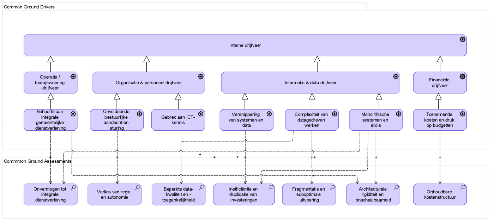

#### Externe drijfveren

Naast de interne ontwikkelingen worden gemeenten geconfronteerd met een
aantal externe ontwikkelingen waarop de huidige informatievoorziening
onvoldoende is ingericht. Toenemende wet- en regelgeving, een beperkte
en geconcentreerde softwaremarkt, groeiende eisen aan digitale
weerbaarheid, maatschappelijke verwachtingen en snelle technologische
ontwikkelingen vergroten de druk op de gemeentelijke
informatievoorziening.

De figuur laat zien hoe deze externe ontwikkelingen leiden tot risico's
op het gebied van continuïteit, transparantie, innovatievermogen en
bestuurlijke wendbaarheid. Zij benadrukken de noodzaak om te investeren
in een open, modulaire en toekomstbestendige architectuur die gemeenten
meer autonomie geeft en beter kan meebewegen met maatschappelijke en
technologische veranderingen.

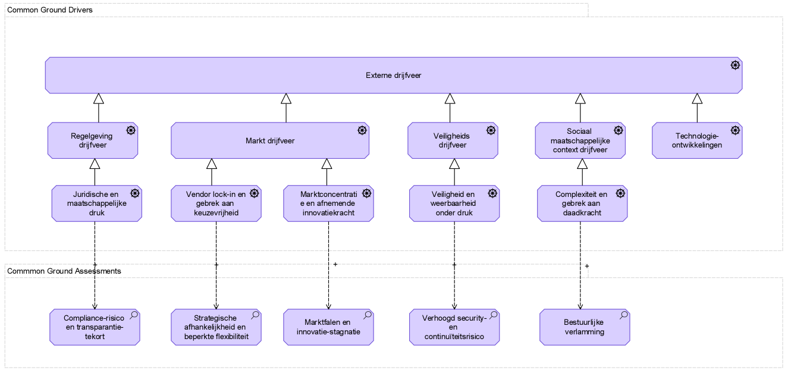

## Common Ground & Platform Dienstverlening

De beschreven ontwikkelingen laten zien dat de huidige uitdagingen niet
kunnen worden opgelost door afzonderlijke applicaties te vervangen of
nieuwe koppelingen toe te voegen. De kern van het probleem ligt in de
manier waarop de gemeentelijke informatievoorziening is ingericht.
Zolang gegevens, functionaliteit en processen opgesloten blijven in
afzonderlijke systemen, zullen complexiteit, kosten en afhankelijkheden
blijven toenemen.

De informatiekundige visie Common Ground kiest daarom voor een
fundamenteel andere benadering. Niet de applicatie, maar gegevens,
dienstverlening en herbruikbare functionaliteit vormen het uitgangspunt
voor de inrichting van de informatievoorziening.

#### Van applicaties naar een platform

Het Platform Dienstverlening vormt de concrete uitwerking van deze
visie. Het is de referentie-implementatie van de Enterprisearchitectuur:
een gezamenlijk ontwikkeld platform van generieke voorzieningen waarmee
gemeenten hun dienstverlening kunnen realiseren. Gemeenten dragen actief
bij aan zowel de architectuur als de realisatie van het platform, samen
met leveranciers en landelijke partijen. Het bereidt daarmee voor op
realisatie van Common Ground in een landelijke organisatie ([Gemeenten
zetten koers naar collectieve digitalisering   \|
VNG](https://vng.nl/nieuws/gemeenten-zetten-koers-naar-collectieve-digitalisering))

Waar gemeenten vandaag investeren in honderden afzonderlijke applicaties
die grotendeels dezelfde functies bevatten, brengt het platform deze
generieke functionaliteit samen in één samenhangend ecosysteem van
herbruikbare voorzieningen. Functionaliteit zoals klantregistratie,
zaakafhandeling, berichten, formulieren en workflowhoeft daardoor niet
langer telkens opnieuw te worden ontwikkeld of aangeschaft.

Hierdoor verschuift de investering van afzonderlijke systemen naar
gezamenlijk ontwikkelde generieke voorzieningen die door meerdere
gemeenten kunnen worden hergebruikt en doorontwikkeld.

#### Kwaliteit by design

Gemeenten worden geconfronteerd met steeds hogere eisen aan de
informatievoorziening (denk aan informatiebeveiliging,
privacybescherming, informatiebeheer). Het afzonderlijk implementeren,
onderhouden en aantoonbaar borgen van deze eisen in honderden
applicaties leidt tot hoge kosten, verschillen in kwaliteit en een
toenemende beheerslast.

Binnen het Platform Dienstverlening worden deze kwaliteitseisen vanaf
het ontwerp integraal meegenomen. Gemeenten kunnen steunen op
voorzieningen die voldoen aan wet- en regelgeving, architectuurkaders en
vereiste kwaliteitsnormen. Dit vergroot niet alleen de kwaliteit en
betrouwbaarheid van de dienstverlening, maar vermindert ook de
uitvoeringslast voor individuele gemeenten.

#### Gegevens als fundament

Een derde fundamentele verandering is dat gegevens niet langer onderdeel
zijn van individuele applicaties, maar een zelfstandige plaats krijgen
binnen de architectuur.

Gegevens worden eenmalig vastgelegd bij de daarvoor aangewezen bron en
vervolgens via gestandaardiseerde services beschikbaar gesteld aan
processen, medewerkers en inwoners. Vastlegging, interpretatie en
presentatie worden daarmee van elkaar gescheiden. Hierdoor ontstaat één
gedeelde informatiebasis waarin besluiten transparant, controleerbaar en
herleidbaar zijn.

Deze benadering sluit aan bij de informatiekundige principes uit *Dwars
door de Orde*: gegevens vormen niet langer een bijproduct van processen,
maar het fundament waarop dienstverlening wordt georganiseerd.

Een belangrijk aandachtspunt daarbij is dat de scheiding tussen
brongegevens, context en presentatie niet mag leiden tot verlies van
samenhang of beheerbaarheid van informatie. Het platform borgt daarom
dat gegevens, metadata, context, proceshistorie en beslisinformatie
onlosmakelijk met elkaar verbonden blijven. Door middel van
contextregistratie, datalineage en gestandaardiseerde metadata blijft de
herkomst, betekenis, samenhang en levenscyclus van informatie
aantoonbaar en duurzaam toegankelijk. Daarmee wordt informatiebeheer
niet gezien als een activiteit achteraf, maar als een integraal
onderdeel van de informatievoorziening vanaf het moment van registratie.

#### Verandering van de softwaremarkt

De gemeentelijke softwaremarkt bestaat grofweg uit drie segmenten:

- **Gemeentespecifieke software** voor de uitvoering van gemeentelijke
  dienstverlening;

- **Standaardsoftware (commodities)**, zoals HR-, financiële en
  kantoorautomatiseringssystemen;

- **Diensten**, waaronder implementatie, beheer, consultancy en
  softwareontwikkeling.

Het Platform Dienstverlening richt zich primair op het eerste segment:
de **gemeentespecifieke software**. Juist in dit segment wordt vandaag
veel vergelijkbare functionaliteit door verschillende leveranciers
onafhankelijk van elkaar ontwikkeld, onderhouden en geïmplementeerd. Dit
leidt tot een hoge mate van duplicatie, complexe integraties en
oplopende maatschappelijke kosten.

Door generieke functionaliteit gezamenlijk te ontwikkelen en als open
bouwstenen beschikbaar te stellen, verschuift de markt van complete,
gesloten gemeentelijke suites naar een ecosysteem van herbruikbare
componenten. Leveranciers blijven een belangrijke rol spelen, maar
concurreren niet langer op generieke basisfunctionaliteit. Hun
onderscheidend vermogen verschuift naar domeinspecifieke
functionaliteit, implementatie, innovatie en dienstverlening.

Voor het segment **Diensten** betekent deze ontwikkeling eveneens een
fundamentele verandering. Waar gemeenten nu afzonderlijk investeren in
architectuur, implementaties, beheer en consultancy, ontstaat
geleidelijk een gezamenlijk ontwikkel- en beheerproces voor generieke
voorzieningen. Hierdoor kan schaarse expertise worden gebundeld,
ontstaat meer continuïteit en neemt de afhankelijkheid van externe
inhuur af.

De beoogde eindsituatie is daarmee niet een overheid die alles zelf
ontwikkelt, maar een gezonde markt waarin gemeenten gezamenlijk
investeren, terwijl leveranciers zich onderscheiden met toegevoegde
waarde boven op dat fundament.

## Resultaat

Aanvullend op bovenstaande volgt hier een voor/na schets van de
transitie Common Ground: een overzicht van de brede doelsituatie voor
gemeenten.

| **Was** | **Wordt** |
|----|----|
| Veel systemen – overwegend closed source – met overlappende functionaliteit | Enkelvoudige, overwegend transparante en herbruikbare open-sourcecomponenten, zonder overlappende functionaliteit. |
| Relatief autonome keuzes bij organisatieonderdelen voor proces- en systeeminrichting, maar beperkt door de (on)mogelijkheden van leverancierssystemen. | Verbonden organisatieonderdelen die optimaal functioneren voor de gehele organisatie, zonder verlies aan functionaliteit; lagere niveaus krijgen meer keuzevrijheid in de inrichting van processen en systemen. |
| Gegevensredundantie en gegevensvervuiling; gegevens opgeslagen in leverancierspakketten; moeizaam hergebruik van gegevens van andere bronhouders. | Geen redundante of vervuilde gegevens; gegevens eenmalig opgeslagen in de gemeentelijke gegevenslaag conform het GGM (Gemeentelijk Gegevensmodel); eenvoudig hergebruik van gegevens van andere bronhouders. |
| Beveiliging, logging, autorisatie, auditing en andere generieke voorzieningen worden per applicatie afzonderlijk ontwikkeld, ingericht en beheerd. | Generieke voorzieningen zoals beveiliging, logging, auditing en autorisatie worden éénmaal gezamenlijk ontwikkeld, beheerd en continu doorontwikkeld als herbruikbare platformdiensten. |
| Iedere gemeente voor zich; inefficiënt gebruik van gemeenschapsgeld. | Vraagharmonisatie en -bundeling; samen organiseren; efficiënt gebruik van gemeenschapsgeld. |
| Gemeenten slagen er niet in alle benodigde IV- en ICT-specialisten te werven en te behouden om goed in regie te komen. | Door samenwerking verdelen we het IV- en ICT-werk over schaarse specialisten en komen we wél goed in regie. |
| Gebrek aan transparantie over gegevensgebruik schaadt het vertrouwen in de overheid. | Common Ground maakt het mogelijk gegevens te delen met burgers en bedrijven en daarmee het vertrouwen in de overheid te vergroten. |
| Bottom-up informatiesystemen per domein (“ieder wetje een pakketje”). | Top-down generieke informatiesystemen (componenten) met domeinspecifieke aanvullingen. |
| Onvolkomen markt tussen vraag (gemeenten) en aanbod (softwareleveranciers met vaak een oligopolie). | Transparante markt met lage toetredingsdrempels. |
| Gemeente leunt op de markt. | Samenwerkende gemeenten regisseren de markt. |
| Weinig innovatie. | Snelle innovatie. |
| Hoge migratiekosten. | Lage migratiekosten dankzij standaardcomponenten en data in eigen beheer. |
| Hoog in de markt inkopen (gereed product; investering en risico bij leverancier). | Lager in de markt inkopen (diensten, expertise en capaciteit; mede-eigenaarschap en -risico in doorontwikkeling; investering en risico meer bij gemeenten). |
| Regie-, inkoop- en beheerorganisatie per gemeente. | Voortdurende ontwikkel- en doorontwikkelorganisatie. |

## Conclusie

Bovenstaand wordt context, uitdaging en doel geschetst waar de
gemeentelijke informatievoorziening voor staat. Deze analyse vormt de
aanleiding voor de architectuur die in de volgende hoofdstukken wordt
uitgewerkt.

# Governance

## Inleiding

Het Platform Dienstverlening is iteratief ontwikkeld vanuit een
samenwerking tussen de vier grote gemeenten (**Amsterdam, Den Haag,
Rotterdam en Utrecht**) binnen de Common Ground-beweging. De governance
is gedurende de ontwikkeling organisch gegroeid en sluit aan bij de
gezamenlijke verantwoordelijkheid voor architectuur, ontwikkeling en
beheer van het platform.

Meer uitleg over het proces, en de documentatie van dit proces, staat
op:

- Notion – samenwerkruimte Common Ground

  - [Backlog](https://www.notion.so/e9375da1960249bba23c49d038d3c888?pvs=21)

  - [Beschrijving Governance &
    proces](https://www.notion.so/Proces-backlog-documentatie-21b78b5f4db4804c828fc43bec7b544c?pvs=21)

- GitBook – publieke documentatie Platform Dienstverlening

  - [Introductie \| Platform Dienstverlening -
    Public](https://dienstverleningsplatform.gitbook.io/platform-generieke-dienstverlening-public)

De governance kent verschillende niveaus met elk een eigen
verantwoordelijkheid.

### Strategisch niveau

De strategische koers van het platform wordt bepaald door de Common
Ground-programma's van de G4. Zij zijn gezamenlijk verantwoordelijk voor
de langetermijnvisie, de positionering van het platform, de financiering
en de roadmap. Waar relevant vindt afstemming plaats met het **Landelijk
Programma Common Ground (LPCG)**, zodat ontwikkelingen aansluiten op
landelijke initiatieven en standaarden.

### Tactisch niveau

Op tactisch niveau worden de gezamenlijke ontwikkeling en de
samenwerking tussen de G4 en het LPCG georganiseerd. Hier vindt
afstemming plaats over prioriteiten, gezamenlijke ontwikkelingen,
planning en de transitie van platformonderdelen naar een landelijke
governance.

### Operationeel niveau

De dagelijkse ontwikkeling van het platform wordt aangestuurd door de
gezamenlijke **Lead Product Owners (LPO's)** van de G4. Iedere LPO is
verantwoordelijk voor een afgebakend deel van het platform en stuurt op
prioritering, financiering en realisatie van de bijbehorende
voorzieningen. Elke LPO vertegenwoordigt ook de stakeholders binnen zijn
of haar gemeente. Door deze verdeling kunnen besluiten dichter bij de
inhoud worden genomen en wordt de bestuurlijke belasting van het
management verminderd. Gezamenlijke afstemming vindt plaats over
planning, knelpunten, demonstraties van gerealiseerde functionaliteit en
de inzet van beschikbare middelen.

## Architectuurgovernance

De architectuurgovernance wordt uitgevoerd onder verantwoordelijkheid
van de **Technische Stuurgroep**, samengesteld uit architecten van de
G4. Deze bewaakt de samenhang van de architectuur, geeft richting voor
ontwikkelingen op basis van de enterprisearchitectuur en standaarden en
adviseert over technische en architectonische keuzes.

Binnen elke individuele gemeente verbindt architectuur strategie en
beleid met portfolio, verandering en uitvoering:

Op strategisch niveau draagt architectuur onder meer bij aan:

- **Richting geven aan digitale transformatie** door het formuleren en
  bewaken van richtinggevende kaders.

- **Bewaken van samenhang en toekomstvastheid** van de
  informatievoorziening.

- **Adviseren van CIO en management** over de architectuurimpact van
  strategische keuzes en besluiten.

- **Opstellen van roadmaps** om vastgestelde strategische doelen te
  vertalen naar concrete ontwikkelingen.

- **Fungeren als escalatiepunt** bij architectuurvraagstukken, waaronder
  het beoordelen en registreren van afwijkingen van architectuurkaders.

Deze **Enterprise Architectuur Common Ground vormt het o**verkoepelende
kader voor architectuur binnen het thema en de scope van Common Ground.

## Doorontwikkeling van de governance

De governance van het Platform Dienstverlening ontwikkelt zich mee met
de groei van het platform en de landelijke samenwerking. In 2026 zijn
gesprekken gestart om onderdelen van de governance geleidelijk onder te
brengen bij het **Landelijk Programma Common Ground (LPCG)**. Doel
hiervan is de gezamenlijke verantwoordelijkheid voor generieke
voorzieningen verder te versterken, de samenwerking tussen gemeenten te
vereenvoudigen en de doorontwikkeling van het platform duurzaam te
organiseren.

# Samenhang met andere ontwikkelingen 

| **Compact:** |
|----|
| Het Platform Dienstverlening is geen eiland. Dit hoofdstuk legt uit hoe het platform zich verhoudt tot de NDS, andere landelijke ontwikkelingen en de gemeentelijke praktijk. De grote lijn: landelijke ambities rond standaarden, hergebruik, data delen, digitale autonomie en gezamenlijke voorzieningen worden vertaald naar een concrete gemeentelijke inrichting. Het platform is daarmee niet nóg een strategisch praatstuk, maar probeert de stap te maken van “we vinden dit allemaal belangrijk” naar “zo gaan we het daadwerkelijk bouwen en gebruiken”. |

Het Platform Dienstverlening is een zelfstandig architectuur- en
ontwikkelprogramma met een eigen scope, governance en roadmap. Het vormt
de meest concrete uitwerking van de informatiekundige visie Common
Ground. Tegelijkertijd wordt het platform niet in een vacuüm ontwikkeld.

Dit hoofdstuk beschrijft hoe het Platform Dienstverlening zich verhoudt
tot de belangrijkste landelijke ontwikkelingen, welke uitgangspunten
worden overgenomen en op welke onderdelen het platform een eigen
invulling of verdere concretisering geeft.

## Relatie met de Nederlandse Digitaliseringsstrategie (NDS)

De [Nederlandse
Digitaliseringsstrategie](https://www.digitaleoverheid.nl/wp-content/uploads/sites/8/2025/07/108.201-NDS-publicatie_v19-WEB.pdf)
beschrijft de beweging naar één digitale overheid, waarin gezamenlijke
regie, (verplicht te stellen) standaarden, herbruikbare bouwstenen en de
ontwikkeling naar een federatief datastelsel centraal staan.

Het Platform Dienstverlening vormt een concrete invulling van deze
strategie op gemeentelijk niveau. De architectuur vertaalt de
strategische uitgangspunten van de NDS naar een samenhangend geheel van:

- Een servicegerichte architectuur met herbruikbare componenten, waarin
  dienstverlening centraal staat en processen worden herontworpen vanuit
  de leefwereld van burgers en ondernemers. Dit ondersteunt proactieve
  dienstverlening (‘één overheid’) en vermindert afhankelijkheid van
  specifieke leveranciersoplossingen (prioriteit 4: burgers en
  ondernemers centraal; prioriteit 5: digitale autonomie en
  weerbaarheid)

- Een gegevenslaag gebaseerd op ‘data bij de bron’, semantische
  standaardisatie en federatieve uitwisseling (prioriteit 2: data delen
  en benutten)

- Gezamenlijk ontwikkelde en beheerde bouwblokken, die hergebruik en
  schaalvoordelen ondersteunen (prioriteit 4: dienstverlening;
  prioriteit 6: digitaal vakmanschap en samenwerking)

- Een infrastructuur gebaseerd op cloud-native principes en
  portabiliteit, passend bij de ontwikkeling naar gezamenlijke
  cloudvoorzieningen (prioriteit 1: cloud)

- Inrichting van centrale beveiliging, autonomie en controle op data en
  componenten (prioriteit 5: digitale weerbaarheid en autonomie)

- Ondersteuning van datagedreven werken en informatiegedreven
  dienstverlening (prioriteit 2: data; prioriteit 6: digitaal
  vakmanschap)

De expliciete focus op eenduidige semantiek en hoogwaardige
datakwaliteit vormt daarbij een randvoorwaarde voor het verantwoord
toepassen van artificiële intelligentie (prioriteit 3). Zonder data kan
AI geen betrouwbare of uitlegbare bijdrage leveren.

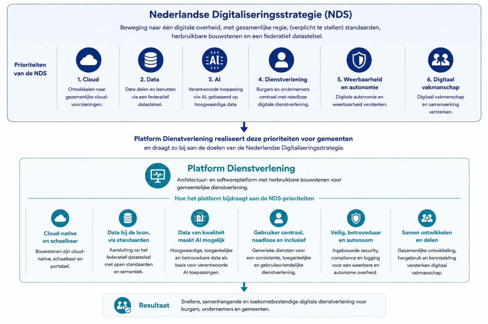

## Andere landelijke ontwikkelingen

### Interactiedoelen Architectuur Digitale Overheid 2030 (GDI-NORA)

De [Architectuur Digitale Overheid
2030](https://pgdi.nl/file/download/8e2cdce9-5f23-451d-9537-946d2086c557/20251103-architectuur-digitale-overheid-2030-versie-102.pdf)
(ADO2030) formuleert de beleidsdoelen voor de ontwikkeling van de
digitale overheid. Voor het contact en de dienstverlening aan burgers en
bedrijven zijn deze doelen verder geconcretiseerd in de
[Domeinarchitectuur
Interactie](https://file.notion.com/f/f/8b8dc544-81d0-40fc-90e8-ce6ddba9548c/12b9b5ee-d397-4829-9bce-4539a783b1a9/20251110_AR_08_Domeinarchitectuur_Interactie.pdf?table=block&id=3d578b5f-4db4-80f5-b367-fbbb11c3653d&spaceId=8b8dc544-81d0-40fc-90e8-ce6ddba9548c&expirationTimestamp=1790899200000&signature=5bi9pZ0-sM3KZ6VhtHhXNCdSIvFNG_-57KF8tZHh3x8&downloadName=20251110+AR+08+Domeinarchitectuur+Interactie.pdf).
Deze domeinarchitectuur vertaalt de beleidsdoelen van ADO2030 naar 11
interactiedoelen, waaronder

- één-overheidsbeleving,

- proactieve dienstverlening,

- samenhangende communicatie,

- regie op gegevens,

- open overheid,

- kanaalonafhankelijke dienstverlening en

- transparante en volgbare dienstverleningsprocessen.

Deze zijn vastgesteld door de Architectuurraad Digitale Overheid. Een
doel is rechtstreeks verbonden aan de bijpassende kernwaarden,
kwaliteitsdoelen en architectuurprincipes in de NORA.

#### Relatie met Platform Dienstverlening

Het Platform Dienstverlening maakt gebruik van en geeft invulling aan
delen van de doelen en capabilities conform de Architectuur Digitale
Overheid. Het biedt generieke architectuurblokken en herbruikbare
softwarecomponenten die gemeenten kunnen inzetten bij de inrichting en
doorontwikkeling van hun dienstverlening. Een globale mapping als volgt:

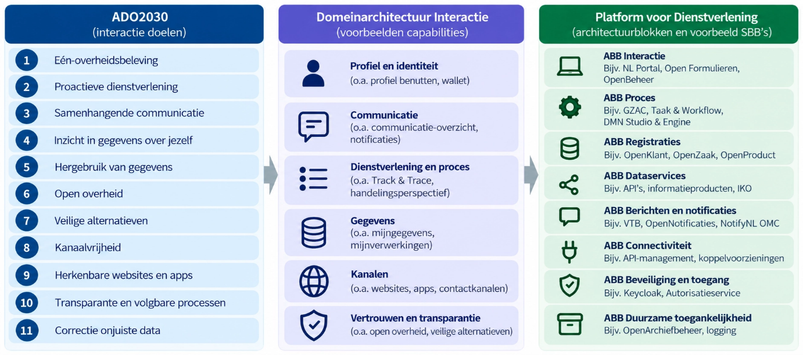

### Federatief Datastelsel (FDS)

Het [**Federatief Datastelsel
(FDS)**](https://federatief.datastelsel.nl/) is een landelijk
afsprakenstelsel voor het verantwoord delen en gebruiken van data binnen
de overheid. Het FDS faciliteert het zoeken, delen en in samenhang
toepassen van hoogwaardige gegevens uit verschillende bronnen, waarbij
gegevens bij de bron blijven en via open standaarden beschikbaar worden
gesteld. Het beschrijft de benodigde stelselfuncties,
architectuurprincipes en standaarden voor een federatief
gegevenslandschap.

#### Relatie met Platform Dienstverlening

Het Platform Dienstverlening realiseert de uitgangspunten van het
Federatief Datastelsel voor de gemeentelijke praktijk. De
platformarchitectuur sluit aan op de architectuurprincipes, standaarden
en stelselfuncties van het FDS en implementeert deze in concrete
generieke voorzieningen, gegevensdiensten en registraties.

### Federatieve Toegangsverlening (FTV)

[**Federatieve Toegangsverlening
(FTV)**](https://vng-realisatie.github.io/ftv/) is een open standaard
voor toegangsverlening binnen het Federatief Datastelsel. De standaard
is gebaseerd op *Externalized Authorization Management (EAM)* en maakt
het mogelijk om autorisatiebeleid los te koppelen van applicaties.
Toegangsbeslissingen worden daardoor centraal, contextafhankelijk,
transparant en traceerbaar genomen, op basis van open standaarden.

#### Relatie met Platform Dienstverlening

Het Platform Dienstverlening realiseert de ondersteuning voor
Federatieve Toegangsverlening als generieke platformvoorziening.
Hierdoor kunnen alle aangesloten componenten gebruikmaken van een
uniforme, landelijke standaard voor federatieve autorisatie en
toegangsverlening.

### Gemeentelijk Gegevensmodel (GGM)

Het **Gemeentelijk Gegevensmodel (GGM)** is het integrale logische
gegevensmodel voor de gemeentelijke informatievoorziening. Het
beschrijft de semantische structuur van gemeentelijke gegevens over alle
beleidsdomeinen heen en vormt daarmee de basis voor eenduidige
gegevensuitwisseling, registraties en informatiemodellen.

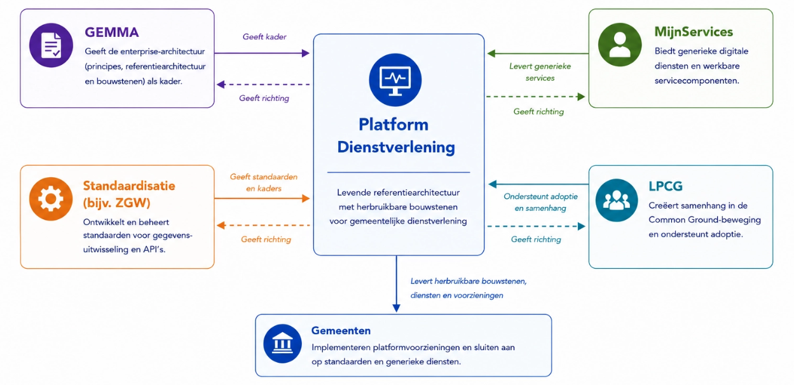

#### Relatie met Platform Dienstverlening

Het Platform Dienstverlening gebruikt het Gemeentelijk Gegevensmodel als
uitgangspunt voor de inrichting van generieke registraties en
gegevensdiensten. Omdat deze registraties daadwerkelijk binnen gemeenten
worden geïmplementeerd, levert het platform praktijkervaringen en
concrete actualiseringsvoorstellen voor de verdere ontwikkeling van het
GGM. Daarmee ontstaat een continue wisselwerking tussen
modelontwikkeling en implementatie, waarbij het GGM richting geeft aan
de platformarchitectuur en implementaties binnen het Platform
Dienstverlening bijdragen aan de verdere doorontwikkeling van het model.

## Relatie met gemeentelijke ontwikkeling

De relatie met gedeelde, of parallelle gemeentelijke ontwikkelingen is
als volgt:

#### VNG / VNG Realisatie (Kenniscentrum Architectuur – KCA)

- **Wat het is:** landelijke koepel van gemeenten; VNG Realisatie
  beheert GEMMA‑architectuur.

- Documentatie:

  - [GEMMA Online](https://www.gemmaonline.nl/wiki/Hoofdpagina)

<!-- -->

- Onderdeel van VNG Realisatie is het vastleggen van gemeentelijke
  standaarden (zoals de ZGW-API’s).

#### VNG - MijnServices

MijnServices is een initiatief binnen VNG dat zich richt op het
ontwikkelen van herbruikbare servicedesings voor digitale diensten voor
inwoners en ondernemers. De bron voor de MijnServices is de
implementatie van het Platform Dienstverlening in de Gemeente Den Haag.
Dit is in een landelijk programma opgeschaald naar overheidsbrede
servicedesigns.

- **Wat het is:** een verzameling generieke, herbruikbare servicedesigns

- Documentatie & informatie:

- [MijnServices dienstverlening \| VNG](https://vng.nl/MijnServices)

#### VNG - Landelijk Programma Common Ground (LPCG)

- **Wat het is:** landelijk programma dat de Common Ground‑beweging
  ondersteunt

- Documentatie:

  - [Website Common Ground](https://commonground.nl/)

    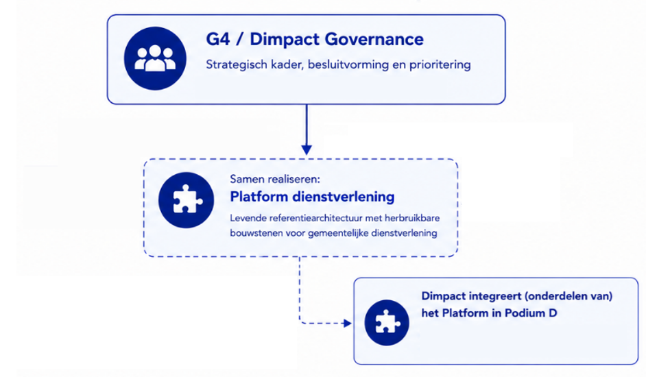

#### G4D/Dimpact (Amsterdam, Rotterdam, Den Haag, Utrecht)

- **Wat het is:** samenwerking van de vier grote gemeenten en Dimpact;
  werkt gezamenlijk aan **Platform Dienstverlening**. Dimpact gebruikt
  de bouwstenen als onderdeel van het platform PodiumD

- Documentatie:

  - Notion – samenwerkruimte Common Ground

    - [Backlog](https://www.notion.so/e9375da1960249bba23c49d038d3c888?pvs=21)

    - [Beschrijving Governance &
      proces](https://www.notion.so/Proces-backlog-documentatie-21b78b5f4db4804c828fc43bec7b544c?pvs=21)

  - GitBook – publieke documentatie Platform Dienstverlening

    - [Introductie \| Platform Dienstverlening -
      Public](https://dienstverleningsplatform.gitbook.io/platform-generieke-dienstverlening-public)

      

## Platform Dienstverlening in context

Binnen dit landschap neemt het Platform Dienstverlening een bijzondere
positie in. Waar veel initiatieven zich richten op visieontwikkeling,
architectuurkaders, standaarden of servicedesigns, richt het Platform
Dienstverlening zich op de concrete realisatie daarvan in software en
implementatie. Dit gebeurt in nauwe samenwerking met de
uitvoeringspraktijk. Hierdoor worden architectuurkeuzes getoetst aan
concrete vraagstukken uit de praktijk, zoals veranderende wetgeving,
complexe dienstverlening, gegevensuitwisseling en de dagelijkse
uitvoerbaarheid voor medewerkers en inwoners. Daarmee fungeert het
Platform Dienstverlening als een levende referentiearchitectuur.

Hoewel het in eerste instantie is ontwikkeld voor de gemeentelijke
praktijk, zijn de onderliggende informatiekundige principes generiek
toepasbaar binnen de gehele overheid. Vraagstukken rond gegevensdeling,
transparantie, digitale autonomie, herbruikbare voorzieningen en
publieke dienstverlening spelen niet uitsluitend bij gemeenten. Daarmee
vervult het Platform Dienstverlening niet alleen een uitvoerende rol
binnen de gemeentelijke sector, maar ook een richtinggevende rol voor
andere overheden die werken aan de modernisering van de digitale
overheid.

# Visie, principes, scope

| **Compact:** |
|----|
| Hier wordt bepaald waar we naartoe willen en volgens welke spelregels. De visie draait om dienstverlening die meer samenhangend, informatiegericht, herbruikbaar en minder afhankelijk van individuele leveranciers is. De architectuurprincipes vertalen dat naar concrete uitgangspunten, zoals data bij de bron, data-autonomie, hergebruik, Open Source, generiek vóór specifiek en portabiliteit. Ook wordt de scope bepaald. |

## Inleiding

Dit onderdeel vormt de overgang van **waarom** (de motivatie) naar
**wat**. Het beschrijft de visie, doelen en principes van het Platform
Dienstverlening. Dit samen geeft richting aan alle daaropvolgende
architectuurkeuzes en vormt het gezamenlijke referentiekader voor
ontwerp, ontwikkeling, implementatie en beheer. De visie beschrijft de
gewenste eindsituatie, de uitgangspunten waarop de architectuur is
gebaseerd en de afbakening van het architectuurwerk. Daarmee ontstaat
een gemeenschappelijk beeld van wat het Platform Dienstverlening beoogt
te realiseren en welke ontwerpprincipes daarbij leidend zijn.

## Visie

Deze architectuur staat niet op zichzelf, maar dient een bredere
maatschappelijke doelstelling. De overheid moet inwoners en ondernemers
als één samenhangende overheid kunnen bedienen, ongeacht de interne
organisatie, processen of het aantal betrokken uitvoeringsorganisaties.
Dienstverlening is toegankelijk, begrijpelijk en waar mogelijk
proactief, waarbij de menselijke maat centraal blijft staan.
Tegelijkertijd vraagt dit om een overheid die zorgvuldig omgaat met
persoonsgegevens, transparant is over het gebruik van gegevens en
inwoners inzicht en invloed geeft op de informatie die over hen wordt
verwerkt. Een moderne informatievoorziening moet deze publieke waarden
niet alleen ondersteunen, maar actief mogelijk maken.

Volgens de visie van het Platform Dienstverlening beschikken gemeenten
gezamenlijk over één samenhangend digitaal ecosysteem dat de
gemeentelijke publieke dienstverlening als geheel ondersteunt en is
ingericht om duurzaam antwoord te geven op de uitdagingen die in de
motivatie van deze architectuur zijn beschreven. Inwoners, ondernemers
en uitvoerend professionals staan daarbij centraal; de
informatievoorziening ondersteunt hun werkzaamheden in plaats van deze
te beperken. Dienstverlening is integraal, gegevens worden eenmalig
vastgelegd en veilig hergebruikt, en nieuwe functionaliteit kan snel
worden toegevoegd zonder het gehele informatielandschap te wijzigen.

De relatie tussen gemeenten en leveranciers verschuift van het afnemen
van gesloten softwareproducten naar het gezamenlijk ontwikkelen en
toepassen van open platformvoorzieningen. Gemeenten voeren gezamenlijk
regie op de generieke architectuur en software, terwijl leveranciers
concurreren op implementatie, diensten, innovatie en specifieke
functionaliteit. Doordat de generieke voorzieningen als Open Source
beschikbaar zijn, ontstaat een transparante markt met lagere
toetredingsdrempels en meer innovatie voor gemeenten.

## Doelen

De visie beschrijft de gewenste eindsituatie van het Platform
Dienstverlening. Om deze visie richting te geven aan architectuur,
ontwikkeling en implementatie is zij vertaald naar een aantal
strategische doelstellingen. Deze doelen vormen het toetsingskader voor
de verdere uitwerking van de architectuur en de keuzes die in de
volgende hoofdstukken worden gemaakt.

De doelstellingen bestrijken verschillende dimensies van de
gemeentelijke informatievoorziening. Zij richten zich niet uitsluitend
op software of techniek, maar ook op dienstverlening, samenwerking,
governance en de inrichting van de gemeentelijke softwaremarkt.
Gezamenlijk beschrijven zij de beoogde maatschappelijke en
organisatorische effecten van het Platform Dienstverlening.

#### Meer regie

Gemeenten voeren gezamenlijk regie op de ontwikkeling van generieke
software, architectuur en standaarden. Hierdoor ontstaat meer grip op de
inrichting en doorontwikkeling van de gemeentelijke
informatievoorziening en neemt de afhankelijkheid van individuele
leveranciers af.

#### Snellere innovatie

Nieuwe functionaliteit wordt ontwikkeld als herbruikbare bouwsteen en
kan daardoor sneller beschikbaar worden gesteld voor alle deelnemende
gemeenten. Innovaties worden gezamenlijk ontwikkeld en continu
doorontwikkeld.

#### Lagere maatschappelijke kosten

Door generieke voorzieningen éénmaal te ontwikkelen en meervoudig te
gebruiken nemen ontwikkel-, implementatie-, beheer- en migratiekosten
af. Investeringen worden gedeeld en publieke middelen doelmatiger
ingezet.

#### Eén gegevensfundament

Gegevens worden eenduidig beheerd en vormen een betrouwbare basis voor
dienstverlening, besluitvorming en gegevensuitwisseling. Hierdoor
ontstaat één consistente informatiebasis voor de gehele gemeentelijke
organisatie. Autorisatie, logging en auditing worden als generieke
voorzieningen rondom deze gegevenslaag ingericht, waardoor inzichtelijk
blijft wie welke gegevens heeft geraadpleegd of gewijzigd en op basis
waarvan besluiten tot stand zijn gekomen. Dit versterkt het vertrouwen
van de inwoner in de overheid.

#### Integrale dienstverlening

Dienstverlening wordt ingericht vanuit de leefwereld van inwoners,
ondernemers en uitvoerend professionals, in plaats van vanuit
afzonderlijke applicaties of organisatorische grenzen. Hierdoor ontstaat
een samenhangende dienstverlening over domeinen en processen heen. De
overheid treedt daarbij zoveel mogelijk op als één overheid: inwoners
ervaren één herkenbare dienstverlening, ongeacht de interne organisatie,
en uitvoerend professionals beschikken over een integraal beeld om
maatwerk te kunnen leveren met behoud van de menselijke maat.

#### Sterkere samenwerking

Gemeenten, leveranciers en landelijke organisaties werken samen aan een
open ecosysteem van architectuur, software en standaarden. Door
gezamenlijk te ontwikkelen en kennis te delen ontstaat een duurzame
basis voor verdere digitalisering van de overheid.

## Architectuurprincipes

De strategische doelstellingen beschrijven wat het Platform
Dienstverlening wil bereiken. Dit onderdeel beschrijft de overkoepelende
architectuurprincipes, nodig om deze doelstellingen op een consistente
en samenhangende manier te realiseren.

Deze principes zijn een samenhangende selectie en concretisering van
bestaande uitgangspunten uit landelijke architecturen, gemeentelijk
beleid en de praktijk van het Platform Dienstverlening.

De principes zijn afgeleid uit onder meer:

- De informatiekundige visie Common Ground;

- De Nederlandse Digitaliseringsstrategie (NDS);

- Vastgestelde architectuurbesluiten (Architecture Decision Records
  (ADR's));

- Bestaande platformarchitectuur en technische standaarden;

- Praktijkervaringen uit de ontwikkeling en implementatie van het
  Platform Dienstverlening binnen G4 en Dimpact.

Deze zijn bewust hoog-over en selectief. Zij zijn gekozen omdat zij de
belangrijkste strategische dimensies van het Platform Dienstverlening
vertegenwoordigen. Tijdens het opstellen van deze architectuur zijn de
principes iteratief gevalideerd met de Technische Stuurgroep,
Platformmanagement en architecten van de deelnemende gemeenten.

### Principe: Architectuurgedreven vernieuwing

#### Uitgangspunt

Ontwikkeling begint niet bij de keuze voor een applicatie, maar bij de
gewenste dienstverlening, de onderliggende waardestroom en de behoeften
van inwoners, ondernemers en uitvoerend professionals. Architectuur
bepaalt welke generieke businessfunctionaliteit en voorzieningen nodig
zijn om deze dienstverlening te realiseren; software is daarvan de
implementatie.

#### Implicaties

- Nieuwe ontwikkelingen starten vanuit de publieke opgave en de
  businessbehoefte, niet vanuit een applicatie.

- De waardestroom voor inwoners, ondernemers en uitvoerend professionals
  is leidend bij het ontwerpen van functionaliteit.

- Functionaliteit wordt eerst beoordeeld op generieke toepasbaarheid.

- Hergebruik gaat vóór nieuwbouw.

- Applicaties volgen de architectuur en bepalen deze niet.

**Uitwerking:** Business- en applicatiearchitectuur.

### Principe: Informatiegericht werken

#### Uitgangspunt

Informatie vormt het verbindende element tussen dienstverlening,
processen, applicaties en organisatie. Gegevens worden onafhankelijk van
individuele processen en applicaties beheerd, zodat zij meervoudig
kunnen worden gebruikt. Daarbij wordt niet alleen de gegevensinhoud
vastgelegd, maar ook de context die nodig is om de betekenis, herkomst,
betrouwbaarheid en samenhang van informatie te begrijpen en te
verantwoorden. Implicaties

- Gegevens worden éénmaal vastgelegd en meervoudig gebruikt.

- Processen en dienstverlening geven aanleiding voor het ontstaan en
  wijzigen van gegevens; ze zijn ook afnemer van informatie; de regie op
  informatie ligt bij registraties.

- Registraties bevatten naast gegevens ook de context die nodig is om
  informatie te interpreteren, zoals bron, actor, tijdstip, aanleiding,
  doelbinding, status en onderlinge relaties.

  Herkomst, gebruik en wijzigingen van informatie zijn herleidbaar door
  middel van metadata, contextregistratie en datalineage. Informatie kan
  domeinoverstijgend worden toegepast.

- Consistentie, kwaliteit en herleidbaarheid van gegevens worden
  centraal geborgd.

- Nieuwe vormen van dienstverlening kunnen worden gerealiseerd zonder
  gegevens opnieuw te organiseren.

**Uitwerking:** Businessarchitectuur, Informatiearchitectuur.

### Principe: (Micro) servicearchitectuur

#### Uitgangspunt

Het Platform Dienstverlening bestaat uit kleine, zelfstandige services
die onafhankelijk ontwikkeld, uitgerold en beheerd kunnen worden.

#### Implicaties

- Services zijn autonoom inzetbaar.

- Services hebben een gestandaardiseerde interface.

- Teams kunnen onafhankelijk ontwikkelen.

- Schaalbaarheid vindt plaats per service.

- Geautomatiseerd testen en deployment zijn onderdeel van iedere
  service.

**Uitwerking:** Applicatie- en technologiearchitectuur.

### Principe: Expliciete bedrijfslogica

#### Uitgangspunt

Bedrijfsprocessen, beslisregels en gegevens worden als afzonderlijke
architectuurelementen gemodelleerd. Beslisregels worden waar mogelijk
centraal beheerd en herbruikbaar vastgelegd, zodat zij consistent kunnen
worden toegepast in meerdere processen, BusinessServices en kanalen.

Dit principe anticipeert o.a. op [RegelRecht: van wet naar digitale
werking](https://regelrecht.rijks.app/).

#### Implicaties

- Beslisregels worden niet hard gecodeerd in applicaties wanneer zij
  generiek toepasbaar zijn.

- Processen beschrijven de volgorde van activiteiten; beslisregels
  beschrijven de inhoud van beslissingen.

- Beslisregels zijn herbruikbaar door meerdere BusinessServices en
  processen.

- Beslisregels zijn versieerbaar en historisch reproduceerbaar.

- Beslisregels zijn begrijpelijk voor beleidsmedewerkers, juristen en
  uitvoerende professionals.

- Wijzigingen in beleid of regelgeving leiden primair tot aanpassing van
  beslisregels en niet van procesmodellen of applicaties.

**Uitwerking:** Business-, informatie- en applicatiearchitectuur.

### Principe: Kwaliteit by Design

#### Uitgangspunt

Niet-functionele kwaliteitseisen worden vanaf het ontwerp integraal
meegenomen in architectuur, software en dienstverlening. Aspecten zoals
informatiebeveiliging, privacy, toegankelijkheid, informatiebeheer,
archivering, logging, auditing en beheerbaarheid zijn geen afzonderlijke
voorzieningen achteraf, maar vormen een integraal onderdeel van iedere
platformvoorziening.

#### Implicaties

- Privacy, informatiebeveiliging en informatiebeheer worden vanaf het
  ontwerp meegenomen.

- Logging, auditing en recordmanagement zijn standaard onderdeel van
  iedere voorziening.

- Componenten voldoen aantoonbaar aan geldende wet- en regelgeving en
  architectuurkaders.

- Niet-functionele kwaliteitseisen worden centraal vastgesteld en door
  generieke platformvoorzieningen ingevuld.

- Nieuwe functionaliteit wordt uitsluitend gerealiseerd wanneer ook de
  benodigde kwaliteitsaspecten integraal zijn ontworpen.

**Uitwerking:** Technologiearchitectuur, Informatiearchitectuur en
Governance.

### Principe: Generiek vóór specifiek

#### Uitgangspunt

Nieuwe functionaliteit wordt generiek ontwikkeld wanneer deze in
meerdere processen, domeinen of gemeenten toepasbaar is.
Domeinspecifieke oplossingen worden alleen ontwikkeld wanneer generieke
realisatie aantoonbaar niet passend is.

#### Implicaties

- Generieke functionaliteit wordt centraal ontwikkeld.

- Domeinen bouwen voort op generieke voorzieningen.

- Duplicatie wordt voorkomen.

- Alleen specifieke functionaliteit wordt domeinspecifiek gerealiseerd.

**Uitwerking:** Business- en applicatiearchitectuur.

### Principe: Beleidsruimte als basis

#### Uitgangspunt

Wendbaarheid is een bestuurlijke kwaliteit. Een gemeente die
verantwoordelijk blijft voor haar besluiten moet ook tijdig kunnen
handelen wanneer wetgeving, lokaal beleid of maatschappelijke
omstandigheden veranderen. Waar de aard van de taak en
bevoegdheidsverdeling ruimte bieden voor vergaande standaardisatie kan
die ruimte worden benut; waar de gemeentelijke verantwoordelijkheid
aantoonbaar lokale keuzes vraagt, moet de generieke functionaliteit die
keuzes tijdig en uitvoerbaar kunnen ondersteunen.

#### Implicaties

- Legitieme wettelijke en lokale keuzeruimte wordt in het IT-ontwerp
  ingebouwd, inclusief extensiepunten voor maatwerk;

- Voor ingebruikname toetsen op

  - Ondersteunt de voorziening de beleidsruimte en de menselijke maat

  - Is de oplossing lokaal voldoende wendbaar bij wetswijzigingen

  - Geen normatieve beleidskeuze afgedwongen door technische
    standaardisatie

- Bedrijfszekerheid en omkeerbaarheid (exit mogelijkheid)

**Uitwerking:** Business- en applicatiearchitectuur.

### Principe: Hergebruik

#### Uitgangspunt

Generieke functionaliteit wordt éénmaal ontwikkeld en meervoudig
toegepast.

#### Implicaties

Hergebruik vindt plaats op verschillende niveaus:

- Services;

- Applicatiefuncties;

- BusinessServices;

- Infrastructuur;

- Platformvoorzieningen.

Nieuwe ontwikkeling vindt uitsluitend plaats wanneer bestaande
voorzieningen aantoonbaar niet voldoen.

**Uitwerking:** Business-, applicatie- en technologiearchitectuur.

### Principe: Data bij de bron

#### Uitgangspunt

Gegevens worden beheerd door de daarvoor aangewezen bronhouder en worden
vanuit die bron beschikbaar gesteld. Processen en applicaties gebruiken
gegevens, maar zijn daarvan geen eigenaar.

#### Implicaties

- Registraties vormen de primaire bron voor gemeentelijke gegevens.

- Bestaande [(landelijke, authentieke)
  bronnen](https://www.noraonline.nl/wiki/Stelsel_van_het_heden_(basisregistraties_als_elementaire_bouwstenen))
  blijven leidend.

- Gegevens worden niet onnodig gedupliceerd.

**Uitwerking:** Informatiearchitectuur.

### Principe: Data-autonomie

#### Uitgangspunt

Gemeenten en inwoners behouden zeggenschap over hun gegevens en kunnen
bepalen hoe deze worden vastgelegd, gebruikt, gedeeld en beheerd.

**Implicaties**

- Gegevens volgen gestandaardiseerde semantiek.

- Gegevens zijn overdraagbaar.

- Gemeenten bepalen toegang en gebruik.

- Leveranciers beperken de beschikbaarheid of overdraagbaarheid van
  gegevens niet.

- Inwoners en ondernemers kunnen erop vertrouwen dat hun gegevens
  zorgvuldig, transparant en uitsluitend voor het beoogde doel worden
  gebruikt, waarbij inzichtelijk is welke gegevens worden verwerkt en
  door wie.

**Uitwerking:** Informatiearchitectuur.

### Principe: Open Source

#### Uitgangspunt

Alle generieke software die binnen het Platform Dienstverlening wordt
ontwikkeld of gefinancierd, wordt als Open Source beschikbaar gesteld.

#### Implicaties

- Broncode is openbaar beschikbaar.

- Ontwikkeling vindt transparant plaats.

- Intellectueel eigendom wordt onafhankelijk ondergebracht.

- Hergebruik staat centraal.

**Uitwerking:** Governance.

### Principe: Portabiliteit en compatibiliteit

#### Uitgangspunt

Platformcomponenten zijn overdraagbaar, reproduceerbaar en interoperabel
binnen het Platform Dienstverlening.

#### Implicaties

- Componenten worden als container-images geleverd.

- Buildprocessen zijn reproduceerbaar.

- Componenten sluiten aan op platformstandaarden.

- Integraties en afhankelijkheden worden expliciet beschreven.

**Uitwerking:** Technologiearchitectuur.

## Scope

Dit onderdeel betreft de functionele scope van het Platform
Dienstverlening als software- en platformvoorziening. Zij beschrijft
welke onderdelen van de gemeentelijke dienstverlening met het platform
kunnen worden gerealiseerd.

Door de generieke opzet van de platformvoorzieningen bestrijkt deze
scope een zeer groot deel van de gemeentelijke informatievoorziening.
Vrijwel alle gemeentelijke producten en diensten maken gebruik van
dezelfde generieke functies waardoor het platform een belangrijk deel
van de gemeentelijke dienstverlening ondersteunen, ongeacht het
beleidsdomein waarin deze plaatsvindt.

De scope kan worden geduid aan de hand van de GEMMA-bedrijfsfuncties.
Deze indeling maakt zichtbaar op welke onderdelen van de gemeentelijke
organisatie het platform zich primair richt, welke functies gezamenlijk
op landelijk niveau worden ingevuld en welke onderdelen buiten de
directe scope vallen.

Binnen GEMMA wordt onderscheid gemaakt tussen besturende, primaire en
ondersteunende functies. Het platform richt zich primair op de
uitvoering van dienstverlening en de bijbehorende informatievoorziening,
en in mindere mate op sturing en bedrijfsvoering.

- **Groene** elementen zijn onderdeel van de bedrijfsarchitectuur in
  scope

- **Blauwe** elementen die in de landelijke realisatie gezamenlijk
  worden ingevuld door het platformmanagement

#### Besturende functies

De besturende functies omvatten onder andere strategie, sturing,
verantwoording en samenwerkingsvorming. Deze functies vallen grotendeels
buiten de directe scope van het platform. Het platform levert hier wel
een bijdrage door het beschikbaar stellen van informatie voor
monitoring, verantwoording en beleidsvorming, maar ondersteunt deze
functies niet als zodanig.

#### Primaire functies

De primaire functies vormen de kern van de scope. Binnen deze laag zijn
drie samenhangende onderdelen te onderscheiden.

#### Interactie en dienstverlening

Het platform ondersteunt de interactie met inwoners en organisaties via
omnichannel dienstverlening (MijnServices). Dit omvat onder meer:

- Ontvangst en verstrekking van informatie

- Klantcontact en klantenservice

- Zelfbedieningskanalen

- Signalering en informering

Deze functies vormen de voorkant van de dienstverlening en verbinden de
leefwereld van de inwoner met de onderliggende processen en gegevens.

#### Uitvoering van gemeentelijke taken

De feitelijke uitvoering van dienstverlening vormt het zwaartepunt van
het platform. Dit betreft processen binnen meerdere domeinen:

- Sociaal domein (inwonergericht werken, casusregie, ondersteuning)

- Fysiek domein (objectgericht werken, beheer en ontwikkeling van de
  leefomgeving)

- Publieksdienstverlening (aanvragen, verstrekken en beheren van
  producten en diensten)

- Openbare orde en veiligheid (regie, toezicht en handhaving)

#### Ondersteunende functies

Ondersteunende functies, zoals financiën, HR, juridische ondersteuning,
communicatie en huisvesting, vallen daarom grotendeels buiten de directe
scope van het platform. Voor deze domeinen bestaan veelal volwassen
standaardoplossingen (commodities) die geen onderdeel vormen van de
gezamenlijke platformontwikkeling.

Dit sluit niet uit dat platformvoorzieningen ook binnen ondersteunende
functies kunnen worden toegepast. Waar relevant ondersteunt het platform
deze functies direct of indirect, bijvoorbeeld via
gegevensbeschikbaarheid, integraties of beveiligingsvoorzieningen.

# Businessarchitectuur

| **Compact:** |
|----|
| Dit hoofdstuk verplaatst de aandacht van architectuur naar van “welke applicatie hebben we?” naar “welke dienstverlening willen we leveren?” De bestaande verkokering moet plaatsmaken voor samenhangende waardestromen en herbruikbare BusinessServices. Domain-Driven Design helpt om verantwoordelijkheden, domeinen en grenzen scherp te krijgen. De bedoeling is dat gemeenten niet voor ieder probleem opnieuw een maatwerkoplossing optuigen, maar eerst kijken wat al generiek kan. Dat vraagt overigens niet alleen nieuwe software, maar ook een andere manier van organiseren, sturen en samenwerken. |

## Inleiding

De businessarchitectuur beschrijft hoe het Platform Dienstverlening de
gemeentelijke dienstverlening ondersteunt en welke businesscapabilities,
bedrijfsfuncties en waardestromen daarbij centraal staan. TOGAF
beschouwt de businessarchitectuur als de beschrijving van de
organisatie, haar dienstverlening, processen en businesscapabilities.
Voor gemeenten is dit op zeker niveau vastgelegd binnen de
GEMMA-architectuur. In het onderdeel [Visie, principes,
scope](#visie-principes-scope) is de scope van het Platform
Dienstverlening daarom afgezet tegen de GEMMA-bedrijfsfuncties.

Deze businessarchitectuur richt zich op de gemeenschappelijke structuur
van de dienstverlening: de generieke businesscapabilities, waardestromen
en architectuurprincipes die voor alle gemeentelijke domeinen gelden. De
verdere uitwerking naar concrete gemeentelijke processen,
dienstverleningsconcepten en implementaties vindt plaats binnen
project-, programma- of solutionarchitecturen. Daar worden de generieke
platformvoorzieningen toegepast op specifieke vraagstukken en domeinen.

Om samenhang te waarborgen, geeft dit onderdeel wel richtlijnen en
methodiek voor het modelleren de businessarchitectuur. Hierdoor ontstaan
lokaal uitgewerkte architecturen die onderling consistent zijn en
aansluiten op de Enterprisearchitectuur van het Platform
Dienstverlening.

## Van verkokering naar samenhang

De huidige gemeentelijke informatievoorziening weerspiegelt de
verkokerde inrichting van de overheid zoals beschreven. Historisch
gegroeide afdelingen, beleidsdomeinen en verantwoordelijkheden zijn
veelal één-op-één vertaald naar processen, applicaties en
gegevensstructuren. Dit sluit aan bij [Conway's
Law](https://en.wikipedia.org/wiki/Conway%27s_law), die stelt dat
informatiesystemen de organisatiestructuur weerspiegelen waaruit zij
zijn ontstaan. De werkelijkheid van inwoners en ondernemers speelt zich
juist over deze organisatorische grenzen heen af.

Het Platform Dienstverlening biedt de mogelijkheid deze verkokering
bewust te doorbreken. Organisatiegrenzen vormen niet langer het
uitgangspunt voor de inrichting van de informatievoorziening. In plaats
daarvan worden dienstverlening, gegevens en waardestromen expliciet
ontworpen vanuit de maatschappelijke opgave en de behoeften van
inwoners, ondernemers en uitvoerend professionals. De
organisatiestructuur kan daarmee de uitvoering blijven ondersteunen,
zonder de inrichting van de informatievoorziening te dicteren.

## Nieuwe mogelijkheden voor dienstverlening

Doordat gegevens, processen en applicaties van elkaar zijn ontkoppeld,
ontstaat ruimte om dienstverlening fundamenteel anders te organiseren.
Gegevens worden éénmaal vastgelegd en via gestandaardiseerde autorisatie
beschikbaar gesteld aan processen, medewerkers en inwoners. Hierdoor
ontstaat één gedeelde informatiebasis waarop verschillende vormen van
dienstverlening kunnen voortbouwen.

Voor inwoners betekent dit dat gegevens niet steeds opnieuw hoeven te
worden aangeleverd en dat dienstverlening samenhangend kan worden
aangeboden, ongeacht de betrokken organisatieonderdelen. Voor uitvoerend
professionals ontstaat een integraal en actueel beeld van de situatie,
waardoor sneller en beter onderbouwde besluiten kunnen worden genomen.

Het Platform Dienstverlening ondersteunt verschillende, naast elkaar
bestaande manieren van werken. Deze sluiten aan bij de ontwikkeling naar
een responsieve, informatiegedreven overheid.

### Informatiegericht werken

Informatiegericht werken vormt het verbindende principe tussen alle
werkvormen en sluit aan op het [Principe: Informatiegericht
werken](#principe-informatiegericht-werken). Gegevens worden
onafhankelijk van processen en applicaties beheerd en vormen de gedeelde
basis voor dienstverlening, besluitvorming en samenwerking. Hierdoor
kunnen verschillende manieren van werken naast elkaar bestaan, terwijl
zij gebruikmaken van dezelfde informatievoorziening en gegevenslaag. Dit
opent een scala aan mogelijkheden om de dienstverlening te verbeteren.

Binnen het kader van informatiegericht werken kunnen verschillende
‘manieren’ van werken onderscheiden:

- **Inwonergericht werken**

  - Inwonergericht werken richt dienstverlening in vanuit de leefwereld
    van inwoners en ondernemers. Gegevens worden éénmaal uitgevraagd en
    vervolgens hergebruikt. Uitvoerend professionals beschikken over een
    integraal beeld van de situatie, waardoor maatwerk mogelijk wordt en
    dienstverlening over organisatorische grenzen heen kan worden
    georganiseerd.

- **Objectgericht werken**

  - Objectgericht werken organiseert dienstverlening rondom objecten in
    de fysieke leefomgeving, zoals adressen, gebouwen en percelen.
    Gegevens over deze objecten vormen de basis voor processen, waardoor
    informatie duurzaam kan worden beheerd en eenvoudig tussen domeinen
    kan worden gedeeld.

- **Zaakgericht werken**

  - Zaakgericht werken is binnen gemeenten een breed toegepaste manier
    om dienstverlening gestructureerd uit te voeren, te volgen en te
    verantwoorden. Het Platform Dienstverlening ondersteunt deze
    werkwijze en versterkt deze door zaakgerichte processen te
    combineren met een informatiegerichte architectuur. De zaak blijft
    het procesmatige construct voor het uitvoeren en standaardiseren van
    een groot deel van de dienstverlening. Tegelijkertijd wordt
    onderkend dat een groot deel van de informatie waarmee gemeenten
    werken de grenzen van individuele zaken overstijgt en een eigen
    levenscyclus, context en betekenis heeft. Daarom worden gegevens,
    documenten, gebeurtenissen en andere informatieobjecten niet
    uitsluitend binnen een zaak beheerd, maar ondergebracht in
    zelfstandige registraties die ook buiten de context van één
    specifieke zaak kunnen worden gebruikt. Zaken verwijzen naar deze
    informatie en brengen deze samen in de context van een
    dienstverleningsproces.

  - Zaakgericht werken is niet het enige organiserende principe van de
    informatievoorziening, maar één van de manieren waarop
    dienstverlening kan worden gerealiseerd.

### Werken vanuit publieke waarde en waardestromen

De verschillende vormen van werken zijn geen doel op zichzelf. Het
vertrekpunt van dienstverlening is de maatschappelijke behoefte van
inwoners, ondernemers en de samenleving. Vanuit die behoefte wordt
bepaald welke [publieke
waarde](https://vng.nl/sites/default/files/documenten/werken-aan-de-publieke-waarde_20181015.pdf)
moet worden gerealiseerd en welke dienstverlening daarvoor nodig is.

Een
[waardestroom](https://begrippen.noraonline.nl/basisbegrippen/nl/page/waardestroom)
beschrijft het geheel aan activiteiten, informatie, beslissingen en
samenwerkingsrelaties dat leidt tot een maatschappelijk waardevol
resultaat voor inwoners, ondernemers en de gemeente.

#### Wanneer is iets een waardestroom? Een proces of bundeling van diensten is een waardestroom als het voldoet aan de volgende voorwaarden:

- Het creëert waarde voor **een specifieke doelgroep**;

- Het bundelt meerdere producten en diensten in **een logische keten**;

- Het ondersteunt **een end-to-end klantreis**;

- Het vraagt samenwerking **tussen afdelingen en ketenpartners**;

- Het gebruikt **data en zaakgericht werken** voor betere
  dienstverlening;

- Het is toegankelijk via **meerdere kanalen** en houdt rekening met
  digitale toegankelijkheid;

- Het wordt continu **gemonitord en verbeterd** op basis van KPI’s en
  gebruikersfeedback;

- Het voldoet aan **wettelijke en ethische eisen.**

Binnen een waardestroom kunnen verschillende vormen van werken naast
elkaar voorkomen. Sommige onderdelen lenen zich voor product- en
zaakgerichte afhandeling, terwijl andere onderdelen vragen om integraal
casusmanagement, projectmatige samenwerking of gegevensgestuurde
opvolging van signalen. De informatievoorziening moet daarom ruimte
bieden aan meerdere werkvormen binnen dezelfde waardestroom.

Deze benadering sluit aan op de gemeentelijke beweging naar publieke
waarde en de door de VNG ontwikkelde [generieke
klantroutes](https://vng.nl/sites/default/files/2025-09/klantroutes-dienstverlening-voor-gemeenten.pdf).
De klantroutes beschrijven hoe inwoners en ondernemers dienstverlening
ervaren vanuit hun eigen perspectief. Waardestromen vormen de
organisatorische en informatiekundige inrichting waarmee deze
klantreizen worden gerealiseerd. Het Platform Dienstverlening
ondersteunt beide perspectieven: de beleving van de inwoner aan de
buitenkant en de samenhangende uitvoering aan de binnenkant.

## Bedrijfsarchitectuur als schakel tussen platform, inwoner en organisatie

De bedrijfsarchitectuur vormt de eerste concrete uitwerking van de
overkoepelende architectuurprincipes uit de visie. Waar deze principes
richting geven aan de architectuur als geheel, beschrijft dit hoofdstuk
hoe zij worden toegepast bij het ontwerpen van gemeentelijke
dienstverlening.

In het bijzonder worden de volgende principes uitgewerkt:

- **[Principe: Architectuurgedreven
  vernieuwing](#principe-architectuurgedreven-vernieuwing):** nieuwe
  dienstverlening wordt ontworpen vanuit de gewenste waardestroom,
  businesscapabilities en architectuur, niet vanuit bestaande
  applicaties.

- **[Principe: Expliciete
  bedrijfslogica](#principe-expliciete-bedrijfslogica):**
  Bedrijfsprocessen, beslisregels en gegevens worden als afzonderlijke
  architectuurelementen gemodelleerd. Beslisregels worden waar mogelijk
  centraal beheerd en herbruikbaar vastgelegd, zodat zij consistent
  kunnen worden toegepast in meerdere processen, BusinessServices en
  kanalen.

- **[Principe: Generiek vóór
  specifiek](#principe-generiek-vóór-specifiek):** generieke
  BusinessServices, procesfragmenten en voorzieningen worden eerst
  hergebruikt voordat domeinspecifieke oplossingen worden ontwikkeld.

- **[Principe: Beleidsruimte als
  basis](#principe-beleidsruimte-als-basis):** waar de gemeentelijke
  verantwoordelijkheid aantoonbaar lokale keuzes vraagt, moet de
  generieke functionaliteit die keuzes tijdig en uitvoerbaar kunnen
  ondersteunen.

- **[Principe: Hergebruik](#principe-hergebruik):** zowel software,
  gegevens, procesinrichting als bedrijfslogica worden ontworpen voor
  meervoudig gebruik binnen verschillende processen, domeinen en
  gemeenten.

Het Platform Dienstverlening biedt de technische mogelijkheden om
gemeentelijke dienstverlening fundamenteel anders in te richten.
Centrale gegevensopslag, herbruikbare services, expliciete beslisregels
en fijnmazige autorisatie maken het mogelijk om dienstverlening
domeinoverstijgend te organiseren. Deze mogelijkheden leiden echter niet
vanzelf tot betere dienstverlening. Zij vragen om een
bedrijfsarchitectuur die de inrichting van processen, rollen en
verantwoordelijkheden afstemt op de mogelijkheden van het platform.

Dit betekent onder meer dat:

- Processen worden ontworpen rondom gedeelde gegevens en
  dienstverlening, in plaats van rondom teams of applicaties;

- Verantwoordelijkheden verschuiven van eigenaarschap van systemen naar
  regie op gegevens, besluiten en dienstverlening;

- Samenwerking over domeinen heen de norm wordt, omdat dezelfde
  informatiebasis wordt gebruikt;

- Autorisatie wordt gebaseerd op de grondslag voor het gebruik van
  informatie en niet uitsluitend op de applicatie of de organisatorische
  rol of functie van een medewerker.

De bedrijfsarchitectuur vormt daarmee de verbinding tussen de
informatiearchitectuur en de dagelijkse uitvoering. Zij vertaalt de
mogelijkheden van het platform naar samenhangende dienstverlening,
eenduidige verantwoordelijkheden en consistente werkprocessen.

### MijnServices

[MijnServices](https://vng.nl/MijnServices) is een initiatief binnen VNG
dat zich richt op het ontwikkelen van herbruikbare servicedesigns. Een
servicedesign
([voorbeeld](https://nl-design-system.github.io/mijn-services/?path=/story/mijn-profiel-1--default))
is de gestandaardiseerde beschrijving van de gewenste gebruikerservaring
en interacties rondom een overheidsdienst. De bron voor de MijnServices
is de implementatie van het Platform Dienstverlening in de Gemeente Den
Haag. Dit is in een landelijk programma opgeschaald naar overheidsbrede
servicedesigns.

Voorbeelden zijn MijnZaken, MijnTaken, MijnBerichten,
MijnContactmomenten en MijnProfiel. Gezamenlijk bieden zij een
consistente manier waarop inwoners hun zaken met de overheid kunnen
regelen, ongeacht de onderliggende organisatie of het beleidsdomein.

MijnServices zijn nadrukkelijk ontwikkeld vanuit het perspectief van de
inwoner. Zij standaardiseren de **buitenkant** van de dienstverlening:
de manier waarop informatie wordt aangeboden, aanvragen worden ingediend
en de voortgang van dienstverlening inzichtelijk wordt gemaakt. Daarmee
leveren zij een belangrijke bijdrage aan één herkenbare digitale
overheid.

Voor de bedrijfsarchitectuur zijn MijnServices echter niet voldoende.
Zij beschrijven wat een inwoner ziet en ervaart, maar niet hoe de
dienstverlening intern wordt georganiseerd en uitgevoerd. Aspecten zoals
proceslogica, besluitvorming, taakverdeling, gegevensgebruik en
samenwerking tussen medewerkers en domeinen vallen buiten de scope van
MijnServices.

Om ook deze interne samenhang te kunnen modelleren introduceert het
Platform Dienstverlening het concept **BusinessService**. Waar
MijnServices de interactie met inwoners standaardiseren, structureren
BusinessServices de uitvoering van het werk. Samen vormen zij de
verbinding tussen de buitenwereld en de interne bedrijfsvoering.

### BusinessServices als ontwerpprincipe

Om samenhang tussen het interne proces en de presentatie ervan aan de
inwoner te realiseren introduceert het Platform Dienstverlening het
concept **BusinessService**. Een BusinessService vormt de herbruikbare
functionele bouwsteen waaruit gemeentelijke dienstverlening wordt
samengesteld. Het wordt hier met twee hoofdletters geschreven om het te
onderscheiden van – bijvoorbeeld – het businessserviceconcept in
Archimate. Het concept wordt verder concreet gemaakt in de bijlage
[BusinessServices](#bijlage---businessservices).

Een BusinessService omvat een logisch samenhangend geheel van gegevens,
beslisregels, proceslogica en interactie rondom één processtap. Zij
verbindt de verschillende architectuurlagen: gegevens uit registraties,
proces- en beslislogica, interactie met inwoners en medewerkers en de
uiteindelijke vastlegging van resultaten

Op de interactielaag verzorgt zij bijvoorbeeld formulieren of
klantinteractie, op de proceslaag workflow en beslislogica, op de
servicelaag API's en validaties en op de gegevenslaag de consistente
vastlegging in generieke registraties en domeinregistraties.

Hierdoor verschuift het ontwerp van de bedrijfsarchitectuur van
end-to-end processen naar een verzameling herbruikbare bouwblokken die
in verschillende processen kunnen worden toegepast. Processen worden
niet langer volledig op maat ontworpen, maar samengesteld uit
BusinessServices die ieder een duidelijke verantwoordelijkheid hebben.

Dit betekent onder andere dat:

- Processen worden samengesteld uit BusinessServices;

- Iedere BusinessService expliciet vastlegt welke gegevens worden
  gebruikt, gewijzigd en geregistreerd;

- Beslisregels, validaties en interacties éénmaal worden ingericht en
  vervolgens breed worden hergebruikt;

  - Beslisregels vormen een expliciet onderdeel van de dienstverlening
    en beschrijven hoe wetgeving en beleid worden toegepast. Door
    beslisregels los van processen vast te leggen, kunnen zij
    onafhankelijk worden beheerd, hergebruikt en gewijzigd;

- Dezelfde BusinessService in meerdere processen, domeinen en vormen van
  dienstverlening kan worden toegepast.

### BusinessServices als herbruikbare bouwstenen

BusinessServices zijn nadrukkelijk bedoeld als **herbruikbare
bouwstenen**. Niet alleen de onderliggende softwarecomponenten worden
gezamenlijk ontwikkeld, maar ook de inrichting daarvan. Gemeenten hoeven
veel voorkomende dienstverleningsprocessen daardoor niet telkens opnieuw
te ontwerpen.

Een BusinessService kan bestaan uit een combinatie van:

- Procesblauwdrukken (Process Blueprints);

- Herbruikbare bouwblokken, zoals formulieren, subprocessen, zaaktypen
  of configuraties;

- Beslisregels;

- Plugins voor generieke uitbreidingen en koppelingen;

- Document- en archiefconfiguraties.

Deze artefacten kunnen tussen gemeenten worden gedeeld via voorzieningen
zoals **Samen Delen** en de **GZAC Exchange**. Gemeenten kunnen
bestaande inrichting hergebruiken, lokaal configureren en waar nodig
uitbreiden met eigen functionaliteit. Hierdoor ontstaat niet alleen
hergebruik van software, maar ook van kennis, procesontwerpen en bewezen
implementaties.

Hiermee krijgt het principe **Hergebruik** een bredere betekenis dan
uitsluitend softwarehergebruik. Gemeenten delen niet alleen broncode,
maar ook de inrichting van processen, formulieren, beslisregels,
configuraties en businessservices. De bedrijfsarchitectuur ontwikkelt
zich daardoor tot een gezamenlijke, levende bibliotheek van herbruikbare
dienstverleningspatronen die continu wordt verbeterd op basis van
implementaties in de praktijk.

## Instructie voor bedrijfsarchitectuur en realisatie

De bedrijfsarchitectuur vormt het vertrekpunt voor de verdere uitwerking
van project- en solutionarchitecturen. Zij bepaalt de gewenste
waardestroom, de BusinessServices en de samenhang tussen
dienstverlening, processen en informatie. De onderliggende
architectuurdomeinen – informatie-, applicatie- en
technologiearchitectuur – werken deze keuzes vervolgens verder uit
binnen hun eigen verantwoordelijkheidsgebied.

Voor de ontwikkeling van software betekent dit een andere manier van
werken. De volgende ontwerpstappen gelden:

1.  **Start bij de maatschappelijke opgave en de waardestroom**

    Beschrijf eerst welke publieke waarde moet worden geleverd, welke
    gebeurtenis of behoefte van een inwoner of ondernemer centraal staat
    en welke waardestroom daarbij hoort. Pas daarna worden processen,
    gegevens en software beschouwd.

2.  **Bepaal de juiste architectuurscope**

    Project- en solutionarchitecturen worden vaak gestart vanuit een
    concrete vraag, zoals de vervanging van een applicatie of de
    verbetering van één bedrijfsproces. Deze afbakening is begrijpelijk
    vanuit projectsturing, maar vormt niet vanzelfsprekend de juiste
    architectuurscope.

    De architect onderzoekt daarom eerst de samenhang met de bredere
    dienstverlening. Dit vraagt om abstraheren en uitzoomen: welke
    waardestroom wordt ondersteund, welke andere processen, domeinen of
    organisatieonderdelen raken hetzelfde vraagstuk, en welke gegevens
    of BusinessServices worden gedeeld?

    Het doel is te voorkomen dat een lokaal vraagstuk leidt tot een
    lokale oplossing, terwijl een generieke voorziening of bredere
    architectuurkeuze leidt tot een betere dienstverlening voor de
    inwoner en meerwaarde biedt voor meerdere processen, domeinen of
    gemeenten.

3.  **Onderzoek bestaande bouwstenen**

    Voordat nieuwe functionaliteit wordt ontworpen, wordt onderzocht
    welke voorzieningen reeds beschikbaar zijn binnen het Platform
    Dienstverlening en de bredere Common Ground-community. Dit onderzoek
    omvat meerdere niveaus van hergebruik:

- Bestaande BusinessServices;

- Procesblauwdrukken (Process Blueprints, MijnServices);

- Building Blocks, formulieren en subprocessen;

- Beslisregels;

- Plugins en generieke koppelingen;

- Bestaande gegevensmodellen en registraties.

4.  **Modelleer de business**

    Vertaal de waardestroom naar samenhangende BusinessServices en
    bepaal welke verantwoordelijkheden, rollen en bedrijfsobjecten
    daarbij horen. Identificeer welke functionaliteit generiek is en
    welke domeinspecifiek blijft. BusinessServices vormen de logische
    bouwstenen waaruit processen worden samengesteld.

5.  **Werk de architectuurdomeinen uit**

    De gekozen BusinessServices vormen vervolgens het uitgangspunt voor
    de verdere uitwerking binnen de overige architectuurdomeinen:

- Informatiearchitectuur: begrippen, informatiemodellen, registraties en
  gegevenskwaliteit. Dit is ook de fase waarin Duurzame Toegankelijkheid
  en Rapportage wordt voorbereid, ingericht en getoetst.

- Applicatiearchitectuur: procesinrichting, services, API's,
  formulieren, beslisregels en integraties.

- Technologiearchitectuur: infrastructuur, beveiliging, deployment en
  operationele voorzieningen.

  Hierdoor blijven alle architectuurdomeinen consistent met dezelfde
  bedrijfsarchitectuur en waardestroom.

6.  **Ontwikkel iteratief**

    BusinessServices worden iteratief ontwikkeld, toegepast en verbeterd
    op basis van praktijkervaring. Implementaties leveren nieuwe
    inzichten op die kunnen leiden tot verbeteringen van de
    businessarchitectuur, waarna deze opnieuw beschikbaar worden gesteld
    aan de community. Zo ontstaat een levende referentiearchitectuur die
    zich continu ontwikkelt.

    

## Domain-Driven Design als ontwerppraktijk

*[Domain-Driven
Design](https://www.bol.com/nl/nl/f/domain-driven-design/9200000002151217/)
(DDD)* vormt binnen het Platform Dienstverlening de
**voorkeursontwerppraktijk** voor het toepassen van het
architectuurprincipe **Architectuurgedreven vernieuwing (4.4.1)**. Waar
het architectuurprincipe richting geeft aan het *wat*, biedt DDD de
methodiek voor het *hoe*: het identificeren, afbakenen en ontwerpen van
BusinessServices vanuit de werkelijkheid van het domein.

DDD wordt niet alleen gebruikt om grenzen tussen services te ontdekken,
maar ook om onderscheid te maken tussen generieke, domeinoverstijgende
concepten en domeinspecifieke verantwoordelijkheden. Dit voorkomt dat
ieder domein eigen varianten van dezelfde dienstverleningsconcepten
introduceert en bevordert hergebruik, interoperabiliteit en een
consistente gebruikerservaring binnen het platform.

Het dienstverleningsdomein, met concepten zoals **klant**, **zaak**,
**taak** **en** **bericht**, vormt zo'n metadomein. Deze concepten
behoren niet tot één specifiek beleids- of uitvoeringsdomein, maar
ondersteunen dienstverlening in brede zin.

De afbakening van deze metadomeinen geldt als uitgangspunt voor de
inrichting van het platform. Binnen die kaders behouden domeinspecifieke
implementaties de vrijheid om eigen bounded contexts, domeinmodellen en
bedrijfsobjecten te definiëren die aansluiten bij de behoeften van het
betreffende vakgebied.

Centraal daarin staat het ontwikkelen van een **gedeelde taal
(ubiquitous language)** tussen beleid, uitvoering en IT. Dit sluit
direct aan op het uitgangspunt van Common Ground: dat feiten, begrippen
en beslissingen eenduidig en herleidbaar moeten zijn. Door deze gedeelde
taal te hanteren in zowel processen, gegevensmodellen als services,
ontstaat consistentie over de gehele keten.

DDD helpt om BusinessServices op een natuurlijke en samenhangende manier
te identificeren en af te bakenen. Door het domein op te delen in
*bounded contexts* wordt duidelijk:

- Welke concepten bij elkaar horen,

- Waar verantwoordelijkheden liggen, en

- Waar logische grenzen tussen services moeten worden getrokken.

Deze afbakening voorkomt dat services te groot, te klein of te
afhankelijk worden. Het ondersteunt daarmee direct de principes uit de
BusinessService-benadering, zoals cohesie, herbruikbaarheid en
duidelijke verantwoordelijkheid.

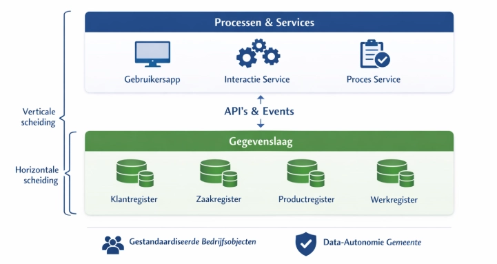

## Implicaties voor de bestaande organisatie

De invoering van Common Ground en het Platform Dienstverlening betekent
meer dan een verandering van de technische architectuur. Het
introduceert een andere manier van kijken naar gemeentelijke
dienstverlening, waarbij publieke waarde, generieke BusinessServices en
intergemeentelijke samenwerking het uitgangspunt vormen. Dit heeft
gevolgen voor de manier waarop beleid, architectuur, analyse,
ontwikkeling, beheer en governance worden ingericht.

De volledige organisatorische en bestuurlijke impact van deze transitie
valt buiten de scope van deze architectuur. Dit hoofdstuk schetst daarom
uitsluitend de belangrijkste implicaties op hoofdlijnen voor de rollen
en verantwoordelijkheden die direct raken aan de ontwikkeling,
realisatie en het beheer van het Platform Dienstverlening. De verdere
organisatorische inrichting, governance en veranderkundige implementatie
vragen om een afzonderlijke uitwerking.

### Directie, proceseigenaren en opdrachtgevers

De invoering van een platformbenadering verandert ook de wijze waarop
gemeenten investeren in digitalisering. Waar de nadruk traditioneel ligt
op het selecteren, aanbesteden en implementeren van afzonderlijke
applicaties, verschuift de aandacht naar de gezamenlijke ontwikkeling en
doorontwikkeling van generieke functionaliteit.

Voor directeuren, proceseigenaren en andere opdrachtgevers betekent dit
dat zij:

- Ontwikkelingen primair beoordelen vanuit de bijdrage aan de
  gezamenlijke dienstverlening;

- Vaker investeren in gezamenlijke ontwikkeling met andere gemeenten dan
  in individuele aanbestedingen;

- Hergebruik en standaardisatie meewegen als volwaardig onderdeel van
  businesscases;

- Gezamenlijk prioriteiten stellen voor de doorontwikkeling van het
  platform.

Hierdoor verschuift de focus van het verwerven van software naar het
gezamenlijk ontwikkelen en beheren van publieke digitale voorzieningen.

### Concern- en thema-architecturen

Deze werkwijze heeft ook consequenties voor gemeentelijke thema- en
concernarchitecturen. Deze zijn van nature domeinoverstijgend, maar
binnen Common Ground gaan ze niet langer primair over applicaties of
systemen, maar over registraties, bedrijfsobjecten en gegevensstromen.

Dit betekent bijvoorbeeld dat eisen aan autorisatie, metadata, logging,
auditing, archivering of datakwaliteit niet op applicatieniveau worden
uitgewerkt, maar moeten aansluiten op een landschap waarin gegevens en
functionaliteit verdeeld zijn over meerdere samenwerkende services.

### Project- en solutionarchitecten

Voor project- en solutionarchitecten verschuift de focus van
applicatiegericht ontwerpen naar bedrijfsarchitectuur als vertrekpunt.
Nieuwe initiatieven worden niet langer primair afgebakend vanuit een
project, applicatie of organisatorisch domein, maar vanuit de
onderliggende waardestroom en de BusinessServices die daarvoor nodig
zijn.

Dit betekent dat architecten:

- Nieuwe vraagstukken eerst toetsen aan de bestaande
  bedrijfsarchitectuur;

- Actief zoeken naar bestaande BusinessServices en andere herbruikbare
  bouwstenen;

- De architectuurscope verbreden wanneer meerdere processen of domeinen
  hetzelfde vraagstuk raken;

- Alleen nieuwe functionaliteit ontwerpen wanneer bestaande
  voorzieningen aantoonbaar onvoldoende aansluiten.

Hierdoor verschuift de rol van projectarchitect van het ontwerpen van
individuele oplossingen naar het bewaken van samenhang binnen het
platform.

### Informatiebeveiliging en privacy

Ook de rol van informatiebeveiligings- en privacyfunctionarissen
verandert. Doordat generieke platformvoorzieningen centraal worden
ontwikkeld en beheerd, kunnen beveiligings- en privacymaatregelen steeds
vaker platformbreed worden ingericht en beoordeeld.

Voor privacy officers en informatieadviseurs betekent dit dat de
aandacht verschuift van het afzonderlijk toetsen van iedere applicatie
naar het beoordelen en bewaken van de generieke platformvoorzieningen en
de daarop gebaseerde architectuur.

Nieuwe oplossingen hoeven daardoor niet telkens opnieuw volledig op
dezelfde generieke aspecten te worden beoordeeld, maar kunnen
voortbouwen op reeds gevalideerde voorzieningen voor bijvoorbeeld
authenticatie, autorisatie, logging, auditing, gegevensuitwisseling en
beveiliging. Hierdoor ontstaat meer uniformiteit, neemt de kwaliteit van
de toetsing toe en wordt dubbel werk voorkomen.

### Businessanalisten

Ook voor businessanalisten verandert de manier van analyseren. De nadruk
verschuift van het beschrijven van bestaande processen naar het
modelleren van de onderliggende dienstverlening.

Businessanalisten richten zich daarom nadrukkelijk op:

- Het identificeren van de maatschappelijke opgave en de gewenste
  waardestroom;

- Het ontwikkelen van een gedeelde taal tussen beleid, uitvoering en IT;

- Het identificeren van BusinessServices en bedrijfsobjecten;

- Het identificeren van beslisregels: beslisregels vormen een expliciet
  onderdeel van de dienstverlening en beschrijven hoe wetgeving en
  beleid worden toegepast;

- Het onderscheiden van generieke en domeinspecifieke functionaliteit;

- Het modelleren van processen als samenstelling van bestaande
  BusinessServices.

Hierdoor ontstaat een stabielere bedrijfsarchitectuur die minder
afhankelijk is van de inrichting van individuele applicaties.

### Functioneel en technisch beheer

Ook de inrichting van beheer verandert. Binnen een componentgebaseerde
architectuur verschuift het beheer van complete applicaties naar het
beheren van platformvoorzieningen, generieke services en configuraties.

Dit betekent onder meer dat:

- Functioneel beheer zich meer richt op de inrichting van generieke
  voorzieningen, formulieren, beslisregels, procesmodellen en
  configuraties dan op afzonderlijke applicaties;

- Technisch beheer zich ontwikkelt van applicatiebeheer naar
  platformbeheer, waarbij aandacht verschuift naar generieke
  infrastructuur, deployment, monitoring, beveiliging en beschikbaarheid
  van platformdiensten;

- Wijzigingen vaker plaatsvinden binnen gedeelde voorzieningen en
  daardoor een bredere impact kunnen hebben;

- Samenwerking tussen beheerteams belangrijker wordt, omdat meerdere
  gemeenten en meerdere BusinessServices gebruikmaken van dezelfde
  platformcomponenten.

Hierdoor verschuift het beheer geleidelijk van een applicatiegerichte
naar een servicegerichte organisatie.

### Ontwikkeling van gemeentelijke IV-organisaties

Op langere termijn ondersteunt de platformarchitectuur ook een andere
inrichting van de gemeentelijke IV-organisatie. Doordat gemeenten steeds
vaker gebruikmaken van dezelfde architectuur, standaarden en
platformvoorzieningen, ontstaat een meer uniforme manier van
ontwikkelen, beheren en doorontwikkelen.

Hierdoor wordt het eenvoudiger om kennis, software en capaciteit tussen
gemeenten uit te wisselen. Ontwikkelaars, architecten, beheerders en
andere IV-professionals kunnen gemakkelijker samenwerken aan dezelfde
voorzieningen en hun expertise breder inzetten. Dit vergroot niet alleen
de continuïteit van het platform, maar draagt ook bij aan een
efficiënter gebruik van schaarse IV-capaciteit binnen de gemeentelijke
sector.

### Doorontwikkeling van de governance

De ontwikkeling van het Platform Dienstverlening vindt plaats binnen een
groeiend samenwerkingsverband van gemeenten. Daarbij wordt toegewerkt
naar een meer landelijke inrichting van ontwikkeling, beheer en
governance.

De inrichting van een structurele landelijke beheerorganisatie maakt
onderdeel uit van de roadmap. De exacte invulling hiervan is nog
onderwerp van verdere uitwerking. Gemeenten doen er daarom goed aan om
bij nieuwe ontwikkelingen rekening te houden met toekomstige landelijke
samenwerking, bijvoorbeeld door gebruik te maken van open standaarden,
generieke voorzieningen en gezamenlijke ontwikkelprocessen.

Tegelijkertijd is terughoudendheid gewenst om vooruit te lopen op
governancekeuzes die nog niet zijn gemaakt. De huidige architectuur is
daarom zo ingericht dat zij zowel binnen de bestaande G4-samenwerking
als binnen een toekomstige landelijke beheerorganisatie toepasbaar
blijft. Hierdoor kan de governance zich geleidelijk ontwikkelen zonder
dat fundamentele architectuurkeuzes opnieuw hoeven te worden gemaakt.

# Informatie- en data-architectuur

| **Compact:** |
|----|
| Dit hoofdstuk beschrijft hoe informatie wordt georganiseerd vanuit de werkelijkheid die de gemeente wil registreren, met duidelijke domeinen en gestandaardiseerde ontsluiting vanuit aangewezen bronnen. Informatie moet vindbaar, beschikbaar, leesbaar, interpreteerbaar, betrouwbaar en toekomstbestendig zijn. Een bron is daarbij niet alleen een plek waar data staat, maar heeft een duidelijke verantwoordelijkheid voor de inhoud, kwaliteit, betekenis en levenscyclus van de gegevens. Gegevens worden via gestandaardiseerde diensten ontsloten. |

## Inleiding

De informatie- en dataarchitectuur beschrijft hoe gegevens binnen het
Platform Dienstverlening worden georganiseerd, beheerd en beschikbaar
gesteld. Binnen TOGAF vormt dit de brug tussen de bedrijfsarchitectuur
en de applicatiearchitectuur. Zij vertaalt de informatiebehoefte vanuit
de dienstverlening naar een samenhangende inrichting van begrippen,
gegevensmodellen, registraties en gegevensuitwisseling.

Dit onderdeel beschrijft deze architectuur op hoofdlijnen. Net als bij
de bedrijfsarchitectuur worden niet alle gemeentelijke gegevensmodellen
uitgewerkt. In plaats daarvan worden de generieke uitgangspunten,
ontwerpprincipes en methodiek beschreven waarmee project- en
solutionarchitecturen consistente informatie- en data-architecturen
kunnen ontwikkelen die aansluiten op het Platform Dienstverlening.

Dit onderdeel beschrijft ook niet de volledige inrichting van
datamanagement, informatiebeheer of recordmanagement. Daarvoor bestaan
bestaande kaders zoals de Archiefwet, DUTO, NORA, GEMMA, de
Selectielijst gemeenten en gemeentelijk informatiebeheerbeleid. Dit
hoofdstuk beschrijft uitsluitend de architectuurprincipes en
ontwerpimplicaties die volgen uit een architectuur waarin informatie
verdeeld is over zelfstandige registraties en services.

## Informatiegericht werken

Volgens de visie wordt de informatiearchitectuur niet primair opgebouwd
vanuit applicaties of processen, maar vanuit de werkelijkheid die
gemeenten administreren. Personen, organisaties, producten, zaken,
besluiten, objecten en andere bedrijfsobjecten worden als
bedrijfsobjecten gemodelleerd die op zichzelf een domein vormen, en
vervolgens via gestandaardiseerde services beschikbaar gesteld aan
BusinessServices, MijnServices en andere toepassingen. Dit volgt het
principe:

> **[Principe: Informatiegericht
> werken](#principe-informatiegericht-werken):** Informatie vormt het
> verbindende element tussen dienstverlening, processen, applicaties en
> organisatie. Gegevens worden onafhankelijk van individuele processen
> en applicaties beheerd, zodat zij meervoudig kunnen worden gebruikt
> voor uitvoering, dienstverlening en besluitvorming.

Hierin zijn de volgende begrippen relevant:

- **Informatie** is de betekenis die mensen aan gegevens geven binnen
  een bepaalde context. Om deze betekenis eenduidig vast te leggen,
  wordt gebruikgemaakt van begrippen, definities en informatiemodellen.
  Hierbij vormt het datamodel
  ([MIM](https://docs.geostandaarden.nl/mim/mim/)) de richtlijn voor het
  vastleggen van de structuur van gegevens, terwijl het begrippenkader
  ([NL-SBB](https://docs.geostandaarden.nl/nl-sbb/nl-sbb/)) de betekenis
  van deze gegevens vastlegt.

- **Data (gegevens)** is de concrete vastlegging van waarnemingen of
  beweringen over objecten. Binnen het Platform Dienstverlening betreft
  dit de opslag, het beheer en de uitwisseling van gegevens via
  registraties en gestandaardiseerde dataservices. Gegevens vormen de
  basis waaruit informatie kan worden afgeleid.

**Applicaties** zijn softwarecomponenten die gegevens verwerken en
functionaliteit aanbieden ter ondersteuning van bedrijfsprocessen en
dienstverlening. Dit onderscheid zorgt ervoor dat:

- Betekenis (informatie) niet afhankelijk is van technische
  implementatie (applicatie)

<!-- -->

- Gegevens consistent en herbruikbaar kunnen worden toegepast over
  verschillende processen en systemen

- Wijzigingen in één laag (bijvoorbeeld applicaties) beperkt effect
  hebben op andere lagen

- Een gemeenschappelijk begrip ontstaat tussen verschillende
  stakeholders en rollen, zoals business, architectuur en development,
  doordat zij vanuit dezelfde begrippen en modellen werken

## Expliciete bedrijfslogica

De informatiearchitectuur geeft ook uitdrukking aan het [**Principe:
Expliciete bedrijfslogica**](#principe-expliciete-bedrijfslogica):
Bedrijfslogica wordt expliciet gemodelleerd en losgekoppeld van
processen, gegevens en softwarecomponenten. Regels die voortkomen uit
wetgeving, beleid of gemeentelijke afspraken worden éénmalig vastgelegd,
centraal beheerd en meervoudig toegepast.

Beslisregels vormen een zelfstandig bedrijfsobject binnen deze
architectuur. Zij beschrijven de formele vertaling van wet- en
regelgeving of beleid naar uitvoerbare logica. Beslisregels kennen een
eigen levenscyclus, versiebeheer, geldigheidsperiode en metadata. Dat
heeft de volgende implicaties:

- Beslisregels vormen een expliciet onderdeel van de dienstverlening en
  beschrijven hoe wetgeving en beleid worden toegepast.

- Beslisregels zijn versieerbaar en historisch reproduceerbaar.

- Beslisregels zijn begrijpelijk voor beleidsmedewerkers, juristen en
  uitvoerende professionals.

## Data-autonomie

Autonomie wordt door
[DICTU](https://www.dictu.nl/sites/default/files/bestanden/website/DICTU%20Toetsingsinstrument%20Soevereiniteit%20Clouddiensten%20v1.0.1.pdf)
gedefinieerd als de combinatie van zelfbeschikking en onafhankelijkheid.
Voor data-autonomie betekent dit dat zowel gemeenten als inwoners
zeggenschap behouden over hun gegevens en kunnen bepalen hoe deze worden
vastgelegd, gebruikt, gedeeld en beheerd. Dit is vastgelegd in **het
[Principe: Data-autonomie](#principe-data-autonomie)**, en dit wordt
hier uitgewerkt.

Data-autonomie kent drie samenhangende aspecten:

- **Zelfbeschikking**  
  Zowel gemeenten als inwoners behouden invloed op het gebruik van
  gegevens binnen de kaders van wet- en regelgeving. Inwoners kunnen
  inzicht krijgen in het gebruik van hun gegevens en waar mogelijk
  invloed uitoefenen op de inhoud en de wijze waarop gegevens worden
  verwerkt.

- **Duurzame zeggenschap**  
  Gemeenten behouden duurzame zeggenschap over hun gegevens. Zij bepalen
  hoe gegevens worden vastgelegd, gebruikt, gedeeld en beheerd, ook
  wanneer de technische uitvoering door leveranciers of andere partijen
  wordt verzorgd. Regie gaat daarmee verder dan eigenaarschap of beheer;
  het betreft het vermogen om richting te geven aan de gehele
  levenscyclus van gegevens.

<!-- -->

- **Onafhankelijkheid**  
  Gegevens blijven beschikbaar, overdraagbaar en toegankelijk,
  onafhankelijk van een specifieke leverancier, applicatie of technische
  implementatie.

  Deze aspecten kennen zowel een dimensie van **weerbaarheid** als van
  **regie**. Enerzijds betekent data-autonomie dat gemeenten en inwoners
  beschermd zijn tegen ongewenste afhankelijkheden van leveranciers,
  technologie of organisaties. Anderzijds betekent data-autonomie dat
  gemeenten daadwerkelijk in staat zijn om zélf richting te geven aan
  hun informatievoorziening: door afspraken te maken over gegevens,
  standaarden en architectuur en deze gezamenlijk te ontwikkelen en toe
  te passen. Autonomie is daarmee niet alleen een vorm van
  onafhankelijkheid, maar ook een de kracht om dienstverlening en
  informatievoorziening actief te kunnen sturen.

Om deze autonomie daadwerkelijk te kunnen realiseren, zijn op
verschillende niveaus architectuurkeuzes en standaarden noodzakelijk.
Binnen het Platform Dienstverlening krijgt data-autonomie daarom
invulling op de volgende niveaus:

- **Semantisch niveau** (standaardisatie van betekenis)

  - Bijvoorbeeld: begrippen als “zaak”, “verzoek” of “bericht” hebben
    een eenduidige definitie en worden overal op dezelfde manier
    geïnterpreteerd, ongeacht welk systeem of domein deze gebruikt.

- **Logisch en functioneel niveau** (inrichting van dataservices en
  registraties)

  - Bijvoorbeeld: gegevens over zaken of klanten worden niet in meerdere
    applicaties opgeslagen, maar centraal ontsloten via registraties en
    API’s, zodat verschillende processen dezelfde bron gebruiken.

<!-- -->

- **Technisch en infrastructureel niveau** (hosting en beheer van
  componenten)

  - Bijvoorbeeld: de gemeente heeft regie over waar en hoe data en
    services draaien, door gebruik te maken van open en overdraagbare
    infrastructuur. Denk hierbij aan inzet van Kubernetes en open-source
    beheertools. Hierdoor kunnen componenten relatief eenvoudig worden
    verplaatst tussen omgevingen of leveranciers

  - Dit maakt het mogelijk om bewust om te gaan met het gebruik van
    cloudleveranciers en waar nodig onafhankelijk te blijven van
    (niet-Europese) hyperscalers, of deze gecontroleerd en uitwisselbaar
    in te zetten.

#### Eigenaarschap

Hoewel vaak wordt gesproken over "data van de gemeente", wordt daarmee
geen goederenrechtelijk eigendom bedoeld. Naar [Nederlands
recht](https://uitspraken.rechtspraak.nl/details?id=ECLI:NL:RBAMS:2023:2540&showbutton=true&keyword=ECLI%253aNL%253aRBAMS%253a2023%253a2540&idx=1)
zijn digitale gegevens in beginsel geen zaken in de zin van het
Burgerlijk Wetboek en kunnen zij daarom niet als zodanig in eigendom
toebehoren. Rechten, plichten en bevoegdheden ten aanzien van gegevens
vloeien voort uit wet- en regelgeving, contractuele afspraken en de
verantwoordelijkheid die organisaties hebben als bronhouder,
verwerkingsverantwoordelijke of beheerder. De term *eigenaarschap* moet
daarom worden gebruikt in de betekenis van bestuurlijke en
organisatorische verantwoordelijkheid, niet als civielrechtelijk
eigendom. Dit volgt [GIBIT Artikel
21](https://vng.nl/sites/default/files/2026-03/gibit-2025-artikelen.pdf)
(‘Intellectueel eigendom’).

### Implicaties voor de architectuur

In de huidige situatie ligt de regie over gegevens vaak impliciet bij
leveranciers, doordat gegevens en functionaliteit zijn opgesloten in
afzonderlijke applicaties en ontsluiting of migratie beperkt mogelijk
is. Daarnaast voeren gemeenten beperkt regie op de inrichting en het
beheer van gegevens.

Dit verandert in deze architectuur en data-autonomie wordt gerealiseerd
langs de volgende samenhangende dimensies:

- **Gestandaardiseerde semantiek**

  Gegevens worden gemodelleerd volgens gemeenschappelijke begrippen,
  definities en informatiemodellen.

- **Brongericht gegevensbeheer**

  Gegevens worden beheerd bij de aangewezen bron of de daarvoor bestemde
  registratie. Duplicatie wordt voorkomen.

- **Gestandaardiseerde gegevensuitwisseling**

  Gegevens worden ontsloten via open API's, events en andere
  interoperabele mechanismen.

- **Portabiliteit**

  Gegevens zijn beschikbaar in open, gedocumenteerde formaten en kunnen
  onafhankelijk van leveranciers worden geëxporteerd, gemigreerd en
  hergebruikt.

- **Transparantie en controleerbaarheid**

  Gegevensgebruik is inzichtelijk en herleidbaar door logging, auditing
  en metadata.

- **Governance en contractuele borging**

  Governance en contractuele afspraken waarborgen dat gemeenten blijvend
  regie houden over gegevens, standaarden, interfaces en
  overdraagbaarheid.

### Uitwerking voor registraties en dataservices

De bovenstaande uitgangspunten leiden tot de volgende architectuureisen
voor registraties en dataservices:

- Iedere registratie heeft een expliciet aangewezen bronhouder;

- Iedere registratie vormt de autoritatieve bron voor de gegevens
  waarvoor zij verantwoordelijk is;

- Gegevens worden vastgelegd conform het gemeentelijke begrippenkader en
  informatiemodel;

- Registraties zijn onafhankelijk van proceslogica en kunnen door
  meerdere BusinessServices worden gebruikt;

- Gegevens worden uitsluitend ontsloten via gestandaardiseerde
  dataservices;

- Dataservices valideren, autoriseren en registreren iedere mutatie;

- Registraties ondersteunen versiebeheer, logging en volledige
  herleidbaarheid;

- Registraties voldoen aan de generieke platformvoorzieningen voor
  authenticatie, autorisatie, logging en beveiliging;

- Gegevens blijven overdraagbaar en leverancier-onafhankelijk.

Bovenstaande wordt verder uitgewerkt in het onderdeel Architectuur van
API’s en registraties.

### Borging buiten de architectuur

Architectuur alleen is onvoldoende om data-autonomie te realiseren. Een
belangrijk deel wordt organisatorisch en juridisch geborgd.

Daaronder vallen onder andere:

- Aanwijzing van bronhouders, data-eigenaren en gegevensbeheerders;

- Afspraken over gegevenskwaliteit en gegevensbeheer;

- Classificatie van gegevens en privacybeleid;

- Autorisatiebeleid en wettelijke grondslagen voor gegevensgebruik;

- Bewaartermijnen, archivering en vernietiging;

- Contractuele afspraken over Open Source, overdraagbaarheid,
  continuïteit en exit;

- Toezicht, auditing en periodieke evaluatie.

## Data bij de bron

Het [**Principe: Data bij de bron**](#principe-data-bij-de-bron) is een
fundamenteel uitgangspunt van zowel Common Ground als de overheidsbrede
[Domeinarchitectuur
Gegevensuitwisseling](https://www.noraonline.nl/wiki/Domeinarchitectuur_Gegevensuitwisseling).
Gegevens worden beheerd door de (door de bronhouder) daarvoor aangewezen
bron en vanuit een (eveneens door de bronhouder aangewezen) bron
beschikbaar gesteld aan afnemers. Processen, BusinessServices en
applicaties gebruiken deze gegevens, maar worden daarvan geen eigenaar.
Hiermee wordt uitvoering gegeven aan architectuurprincipe 4.4.8 – Data
bij de bron.

> **Principe: Data bij de bron:** Gegevens worden beheerd door de
> daarvoor aangewezen bronhouder en worden vanuit die bron beschikbaar
> gesteld. Processen en proces-services/applicaties gebruiken gegevens,
> maar zijn daarvan geen eigenaar.

### De bron

Binnen deze architectuur wordt onder een **bron** verstaan:

*De registratie of gegevensdienst die door de bronhouder als leidende
voorziening is aangewezen voor het beschikbaar stellen van een bepaald
type gegevens.*

Deze definitie sluit aan bij de Domeinarchitectuur Gegevensuitwisseling,
waarin het onderscheid wordt gemaakt tussen het beheren van gegevens
(bronhouder) en het beschikbaar stellen daarvan (aanbieder). Beide
rollen kunnen door dezelfde organisatie worden ingevuld, maar hoeven dat
niet te zijn.

### Rollen en verantwoordelijkheden

Binnen deze architectuur wordt aangesloten bij de terminologie uit de
Domeinarchitectuur Gegevensuitwisseling, waarin de rollen bronhouder,
aanbieder en afnemer centraal staan. Deze rollen beschrijven de
verantwoordelijkheden voor het beheren en beschikbaar stellen van
gegevens binnen een gegevensuitwisseling.

Binnen Data Governance wordt vaak gesproken over een data-eigenaar. Deze
rol heeft een bredere organisatorische verantwoordelijkheid voor de
kwaliteit, het gebruik en de governance van een gegevensdomein. In veel
gevallen zal de data-eigenaar tevens optreden als bronhouder, maar beide
begrippen zijn niet volledig uitwisselbaar:

- Data-eigenaar beschrijft de persoon binnen de organisatie die
  eindverantwoordelijk is voor de definitie, kwaliteit, waarde en het
  correct beschikbaar stellen van een specifieke dataset of data-domein
  ([DAMA](https://dama-nl.org/wp-content/uploads/2022/09/Two-pager-Data-Governance-2-DAMA-NL.pdf))

- [Bronhouder](https://www.noraonline.nl/wiki/Rollen_Domeinarchitectuur_Gegevensuitwisseling)
  beschrijft een [rol](javascript:void(0);) van een partij die
  verantwoordelijk is voor de inhoud en kwaliteit van een registratie
  die als bron is aangewezen.

In deze Enterprise Architectuur wordt het begrip bronhouder gebruikt,
omdat dit aansluit bij de landelijke terminologie rond
gegevensuitwisseling. Gemeenten kunnen deze rol intern beleggen bij de
data-eigenaar of een andere daarvoor aangewezen functionaris.

### Toepassing binnen Platform Dienstverlening

Binnen het Platform Dienstverlening worden verschillende typen bronnen
onderscheiden.

- **Landelijke bronnen**, zoals basisregistraties, zijn de bron voor
  wettelijk aangewezen gegevens.

  - In de praktijk vallen de plaats waar gegevens worden beheerd en de
    plaats waar zij beschikbaar worden gesteld dus niet altijd samen
    (zie de optionele scheiding tussen bronhouder en aanbieder). Een
    bekend voorbeeld is de Basisregistratie Personen (BRP). Gemeenten
    zijn bronhouder voor persoonsgegevens van ingezetenen, terwijl
    landelijke voorzieningen deze gegevens beschikbaar stellen aan
    afnemers. Voor gebruikers vormt deze gegevensdienst de bron, terwijl
    de verantwoordelijkheid voor de gegevens bij de bronhouder blijft.

- **Gemeentelijke registraties** vormen de bron voor lokale en
  domeinspecifieke gegevens waarvoor de gemeente de bronhouder is.

  - Ook binnen de gemeentelijke context kunnen de rollen van
    **bronhouder** en **aanbieder** worden gescheiden. Dit gebeurt
    bijvoorbeeld bij Patroon B-implementaties (zie [Patroon B – Hybride
    implementatie](#patroon-b-hybride-implementatie)). De bronhouder is
    verantwoordelijk voor de inhoud, kwaliteit en betekenis van de
    gegevens in de registratie. De aanbieder verzorgt de ontsluiting van
    deze gegevens via gestandaardiseerde gegevensdiensten, inclusief
    metadata, autorisatie, notificaties en eventuele intermediaire
    voorzieningen.

- **Domeinregistraties** zijn gemeentelijke registraties, maar bevatten
  gegevens die specifiek zijn voor een bepaald beleidsdomeinOngeacht het
  type bron geldt dat gegevens uitsluitend beschikbaar worden gesteld
  via gestandaardiseerde gegevensdiensten. Hierdoor kunnen meerdere
  BusinessServices dezelfde gegevens gebruiken zonder deze te
  dupliceren.

### De eindigheid van bronnen en brongegevens

Het principe Data bij de bron betekent niet dat data in een bron of
registratie onbeperkt blijft bestaan of dat gegevens onbeperkt
beschikbaar blijven. Elk gegeven kent een eigen levenscyclus, die wordt
bepaald door wet- en regelgeving en de doelbinding waarvoor gegevens
zijn verzameld.

Voor registraties binnen het Platform Dienstverlening betekent dit dat
gegevens gedurende hun levenscyclus beschikbaar worden gesteld via de
bron, maar uiteindelijk:

- Worden vernietigd wanneer daarvoor een wettelijke grondslag bestaat;

- Of, indien de Archiefwet dit voorschrijft, worden overgebracht naar
  een archiefbewaarplaats voor duurzame bewaring.

Daarnaast geldt dat het beschikbaar stellen van gegevens altijd
plaatsvindt binnen de geldende autorisaties, doelbinding en
informatieclassificatie. Dat gegevens bij de bron beschikbaar zijn,
betekent nadrukkelijk niet dat iedere afnemer toegang heeft tot alle
gegevens.

Hieruit volgt dat Data bij de bron niet alleen vraagt om een duidelijke
bronregistratie, maar ook om ondersteuning van de volledige
informatielevenscyclus, inclusief autorisatie, bewaartermijnen,
vernietiging en – waar wettelijk vereist – overbrenging naar een
archiefbewaarplaats. De architectuurimplicaties hiervan worden verder
uitgewerkt in [Duurzame toegankelijkheid by
design](#duurzame-toegankelijkheid-by-design).

### Implicaties voor ontwerp

Het principe **Data bij de bron** heeft directe gevolgen voor de
inrichting van bedrijfsprocessen, BusinessServices en applicaties. Bij
de ontwikkeling van nieuwe functionaliteit geldt daarom het volgende:

- Bestaande registraties zijn het uitgangspunt voor gegevensgebruik;

- Nieuwe processen introduceren geen eigen gegevensdefinities of
  gegevensopslag wanneer hiervoor reeds een bronregistratie bestaat;

- Nieuwe gegevensdefinities worden gerealiseerd conform het
  gemeentelijke begrippenkader en de informatiearchitectuur;

- BusinessServices gebruiken gegevens via de daarvoor aangewezen
  registraties en dataservices;

- Alleen wanneer bestaande registraties aantoonbaar onvoldoende zijn,
  wordt een nieuwe registratie geïntroduceerd.

Processen en BusinessServices zijn afnemers van gegevens; registraties
zorgen voor het voor het duurzaam beheer daarvan.

### Bronnen buiten de scope van het Platform

Niet alle gemeentelijke gegevens bevinden zich binnen het Platform
Dienstverlening. Voor voorzieningen zoals HR-, financiële of andere
bedrijfsvoeringssystemen blijft het betreffende systeem de bron voor de
gegevens waarvoor het verantwoordelijk is.

Het Platform Dienstverlening neemt deze gegevens niet over, maar
gebruikt ze via gestandaardiseerde gegevensdiensten. Daarbij gelden de
volgende uitgangspunten:

- De externe registratie blijft de leidende bron;

- Gegevens worden ontsloten via gestandaardiseerde API's of
  gegevensdiensten;

- BusinessServices gebruiken gegevens via referenties of raadplegingen
  en voorkomen onnodige duplicatie.

Alleen wanneer synchronisatie noodzakelijk is, bijvoorbeeld vanwege
prestaties, beschikbaarheid of wettelijke eisen, mag hiervan worden
afgeweken. Daarbij geldt altijd dat:

- De bronrelatie expliciet blijft vastgelegd;

- De externe registratie leidend blijft;

- Geen nieuw bronhouderschap binnen het platform ontstaat;

- Verantwoordelijkheden voor actualiteit, synchronisatie en
  gegevenskwaliteit expliciet zijn belegd.

## Duurzame toegankelijkheid by design

In traditionele (zaak)systemen bevinden gegevens zich veelal binnen één
applicatie. In een Common Ground-architectuur zijn informatieobjecten
verdeeld over meerdere zelfstandige registraties en services. Hierdoor
verschuift de uitdaging van het archiveren van één applicatie naar het
duurzaam toegankelijk houden van een samenhangend netwerk van
informatieobjecten.

Een van de architectuurprincipes is [**Principe: Kwaliteit by
Design**](#principe-kwaliteit-by-design):

> Niet-functionele kwaliteitseisen worden vanaf het ontwerp integraal
> meegenomen in architectuur, software en dienstverlening. Aspecten
> zoals informatiebeveiliging, privacy, toegankelijkheid,
> informatiebeheer, logging, auditing en beheerbaarheid zijn geen
> afzonderlijke voorzieningen achteraf, maar vormen een integraal
> onderdeel van iedere platformvoorziening.

Dit sluit aan bij de visie op de digitale overheid, waarin de overheid
duurzaam regie moet houden op haar informatie en digitale
infrastructuur. Publieke waarden zoals transparantie, uitlegbaarheid,
toegankelijkheid en duurzame beschikbaarheid van overheidsinformatie
moeten niet afhankelijk zijn van individuele applicaties of
leveranciers, maar structureel worden geborgd in de inrichting van het
informatiestelsel.

Voor de uitwerking van duurzame toegankelijkheid sluit deze architectuur
aan bij het
[DUTO-raamwerk](https://www.nationaalarchief.nl/archiveren/kennisbank/duto-raamwerk)
van het Nationaal Archief. DUTO beschrijft geen afzonderlijke
archiefvoorziening, maar een ontwerpbenadering waarbij
informatiesystemen vanaf het ontwerp zodanig worden ingericht dat
overheidsinformatie gedurende haar gehele levenscyclus duurzaam
toegankelijk blijft. Het raamwerk onderscheidt daarbij de
kwaliteitskenmerken vindbaar, beschikbaar, leesbaar, interpreteerbaar,
betrouwbaar en toekomstbestendig en werkt deze uit in concrete
ontwerpmaatregelen voor informatiesystemen.

Dit onderdeel beperkt zich tot de architectuurimplicaties van duurzame
toegankelijkheid binnen een Common Ground-architectuur en onderscheidt
daarbij de **architectuur** en de **implementatie**.

### Duurzame toegankelijkheid vanuit de architectuur

Het DUTO-raamwerk onderscheidt vijf informatiebeheerprocessen die
gezamenlijk invulling geven aan duurzame toegankelijkheid:

- Registreren;

- Bewaren;

- Migreren;

- Vernietigen;

- Ter beschikking stellen.

Binnen het Platform Dienstverlening worden deze processen niet door één
component uitgevoerd, maar verdeeld over meerdere
architectuurbouwblokken. Daarmee sluit de architectuur aan op het
uitgangspunt dat iedere component verantwoordelijk is voor zijn eigen
gegevens en functionaliteit.

De relevante bouwblokken zijn uitgewerkt in de
[applicatiearchitectuur](#architectural-building-blocks-abbs-en-clusters):

- **ABB Registraties** (laag 1) en **ABB Diensten** (laag 2) zijn
  verantwoordelijk voor het vastleggen, beheren en ontsluiten van
  informatieobjecten.

- De doorsnijdende **ABB Duurzame toegankelijkheid** ondersteunt de
  platformbrede informatiebeheerprocessen, zoals lifecyclebeheer,
  archivering, overbrenging en vernietiging.

  De (applicatie)architectuur van
  [registraties](#architectuur-van-registraties) en
  [API’s](#architectuur-van-apis) geeft invulling aan een belangrijk
  deel van de eisen voor duurzame toegankelijkheid. Registraties leggen
  informatie duurzaam vast, inclusief historie, metadata en
  gebeurtenissen, terwijl handelingsgedreven API's zorgen voor
  gecontroleerde mutaties en volledige herleidbaarheid van wijzigingen.

  Maar een gedistribueerde architectuur vraagt om aanvullende
  functionaliteit en afspraken die in deze versie van de architectuur
  verder worden uitgewerkt aan de hand van het DUTO-functiemodel.

### Implementatie & DUTO-functiemodel

De DUTO-processen worden verdiept met het
[DUTO-functiemodel](https://www.nationaalarchief.nl/archiveren/kennisbank/duto-functiemodel).
Dit geeft een handvat om te controleren in hoeverre, en op welke manier,
het Platform voldoet aan de gestelde eisen.

<table>
<colgroup>
<col style="width: 23%" />
<col style="width: 24%" />
<col style="width: 51%" />
</colgroup>
<thead>
<tr>
<th><strong>DUTO-functie</strong></th>
<th><strong>Primaire ABB</strong></th>
<th><strong>Toelichting</strong></th>
</tr>
</thead>
<tbody>
<tr>
<td><strong>F01 Bevriezing</strong></td>
<td>ABB Registraties</td>
<td>API’s op registraties dwingen af dat gegevens volgens bedrijfsregels
worden vastgezet zodat ze niet meer kunnen worden gewijzigd. De interne
logica van Registraties dwingt af dat de registratie van data niet
aanpasbaar is, maar dat een mutatie een nieuwe registratie is.</td>
</tr>
<tr>
<td><strong>F02 Conversie</strong></td>
<td><strong>Niet ingevuld</strong></td>
<td>
In de registraties worden informatie-objecten zo opgeslagen dat
ze op diverse wijzen kunnen worden gerepresenteerd, conform doel en
doelbinding.

In de periferie van het platform (zaakbruggen, koppelvlakken) worden
door leveranciers wel degelijk conversiefunctionaliteit gerealiseerd om
legacy-dataformaten om te zetten naar de standaarden (data <em>in</em>
het platform te krijgen). Maar andersom nog niet. Een usecase daarvoor
zou overbrenging naar het E-Depot kunnen zijn.
</td>
</tr>
<tr>
<td><strong>F03 Creatie</strong></td>
<td>ABB Processervice, ABB Diensten + ABB Registraties</td>
<td>Creatie speelt over het hele platform een rol: vanaf formulieren
(bepaling van velden, validatie), tot processervices (datamodellen,
validatie, procesinrichting; Diensten(API’s) dwingen validatie en
constraints af; registraties nemen informatieobjecten duurzaam op.</td>
</tr>
<tr>
<td><strong>F04 Inwinning</strong></td>
<td>ABB Processervices</td>
<td>In de proceslaag worden gegevens opgehaald via gestandaardiseerde
API’s van externe bronnen. Ze worden daar gevalideerd; via API’s en
configuratie worden de gegevens met de juiste metadata (bron) verwerkt
in registraties.</td>
</tr>
<tr>
<td><strong>F05 Maskering</strong></td>
<td><strong>Niet ingevuld</strong></td>
<td>In het huidige platform is geen generieke maskeringsfunctionaliteit
gerealiseerd. Dat is voor verschillende doeleinden wel nodig.</td>
</tr>
<tr>
<td><strong>F06 Metagegevensbeheer</strong></td>
<td>ABB Registraties</td>
<td>Registraties beheren objectmetadata; Hiervoor worden standaarden
gevolgd</td>
</tr>
<tr>
<td><strong>F07 Opname</strong></td>
<td>ABB Registraties</td>
<td>Registraties nemen informatieobjecten duurzaam in beheer.</td>
</tr>
<tr>
<td><strong>F08 Opslag</strong></td>
<td>ABB Registraties</td>
<td>Registraties zijn verantwoordelijk voor duurzame opslag van
informatieobjecten. Hier is een vast patroon voor (URN’s)</td>
</tr>
<tr>
<td><strong>F09 Publicatie</strong></td>
<td>ABB Diensten</td>
<td>Informatie wordt beschikbaar gesteld via gestandaardiseerde
dataservices en API's.</td>
</tr>
<tr>
<td><strong>F10 Representatie</strong></td>
<td>ABB Interactieservices</td>
<td>Portalen en gebruikersinterfaces tonen informatie aan gebruikers.
Dit gaat om diverse services, conform doel(groep) en doelbinding.</td>
</tr>
<tr>
<td><strong>F11 Toegangsbeheer</strong></td>
<td>ABB Autorisatie (AuthZEN/OpenFTV)</td>
<td>Platformbrede autorisatie op basis van beleid, attributen en
context.</td>
</tr>
<tr>
<td><strong>F12 Uitwisseling</strong></td>
<td>ABB Dataservices + ABB Connectiviteit</td>
<td>Machine-to-machine-uitwisseling via API's en FSC.</td>
</tr>
<tr>
<td><strong>F13 Validatie</strong></td>
<td>Crossfunctioneel</td>
<td>Zie F03 – Creatie.</td>
</tr>
<tr>
<td><strong>F14 Verantwoording</strong></td>
<td>(o.a.) ABB Logging Dataverwerkingen, ABB Registraties</td>
<td>Verantwoording ontstaat uit de samenhang tussen registraties
(states, events en metadata), het Logboek Dataverwerkingen en de
autorisatievoorziening. Samen maken deze bouwblokken beheer en gebruik
van informatieobjecten volledig herleidbaar.</td>
</tr>
<tr>
<td><strong>F15 Vernietiging</strong></td>
<td>ABB Duurzame toegankelijkheid + ABB Registraties</td>
<td>De ABB Duurzame toegankelijkheid stelt de recordmanager in staat
regie te voeren op vernietiging; registraties voeren de feitelijke
verwijdering uit.</td>
</tr>
<tr>
<td><strong>F16 Zoeken</strong></td>
<td>ABB Dataservices + ABB Interactieservices</td>
<td>Registraties bieden zoekfunctionaliteit via API's;
interactieservices ondersteunen gebruikers bij het vinden van
informatie.</td>
</tr>
</tbody>
</table>

De mapping laat zien dat een belangrijk deel van de DUTO-functies geheel
of gedeeltelijk wordt ingevuld door de referentie-architectuur van het
Platform Dienstverlening. Registraties vormen daarbij de primaire
bouwsteen voor het duurzaam beheren van informatieobjecten, terwijl
diensten, dataservices, autorisatie, logging en connectiviteit
gezamenlijk invulling geven aan de overige functies. Duurzame
toegankelijkheid wordt daarmee niet gerealiseerd door één afzonderlijke
archiefcomponent, maar als een integrale eigenschap van het gehele
platform.

Daarbij moet worden opgemerkt dat niet alle architectuurbouwblokken
(ABB's) in de huidige referentie-implementatie zijn gerealiseerd.
Voorbeelden hiervan zijn de verdere doorontwikkeling van de
registraties, de volledige implementatie van het Logboek
Dataverwerkingen (LDV) en de realisatie van de
OpenFTV/AuthZEN-voorziening.

De volgende capabilities zijn (architectureel) nog geheel of
gedeeltelijk uit te werken:

- **Platformbrede maskeringsfunctionaliteit (F05)**  
  Het platform kent nog geen generieke capability voor het dynamisch
  maskeren of pseudonimiseren van gegevens op basis van doel, context of
  gebruikersrol.

- **Lifecyclebeheer van informatieobjecten**  
  Platformbrede ondersteuning voor lifecycle-overgangen, zoals
  archiefstatussen, overbrenging en vernietiging, vraagt verdere
  standaardisatie. Daarbij moet – waarschijnlijk – ook invulling worden
  gegeven aan de eisen uit de Archiefwet voor de overbrenging van
  blijvend te bewaren informatie naar een archiefbewaarplaats (e-depot).
  De wijze waarop deze overbrenging plaatsvindt, is niet uitgewerkt.
  Daarbij spelen onder meer vragen over de
  verantwoordelijkheidsverdeling tussen registraties en
  archiefvoorzieningen, de benodigde metadata en de vraag of
  informatieobjecten vóór overbrenging moeten worden geconverteerd, en
  welke service dat moet doen.

- **Platformbreed metagegevensbeheer**  
  Registraties beheren hun eigen metadata. Verdere uitwerking is nodig
  voor uniforme archiefmetadata, classificaties, bewaartermijnen en
  andere lifecyclemetadata conform landelijke standaarden zoals MDTO.
  Dit wordt ten dele ondervangen in de architectuur van registraties.

- **Duurzame reconstructie van dossiers**  
  Omdat informatieobjecten verspreid zijn over meerdere registraties, is
  een architectuur nodig waarmee dossiers en andere samenhangende
  informatie ook op langere termijn volledig en reproduceerbaar kunnen
  worden samengesteld.

- **Referentie-implementatie van de ABB Duurzame toegankelijkheid**  
  Binnen de huidige referentie-implementatie van het Platform
  Dienstverlening wordt de ABB Duurzame toegankelijkheid gedeeltelijk
  ingevuld door de Open Archiefbeheer Beheercomponent (OAB). Deze
  component richt zich primair op de vernietiging van informatie. OAB
  geeft slechts een eerste invulling van de ABB Duurzame
  toegankelijkheid. Verdere doorontwikkeling is noodzakelijk.

De nadruk van bovenstaande inventarisatie ligt nadrukkelijk op de
ontwikkeling van architectuurcapabilities. De *organisatorische*
inrichting van informatiebeheer, recordmanagement en archiefprocessen
valt buiten de scope van deze Enterprise Architectuur en wordt
uitgewerkt binnen de daarvoor geldende vakinhoudelijke kaders.

De concrete doorontwikkeling van services (zoals registraties, en OAB)
vindt iteratief plaats in samenwerking met de betrokken vakexperts.
Hierbij worden de architectuurprincipes uit deze Enterprise Architectuur
verfijnd en vertaald naar concrete services, API's, informatiepatronen
en implementaties.

### Openbaarheid van overheidsinformatie (Woo)

De [Wet open overheid
(Woo)](https://www.rijksoverheid.nl/themas/overheid-en-democratie/wet-open-overheid-woo/hoofdlijnen-woo)
heeft als doel de transparantie van de overheid te vergroten door
overheidsinformatie actief en passief openbaar te maken. De wet gaat uit
van het principe dat overheidsinformatie openbaar is, tenzij een
wettelijke uitzonderingsgrond van toepassing is. Daarnaast stelt de Woo
eisen aan de digitale informatiehuishouding van overheidsorganisaties,
zodat informatie vindbaar, toegankelijk en duurzaam beschikbaar is.

De (informatie)architectuur van het Platform Dienstverlening vormt een
belangrijke randvoorwaarde voor de uitvoering van de Woo. De Woo vereist
aanvullende functionaliteit, denk hierbij aan het selecteren van
openbaar te maken informatie, het toepassen van uitzonderingsgronden,
anonimisering of pseudonimisering, publicatie naar landelijke
voorzieningen en het ondersteunen van de processen rondom actieve en
passieve openbaarmaking.

Binnen de huidige referentiearchitectuur is hiervoor nog geen oplossing
aangewezen. Hoewel binnen de Common Ground-gemeenschap voorzieningen
zijn ontwikkeld, zoals
[OpenWoo](https://www.conduction.nl/solutions/openwoo/) en [de Generieke
Publicatievoorziening Woo (GPP-Woo)](https://www.gpp-woo.nl/), maken
deze op dit moment nog geen integraal onderdeel uit van het Platform
Dienstverlening en bestaat er nog geen gestandaardiseerd
integratiepatroon met de overige platformvoorzieningen. Tegelijkertijd
wordt landelijk gewerkt aan de [Generieke Woo-voorziening
(GWV)](https://www.koopoverheid.nl/voor-overheden/rijksoverheid/open-overheid)
voor de gefaseerde invoering van de actieve openbaarmakingsplicht.

De verdere uitwerking van Woo-ondersteuning valt buiten de scope van
deze versie van de Enterprise Architectuur. Wel worden de volgende
architectuurcapabilities voorzien voor toekomstige ontwikkeling:

- **Platformbrede Woo-capability**, inclusief een architectuurbouwblok
  voor actieve en passieve openbaarmaking.

- **Gestandaardiseerde koppeling tussen registraties en
  Woo-voorzieningen**, zodat informatieobjecten inclusief metadata,
  relaties en context beschikbaar kunnen worden gesteld voor
  openbaarmaking.

- **Ondersteuning van openbaarmakingsprocessen**, waaronder selectie,
  beoordeling, anonimisering, publicatie en intrekking.

- **Platformbrede maskeringsfunctionaliteit**, waarmee persoonsgegevens
  en andere beschermde informatie op basis van wet- en regelgeving,
  autorisatie en doelbinding automatisch kunnen worden afgeschermd of
  geanonimiseerd. Deze capability sluit aan op de ABB **Duurzame
  toegankelijkheid**, waarin generieke ondersteuning voor maskering als
  ontbrekende functie is geïdentificeerd.

- **Integratie met landelijke Woo-voorzieningen**, waaronder de
  Generieke Woo-voorziening (GWV) en eventuele opvolgende landelijke
  publicatievoorzieningen.

- **Samenhang met duurzame toegankelijkheid**, zodat informatie
  gedurende de gehele levenscyclus zowel archiefwaardig als
  openbaarmaakbaar blijft.

## Security by Design

Informatiebeveiliging is een randvoorwaarde voor het Platform
Dienstverlening. Gemeenten zijn verantwoordelijk voor het voldoen aan de
[Baseline Informatiebeveiliging Overheid
(BIO)](https://www.digitaleoverheid.nl/overzicht-van-alle-onderwerpen/cybersecurity/bio-en-ensia/baseline-informatiebeveiliging-overheid/)
en de daarop gebaseerde normen, processen en risicobeheersing. Een
volledige toetsing aan de BIO of ISO/NEN 27001 vindt plaats op het
niveau van de ingerichte organisatie, de operationele beheerprocessen en
de daadwerkelijk geïmplementeerde ICT-omgeving, en valt daarmee buiten
de scope van deze Enterprise Architectuur.

Deze architectuur beschrijft uitsluitend de architectonische
uitgangspunten voor *Security by Design*: de wijze waarop beveiliging
vanaf het ontwerp integraal onderdeel vormt van het Platform
Dienstverlening. Hiermee wordt invulling gegeven aan [**Principe:
Kwaliteit by Design**](#principe-kwaliteit-by-design):

> Niet-functionele kwaliteitseisen worden vanaf het ontwerp integraal
> meegenomen in architectuur, software en dienstverlening. Aspecten
> zoals informatiebeveiliging, privacy, toegankelijkheid,
> informatiebeheer, logging, auditing en beheerbaarheid zijn geen
> afzonderlijke voorzieningen achteraf, maar vormen een integraal
> onderdeel van iedere platformvoorziening.

### Platformverantwoordelijkheid security

Het Platform Dienstverlening realiseert een belangrijk deel van de
generieke technische beveiligingsvoorzieningen als gemeenschappelijke
platformcapabilities. Hierdoor hoeven individuele services deze
voorzieningen niet telkens opnieuw te implementeren en ontstaat een
uniforme beveiligingsbasis voor het gehele platform.

Deze generieke capabilities worden grotendeels gerealiseerd door de
Haven+ infrastructuur, zie onder meer het principe [*Security by
default* in de Haven+
architectuur](https://havenplus.commonground.nl/docs/haven-plus-architecture-principles/#ap-06--security-by-default).
Hierdoor kunnen ontwikkelteams zich concentreren op de functionele
beveiliging van hun eigen services.

### Verantwoordelijkheid van services

De beschikbaarheid van generieke platformvoorzieningen ontslaat de
proceseigenaar niet van de eigen verantwoordelijkheid voor de inrichting
van de service. Bij iedere implementatie blijft de proceseigenaar
verantwoordelijk voor onder andere:

- Correcte autorisatie van bedrijfsfunctionaliteit;

- Rechtmatige verwerking van gegevens;

- Invoervalidatie en bescherming tegen kwetsbaarheden;

- Correcte toepassing van privacy- en informatiebeveiligingsmaatregelen;

- Veilige softwareontwikkeling en onderhoud.

Platformbeveiliging en applicatiebeveiliging vullen elkaar daarmee aan;
maar ook bij de uitbesteding van ontwikkeling of beheer blijft de
proceseigenaar eindverantwoordelijk.

### Verdere uitwerking

De concrete implementatie van Security by Design wordt in deze
Enterprise Architectuur niet verder uitgewerkt. Hiervoor wordt verwezen
naar:

- De **Technologiearchitectuur** (Haven+ en platformvoorzieningen);

- De **Aansluitvoorwaarden Platform Dienstverlening**, waarin de
  technische beveiligings- en ontwikkelvereisten voor platformservices
  en aangesloten applicaties zijn opgenomen, waaronder eisen aan
  identity, autorisatie, OpenTelemetry, GitOps, Kubernetes, CI/CD,
  containerbeveiliging, softwarekwaliteit en releasebeheer;

- De gemeentelijke BIO-governance, waarin risicomanagement,
  classificatie, incidentmanagement, leveranciersmanagement, auditing en
  compliance zijn belegd.

- Een Security Handboek waarin de BIO2-beheersmaatregelen voor de
  relevante domeinen worden uitgewerkt tot concrete
  beveiligingsstandaarden voor het platform en services. Dit document is
  in ontwikkeling. Publicatie volgt.

## Data-architectuur

De voorgaande paragrafen beschrijven de informatiekundige uitgangspunten
van het Platform Dienstverlening. Zij geven antwoord op vragen als:
welke gegevens zijn leidend, wie is verantwoordelijk voor de kwaliteit
ervan en hoe blijven gegevens duurzaam toegankelijk?

De data-architectuur bouwt hierop voort en beschrijft de logische
inrichting van de gemeentelijke gegevenslaag. Centraal staan de gegevens
zelf: de businessobjecten, hun onderlinge relaties, de verdeling over
generieke en domeinspecifieke registraties en de aansluiting op het
Gemeentelijk Gegevensmodel (GGM). De nadruk ligt daarbij op de structuur
en samenhang van gegevens, onafhankelijk van de wijze waarop deze
technisch worden geïmplementeerd of ontsloten.

De concrete realisatie van registraties, dataservices, API's en andere
softwarecomponenten wordt in het hoofdstuk Applicatiearchitectuur
uitgewerkt.

### Scheiding van data en proces

Een fundamenteel uitgangspunt binnen de data-architectuur is de
scheiding tussen **gegevens** en **processen**. Gegevens beschrijven de
werkelijkheid en hebben een zelfstandige betekenis, onafhankelijk van de
processen waarin zij worden gebruikt. Voor duurzame toegankelijkheid
blijft de procescontext wel essentieel. Om de herkomst, betekenis en
totstandkoming van gegevens te kunnen reconstrueren, moeten de processen
waarin gegevens zijn ontstaan, gewijzigd of geraadpleegd expliciet
worden vastgelegd en raadpleegbaar blijven.

Hiermee wordt uitvoering gegeven aan het architectuurprincipe
[**Principe: Data bij de bron**](#principe-data-bij-de-bron).

Deze scheiding kent twee complementaire dimensies.

- **Verticale scheiding tussen proces en data**

  - BusinessServices en processen gebruiken gegevens uit de daarvoor
    aangewezen registraties. Gegevens worden niet beheerd binnen
    processen of applicaties, maar uitsluitend binnen de registraties
    die daarvoor verantwoordelijk zijn. Hierdoor kunnen dezelfde
    gegevens door meerdere processen worden gebruikt zonder duplicatie
    of inconsistentie.

- **Horizontale scheiding tussen registraties**

  - Gemeenschappelijke bedrijfsobjecten, zoals **Klant**, **Zaak**,
    **Product** en **Plan**, overstijgen individuele processen en
    beleidsdomeinen. Deze worden daarom ondergebracht in generieke
    registraties die door meerdere BusinessServices kunnen worden
    gebruikt.

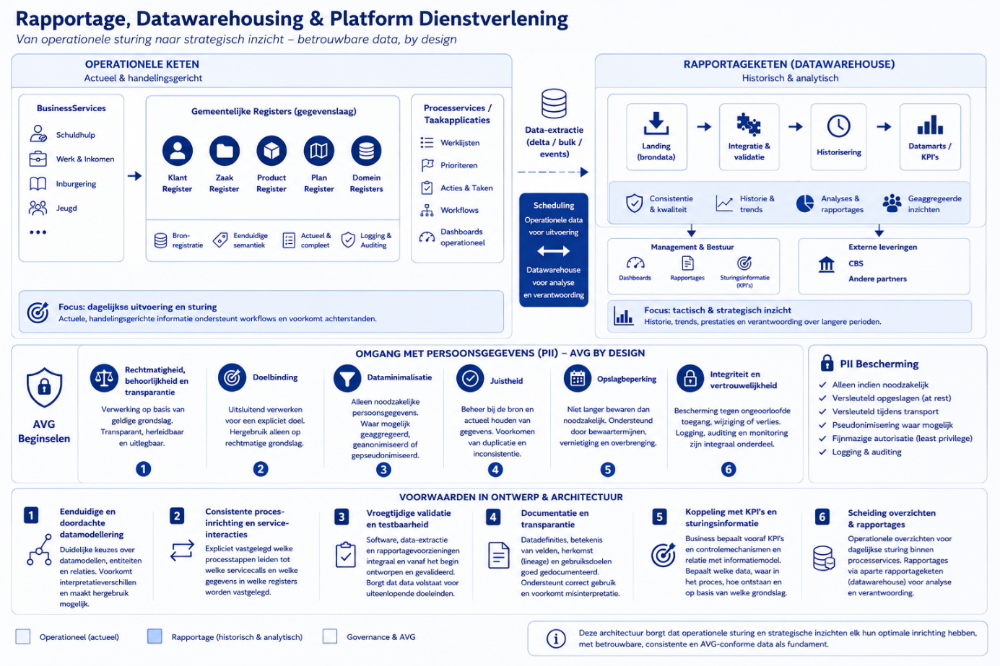

Daarnaast bestaan domeinspecifieke registraties voor gegevens die
uitsluitend binnen een bepaald beleidsdomein relevant zijn. Ook deze
registraties worden onafhankelijk van processen beheerd en kunnen door
meerdere toepassingen worden hergebruikt, binnen de daarvoor geldende
autorisatie- en validatieregels.

Deze inrichting zorgt ervoor dat:

- Gegevens éénmaal en eenduidig worden vastgelegd;

- Semantiek onafhankelijk van processen wordt beheerd;

- BusinessServices en processen onafhankelijk van de gegevensstructuur
  kunnen evolueren;

- Generieke en domeinspecifieke gegevens op consistente wijze kunnen
  worden gecombineerd.

De verzameling van generieke registraties, domeinregistraties en hun
onderlinge relaties vormt de **gemeentelijke gegevenslaag** van het
Platform Dienstverlening.

De concrete realisatie van deze registraties, de ontsluiting via
dataservices, API's en events en de onderlinge communicatie tussen
softwarecomponenten worden uitgewerkt in de **Applicatiearchitectuur**.

## Soorten data en positionering in de architectuur

Hoewel registraties de gegevensbasis vormen in de architectuur, betekent
dit niet dat *alle* data binnen het platform in deze laag thuishoort (en
dat is ook niet mogelijk). De volgende vorm van data zijn te
onderscheiden.

#### Duurzame gegevens (registratiedata)

Dit zijn gegevens die een duurzame representatie van de werkelijkheid
vormen en door meerdere processen en services worden gebruikt. Het gaat
om gegevens met een duidelijke betekenis buiten één specifiek proces,
die consistent en eenduidig moeten worden beheerd.

- Voorbeelden: personen, zaken, producten, beschikkingen

- Kenmerken: herbruikbaar en leidend voor besluitvorming

- Positionering: vastgelegd in registraties (dataservices) en ontsloten
  via API’s

Deze gegevens vormen de kern van de gegevenslaag en zijn de primaire
bron voor dienstverlening. De informatie over een inwoner en diens
situatie is daarbij niet geconcentreerd in één plek, maar verdeeld over
meerdere registraties. Zo worden verschillende aspecten van de
werkelijkheid afzonderlijk vastgelegd, elk vanuit hun eigen domein:

- Gegevens over de persoon in een klant- of basisregistratie

- Gegevens over producten in de productregistratie

- Gegevens over de voortgang van een zaak in de zaakregistratie

Dit betekent dat de “toestand” van een inwoner of een casus altijd een
samenspel is van meerdere gegevensbronnen. Door deze gegevens centraal
en per domein te beheren, blijft de informatie onafhankelijk van
specifieke applicaties of workflows. Hoe deze data duurzaam wordt
geregistreerd is beschreven in [Architectuur van
registraties](#architectuur-van-registraties).

#### Procesdata (workflow- en uitvoeringsdata)

Dit betreft gegevens die nodig zijn om processen uit te voeren, maar die
geen zelfstandige betekenis hebben buiten dat proces. Dit gaat
bijvoorbeeld om:

- De toestand van het proces zelf: waar zit een case in de workflow,
  welke stap is actief, welke paden zijn doorlopen.

- Voorbeelden: actieve taak, processtap, wachttijd, routingbeslissing.

Deze data hoort niet in de gegevenslaag thuis en blijft gekoppeld aan de
uitvoering van processen, en wordt beheerd binnen proces- of
orkestratieservices (bijv. GZAC/Valtimo). Belangrijk is dat bij de
configuratie van deze services wordt ingebouwd dat die data vernietigd
wordt als het proces stopt.

#### Afgeleide en analytische data

Dit betreft data die wordt samengesteld of afgeleid uit andere gegevens,
bijvoorbeeld voor analyse, sturing of rapportage.

- Voorbeelden: dashboards, rapportages, beleidsinformatie, statistieken

- Kenmerken: afgeleid, niet leidend voor operationele processen, vaak
  gecombineerd uit meerdere bronnen; de informatie kan wel essentieel
  zijn voor sturing op operationele processen.

- Positionering: beheerd in aparte analyse- of rapportagevoorzieningen

Deze data ondersteunt inzicht en besluitvorming, maar is geen directe
bron voor operationele dienstverlening.

#### Positionering van DMN-regels in de architectuur

De inhoud van een DMN-engine (beslisregels, decision tables) moet worden
gezien als:

- Herbruikbare, expliciete beslislogica die onderdeel is van de
  dienstverlening, maar geen representatie van de werkelijkheid zelf.

Om die herbruikbaarheid en consistentie te borgen, worden deze regels
ondergebracht in een losstaande rule-engine, die door meerdere services
wordt gebruikt. Dit voorkomt dat dezelfde regels op meerdere plekken
worden geïmplementeerd en uiteen gaan lopen, en maakt het mogelijk om
wijzigingen in beleid of wetgeving gecontroleerd en uniform door te
voeren. Zie verder de applicatiearchitectuur.

### Datakwaliteit

Datakwaliteit bepaalt in hoeverre gegevens geschikt zijn voor het doel
waarvoor ze worden gebruikt. Het is daarmee geen absolute eigenschap,
maar afhankelijk van context: dezelfde data kan voor het ene doel
bruikbaar zijn en voor het andere niet.

[ISO/IEC
25012](https://mail.iso25000.com/index.php/en/iso-25000-standards/iso-25012)
onderscheidt twee perspectieven: **inherente datakwaliteit** en
**systeemafhankelijke datakwaliteit**.

#### Inherente datakwaliteit

Dit betreft de kwaliteit van de data zelf, los van systemen. Deze wordt
bepaald bij het modelleren en vastleggen van gegevens.

- Kenmerken: juistheid, volledigheid, consistentie, geloofwaardigheid,
  actualiteit

- Ontstaat bij: datamodel, definities en keuzes wat wel en niet wordt
  vastgelegd.

De belangrijkste consequentie is dat datakwaliteit hier begint: gegevens
die niet worden gemodelleerd of onjuist worden vastgelegd, kunnen later
niet of slechts beperkt worden gecorrigeerd. De kwaliteit hier wordt
bepaald door de modellering van proces- en dataservices, die wordt
beschreven in [Bedrijfsarchitectuur als schakel tussen platform, inwoner
en
organisatie](#bedrijfsarchitectuur-als-schakel-tussen-platform-inwoner-en-organisatie).

#### Systeemafhankelijke (borging van) datakwaliteit

Systeemafhankelijke datakwaliteit betreft de mate waarin systemen de
kwaliteit van data borgen tijdens gebruik. Een service-architectuur
betekent dat datakwaliteit niet beperkt is tot één service of component,
maar het resultaat is van het samenspel tussen services, API’s en
registraties tijdens invoer, verwerking en ontsluiting van gegevens:

- **Interactieservices** vormen het eerste punt waar datakwaliteit wordt
  beïnvloed. Zij begeleiden inwoners en medewerkers bij het invoeren van
  gegevens, voeren vroegtijdige validaties uit en voorkomen dat onjuiste
  of onvolledige informatie het systeem binnenkomt.

- **Proces- en businessservices** zorgen vervolgens voor het correcte
  gebruik en de toepassing van gegevens. Zij combineren informatie uit
  verschillende bronnen, passen beslislogica toe en waarborgen dat
  gegevens in de juiste context worden geïnterpreteerd en gebruikt.

- **Registraties (dataservices)** vormen tenslotte de bron van waarheid
  en borgen de structurele kwaliteit. Zij valideren gegevens bij opslag
  en mutatie, bewaken consistentie en zorgen voor integriteit binnen het
  domein.

## Rapportage, datawarehousing & Platform Dienstverlening

Verschillende stakeholders – zoals medewerkers, behandelaren,
management, bestuur en externe partners (bijvoorbeeld het CBS) – hebben
behoefte aan inzicht in het verloop van processen. Deze informatie is
essentieel voor beleidsvorming, het beoordelen van prestaties, het
verdelen van werkdruk en het bepalen van urgentie.

### Voorwaarden in ontwerp en architectuur

Een effectieve en betrouwbare ontsluiting van data begint bij de
inrichting van de software. Daarbij gelden de volgende randvoorwaarden:

- **Eenduidige en doordachte datamodellering**

  Voorafgaand aan het configureren en bouwen van services en
  registraties moeten duidelijke keuzes worden gemaakt over
  datamodellen, entiteiten en relaties. Dit voorkomt
  interpretatieverschillen en maakt hergebruik van data mogelijk.

- **Consistente procesinrichting en service-interacties**

  Er moet expliciet zijn vastgelegd welke processtappen leiden tot welke
  servicecalls en welke gegevens in welke registraties worden
  vastgelegd. Alleen dan ontstaat een betrouwbare en complete
  datagrondslag voor zowel operationele overzichten als rapportages.

- **Vroegtijdige validatie en testbaarheid**

  Softwareontwikkeling, data-extractie en rapportagevoorzieningen worden
  integraal en vanaf het begin van het traject ontworpen en gevalideerd.
  Dit is noodzakelijk om te waarborgen dat data volstaat voor
  uiteenlopende doeleinden.

- **Documentatie en transparantie**

  Datadefinities, datatypen, eenheden en formaten, herkomst (lineage) en
  gebruiksdoelen moeten goed worden gedocumenteerd. Dit ondersteunt
  correct gebruik en voorkomt verschillende interpretaties van dezelfde
  data.

- **Koppeling met KPI’s en sturingsinformatie**

  De business moet voorafgaand aan de ontwikkeling expliciet aangeven
  welke KPI’s en controlemechanismen relevant zijn, en hoe die relateren
  aan het informatiemodel. Op basis daarvan kan worden bepaald:

  - Welke datapunten noodzakelijk zijn

  - Waar in het proces deze worden vastgelegd

  - En hoe deze later ontsloten worden voor rapportage

  - Op basis van welke grondslag.

> Deze aanpak borgt dat data niet achteraf “bij elkaar gezocht” hoeft te
> worden, maar by design beschikbaar is voor zowel operationele sturing
> als strategische rapportage.

### Overzichten versus rapportages

Binnen deze informatiebehoefte wordt een fundamenteel onderscheid
gemaakt tussen **operationele overzichten** en **rapportages**.

**Operationele overzichten** bieden een actuele, beknopte weergave van
gegevens in tabel- of lijstvorm, zonder historische context of
trendanalyse. Ze zijn nadrukkelijk handelingsgericht: het doel is om te
sturen op het behalen van doelstellingen in de dagelijkse uitvoering,
zoals het binnen termijnen houden van werk, het voorkomen van
achterstanden en het tijdig oppakken van urgente zaken.

Deze overzichten ondersteunen direct de workflow en kunnen daarin ook
actief worden ingezet, bijvoorbeeld door:

- Het tonen van geprioriteerde werklijsten

- Het zichtbaar maken van urgente of achterstallige dossiers

- Het suggereren van eerstvolgende acties of op te pakken werk

- Het bieden van inzicht in werkvoorraden en capaciteit.

Operationele overzichten manifesteren zich in de praktijk als lijstwerk,
werkschermen en lichte dashboarding binnen applicaties. Ze zijn daarmee
een integraal onderdeel van de uitvoering en operationele sturing.

**Operationele overzichten** zijn onderdeel van de **processervices**
(of ‘taakapplicaties). Dit is de plek waar het werk daadwerkelijk wordt
uitgevoerd en waar beslissingen over prioritering en werkverdeling
worden genomen. Dit betekent dat bij het ontwerp en de implementatie van
processervices expliciet rekening moet worden gehouden met de
beschikbaarheid van actuele, direct bruikbare data in de juiste vorm,
zodat applicaties (zoals GZAC) deze informatie kunnen gebruiken binnen
de workflow.

**Rapportages** daarentegen voorzien in tactische en strategische
sturingsinformatie. Zij bieden inzicht in KPI’s, historische
ontwikkelingen, trends en prestaties over langere perioden. Rapportages
combineren gegevens uit meerdere processen en bronnen en maken analyse
en verantwoording mogelijk. Daarmee dienen zij een wezenlijk ander doel
dan operationele overzichten en zijn zij nadrukkelijk geen onderdeel van
de operationele procesondersteuning.

Binnen de referentie-architectuur worden rapportages gerealiseerd via
een afzonderlijke **rapportageketen (datawarehouse)**. In deze keten
wordt data uit verschillende bronservices verzameld, gevalideerd,
getransformeerd en geïntegreerd. Vervolgens wordt deze data ontsloten in
een vorm die geschikt is voor analyse, dashboards en
managementinformatie.

Deze scheiding borgt dat:

- Operationele processen beschikken over actuele, handelingsgerichte en
  workflow-ondersteunende informatie

- Rapportagevoorzieningen kunnen optimaliseren voor consistentie,
  historie en analysemogelijkheden.

### Omgang met persoonsgegevens (PII)

Persoonsgegevens worden verwerkt conform de beginselen van de Algemene
Verordening Gegevensbescherming (AVG). Deze beginselen worden binnen het
Platform Dienstverlening vanaf het ontwerp toegepast (*privacy by
design*).

- **Rechtmatigheid, behoorlijkheid en transparantie**  
  Persoonsgegevens worden uitsluitend verwerkt op basis van een geldige
  wettelijke grondslag. De verwerking is transparant, herleidbaar en
  uitlegbaar voor inwoners.

- **Doelbinding**  
  Persoonsgegevens worden uitsluitend verwerkt voor een expliciet
  omschreven en gerechtvaardigd doel. Hergebruik voor andere doeleinden
  vindt alleen plaats wanneer hiervoor een rechtmatige grondslag
  bestaat.

- **Dataminimalisatie**  
  Alleen persoonsgegevens die noodzakelijk zijn voor het beoogde doel
  worden verwerkt. Voor rapportages en analyses wordt waar mogelijk
  gebruikgemaakt van geaggregeerde, gepseudonimiseerde of
  geanonimiseerde gegevens.

- **Juistheid**  
  Persoonsgegevens worden beheerd bij de aangewezen bron en waar nodig
  geactualiseerd. BusinessServices gebruiken brongegevens en voorkomen
  onnodige duplicatie, zodat de kwaliteit van gegevens behouden blijft.

- **Opslagbeperking**  
  Persoonsgegevens worden niet langer bewaard dan noodzakelijk.
  Bewaartermijnen, vernietiging en – waar wettelijk vereist –
  overbrenging worden ondersteund door de generieke voorzieningen voor
  duurzame toegankelijkheid.

- **Integriteit en vertrouwelijkheid**  
  Persoonsgegevens worden passend beschermd tegen ongeautoriseerde
  toegang, wijziging of verlies. Gevoelige gegevens worden standaard
  versleuteld opgeslagen en beveiligd tijdens transport. Toegang vindt
  uitsluitend plaats op basis van expliciete autorisatie, waarbij
  logging en auditing integraal onderdeel zijn van de architectuur.

#### Dataminimalisatie en doelbinding

Persoonsgegevens worden uitsluitend verwerkt voor een expliciet
gedefinieerd en rechtmatig doel en beperkt tot wat daarvoor noodzakelijk
is. Voor rapportagedoeleinden wordt kritisch beoordeeld of
persoonsgegevens überhaupt nodig zijn; waar mogelijk wordt gewerkt met
geaggregeerde, gepseudonimiseerde of geanonimiseerde gegevens.
Persoonsgegevens worden standaard versleuteld opgeslagen en uitsluitend
ontsloten aan geautoriseerde gebruikers en services overeenkomstig de
geldende autorisatie- en beveiligingskaders.

#### Scheiding tussen operationeel en analytisch gebruik

PII wordt primair verwerkt binnen operationele systemen
(processervices). In de rapportageketen (datawarehouse) wordt het
gebruik van direct herleidbare persoonsgegevens vermeden.

#### Pseudonimisering en anonimisering

Indien persoonsgegevens noodzakelijk zijn voor analyse, worden deze bij
voorkeur gepseudonimiseerd (bijv. via sleutels of hashing). Het platform
voorziet nog niet in deze functionaliteit, en die ligt momenteel dus
extern (in deze context bij de gemeentelijke datavoorziening).

#### Toegangsbeheer en autorisatie

Toegang tot datasets met PII is strikt gereguleerd en gebaseerd op
rollen en noodzaak (need-to-know). Analytische omgevingen maken gebruik
van fijnmazige autorisatie, waarbij onderscheid wordt gemaakt tussen
gebruikersgroepen (bijv. operationeel, analytisch, extern).

#### Dataretentie en lifecycle management

Ook voor persoonsgegevens worden duidelijke bewaartermijnen gehanteerd.
In analytische omgevingen worden gegevens niet langer bewaard dan
noodzakelijk en waar mogelijk tijdig verwijderd of geanonimiseerd.

#### Gebruik van testdata

In ontwikkel- en testomgevingen wordt geen gebruik gemaakt van echte
persoonsgegevens. Er wordt gewerkt met synthetische of geanonimiseerde
datasets.

### Exports voor externe partijen (bijv. CBS)

Gemeenten moeten in sommige context rapportages over hun processen
aanleveren bij gerelateerde instanties, zoals het CBS (voorbeeld:
<https://www.cbs.nl/nl-nl/deelnemers-enquetes/decentrale-overheden/overzicht/wet-inburgering>).
Dit verplicht gemeenten om maandelijks een CSV-bestand aan te leveren
met een snapshot van alle personen binnen een proces, inclusief PII
(persoonsgegevens) en statusinformatie.

#### Positionering in de architectuur

De CBS-aanlevering wordt gepositioneerd binnen de rapportageketen
(datawarehouse) en nadrukkelijk niet binnen de operationele
processervices. Dit voorkomt dat:

- Operationele systemen worden belast met extractielogica

- Er ongecontroleerde extracties van persoonsgegevens plaatsvinden.

Het datawarehouse fungeert als de enige bron (“single point of truth”)
voor de samenstelling van de CBS-levering.

#### Inrichting van de dataflow

De aanbevolen inrichting bestaat uit de volgende stappen:

1.  **Bronregistratie (processervices / registraties)** Gegevens worden
    vastgelegd conform procesinrichting, inclusief relevante statussen
    en (noodzakelijke) persoonsgegevens.

2.  **Ontsluiting naar datawarehouse** Data wordt via replica’s
    ontsloten naar het datawarehouse.Binnen Haven+ is dat
    CloudNativePG-kopie, die structureel up-to-date wordt gehouden en
    een parallelle bron geeft voor ander type (bulk) bevragingen.

3.  **Historisering en peildatumlogica** In het datawarehouse wordt
    expliciet voorzien in:

- Historisering van statussen

- Het kunnen bepalen van een peildatum (snapshotdatum)

- Reproduceerbaarheid van eerdere snapshots.

4.  **CBS-specifieke datamart / extractielaag** Er worden aparte,
    logisch afgebakende datasets ingericht waarin:

- Alleen de voor CBS benodigde velden worden opgenomen

- Datadefinities expliciet zijn vastgelegd conform CBS-specificaties

- Transformaties (bijv. coderingen, afleidingen) eenduidig plaatsvinden.

5.  **Generatie van de CSV (geautomatiseerd)** De maandelijkse levering
    wordt volledig geautomatiseerd:

- Selectie op basis van peildatum

- Export naar CSV-formaat conform CBS-specificaties.

#### Gescheiden verwerkingszone

Richt ook binnen het datawarehouse een afgeschermde zone in voor
datasets met PII die bestemd zijn voor externe levering. Toegang tot de
CBS-dataset en extractieprocessen is beperkt tot een zeer kleine,
geautoriseerde groep. Elke extractie en levering wordt gemonitord en
gelogd, conform de eisen die [BIO (Baseline Informatiebeveiliging
Overheid)](https://www.bio-overheid.nl/bio2/bio-producten/baseline-informatiebeveiliging-overheid-2-bio2/)
stelt.

Overweeg om de deze aanlevering te positioneren als een
gestandaardiseerd dataproduct binnen de organisatie:

- Met een duidelijke eigenaar

- Met expliciete SLA’s (tijdigheid, kwaliteit) en

- Met vaste definities.

### Ontsluiten van data voor rapportage

Binnen de huidige Common Ground-implementaties stellen registraties
primair operationele API’s beschikbaar. Deze API’s zijn ontworpen voor
transactieverwerking en het ondersteunen van processtappen binnen
applicatieprocessen. Hoewel deze API’s technisch gebruikt kunnen worden
voor het vullen van een landing zone of datawarehouse (bijvoorbeeld door
middel van iteratief ophalen/looping), is dit vanuit architectuur- en
performanceperspectief niet optimaal. Dit leidt tot onnodige belasting
van bronsystemen, inefficiënte dataverwerking en verhoogde complexiteit
in dataplatformen.

Om datagebruik beter te faciliteren, wordt binnen Haven+ voorzien in
alternatieve ontsluitingsmechanismen. Zo worden via CloudNativePG
replica-databases beschikbaar gesteld.

CloudNativePG is een Kubernetes-operator voor PostgreSQL die het
mogelijk maakt om databases als schaalbare en beheersbare cloud-native
workloads te draaien. Hierbij worden primaire databases (de operationele
registraties) automatisch gerepliceerd naar één of meerdere
read-replica’s. Deze replica’s worden continu gesynchroniseerd via
streaming replication en bevatten daardoor een (near) real-time
afspiegeling van de brondatasets.

Door deze architectuur ontstaat een duidelijke scheiding tussen:

- **Transactionele belasting** op de primaire databases (ten behoeve van
  procesvoering en API’s)

- **Analytische belasting** op de replica’s (ten behoeve van rapportage
  en data-analyse).

De replica-databases zijn specifiek bedoeld voor analytische doeleinden
en worden ontsloten voor datateams binnen gemeenten. Zij kunnen hierop
eigen queries uitvoeren, datasets samenstellen en data extraheren voor
verdere verwerking in bijvoorbeeld een datawarehouse of dataplatform,
zonder impact op de performance, stabiliteit en beschikbaarheid van de
operationele processen en API’s.

Daarnaast voorziet de roadmap van Common Ground-registraties in
uitbreidingen waarmee data efficiënter en doelgerichter ontsloten kan
worden voor analyse- en rapportagedoeleinden. Hiervoor zijn
verschillende implementatievarianten mogelijk:

- **Bulk Data API (Data API)** Een API gericht op het in één keer
  ontsluiten van volledige datasets of relevante deelverzamelingen
  (bijvoorbeeld per domein of periode). Dit voorkomt inefficiënte
  looping en maakt initiële vulling van een datawarehouse eenvoudiger en
  betrouwbaarder.

- **Delta API (wijzigingen sinds tijdstip X)** Een API die uitsluitend
  mutaties (inserts, updates, deletes) sinds een bepaald moment
  retourneert. Dit ondersteunt efficiënte incrementele laadprocessen en
  sluit aan bij gangbare datawarehouse-principes zoals change data
  capture (CDC).

- **Event-driven ontsluiting (event streams / notificaties)**
  Registraties publiceren gebeurtenissen (events) bij wijzigingen,
  bijvoorbeeld via messaging of event streaming (zoals Kafka-achtige
  patronen). Dataplatformen kunnen deze events consumeren en verwerken
  tot analytische datasets.

- **Voorgedefinieerde extracties / ETL-services** Door de leverancier of
  infrastructuur aangeboden extracties (bijvoorbeeld periodieke dumps of
  downloadbare datasets) die met minimale inspanning kunnen worden
  ingeladen in een datawarehouse.

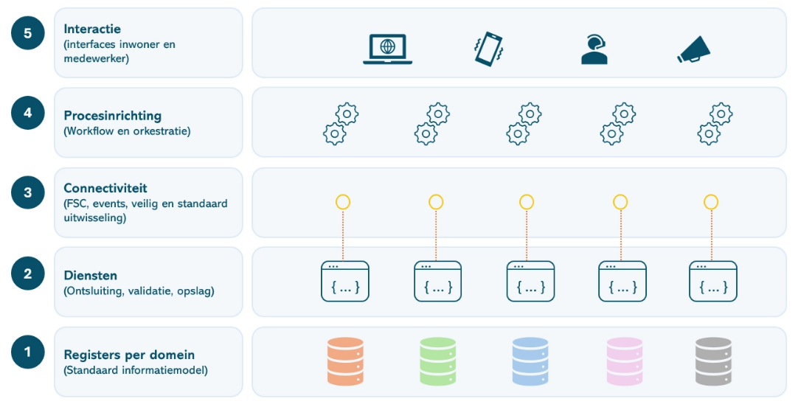

# Applicatiearchitectuur

| **Compact:** |
|----|
| Hier wordt het allemaal wat technischer. De applicatiearchitectuur vertaalt de eerdere uitgangspunten naar services, API’s, events en componenten. Het vijf-lagenmodel onderscheidt interactie, proces, connectiviteit, diensten en gegevens. Functionaliteit wordt zoveel mogelijk opgebouwd uit zelfstandige, herbruikbare componenten met een duidelijke verantwoordelijkheid. De kernboodschap: geen monolithische alleskunner die tegelijk je registratie, proces, formulier, API en koffieautomaat wil zijn, maar kleinere bouwstenen die netjes samenwerken. |

## Inleiding

Binnen TOGAF beschrijft de applicatiearchitectuur hoe de bedrijfs-,
informatie- en data-architectuur worden gerealiseerd met behulp van
samenwerkende softwarecomponenten. Waar de voorgaande hoofdstukken
beschrijven **wat** de dienstverlening is, **welke** informatie wordt
beheerd en **hoe** gegevens logisch zijn georganiseerd, beschrijft dit
hoofdstuk hoe deze uitgangspunten worden geïmplementeerd in applicaties,
services en interfaces.

Dit hoofdstuk vormt daarmee de concrete uitwerking van de
architectuurprincipes:

- [**Principe: Architectuurgedreven
  vernieuwing**](#principe-architectuurgedreven-vernieuwing)

- [**Principe: (Micro)
  servicearchitectuur**](#principe-micro-servicearchitectuur)

- [**Principe: Expliciete
  bedrijfslogica**](#principe-expliciete-bedrijfslogica)

- [**Principe: Generiek vóór
  specifiek**](#principe-generiek-vóór-specifiek)

- [**Principe: Beleidsruimte als
  basis**](#principe-beleidsruimte-als-basis)

- [**Principe: Hergebruik**](#principe-hergebruik)

Binnen het Platform Dienstverlening is de applicatiearchitectuur
gebaseerd op een componentgebaseerde opzet. Functionaliteit wordt
gerealiseerd als zelfstandige, herbruikbare componenten met een
duidelijke verantwoordelijkheid, die via gestandaardiseerde API's en
events samenwerken. Hierdoor kunnen onderdelen onafhankelijk worden
ontwikkeld, vervangen en doorontwikkeld, terwijl de samenhang van het
platform behouden blijft.

Dit hoofdstuk beschrijft de applicatiearchitectuur op hoofdlijnen en
werkt de verschillende applicatielagen en hun onderlinge samenhang uit.

## Het Vijf-lagen model

Conform de [Informatiekundige visie Common
Ground](https://www.gemmaonline.nl/wiki/Thema-architectuur_Common_Ground)
maakt de applicatie-architectuur van het Platform onderscheid tussen:

- **Interactie** (gebruikersinterface)

- **Proces** (afhandeling van het proces)

- **Connectiviteit** (aansluiting van afnemers en diensten)

- **Diensten** (API’s)

- **Gegevens** (registraties).

  

  Deze lagen, hun betekenis en betrokken (applicatie)capabilities worden
  in [Architectural Building Blocks (ABB’s) en
  clusters](#architectural-building-blocks-abbs-en-clusters) verder
  toegelicht.

#### Interpretatie van het lagenmodel

Het lagenmodel geeft op hoofdlijnen de verdeling van
verantwoordelijkheden binnen de applicatiearchitectuur weer. Het is een
**conceptueel architectuurmodel** en geen letterlijk implementatiemodel.
De plaats van een component in een laag geeft aan **waar de primaire
verantwoordelijkheid ligt**, niet dat de component uitsluitend
functionaliteit uit die laag bevat.

In de praktijk bevatten componenten ook ondersteunende functionaliteit
uit andere lagen. Zo kent een registratie bijvoorbeeld validaties en
beperkte proceslogica, beschikt een integratievoorziening vaak over een
beheerinterface en bevatten processervices gegevens of configuratie die
noodzakelijk zijn voor hun werking. Deze functies zijn echter
ondersteunend; de component wordt ingedeeld op basis van zijn dominante
verantwoordelijkheid binnen de architectuur. Bij de ontwikkeling van
nieuwe componenten geldt daarom het uitgangspunt dat functionaliteit
wordt geplaatst in de laag waarvoor zij primair verantwoordelijk is.

## Architectuurstijl: (micro)services

Binnen de (historische) ontwikkeling van applicatie-architecturen zijn
verschillende stijlen te onderscheiden:

- **Monolithische architectuur:** Eén codebase en deployment. Eenvoudig
  te starten, maar beperkt schaalbaar en lastig aanpasbaar.

- **Modulaire monoliet:** Logische scheiding binnen één applicatie.
  Beter gestructureerd, maar nog steeds één deploybare eenheid.

- **Service-georiënteerde architectuur (SOA):** Services met centrale
  orkestratie (bijv. via ESB). Flexibeler, maar vaak complex door
  centrale afhankelijkheden.

<!-- -->

- **Microservice-architectuur:** Kleine, zelfstandige services die
  onafhankelijk deploybaar zijn en gericht zijn op wendbaarheid en
  schaalbaarheid.

Er bestaan verschillende manieren om de architectuur van het Platform
Dienstverlening te beschrijven, zoals *microservice-architectuur* of
*composable architecture*. Ook wordt soms gesproken over een
*distributed monolith* wanneer de technische ontkoppeling onvoldoende is
gerealiseerd. Binnen deze architectuur wordt bewust gekozen voor de term
(**micro)service-architectuur** als referentiemodel voor de verdere
uitwerking, omdat deze aansluit bij de eisen rondom flexibiliteit,
schaalbaarheid en snelle aanpasbaarheid (bijv. door beveiligingseisen).

### Kenmerken van services

Binnen het platform vormen services de centrale bouwstenen. Dit is de
realisatie van het [**Principe: (Micro)
servicearchitectuur**](#principe-micro-servicearchitectuur). Een service
wordt gekenmerkt door:

- **Single Responsibility Boundary:** Een service ondersteunt één
  duidelijke business capability

- **Autonomie:** Services zijn zelfstandig te ontwikkelen, testen en
  deployen

### Afbakening van services

De grootte en grenzen van services worden bepaald aan de hand van
meerdere perspectieven:

- **Domain-Driven Design (bounded contexts):** Diensten worden gebaseerd
  op betekenisvolle domeinen

- **Business capabilities:** Wat de dienstverlening moet leveren vormt
  de basis

- **Performance en belasting:** Verschillende loadprofielen → aparte
  services

- **Foutisolatie:** Kritische onderdelen worden gescheiden.

De set van services binnen het platform is niet statisch. Op basis van
nieuwe inzichten en gebruik kan de architectuur worden aangepast, door
het:

- Samenvoegen van services

- Opsplitsen van services en

- Introduceren van nieuwe services.

Dit maakt onderdeel uit van het architecturaal continuüm, waarin de
architectuur meegroeit met de organisatie en het platform.

### Criteria voor services

Elke service in het platform moet voldoen aan de volgende criteria:

- **Single purpose (één duidelijke verantwoordelijkheid) -** Elke
  service heeft één afgebakende taak of business capability. Dit
  voorkomt dat logica onnodig wordt verweven met andere functionaliteit

- **Hergebruik binnen het platform -** Services interacteren met
  bestaande services in het landschap en introduceren geen reeds
  aanwezige functionaliteit. Dit voorkomt duplicatie, bevordert
  consistent gedrag, faciliteert dat je kunt standaardiseren op
  services/capabilities en verlaagt beheer- en onderhoudslast binnen het
  platform.

- **Aansluiten op het platform -** Services sluiten volledig aan op de
  applicatie infrastructuur (waaronder technische notificaties, logging,
  authorisatie, identificatie)

- De [Patronen en API-specificaties](#toegepaste-patronen) worden
  gevolgd.

### Voordelen van de gekozen architectuur

De microservice-architectuur biedt de volgende voordelen:

- Single purpose (één duidelijke verantwoordelijkheid): Elke service
  heeft een afgebakende taak

- Technologische flexibiliteit: Teams kiezen zelf technologie per
  service

- Onafhankelijke deployability: Services kunnen los uitgerold worden

- Schaalbaarheid: Alleen zwaar belaste onderdelen worden opgeschaald

- Veerkracht en foutisolatie: Storingen blijven beperkt tot één service

- Beheersbare codebases: Kleinere systemen zijn beter te begrijpen

- Autonome teams: Teams zijn eigenaar van hun service

- Continue levering (CI/CD): Snelle en veilige releases

- Experimenteerbaarheid: Nieuwe functionaliteit kan geïsoleerd
  ontwikkeld worden.

De gekozen architectuur stelt ook eisen aan de organisatie en techniek:

- Sterke automatisering: CI/CD, testing en monitoring zijn essentieel

- Volwassen DevOps-teams: Teams zijn verantwoordelijk voor de volledige
  lifecycle

- Gestandaardiseerde interfaces: API’s en events moeten uniform zijn

- Observability: Logging, monitoring en tracing zijn noodzakelijk

- Governance op architectuurprincipes: Zonder kaders ontstaat
  fragmentatie.

## Samenwerking tussen services

Binnen een microservice-architectuur is de manier waarop services
samenwerken een cruciale ontwerpkeuze. De architectuur schrijft niet één
mechanisme voor, maar een set van gestandaardiseerde interactiepatronen,
die afhankelijk van de situatie worden toegepast.

### Basisvormen van samenwerking

Er zijn drie hoofdvormen van interactie tussen services:

- **Synchroon (request/response)**

  - Services communiceren direct via API’s en wachten op een antwoord.
    Toepasbaar bij:

    - directe validatie en

    - opvragen van actuele gegevens.

<!-- -->

- **Asynchroon (event-driven)**

  - Services communiceren via notificaties, berichten of events, zonder
    directe afhankelijkheid. Toepasbaar bij:

    - procesafhandeling

    - ketens van verwerking en

    - losgekoppelde samenwerking.

<!-- -->

- **API-compositie**

  - Meerdere services worden gecombineerd tot één samenhangende
    response. Toepasbaar bij:

    - Gebruikersinterfaces en

    - integrale beelden

  - Belangrijke patronen hierbij zijn:

    - API Gateway (centrale toegang, routing, beveiliging) en

    - Backend-for-Frontend (BFF) (specifieke API per frontend).

Binnen het Platform Dienstverlening ligt de nadruk op asynchrone,
eventgedreven samenwerking, aangevuld met synchrone en
compositiepatronen waar nodig.

### Toegepaste patronen binnen het platform

Binnen het platform worden verschillende patronen gecombineerd:

- Event-driven: Een service registreert data en publiceert een
  notificatie; andere services reageren hierop (bijvoorbeeld het
  Verzoekenpatroon)

- Request/response interacties: Voor directe interacties tussen services
  (bijv. GZAC ↔ OpenZaak)

- Compositiepatronen (BFF / aggregatie): Voor het samenstellen van
  gegevens voor gebruikers of systemen (bijv. IKO - Integraal Klant en
  Objectbeeld).

Deze combinatie zorgt voor:

- Losse koppeling

- Schaalbaarheid

- Flexibiliteit in procesinrichting

Net als bij services zelf zijn interactiepatronen niet statisch. Het
kiezen en ontwikkelen van patronen maakt onderdeel uit van het
architecturaal continuüm, waarbij de samenwerking tussen services wordt
verbeterd op basis van praktijkervaring. De concrete toepassing van
patronen in betekenisvolle orkestratie wordt beschreven in [Toegepaste
patronen](#toegepaste-patronen).

## Overzicht architecturale stijl

De applicatiearchitectuur van het Platform Dienstverlening is gebaseerd
op een samenhangend ecosysteem van kleine, zelfstandige en herbruikbare
services. Door functionaliteit op te delen in duidelijk afgebakende
verantwoordelijkheden, generieke voorzieningen te hergebruiken en
gestandaardiseerde interactiepatronen toe te passen, ontstaat een
wendbaar en schaalbaar platform dat zich geleidelijk kan ontwikkelen. De
precieze invulling van individuele services zal daarbij in de tijd
veranderen; de architectuurprincipes en verantwoordelijkheidsverdeling
blijven leidend.

Om deze samenhang duurzaam te borgen, is een gemeenschappelijke
beschrijving van applicatiefuncties nodig die onafhankelijk is van
concrete softwareproducten. Daarom wordt binnen het Platform
Dienstverlening gewerkt met logische bouwstenen die de functionele
verantwoordelijkheden binnen de applicatiearchitectuur beschrijven en
als referentie dienen voor de ontwikkeling, selectie en samenstelling
van softwarecomponenten: building blocks.

## Building blocks (architectureel en solution)

Binnen (enterprise) architectuur wordt onderscheid gemaakt tussen
**Architectural Building Blocks (ABB’s)** en **Solution Building Blocks
(SBB’s)**. Dit is een generiek architectuurprincipe dat ook binnen het
Platform Dienstverlening wordt toegepast.

Een **Architectural Building Block (ABB)** beschrijft een generieke of
abstracte specificatie van functionaliteit. ABB’s definiëren de
benodigde capabilities in termen van business-, informatie-, applicatie-
en technologie-architectuur. Binnen dit kader wordt functionaliteit
primair uitgedrukt als een **BusinessService**: een logisch afgebakende
dienst die waarde levert aan de business, onafhankelijk van de
onderliggende implementatie.

De concrete invulling van deze BusinessServices vindt plaats in
**Solution Building Blocks (SBB’s)**. Dit zijn de gerealiseerde
componenten binnen het platform, bestaande uit softwarecomponenten en/of
configuraties die gezamenlijk de BusinessService implementeren.

ABB’s worden binnen het platform op twee niveaus toegepast:

1.  **Op het niveau van softwarecomponenten (services)**

- ABB’s beschrijven hier de BusinessService en de bijbehorende
  functionele en architectonische eisen.

- SBB’s zijn de concrete implementaties hiervan in de vorm van services
  (bijv. registraties, proces- of integratieservices).

2.  **Op het niveau van configuratie binnen componenten**

- ABB’s beschrijven hier de functionele invulling van een
  BusinessService binnen een component.

- SBB’s zijn de concrete configuraties, zoals:

  - Formulieren

  - BPMN-processen

  - Business rules

  - Gegevensmodellen.

Deze configuraties vormen geen zelfstandige softwarecomponenten, maar
zijn een invulling van functionaliteit binnen bestaande services.

Door dit onderscheid ontstaat een heldere scheiding tussen:

- BusinessServices (wat wordt geleverd)

- Softwarecomponenten (waar dit wordt uitgevoerd)

- Configuratie (hoe dit concreet wordt ingericht binnen componenten)

Hiermee wordt geborgd dat:

- Architectuurprincipes consistent worden toegepast

- Functionaliteit herbruikbaar en vervangbaar blijft

- Implementaties flexibel kunnen evolueren.

ABB’s en SBB’s vormen daarmee de schakel tussen architectuur
(richtinggevend) en realisatie (concreet en configureerbaar).

### Voorbeeld – Aanvragen van een uitkering

De BusinessService **"Beoordelen uitkeringsaanvraag"** is een
**Architectural Building Block (ABB)**. Deze beschrijft wat de
dienstverlening moet leveren: beoordelen van een aanvraag, vastleggen
van gegevens, toepassen van beslisregels en informeren van de inwoner.

De concrete invulling bestaat uit **Solution Building Blocks (SBB's)**:

- **Niveau 1: Softwarecomponenten:** GZAC, OpenZaak, OpenKlant, DMN
  Engine en Open Formulieren.

- **Niveau 2: Configuratie:** het aanvraagformulier, het BPMN-proces, de
  DMN-beslisregels, zaaktype, producttype en validatieregels.

Hierdoor blijft de BusinessService hetzelfde, terwijl de
softwarecomponenten of configuratie in de tijd kunnen veranderen zonder
de architectuur aan te passen.

## Architectural Building Blocks (ABB’s) en clusters

Architectural Building Blocks (ABB's) beschrijven generieke capabilities
binnen het Platform Dienstverlening. Ze moeten tenslotte invulling geven
aan de hele gemeentelijke dienstverlening. Een uitgangspunt voor de
gemeentelijke processen zijn GEMMA’s applicatieservices. GEMMA biedt een
overzicht van
[referentiecomponenten](https://www.gemmaonline.nl/wiki/Overzicht_alle_referentiecomponenten)
en de bijbehorende services die gerealiseerd kunnen worden. Waar
GEMMA‑services vooral concrete softwarefuncties beschrijven, richten
ABB’s zich op de onderliggende capabilities die in *alle* gemeentelijke
domeinen terugkomen.

### ABB’s per functionele laag

De architectuur maakt het mogelijk om generiek te ontwerpen en
domeinoverstijgend te sturen. We clusteren functionaliteiten globaal op
het vijflagenmodel.

#### Laag 5 – Interactie

- **Functionaliteit:** Portalen, formulieren, klant- en objectbeelden,
  medewerkerinterfaces, en beheerinterfaces.

- **Doel:** Faciliteren van de interactie tussen inwoners, ondernemers,
  medewerkers en het platform.

- **Functionele eisen:**

  - Ondersteunt verschillende gebruikersgroepen en kanalen.

  - Verzamelt invoer en presenteert informatie, status en voortgang.

  - Begeleidt gebruikers bij het uitvoeren van taken en aanvragen.

  - Maakt gebruik van onderliggende proces- en dataservices, zonder deze
    te dupliceren.

#### Laag 4 – Procesinrichting

- **Functionaliteit:** Workflow, procesorkestratie, taakafhandeling,
  casusregie, besluitvorming en business rules.

- **Doel:** Uitvoeren, coördineren en bewaken van gemeentelijke
  dienstverlening.

- **Functionele eisen:**

  - Orkestreert processtappen en workflow.

  - Past wet- en regelgeving en businessregels toe.

  - Ondersteunt besluitvorming, taakafhandeling en casusregie.

  - Bewaakt voortgang en samenhang van processen.

  - Maakt uitsluitend gebruik van gegevens uit de registraties en
    dataservices.

#### Laag 3 – Connectiviteit

- **Functionaliteit**: API's, FSC, events, notificaties, omnichannel
  communicatie.

- **Doel**: Verbinden van services en realiseren van veilige,
  gestandaardiseerde gegevensuitwisseling.

- **Functionele eisen:**

  - Ondersteunt synchrone en asynchrone communicatie.

  - Verzorgt notificaties, events en berichtuitwisseling.

  - Faciliteert federatieve gegevensuitwisseling en integratie.

  - Borgt interoperabiliteit door gebruik van open standaarden.

#### Laag 2 – Diensten

- **Functionaliteit**: Dataservices voor klanten, zaken, producten,
  verzoeken, berichten, taken en referentiegegevens.

- **Doel**: Valideren, ontsluiten en beschikbaar stellen van gegevens en
  businessfunctionaliteit.

- **Functionele eisen:**

  - Valideert en verwerkt mutaties op gegevens.

  - Biedt gestandaardiseerde API's voor raadpleging en mutatie.

  - Voorkomt duplicatie van gegevens en businesslogica.

  - Ontsluit gegevens onafhankelijk van de onderliggende registratie.

#### Laag 1 – Registraties

- **Functionaliteit**: Klant-, zaak-, product- en domeinregistraties,
  referentielijsten en externe bronnen.

- **Doel**: Duurzaam vastleggen en beheren van gegevens als bron voor
  het platform.

- **Functionele eisen:**

  - Vormen de bron voor de aan hen toegewezen gegevens.

  - Beheren gegevens, relaties, historie en metadata.

  - Bieden een consistente en herleidbare gegevensbasis.

  - Stellen gegevens uitsluitend beschikbaar via gestandaardiseerde
    dataservices.

### Crossfunctionele Architectural Building Blocks (ABB’s) 

Naast de vijf lagen kent het platform een aantal doorsnijdende
Architectural Building Blocks. Deze leveren generieke functionaliteit
die door meerdere lagen wordt gebruikt en zijn daarom niet aan één
specifieke laag toe te wijzen. Dit gaat om: Identity & Accessmanagement,
Autorisatie, Logging, Auditing, Security,Privacy, Monitoring en
Observability. Deze worden deels in de technische architectuur
gerealiseerd (Haven+) en deels in ABB’s die haaks op het vijflagenmodel
staan.

#### Functionele eisen:

- Borgen authenticatie, autorisatie en beveiliging.

- Verzorgen logging, auditing en observability.

- Ondersteunen duurzame toegankelijkheid, archivering en
  recordmanagement.

- Faciliteren omnichannel communicatie, notificaties en generieke
  platformdiensten.

  

### Specificatie ABB’s niveau 2 

Op niveau 2 worden ABB’s uitgewerkt als configuraties binnen
componenten, waarmee de generieke services uit niveau 1 concreet worden
ingevuld. Het gaat hier om de vertaling van een BusinessService naar
configureerbare elementen zoals formulieren, BPMN-processen, business
rules en gegevensmodellen.

Het is mogelijk deze ABB’s structureel te mappen op de
GEMMA-applicatieservices, zie daarvoor [BIJLAGE - ABB’s GEMMA en
Platform
Dienstverlening](#bijlage---abbs-gemma-en-platform-dienstverlening).

## Solution Building Blocks (SBB’s) en mapping op ABB’s

Solution Building Blocks (SBB’s) vormen de concrete implementatie in het
platform van de generieke capabilities zoals gedefinieerd in de ABB’s
(niveau 1).

Ondanks het uitgangspunt dat er geen functionele dubbelingen zijn, hoeft
de relatie tussen ABB’s en SBB’s niet 1:1 te zijn:

- Één ABB kan door één of meerdere SBB’s worden gerealiseerd
  (bijvoorbeeld bij functionele opsplitsing of specialisatie)

- Één SBB kan meerdere ABB’s realiseren (bijvoorbeeld bij
  platformcomponenten met bredere functionaliteit).

Per cluster en ABB bestaat - op moment van schrijven - de volgende
conceptuele mapping:

#### Laag 5 – Interactie

| **ABB (service die…)** | **Primaire SBB** |
|----|----|
| Gebruikersinteractie via portalen faciliteert | NL Portal |
| Self-service functionaliteit biedt voor inwoners en ondernemers | NL Portal |
| Digitale formulieren aanbiedt en verwerkt | Open Formulieren |
| Geïntegreerde klant- en objectbeelden toont | IKO |
| Procesuitvoering en werkvoorraad visualiseert voor medewerkers | GZAC (UI) |
| Functioneel beheer en configuratie ondersteunt | OpenBeheer |

#### Laag 4 – Procesinrichting

| **ABB (service die…)**             | **Primaire SBB**    |
|------------------------------------|---------------------|
| Procesflows orkestreert en bewaakt | GZAC                |
| Besluitvorming ondersteunt         | GZAC                |
| Business rules beheert en uitvoert | DMN Studio & Engine |
| Werkvoorraad en taken organiseert  | Taak & Workflow     |
| Casus- en procesregie ondersteunt  | GZAC                |

#### 

#### Laag 3 – Connectiviteit

| **ABB (service die…)**                               | **Primaire SBB** |
|------------------------------------------------------|------------------|
| Gegevensuitwisseling tussen organisaties faciliteert | OpenFSC          |
| Notificaties publiceert en distribueert              | OpenNotificaties |
| Omnichannel communicatie verzorgt                    | NotifyNL OMC     |
| Logging, auditing en tracing faciliteert             | Platform         |

#### Laag 2 – Diensten

| **ABB (service die…)**                | **Primaire SBB**      |
|---------------------------------------|-----------------------|
| Klantgegevens valideert en ontsluit   | OpenKlant API         |
| Zaakgegevens valideert en ontsluit    | OpenZaak API          |
| Productgegevens valideert en ontsluit | OpenProduct API       |
| Verzoeken beheert                     | Verzoeken (VTB)       |
| Taken beheert                         | Taken (VTB)           |
| Berichten beheert                     | Berichten (VTB)       |
| Referentiegegevens ontsluit           | Referentielijsten API |
| Generieke objecten ontsluit           | Objects API           |

#### Laag 1 – Registraties

| **ABB (service die…)**                          | **Primaire SBB**        |
|-------------------------------------------------|-------------------------|
| Personen en organisaties registreert            | OpenKlant Registratie   |
| Zaken en procescontext vastlegt                 | OpenZaak Registratie    |
| Producten en diensten registreert               | OpenProduct Registratie |
| Organisaties en medewerkers beheert             | OpenOrganisatie         |
| Domeinspecifieke gegevens beheert               | Domeinregistraties      |
| Verzoeken, taken en berichten duurzaam vastlegt | VTB-registraties        |
| Referentiegegevens beheert                      | Referentielijsten       |

#### Doorsnijdende voorzieningen

| **ABB (service die…)** | **Primaire SBB** |
|----|----|
| Duurzame toegankelijkheid en bewaartermijnen beheert | Registraties, OpenArchiefBeheer |
| Authenticatie en autorisatie verzorgt | Keycloak / Autorisatieservice |
| Monitoring en observability ondersteunt | Platformvoorzieningen |
| Privacy, security en compliance ondersteunt | Platformvoorzieningen |

De SBB’s op niveau 1 staan ook verzameld onder [BIJLAGE - Overzicht
services](#bijlage---overzicht-services). Een voorbeeldmapping:

De bovenstaande mapping maakt inzichtelijk hoe de verschillende
capabilities in de huidige situatie zijn belegd over componenten.
Daarbij valt op dat GZAC een duidelijk zwaartepunt vormt binnen het
procescluster, waar het meerdere ABB’s rondom processturing,
taakafhandeling en besluitvorming realiseert. Dit sluit aan bij het
uitgangspunt dat het onderliggende Operaton-framework modellering biedt
voor een breed scala aan usecases.

Tegelijkertijd is in de praktijk zichtbaar dat GZAC als
interactiecomponent beperkingen kent, bijvoorbeeld op het gebied van
casusregie. Dit leidt tot de ontwikkeling van aanvullende SBB’s en een
verdere specificatie van ABB’s om deze functionaliteit beter en
explicieter te beleggen.

Een vergelijkbare ontwikkeling speelt binnen de Doorsnijdende
voorzieningen, waar op het gebied van eventgedreven architectuur,
autorisatie en logging verdere doorontwikkeling op de roadmap staat.
Deze doorontwikkeling raakt niet alleen de doorsnijdende voorzieningen,
maar ook processervices en de registraties in de gegevenslaag. Deze
mapping is daarmee geen eindbeeld, maar een hulpmiddel om de
architectuur gericht door te ontwikkelen en verantwoordelijkheden verder
te verduidelijken.

#### SBB’s niveau 2

De identificatie en realisatie van SBB’s op niveau 2 (vertaling van een
BusinessService naar configureerbare elementen zoals formulieren,
BPMN-processen, business rules en gegevensmodellen) gebeurt op basis van
businessbehoefte. Zie ook [Samenwerking en uitwisseling
bouwstenen](#samenwerking-en-uitwisseling-bouwstenen).

## Configuratie vs. softwareontwikkeling

Binnen het Platform Dienstverlening is het onderscheid tussen
**configuratie** en **softwareontwikkeling (code)** essentieel voor het
realiseren van hergebruik en beheersbaarheid.

Er wordt onderscheid gemaakt tussen:

- **Configuratie:** Het instellen of aanpassen van bestaande software
  door middel van opties, parameters of instellingen, zonder wijziging
  van de onderliggende broncode

- **Coderen (pro-code):** Het ontwikkelen of aanpassen van broncode om
  nieuwe functionaliteit te realiseren of bestaand gedrag te wijzigen.

#### Voorkeursrichting: configuratie boven maatwerk

Binnen services wordt variatie in processen, gegevens en gedrag bij
voorkeur gerealiseerd via configuratie en als low-code voorzieningen.
Hiermee blijft functionaliteit:

- Consistent met de capabilities van de service

- Eenvoudiger te beheren en te updaten

- Herbruikbaar binnen meerdere implementaties.

Dit volgt het **[Principe: Expliciete
bedrijfslogica](#principe-expliciete-bedrijfslogica):**
Bedrijfsprocessen, beslisregels en gegevens worden als afzonderlijke
architectuurelementen gemodelleerd. Beslisregels worden waar mogelijk
centraal beheerd en herbruikbaar vastgelegd, zodat zij consistent kunnen
worden toegepast in meerdere processen, BusinessServices en kanalen.

Aanvullend geeft configuratie invulling aan het [**Principe:
Beleidsruimte als basis**](#principe-beleidsruimte-als-basis). Door
beleidsregels, termijnen, procesvarianten en andere bestuurlijke keuzes
configureerbaar te maken, kunnen gemeenten hun wettelijke en lokale
beleidsruimte benutten zonder broncode aan te passen. Hierdoor blijft de
voorziening wendbaar bij beleids- en wetswijzigingen, terwijl
tegelijkertijd wordt voorkomen dat technische standaardisatie onbedoeld
normatieve beleidskeuzes afdwingt. Configuratie is daarmee een prima
instrument om variatie tussen gemeenten te ondersteunen binnen een
generieke oplossing.

### Toepassing van beslisregels

Beslisregels worden beschouwd als een zelfstandige capability binnen de
proceslaag van het vijf-lagenmodel. Beslisregels bepalen hoe een besluit
tot stand komt; processen bepalen wanneer een beslissing wordt genomen
en registraties leveren de gegevens waarop de beslissing wordt
gebaseerd.

Het expliciet modelleren van beslisregels draagt bij aan de kern van
Common Ground: transparantie, uitlegbaarheid, herbruikbaarheid en
scheiding van verantwoordelijkheden. Hierdoor kan voor iedere beslissing
worden herleid welke gegevens, regels en processtappen zijn toegepast.
Dit anticipeert o.a. op [RegelRecht: van wet naar digitale
werking](https://regelrecht.rijks.app/).

Beslisregels worden daarom niet in applicatiecode opgenomen wanneer zij
generiek toepasbaar zijn, maar ondergebracht in een centrale
beslisservice.

#### Decision Model and Notation (DMN)

Voor het modelleren van beslisregels wordt gebruikgemaakt van Decision
Model and Notation (DMN), de internationale OMG-standaard voor het
modelleren en uitvoeren van beslislogica.

DMN maakt het mogelijk om:

- Beslisregels begrijpelijk vast te leggen voor beleid, uitvoering en
  IT;

- Beslisregels centraal te beheren en te versioneren;

- Regels meervoudig toe te passen binnen verschillende BusinessServices;

- Besluitvorming reproduceerbaar en uitlegbaar te maken;

- Wijzigingen in wet- en regelgeving door te voeren zonder
  procesmodellen of softwarecomponenten aan te passen.

  Hierdoor ontstaat een duidelijke scheiding:

- BPMN beschrijft de proceslogica;

- DMN beschrijft de beslislogica;

- Registraties leveren de benodigde gegevens;

- BusinessServices orkestreren de samenwerking.

#### Functionele eisen

De beslisvoorziening binnen het Platform Dienstverlening voldoet
minimaal aan de volgende uitgangspunten:

- Beslisregels worden vastgelegd conform de DMN-standaard;

- Beslisregels zijn als zelfstandige service (Rules as a Service) via
  API's beschikbaar;

- Beslisregels zijn versieerbaar en historisch reproduceerbaar;

- Beslisregels zijn herbruikbaar door meerdere processen en services;

- Beslisregels zijn begrijpelijk voor domeinspecialisten en juristen en
  niet uitsluitend voor ontwikkelaars;

- Beslisregels kunnen onafhankelijk van applicaties worden beheerd en
  gepubliceerd;

- Uitgevoerde beslissingen zijn herleidbaar naar de gebruikte regelset
  en versie;

- De voorziening sluit aan op de generieke platformvoorzieningen voor
  autorisatie, logging en deployment.

#### Toepassing binnen het Platform

De centrale beslisservice kan door uiteenlopende services binnen het
Platform Dienstverlening worden aangeroepen, bijvoorbeeld voor:

- Het bepalen van de vervolgstap in een proces;

- Het toetsen van wettelijke voorwaarden;

- Het uitvoeren van gemeentelijke beleidsregels;

- Het berekenen van bedragen of tarieven;

- Het bepalen van rechten of verplichtingen;

- Het aansturen van dynamische formulieren en gebruikersinterfaces.

  Hierdoor ontstaat één centrale plaats waar beslislogica wordt beheerd,
  terwijl processen, registraties en gebruikersinterfaces hiervan
  onafhankelijk kunnen evolueren.

### Toepassing van ‘maatwerk’ (pro-code)

Wanneer configuratie onvoldoende is en maatwerk noodzakelijk blijkt,
wordt eerst beoordeeld of de functionaliteit generiek toepasbaar is en
herbruikbaar is binnen meerdere gemeenten of services. Op basis daarvan
wordt bepaald of de oplossing wordt gerealiseerd als:

- Uitbreiding van een bestaande service

- Nieuwe service of

- Plugin.

#### Plugins als extensiemechanisme

Plugins vormen een gecontroleerd mechanisme om functionaliteit uit te
breiden zonder de kern van een service aan te passen.

Een plugin is geschikt wanneer deze:

- **Functioneel afgebakend** is (klein tot middelgroot en gericht op één
  specifieke uitbreiding

- **Beperkt complex** is (aansluit op bestaande extensiepunten)

- **Herbruikbaar** is (toepasbaar binnen meerdere implementaties)

- **Beperkte impact op updates** heeft (onafhankelijk van de kern te
  ontwikkelen en te deployen).

Voor plugins geldt dat een **helder contract** noodzakelijk is, waarin
de interactie tussen plugin en service formeel is vastgelegd. Dit maakt
het mogelijk om:

- Plugins onafhankelijk te ontwikkelen

- Updates gecontroleerd door te voeren

- Functionaliteit te vervangen zonder impact op de kern.

## Architectuur van registraties

Registraties vormen de basis van de gegevensvoorziening binnen het
Platform Dienstverlening. Een registratie is een zelfstandige
softwarecomponent die verantwoordelijk is voor het duurzaam vastleggen,
beheren en beschikbaar stellen van gegevens over een afgebakend domein
of objecttype.

Registraties realiseren de informatiekundige uitgangspunten uit de
informatie- en data-architectuur, waaronder **data bij de bron**,
**data-autonomie** en **duurzame toegankelijkheid**. Zij vormen de
authentieke bron voor de gegevens waarvoor zij verantwoordelijk zijn en
zijn onafhankelijk van de processen waarin deze gegevens worden
gebruikt.

Binnen de applicatiearchitectuur bestaat een registratie uit twee
logisch gescheiden onderdelen:

- De **registratie**, waarin gegevens duurzaam worden beheerd;

- De **dataservice (API)** waarmee deze gegevens gestandaardiseerd
  beschikbaar worden gesteld.

  

Processen communiceren uitsluitend met de dataservice; de registratie
blijft verantwoordelijk voor de kwaliteit, integriteit en historie van
de gegevens.

### Referentiearchitectuur van een registratie

Hoewel registraties verschillende gegevens beheren, volgen zij binnen
het Platform Dienstverlening dezelfde referentiearchitectuur. Een
registratie is een zelfstandige softwarecomponent die bestaat uit een
**registratie** (laag 1) en een **dataservice** (laag 2).

De **registratie** bestaat uit:

- **State**

  - De actuele en historische toestand van de geregistreerde gegevens.
    Iedere wijziging resulteert in een nieuwe state, waardoor zowel de
    actuele situatie als de formele en materiële historie behouden
    blijven.

- **Events**

  - Iedere betekenisvolle wijziging wordt vastgelegd als gebeurtenis.
    Events beschrijven welke handeling heeft plaatsgevonden en vormen de
    basis voor notificaties, auditing en herleidbaarheid.

- **Metadata**

  - Bij iedere registratie en gebeurtenis wordt context vastgelegd,
    zoals bron, actor, tijdstip, aanleiding, doelbinding en
    betrouwbaarheid. Hiermee wordt invulling gegeven aan
    verwerkingsverantwoording en de beoordeling van de kwaliteit en
    herkomst van gegevens.

    De **dataservice (API)** vormt de gestandaardiseerde toegang tot de
    registratie. Naast het raadplegen van gegevens biedt zij
    handelingsgedreven API-acties voor betekenisvolle mutaties op de
    registratie. Iedere API-actie valideert de handeling, autoriseert de
    uitvoering, legt de bijbehorende gebeurtenis en metadata vast,
    creëert indien nodig een nieuwe state en publiceert notificaties. De
    architectuur van deze API's wordt verder uitgewerkt in [Architectuur
    van API's](#architectuur-van-apis).

    

### Functionele eisen aan registraties

Om gegevens duurzaam, betrouwbaar en herbruikbaar beschikbaar te
stellen, moeten alle registraties binnen het Platform Dienstverlening
aan dezelfde functionele eisen voldoen:

#### Enkelvoudige bron en standaardisatie

Registraties:

- Vormen de enige bron voor de gegevens waarvoor zij verantwoordelijk
  zijn.

- Leggen gegevens eenduidig en gestandaardiseerd vast.

- Voorzien ieder object van een unieke identiteit.

#### Betrouwbaarheid

Registraties:

- Leggen iedere wijziging duurzaam vast.

- Ondersteunen volledige historie en reproduceerbaarheid.

- Maken de herkomst van gegevens inzichtelijk.

- Borgen de integriteit en consistentie van gegevens.

#### Herbruikbaarheid

Registraties:

- Ondersteunen meerdere BusinessServices.

- Zijn onafhankelijk van processen en gebruikersinterfaces.

- Voorkomen duplicatie van gegevens.

- Stellen gegevens op uniforme wijze beschikbaar.

#### Interoperabiliteit

Registraties moeten:

- Beschikken over één generieke en gestandaardiseerde aansluitingsvorm

- Zowel protocollair (bijv. API-standaarden, eventformaten) als qua type
  aanroep (raadplegen, muteren, events) uniform zijn

- Volgen de vastgestelde semantische en technische standaarden van het
  platform.

- Aansluiten op de integratiestandaarden van het platform (o.a. via
  FSC), zodat services in de proces- en interactielaag (laag 4/5) zonder
  maatwerk kunnen koppelen.

### Betrouwbare registratie

Een registratie moet niet alleen gegevens opslaan, maar ook aantoonbaar
kunnen verantwoorden wat is geregistreerd, wanneer, door wie, op basis
van welke grondslag en hoe een registratie zich in de tijd heeft
ontwikkeld. Betrouwbare registraties zijn essentieel voor rechtmatige
besluitvorming, transparante dienstverlening, toezicht, auditing en het
duurzaam gebruik van gegevens binnen de overheid.

Het project [**Uit Betrouwbare Bron
(UBB)**](https://uitbetrouwbarebron.rijks.app/handreiking-respec/)
beschrijft de eigenschappen waaraan overheidsregistraties moeten voldoen
om als betrouwbare bron te kunnen functioneren. UBB biedt hiervoor een
referentiemodel met uitgangspunten voor onder meer historie,
herleidbaarheid, verwerkingsverantwoording, betrouwbaarheid en de
context van registraties.

De registratiearchitectuur sluit aan bij deze uitgangspunten. De
verschillende UBB-concepten worden niet als afzonderlijke administraties
geïmplementeerd, maar gerealiseerd door de samenhang tussen
**handelingsgedreven API-acties**, **events**, **states** en
**metadata**.

#### Handelingsgedreven API-acties

Mutaties op een registratie vinden plaats via expliciete, betekenisvolle
API-acties. Iedere handeling resulteert in een gecontroleerde wijziging
van de registratie en legt de bijbehorende gebeurtenis en metadata vast.

Voorbeelden van gestandaardiseerde handelingen zijn:

- **Registreren** (aanmaken van een nieuw object);

- **Wijzigen** (actualiseren van gegevens);

- **Corrigeren** (herstellen van onjuiste gegevens zonder verlies van
  historie);

- **Herzien** (herstellen van één of meer historische states);

- **Ongedaan maken** (terugdraaien van een eerder uitgevoerde
  handeling);

- **Archiveren** (overbrengen naar een e-depot of vernietiging).

Deze API-acties vormen de technische invulling van betekenisvolle
domeinhandelingen en sluiten aan op de handelingsgedreven
API-architectuur zoals beschreven in [Architectuur van
API's](#architectuur-van-apis).

#### Historie en reproduceerbaarheid

Doordat iedere wijziging resulteert in een nieuwe state en een
bijbehorend event, kunnen historische situaties volledig worden
gereconstrueerd. Hiermee wordt inzichtelijk welke gegevens op een
bepaald moment geldig waren en welke handelingen daartoe hebben geleid.

#### Verwerkingsverantwoording

Iedere wijziging legt vast:

- Welke handeling is uitgevoerd;

- Welke gegevens zijn gewijzigd;

- Door welke actor;

- Op welk moment;

- Op basis van welke aanleiding en grondslag.

#### Betrouwbaarheid en herkomst

Metadata leggen aanvullende informatie vast over de kwaliteit en
herkomst van gegevens, waaronder:

- De bron.

- De onderzoekstatus.

- De betrouwbaarheid of het zekerheidsniveau.

- De aanleiding van registratie.

Hierdoor kan niet alleen worden vastgesteld *wat* is geregistreerd, maar
ook *hoe betrouwbaar* die informatie op een bepaald moment werd geacht.

#### Leveringen en notificaties

Gegevens worden beschikbaar gesteld via gestandaardiseerde dataservices
en notificaties. Leveringen zijn projecties op de onderliggende
registratie; de registratie houdt daarom geen afzonderlijke
leveringenadministratie bij. Hierdoor kunnen dezelfde gegevens vanuit
verschillende perspectieven worden ontsloten zonder duplicatie van
informatie.

### Datamodelleringseisen

Een betrouwbare registratie begint bij een eenduidig informatiemodel.
Alleen wanneer objecten, eigenschappen en relaties op een consistente
wijze zijn gemodelleerd, kunnen gegevens betrouwbaar worden
uitgewisseld, hergebruikt en geïnterpreteerd door verschillende
processen, applicaties en organisaties. Datamodellering vormt daarmee de
basis voor interoperabiliteit, semantische consistentie en duurzame
gegevensuitwisseling.

Binnen het Platform Dienstverlening wordt waar mogelijk aangesloten op
het [**Metamodel Informatie Modellering
(MIM)**](https://docs.geostandaarden.nl/mim/mim/), de landelijke
standaard voor het modelleren van informatiemodellen binnen de overheid.
MIM biedt een uniforme manier om objecttypen, attributen, relaties,
begrippen en regels vast te leggen, waardoor informatiemodellen
onderling vergelijkbaar, uitwisselbaar en herbruikbaar worden.

Voor elke registratie moet een datamodel worden opgesteld dat zich
conformeert aan het MIM**:**

- Het informatiemodel beschrijft primair de werkelijkheid (objecten,
  eigenschappen en relaties) en niet de technische implementatie.
  Technische structuren zoals tabellen, JSON of API’s zijn een afgeleide
  van dit model.

<!-- -->

- Data wordt gemodelleerd in termen van objecttypen, attribuutsoorten en
  relaties. Data-objecten in registraties corresponderen met
  objecttypen; attributen en relaties worden expliciet en betekenisvol
  vastgelegd.

- Relaties tussen objecten worden expliciet gemodelleerd als onderdeel
  van het informatiemodel en niet alleen impliciet via technische
  koppelingen zoals foreign keys.

- Alle modelelementen (objecttypen, attributen, relaties) hebben een
  eenduidige naam en een formele definitie. Deze definities zijn leidend
  voor de interpretatie van de gegevens.

- Het datamodel wordt uitgewerkt op meerdere niveaus:

  - Een conceptueel model (betekenis en samenhang)

  - Een logisch model (structuur van gegevens)

  <!-- -->

  - Een fysiek/technisch datamodel (implementatie).

Modellering start op conceptueel niveau en wordt daarna pas technisch
uitgewerkt.

- De **semantiek (betekenis van begrippen)** wordt expliciet vastgelegd
  en is niet alleen af te leiden uit veldnamen of technische structuren.
  Waar mogelijk wordt aangesloten op een begrippenkader.

- **Constraints en validatieregels** maken onderdeel uit van het
  datamodel. Dit betreft zowel structurele regels (zoals cardinaliteit
  en verplichtheid) als inhoudelijke regels. Deze worden niet
  uitsluitend in applicatielogica geïmplementeerd.

- Het datamodel is **technologie-onafhankelijk opgesteld**. Keuzes voor
  databases, datastructuren of uitwisselingsformaten beïnvloeden het
  model niet, maar volgen eruit.

- Het model is ingericht op **interoperabiliteit en herbruikbaarheid**.
  Dit betekent dat het model begrijpelijk en toepasbaar moet zijn buiten
  de context van één specifieke registratie of implementatie.

- Het datamodel moet **zelfstandig interpreteerbaar** zijn, zonder
  afhankelijkheid van kennis van de technische implementatie of
  applicatielogica.

Deze uitgangspunten zorgen ervoor dat datamodellen binnen registraties
consistent, uitwisselbaar en duurzaam toepasbaar zijn binnen het
Platform.

## Architectuur van API's

API's vormen de gestandaardiseerde contractlaag tussen services binnen
het Platform Dienstverlening. Zij bepalen hoe gegevens en
functionaliteit beschikbaar worden gesteld aan processen,
gebruikersinterfaces en externe afnemers.

### Typen API's

Binnen de literatuur worden verschillende typen API's onderscheiden. De
terminologie verschilt enigszins tussen leveranciers en
architectuurmethoden, maar de gehanteerde indeling is grotendeels
vergelijkbaar. Binnen het Platform Dienstverlening worden de volgende
typen onderscheiden.

- **System API**

  - Een System API ontsluit één registratie of bronvoorziening. Zij
    vormt de gestandaardiseerde toegang tot gegevens binnen één
    afgebakend domein.

  - Binnen deze architectuur worden twee varianten onderscheiden:

    - CRUD API's;

    - Handelingsgedreven API's.

- **Process API**

  - Een Process API combineert meerdere bronnen of registraties om
    processtappen of samengestelde gegevens aan te bieden.

  - Binnen het Platform Dienstverlening wordt deze architectuurstijl
    niet toegepast. Procesorkestratie behoort tot de proceslaag
    (BusinessServices, BPMN en DMN) en niet tot de API-laag. Hierdoor
    blijft de scheiding tussen data, handelingen en processen behouden.

- **Experience API**

  - Een Experience API presenteert gegevens in een vorm die aansluit op
    een specifiek kanaal of gebruikersgroep. Zij combineert bestaande
    API's zonder eigenaar te worden van gegevens of proceslogica.

  - Er is – vooralsnog – geen usecase voor experience API’s op
    registraties; via IKO (Integraal Klant- en Objectbeeld) kan via de
    BFF wel een experience-API opgebouwd worden.

### Handelingsgedreven API's

Het Platform Dienstverlening kiest voor **handelingsgedreven API's** als
standaard voor mutaties op registraties. Waar traditionele CRUD-API's
zich richten op technische operaties (*Create*, *Read*, *Update*,
*Delete*), beschrijven handelingsgedreven API's expliciet de
betekenisvolle handeling die binnen het domein wordt uitgevoerd.

Voorbeelden zijn:

- Registreer contactmoment

- Start zaak

- Publiceer document

- Sluit zaak

Hierdoor sluit het contract van de API aan op de taal van de business en
niet op de interne structuur van het datamodel. Deze architectuurkeuze
ondersteunt meerdere uitgangspunten van het Platform Dienstverlening.
Handelingsgedreven API's:

- Maken de businessintentie expliciet.

- Centraliseren validaties, statustransities en businessregels binnen
  één handeling.

- Verminderen het aantal technische interacties tussen afnemer en
  platform.

- Ondersteunen fijnmazige autorisatie op betekenisvolle handelingen.

- Sluiten direct aan op BusinessServices uit de bedrijfsarchitectuur.

- Leveren betere auditbaarheid en verwerkingsverantwoording op.

# Logging

| **Compact:** |
|----|
| Dit hoofdstuk beschrijft de uitgangspunten voor logging en observability binnen het Platform Dienstverlening. Logging moet helpen om systemen, gebeurtenissen en ketens te begrijpen, fouten te vinden en beheer en toezicht te ondersteunen. Het gaat dus niet om zoveel mogelijk logregels verzamelen, maar om voldoende informatie om te kunnen reconstrueren wat er is gebeurd. |

Logging is een essentieel onderdeel van de kwaliteitseisen van het
Platform Dienstverlening en geeft invulling aan het principe Kwaliteit
by Design.

Het ondersteunt uiteenlopende doelen, zoals het bewaken van de
technische werking van het platform, het reconstrueren van uitgevoerde
handelingen en het voldoen aan wettelijke eisen op het gebied van
verantwoording, informatiebeheer en beveiliging.

## Vormen van logging binnen de architectuur

Verschillende doelen stellen ook verschillende eisen aan de vastgelegde
informatie, de bewaartermijnen en de wijze waarop logging wordt
gebruikt. Logging is daarom geen eenduidige voorziening, maar bestaat
uit meerdere vormen die elk een eigen verantwoordelijkheid en
toepassingsgebied hebben.

Op hoofdlijnen worden binnen de architectuur drie vormen onderscheiden:

- Technische logging (infrastructuur en observability)

  - Deze vorm richt zich op het functioneren van systemen en
    infrastructuur. Het gaat om logs, metrics en traces die inzicht
    geven in beschikbaarheid, performance en onderlinge communicatie
    tussen services.

  - Deze logging wordt gerealiseerd in de onderliggende infrastructuur
    (Haven/Haven+) en via standaarden zoals OpenTelemetry. Zij maakt het
    mogelijk om storingen te analyseren, ketens te volgen en de
    technische werking van het platform te monitoren.

- Security logging

  - Security logging richt zich op het detecteren en analyseren van
    beveiligingsincidenten en afwijkend gedrag.

  - Deze logging ontstaat op meerdere plekken in het platform, zoals de
    infrastructuur, identity-voorzieningen en autorisatieketen, en wordt
    gebruikt voor monitoring, alarmering en incidentonderzoek. Het
    resultaat is een set events die inzicht geven in mogelijke
    dreigingen en misbruik.

- Logging op juridisch en verantwoordingsniveau

  - De derde vorm betreft logging vanuit het perspectief van
    gegevensgebruik. In deze context bestaan drie niveaus van logging:

    - Connectie van services (via FSC),

    - Toegang (via (Open)FTV) en

    - Verwerking (waarvoor het [Logboek
      dataverwerkingen](https://logius-standaarden.github.io/logboek-dataverwerkingen/) -
      LDV - de standaard is).

  - Deze zijn formeel met elkaar verbonden in de standaarden. Voor de
    terminologie is het belangrijk alleen LDV een dataverwerking te
    noemen. FTV en FSC (of elke andere gateway) doen geen verwerking in
    wettelijke zin (AVG/Wpg/etc).

Bij logging van Dataverwerking staat de vraag centraal:

- Wie heeft welke gegevens gebruikt, wanneer, met welk doel en op basis
  van welke grondslag?

Deze logging is noodzakelijk voor rechtmatigheid, transparantie en
verantwoording richting inwoners, toezichthouders en bestuur, en dit is
het hoofdthema van dit onderdeel.

## Logging van dataverwerking

#### Verantwoordelijkheden

De proceseigenaar (lijnmanagement) is de eigenaar van
informatie(systemen) en verantwoordelijk voor het toepassen van de
verplichte beheersmaatregelen en overheidsmaatregelen uit de BIO voor
het informatiesysteem. ([BIO2
§12.2](https://www.bio-overheid.nl/bio2/bio-producten/baseline-informatiebeveiliging-overheid-2-bio2/)).

De architectuur is stelt de generieke kaders voor logging vast binnen
het platform. De software en infrastructuur moet de mogelijkheden bieden
om die kaders in te vullen. De uiteindelijke inrichting (implementatie)
realiseert de logging tenslotte.

Services zijn verantwoordelijk voor het produceren van de juiste
logevents en het meegeven van de vereiste context. De architectuur zorgt
ervoor dat de logging ketenbreed kan worden verzameld, gekoppeld en
ontsloten.

De verantwoordelijkheid voor het bepalen van het noodzakelijke
detailniveau, de bewaartermijn en het gebruik van de logging blijft bij
de proceseigenaar en de daarvoor verantwoordelijke
organisatieonderdelen.

#### Niveau van logging

Voor logging van dataverwerking geldt: log het laagste detailniveau
waarmee je de noodzakelijke verantwoording kunt afleggen, zonder onnodig
veel persoonsgegevens en opslaglast vast te leggen.

Logboek Dataverwerking onderscheidt [drie
niveaus](https://logius-standaarden.github.io/logboek-dataverwerkingen/#definities-van-niveaus):

- **Niveau 1 – registerverwijzing:** alleen de processing_activity_id en
  daarmee een verwijzing naar het Register worden vastgelegd. Je kunt
  achteraf zien **welke soort verwerking** heeft plaatsgevonden en welke
  gegevens daar potentieel bij horen, maar niet welke gegevens
  daadwerkelijk zijn gebruikt. Dit niveau past wanneer het voldoende is
  om aan te tonen dát een bepaalde verwerking heeft plaatsgevonden.

- **Niveau 2 – kolomverwijzing:** naast de verwijzing naar het Register
  worden ook de **daadwerkelijk gebruikte gegevenscategorieën**
  vastgelegd. Je kunt daarmee achteraf zien welke soorten gegevens zijn
  verwerkt, maar niet welke concrete waarden deze hadden. Dit niveau
  past wanneer je moet kunnen aantonen **welke gegevenscategorieën zijn
  gebruikt**, zonder dat de waarden zelf nodig zijn.

- **Niveau 3 – concrete data:** naast het Register en de
  gegevenscategorieën worden ook de **concrete waarden** vastgelegd.
  Daarmee kan de feitelijke dataverwerking achteraf volledig worden
  gereconstrueerd. Dit niveau past wanneer het noodzakelijk is om te
  kunnen aantonen **welke concrete gegevens daadwerkelijk zijn
  verwerkt**. Kort gezegd: niveau 1 = *wat voor verwerking?*, niveau 2 =
  *welke gegevenscategorieën?*, niveau 3 = *welke concrete waarden?*

Per proces moet dit niveau bij de implementatie bepaald worden. Soms is
de inhoud van de protocollering en logging voorgeschreven, zoals bij
RVIG (BRP-V).
[Suwinet](https://bkwi.nl/standaarden/privacy-beveiliging/suwinet-guidance-2025-voor-de-toepassing-van-de-bio)
schrijft niet alleen logging voor, maar ook dat deze logging voldoende
gedetailleerd is, wordt beschermd, gedurende een vastgestelde periode
beschikbaar blijft én periodiek wordt beoordeeld.

#### Formaat van logs

Het logboek Dataverwerkingen schrijft de volgende velden voor (zie de
[bron](https://logius-standaarden.github.io/logboek-dataverwerkingen/#interface)
voor volledige definities):

| **Veld** | **Verplicht?** | **Definitie** |
|----|----|----|
| trace_id | Verplicht | Unieke identificerende code van de **Trace** die een **Dataverwerking** volgt. Als meerdere applicaties bijdragen aan dezelfde dataverwerking, gebruiken zij dezelfde trace_id. |
| span_id | Verplicht | Unieke identificerende code van een **Actie** binnen een **Dataverwerking**. Eén dataverwerking kan meerdere span_id's bevatten onder dezelfde trace_id. |
| status | Verplicht | Status van de dataverwerking. Dit is een enumeratie met de waarden Unset, Ok en Error, waarmee wordt aangegeven of de verwerking technisch succesvol, expliciet succesvol of met een interne fout is uitgevoerd. |
| name | Verplicht | Naam van de specifieke **Actie** binnen de **Dataverwerking**. Dit is een tekstuele beschrijving voor mensen, niet voor machines. |
| start_time | Verplicht | Tijdstip waarop de **Actie** is gestart, uitgedrukt in milliseconden sinds de Epoch. |
| end_time | Verplicht | Tijdstip waarop de **Actie** is beëindigd, uitgedrukt in milliseconden sinds de Epoch. |
| parent_span_id | Optioneel | Unieke identificerende code van de aanroepende **Actie**. Hiermee wordt de relatie vastgelegd tussen acties binnen dezelfde applicatie of tussen verschillende applicaties. |
| resource | Optioneel | Object met attributen waarmee een systeem, applicatie of component wordt geïdentificeerd, bijvoorbeeld via naam, versienummer of een verwijzing naar een CMDB-record. |
| attributes | Verplicht | Object met velden in de namespace dpl (Data Processing Log). Het bevat de metadata over de dataverwerking, zoals verwijzingen naar verwerkingsactiviteiten, betrokkenen en andere voorgeschreven attributen. |

En bij **Attributes**:

| **Veldnaam** | **Type** | **Omschrijving** |
|----|----|----|
| dpl.core.processing_activity_id | URI | Verwijzing naar een Register met meer informatie over de Verwerkingsactiviteit. |
| dpl.core.data_subject_id | String | Unieke, versleutelde identificerende code van de Betrokkene. |
| dpl.core.data_subject_id_type | String | Type van de identificerende code, zoals BSN, personeelsnummer, of een URI naar een Register dat het type specificeert. |

#### Vergaren van logs

Het is logisch om alle logregels centraal op te slaan en te ontsluiten
omdat dat ketenbrede reconstructie en eenduidige verantwoording mogelijk
maakt: logregels uit verschillende services kunnen aan elkaar worden
gekoppeld, waardoor een volledige dataverwerking kan worden gevolgd
zonder per systeem afzonderlijk te zoeken. Tegelijkertijd kunnen
beveiliging, autorisatie, bewaarbeleid, auditing en ontsluiting centraal
en uniform worden ingericht, terwijl de afzonderlijke applicaties
verantwoordelijk blijven voor het correct produceren van hun logregels.

#### Bewaartermijn

De LDV-standaard schrijft zelf geen bewaartermijn voor. De bewaartermijn
moet worden bepaald op basis van het doel van de logging, toepasselijke
wettelijke bewaartermijnen en de selectielijst van toepassing. NB. voor
logging van BRP-gegevens bestaat [een bewaartermijn van 20
jaar](https://wetten.overheid.nl/BWBR0034327/2026-07-01/0#:~:text=Bescheiden%20verband%20houdend%20met%20de%20verstrekking%20van%20gegevens%20uit%20de%20basisregistratie%20(waaronder%20verzoeken%20betreffende%20het%20inzagerecht)).

Voor overige processen wordt de bewaartermijn vastgelegd in de
selectielijst van VNG ([Selectielijst \|
VNG](https://vng.nl/artikelen/selectielijst)).

#### Vergaren vs. Benutten

Vergaren en benutten twee verschillende functies. Vergaren gaat over het
betrouwbaar, volledig en veilig verzamelen en bewaren van loggegevens;
benutten gaat over het gericht ontsluiten, raadplegen, analyseren en
gebruiken van die gegevens voor bijvoorbeeld verantwoording, toezicht,
onderzoek of incidentafhandeling. Dit onderscheid kan aanleiding zijn om
beide functies als afzonderlijke voorzieningen te beschouwen, ook
wanneer ze gebruikmaken van dezelfde onderliggende opslag.

## Huidige inrichting

In de huidige vorm van het platform is logging als volgt in te richten:

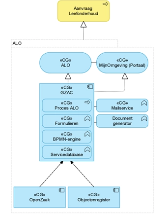

- **Logging van verkeer tussen services (groene lijn)** vindt plaats in
  de onderliggende infrastructuur, binnen de servicemesh (Istio) en de
  observability stack van Haven+. Dit biedt (nu) beperkt inzicht in de
  onderliggende API-calls tussen services. FSC legt vast welke services
  met elkaar communiceren, wanneer dit gebeurt en hoe het verkeer
  verloopt, en registreert transacties en autorisaties op kanaalniveau.

- **Binnen services en applicaties (laag 4/5) (rode pijl)** wordt
  autorisatie ingericht op basis van rollen en context, en worden - als
  het goed is - auditlogs bijgehouden van handelingen binnen de service
  zelf. Deze logging is gericht op het vastleggen van verwerkingen
  binnen de eigen service. Er is ook geen - centrale of
  gestructureerde - vastgestelde plek die aan de functionele eisen voor
  Duurzame Toegankelijkheid (bijv. bewaartermijnen) voldoet, of
  bedrijfsfuncties levert zoals inzage. Er is ook geen standaard in
  gebruik voor het formaat van logregels.

Het vergaren en benutten van logs zijn functionele eisen aan het
platform (en vormen dus een architectural buildingblocks). Deze zijn
momenteel niet ingevuld met solutions. Verschillende gemeenten en
services kiezen eigen oplossingen om aan de eisen te voldoen. Voor deze
buildingblocks zijn bestaande (OpenSource) oplossingen beschikbaar.

## Doelarchitectuur logging

De doelarchitectuur ziet er als volgt uit:

De doelarchitectuur logging is (o.a.) gebaseerd op het Logboek
dataverwerkingen. De doelarchitectuur maakt onderscheid tussen de
verschillende lagen van het Platform Dienstverlening. Per laag ligt de
verantwoordelijkheid voor logging anders. Het uitgangspunt is dat iedere
service voldoende informatie levert om een verwerking **ketenbreed te
kunnen herleiden**, terwijl centrale voorzieningen zorgen voor het
verzamelen, koppelen, bewaren en ontsluiten van de logging.

#### Laag 4/5 – Procesinrichting & interactie

**Voorbeelden:** GZAC, NL-Portal.

Deze laag is belangrijk omdat hier bedrijfsprocessen worden uitgevoerd
en gegevens worden verwerkt in de context van een proces of zaak.

Een service op deze laag moet:

- Iedere relevante gegevensverwerking als event kunnen vastleggen;

- De **trace_id** uit de keten behouden;

- Actor, doelbinding en verwerkingsactiviteit vastleggen;

- Vastleggen welke handeling is uitgevoerd en op welke
  gegevens/resource;

- Interne verwerkingen loggen wanneer gegevens in een eigen database,
  cache of andere opslag worden verwerkt;

- De logging beschikbaar maken voor het centrale Logboek
  Dataverwerkingen.

Voor deze services geldt dat logging niet automatisch ontstaat doordat
een onderliggende registratie wordt gelogd. Een processervice die zelf
gegevens verwerkt, heeft ook een eigen loggingverantwoordelijkheid.
Iedere service op laag 4/5 logt hiervoor iedere relevante actie via
OpenTelemetry (OTel), buffert de logging lokaal en streamt deze naar de
infrastructuur.

Het LDV kent hiervoor, bovenstaand beschreven, drie mogelijke niveaus:

1.  **Registerverwijzing** – aantonen dát een bepaalde verwerking heeft
    plaatsgevonden.

2.  **Kolomverwijzing** – aantonen welke gegevenscategorieën zijn
    gebruikt.

3.  **Concrete data** – kunnen reconstrueren welke concrete waarden zijn
    verwerkt.

Het noodzakelijke niveau wordt per proces bepaald.

#### Laag 3 – Connectiviteit

Op deze laag wordt vooral **de verbinding en toegang** gelogd:

- Welke service communiceert met welke andere service;

- Wanneer de communicatie plaatsvindt;

- Via welk kanaal of welke gateway;

- Welke autorisatie-/toegangsbeslissing heeft plaatsgevonden;

- De technische trace-context.

De logging op deze laag ondersteunt daarmee de ketenbrede
herleidbaarheid.

Belangrijk is dat deze logging niet moet worden verward met logging van
de wettelijke dataverwerking. FSC legt verbinding en toegang vast; het
LDV legt de daadwerkelijke dataverwerking vast.

Op deze laag wordt ook een centrale loggingpipeline ingericht voor

- De verwerking van de logs uit laag 4/5

- Het creëren van logs die naar de registraties (laag 1/2) gaan.

Deze inrichting is inclusief **l**ogcollectie, processing, labeling,
routering naar de juiste storage en retrymechanismen. De service (laag
4/5) blijft verantwoordelijk voor het correct produceren van de
logregels en het behouden van de ketenbrede trace-context.

De logging hoeft daarbij niet noodzakelijk alle gegevenswaarden zelf te
bevatten. Het doel is primair om vast te kunnen stellen welke
gegevensverwerking heeft plaatsgevonden en, afhankelijk van het vereiste
niveau, welke gegevenscategorieën of concrete gegevens daarbij zijn
gebruikt.

## Generieke platformvoorzieningen

Voor bovenstaande inrichting zijn in de doelarchitectuur drie generieke
voorzieningen nodig.

#### Logboek Dataverwerkingen

Het **Logboek Dataverwerkingen** is de centrale voorziening waarin de
verwerkingslogregels ketenbreed worden verzameld.

Het LDV moet onder meer:

- Verwerkingen ketenbreed kunnen reconstrueren;

- Verwerkingen kunnen koppelen aan het verwerkingsregister;

- De autorisatiebeslissing kunnen koppelen;

- Kunnen zoeken en filteren;

- Verschillende doelgroepen gecontroleerd inzage kunnen geven;

- Bewaartermijnen ondersteunen;

- Uitlegbaarheid en inzage mogelijk maken.

#### Verwerkingenregister

Het **Verwerkingenregister** beschrijft vooraf welke verwerkingen zijn
toegestaan: welk doel de verwerking heeft en op welke grondslag deze
plaatsvindt.

Het LDV verwijst vervolgens naar deze registratie. Daardoor ontstaat de
gewenste relatie:

**beleid / doelbinding → toegestane verwerking → feitelijke verwerking →
logregel**

De doelarchitectuur beschrijft dit als de koppeling tussen het register
van verwerkingsactiviteiten en het operationele verwerkingenlog.

#### Presentatie

Bovenop het logboek komt een presentatielaag voor bijvoorbeeld:

- Inzage door de inwoner;

- Auditing;

- Toezicht en verantwoording.

De presentatievoorziening is daarbij niet zelf de bron van de logging.
Zij ontsluit informatie uit het centrale logboek, met autorisatie en
dataminimalisatie passend bij de doelgroep.

## Transitie

Er moet een transitiepad worden bepaald om huidige implementaties te
laten voldoen aan de doelarchitectuur.

## Relatie met Policy Based Access Control

Met de ontwikkeling van **PBAC (Policy Based Access Control)** en
**OpenFTV** (zie onderdeel **8. Identificatie, authenticatie en
autorisatie**) wordt een stap gezet in het platform naar een meer
samenhangende manier van toegang en logging.

Deze voorziening maakt het mogelijk om:

- Gegevensverwerkingen expliciet te koppelen aan beleid, doelbinding en
  autorisatie

- Toegang tot gegevens en het gebruik daarvan centraal en uniform te
  sturen en

- Deze handelingen structureel en herleidbaar vast te leggen

PBAC bepaalt of een gevraagde handeling is toegestaan op basis van
beleid en context. Het logboek van OpenFTV vormt geen zelfstandig
vervangend logboek voor dataverwerkingen, maar is een onderdeel van de
totale verantwoording.

Autorisatiebeslissingen worden als events opgenomen binnen de bredere
trace van een dataverwerking. Het Logboek Dataverwerkingen fungeert als
overkoepelend log, waarin:

- De autorisatiebeslissing (permit/deny) wordt vastgelegd als stap in de
  keten

- De feitelijke uitvoering van de verwerking wordt geregistreerd.

Logging van dataverwerking is ook vastgelegd als (kandidaat) **toegepast
patroon** in het onderdeel [Toegepaste patronen](#toegepaste-patronen).

# Identificatie, authenticatie en autorisatie

Binnen het Platform wordt een scheiding aangebracht tussen
identificatie/authenticatie en autorisatie:

- **Identificatie en authenticatie** worden gerealiseerd met Keycloak
  als standaard bouwblok (Identity Provider).

- **Autorisatie** wordt gerealiseerd via een externe autorisatielaag
  volgens een PxP-architectuur (Policy x Point).

## Identificatie en authenticatie (Keycloak, DigiD)

Authenticatie wordt centraal verzorgd door Keycloak als Identity
Provider (IdP). Dit omvat:

- Authenticatie van gebruikers (bijv. via DigiD, eHerkenning of andere
  IdP’s)

- Uitgifte van tokens (bijv. OAuth2 / OpenID Connect)

- Identity federation

- Beheer van gebruikers, rollen en attributen

Applicaties vertrouwen op de door Keycloak uitgegeven tokens voor het
vaststellen van de identiteit van de gebruiker (subject).

Voor **eindgebruikers** (burgers en bedrijven) vindt authenticatie
plaats via erkende landelijke voorzieningen. Inwoners loggen in met
DigiD en bedrijven met eHerkenning, bijvoorbeeld bij gebruik van
OpenFormulieren en portalen (zoals een MijnOmgeving).

Daarnaast wordt het gebruik van de **European Digital Identity Wallet
(EUDI-wallet)** momenteel verder uitgewerkt als toekomstige voorziening
voor digitale identificatie en attributenuitwisseling binnen Europa.

## Autorisatie (huidige situatie)

Autorisatie *tussen* services wordt primair gerealiseerd op **laag 3
(integratie- en servicelaag)** via de FSC. Binnen de FSC worden
afspraken (contracten) vastgelegd tussen dienstaanbieders en afnemers.
Toegang tot API’s wordt daarbij gecontroleerd op basis van deze
contracten en technisch afgedwongen met behulp van tokens (bijvoorbeeld
JWT). Hierdoor is geborgd dat alleen geautoriseerde afnemers gebruik
kunnen maken van specifieke services.

Binnen afnemende services op **laag 4 en 5** — zoals KISS en GZAC —
wordt aanvullende autorisatie ingericht op basis van rollen en rechten.
Dit betekent dat gebruikers binnen deze applicaties alleen toegang
hebben tot functionaliteiten en gegevens die passen bij hun rol.
Tegelijkertijd worden binnen deze applicaties auditlogs gegenereerd,
waarin gebruikershandelingen worden vastgelegd ten behoeve van
verantwoording en controle.

## Policy Based Access Control (PBAC) en FTV

In de doelarchitectuur wordt autorisatie ingericht volgens een
**externalized authorization model** gebaseerd op het PxP-concept.
Hierbij worden verantwoordelijkheden gescheiden over meerdere
componenten:

- **PEP (Policy Enforcement Point)** Bevindt zich in API-gateways of
  services en dwingt autorisatie af.

- **PDP (Policy Decision Point)** Neemt autorisatiebeslissingen op basis
  van policies.

- **PAP (Policy Administration Point)** Beheert en publiceert
  autorisatieregels.

- **PIP (Policy Information Point)** Levert contextinformatie (bijv. uit
  registraties of andere bronnen).

Het AuthZEN-initiatief van de OpenID Foundation beschrijft hoe deze
componenten samenwerken. AuthZEN definieert een gestandaardiseerde
Authorization API waarmee een PEP een autorisatievraag kan stellen aan
een PDP. De specificatie stelt dat de PDP deze API aanbiedt en dat de
PEP deze gebruikt om beslissingen op te vragen. In een verzoek worden
bijvoorbeeld het subject (wie), de resource (waarop), de actie (wat) en
contextinformatie meegestuurd. De PDP evalueert deze gegevens tegen
policies en retourneert een beslissing zoals *permit* of *deny*.

Dit model ondersteunt externalized authorization: autorisatielogica
bevindt zich niet in applicaties zelf, maar in een aparte service. De
gekozen architectuur ondersteunt federatieve samenwerking tussen
organisaties. Dit betekent dat:

- Autorisatiebeslissingen gebaseerd zijn op context uit meerdere
  domeinen

- Policies organisatie-overstijgend kunnen worden toegepast

- Toegang tot informatieobjecten consistent en herleidbaar wordt
  beoordeeld

  Deze aanpak sluit aan bij initiatieven zoals [**Federatieve
  Toegangsverlening (FTV)**](https://vng-realisatie.github.io/ftv/) en
  de referentie-implementatie
  [OpenFTV](https://vng-realisatie.github.io/ftv/actueel/nieuws/20251014updateopenftv/)
  en is ook vastgelegd als (kandidaat) **toegepast patroon** in het
  onderdeel [Toegepaste patronen](#toegepaste-patronen).

# Toegepaste patronen

| **Compact:** |
|----|
| Dit hoofdstuk beschrijft herbruikbare oplossingspatronen voor veelvoorkomende vormen van dienstverlening, zoals notificaties, verzoeken, taken en berichten. Ook worden implementatiepatronen en de registratiestrategie beschreven. De gedachte is simpel: als iets vaker voorkomt, maken we er een patroon van. |

## Inleiding

In onderdeel [Samenwerking tussen
services](#samenwerking-tussen-services) zijn de generieke
interactievormen binnen het Platform Dienstverlening beschreven. Daar is
onderscheid gemaakt tussen synchrone communicatie (request/response),
asynchrone communicatie (event-driven) en API-compositie. Deze
beschrijven op welke wijze services technisch met elkaar samenwerken.

Dit hoofdstuk beschrijft een ander abstractieniveau. De hier opgenomen
patronen zijn oplossingspatronen voor veelvoorkomende functionele
vraagstukken binnen de gemeentelijke dienstverlening. Zij beschrijven
hoe meerdere services gezamenlijk invulling geven aan een specifieke
capability, zoals het registreren van een verzoek, het uitvoeren van een
taak of het verzenden van een bericht.

Een patroon bestaat daarbij uit een samenhang van registraties, API's,
notificaties en procescomponenten die volgens vaste afspraken
samenwerken. Een patroon kan gebruikmaken van één of meerdere
interactievormen. Zo combineert het Verzoekenpatroon bijvoorbeeld
a-synchrone notificaties voor de registratie van een verzoek met
synchrone API-calls voor de verdere procesafhandeling.

## Notificatiepatroon

Alle interactiepatronen binnen het Platform Dienstverlening bouwen voort
op hetzelfde notificatiepatroon. Componenten communiceren zoveel
mogelijk asynchroon door gebeurtenissen (events) te publiceren. Andere
componenten kunnen zich hierop abonneren zonder dat directe
afhankelijkheden ontstaan.

Hiervoor wordt gebruikgemaakt van **Open Notificaties** die een
publish/subscribe-mechanisme biedt voor het routeren van gebeurtenissen
tussen componenten.

De belangrijkste uitgangspunten zijn:

- Componenten publiceren gebeurtenissen; zij kennen hun afnemers niet.

- Componenten ontvangen notificaties via abonnementen op één of meer
  kanalen.

- Notificaties bevatten uitsluitend verwijzingen naar gewijzigde
  gegevens (informatie-arm).

- De ontvangende component bepaalt zelfstandig of en hoe de gewijzigde
  gegevens worden opgehaald.

- Componenten moeten rekening houden met tijdelijke uitval of gemiste
  notificaties en implementeren daarom een passende herstelstrategie,
  bijvoorbeeld retries of periodieke synchronisatie.

Hierdoor ontstaat een losse koppeling tussen registraties,
procescomponenten en gebruikersvoorzieningen.

## Verzoekenpatroon

Het verzoekenpatroon vormt het standaardpatroon voor het starten van
dienstverlening. Het uitgangspunt is dat een aanvraag eerst als
zelfstandig **Verzoek** wordt geregistreerd, voordat een proces of zaak
wordt gestart. Hierdoor wordt de interactie met de inwoner losgekoppeld
van de procesafhandeling.

Het patroon bestaat uit de volgende stappen:

- Een kanaal registreert een verzoek via de Verzoeken API.

- Het verzoek wordt gevalideerd.

- Het verzoek wordt opgeslagen als zelfstandig informatieobject.

- De registratie publiceert een notificatie.

- Procescomponenten bepalen zelfstandig of en welk proces moet worden
  gestart.

Hierdoor kunnen meerdere processen gebruikmaken van dezelfde
verzoekregistratie.

#### Aansluiten op het patroon

Procescomponenten:

- Abonneren zich op relevante notificaties.

- Halen het volledige verzoek op via de API.

- Bepalen zelfstandig welk proces moet worden gestart.

## Takenpatroon

Taken worden binnen het platform niet rechtstreeks aangeboden vanuit
procescomponenten, maar eerst geregistreerd als zelfstandig
informatieobject. Procescomponenten zijn verantwoordelijk voor het
registreren en beheren van taken; gebruikersinterfaces zijn
verantwoordelijk voor het tonen en afhandelen ervan.

Hierdoor ontstaat een generieke takenvoorziening die door meerdere
processen en gebruikersinterfaces kan worden hergebruikt.

#### Aansluiten op het patroon

Procescomponenten:

- Registreren taken via de Taken API.

- Koppelen taken aan het relevante hoofdobject.

- Beheren de levenscyclus van de taak.

De takenregistratie:

- Registreert de taken

- Publiceert wijzigingen via notificaties.

Portalen:

- Halen bij login van de gebruiker de taken op

- Tonen de actuele taken

- Verwerken gebruikersacties.

## Berichtenpatroon

Ook berichten worden als zelfstandig informatieobject geregistreerd
voordat zij daadwerkelijk worden verzonden. Procescomponenten zijn
verantwoordelijk voor **wat** moet worden gecommuniceerd; de
berichtenvoorziening (Outputmanagementcomponent en Notify) bepaalt
**hoe** en via welk kanaal dit gebeurt.

Het patroon bestaat uit:

- Registratie van het bericht.

- Validatie.

- Opslag.

- Publicatie van een notificatie.

- Verzending door de omnichannelvoorziening.

Hierdoor ontstaat een volledige scheiding tussen proceslogica en
communicatiekanalen.

#### Aansluiten op het patroon

Procescomponenten:

- Stellen berichten inhoudelijk samen.

- Registreren deze via de Berichten API.

- Relateren berichten aan het relevante hoofdobject.

OMC/Notify:

- Abonneert zich op relevante notificaties.

- Haalt berichtgegevens op.

- Bepaalt – op basis van klantgegevens (KlantenAPI) via welk kanaal het
  bericht moet worden verzonden

- Verzorgt de daadwerkelijke verzending.

## Patronen in ontwikkeling

Het Platform Dienstverlening ontwikkelt zich continu. Naast de in dit
onderdeel beschreven patronen kunnen nieuwe generieke interactiepatronen
worden toegevoegd wanneer deze bijdragen aan een betere ontkoppeling,
herbruikbaarheid of standaardisatie.

Nieuwe patronen worden ontwikkeld conform de architectuurprincipes uit
dit document en maken, na vaststelling, onderdeel uit van de
referentiearchitectuur van het platform. De volgende patronen zijn in
2026/27 kandidaat:

### Autorisatiepatroon (OpenFTV / AuthZEN)

Binnen het Platform Dienstverlening wordt autorisatie niet door
individuele services ingericht, maar als een generieke
platformvoorziening toegepast. Hiervoor wordt aangesloten op de
architectuur van **OpenFTV** en de **AuthZEN-standaard**. Dit maakt het
mogelijk om autorisatiebeslissingen centraal, consistent en
contextafhankelijk uit te voeren.

Het uitgangspunt is dat iedere service verantwoordelijk blijft voor zijn
eigen gegevens en functionaliteit, maar autorisatiebeslissingen
delegeert aan de centrale autorisatievoorziening. Hierdoor worden
autorisatieregels éénmaal beheerd en platformbreed toegepast.

Het patroon bestaat uit de volgende stappen:

- **Doen van een verzoek**  
  Een gebruiker of service doet een aanvraag om een bepaalde handeling
  uit te voeren, bijvoorbeeld het raadplegen of wijzigen van gegevens.

- **Opbouwen van de autorisatiecontext**  
  De uitvoerende service verzamelt de benodigde context, zoals:

  - De identiteit van de actor;

  - De gevraagde handeling;

  - Het betreffende object of de resource;

- **Autorisatiebeslissing**  
  De service vraagt via de AuthZEN-interface een autorisatiebeslissing
  op bij de centrale Policy Decision Point (PDP). Daarbij worden
  beleidsregels uit het Policy Administration Point (PAP) toegepast,
  aangevuld met gegevens uit één of meer Policy Information Points
  (PIP).

- **Afdwingen van de beslissing**  
  De ontvangende service fungeert als Policy Enforcement Point (PEP) en
  voert de beslissing uit. Alleen wanneer de beslissing *Permit* luidt
  wordt de gevraagde handeling uitgevoerd.

Hierdoor ontstaat een uniforme autorisatiearchitectuur waarin beleid,
uitvoering en verantwoording van elkaar zijn gescheiden.

#### Aansluiten op het patroon

Services die persoonsgegevens of andere beschermde gegevens verwerken:

- Implementeren de AuthZEN-interface voor autorisatiebeslissingen.

- Treden op als **Policy Enforcement Point (PEP)**.

- Verstrekken de benodigde context aan de centrale
  autorisatievoorziening.

- Respecteren de teruggegeven autorisatiebeslissing (*Permit* of
  *Deny*).

- Registreren de autorisatiebeslissing als onderdeel van de ketenbrede
  verwerking.

### Loggingpatroon (OpenTelemetry en Logboek Dataverwerkingen)

Binnen het Platform Dienstverlening wordt logging als een generiek
platformpatroon toegepast. Hierbij wordt onderscheid gemaakt tussen de
technische registratie van gebeurtenissen en de juridische
verantwoording van gegevensverwerkingen.

OpenTelemetry (OTel) vormt de technische standaard voor het vastleggen
van logs, traces en events over de gehele keten. Het **Logboek
Dataverwerkingen (LDV)** bouwt hierop voort door deze technische logging
te verrijken met informatie over doelbinding, grondslag en de
uitgevoerde gegevensverwerking. Hierdoor ontstaat één samenhangend beeld
van een gegevensverwerking, ongeacht hoeveel services daarbij betrokken
zijn.

Het patroon bestaat uit de volgende stappen:

- **Start van een verwerking**  
  Een gebruiker of service initieert een verwerking. Daarbij wordt een
  ketenbrede trace gestart conform de W3C Trace Context-standaard.

- **Verwerking door services**  
  Iedere service legt relevante gebeurtenissen vast volgens de
  OpenTelemetry-standaard. Hierbij worden onder andere de trace-id, de
  uitgevoerde handeling en de betrokken component geregistreerd.

- **Registratie van autorisatie en gegevensgebruik**  
  Autorisatiebeslissingen, API-aanroepen en gegevensmutaties worden als
  onderdeel van dezelfde trace vastgelegd. Hierdoor ontstaat een
  volledig beeld van de uitgevoerde verwerking.

- **Verrijking met verwerkingscontext**  
  De technische logging wordt gekoppeld aan de bijbehorende
  verwerkingsactiviteit uit het Verwerkingsregister. Daarbij worden
  onder meer doelbinding, grondslag en de aard van de gegevensverwerking
  vastgelegd.

- **Registratie in het Logboek Dataverwerkingen**  
  Alle relevante gebeurtenissen worden samengebracht in één
  platformbreed Logboek Dataverwerkingen. Hierdoor ontstaat een complete
  en herleidbare registratie van de uitgevoerde gegevensverwerking.

Deze werkwijze maakt het mogelijk om gegevensverwerkingen over meerdere
componenten heen te reconstrueren en ondersteunt zowel operationeel
beheer als wettelijke verantwoording.

#### Aansluiten op het patroon

Alle componenten binnen het Platform Dienstverlening:

- Gebruiken **OpenTelemetry** voor logging, metrics en distributed
  tracing.

- Propageren de **trace-id** over alle API-calls en events.

- Leggen relevante handelingen en gebeurtenissen vast conform de
  platformstandaard.

- Registreren autorisatiebeslissingen als onderdeel van dezelfde trace.

- Verrijken logging met de benodigde context voor het Logboek
  Dataverwerkingen.

- Leveren hun logging aan de centrale OTel-infrastructuur.

De centrale loggingvoorziening bestaat uit:

- **OpenTelemetry Collectors** voor het verzamelen van logs, traces en
  metrics;

- **OpenTelemetry Backend(s)** voor opslag en analyse;

- **Logboek Dataverwerkingen (LDV)** voor de registratie van
  gegevensverwerkingen;

- **Verwerkingsregister** voor de registratie van
  verwerkingsactiviteiten, doelbinding en grondslag.

**Uitgangspunten**

Bij de inrichting van het loggingpatroon gelden de volgende
uitgangspunten:

- Iedere relevante gegevensverwerking is volledig herleidbaar over de
  gehele keten.

- Alle componenten gebruiken hetzelfde OpenTelemetry-formaat.

- Persoonsgegevens worden niet onnodig opgenomen in technische logging;
  waar mogelijk worden stabiele identifiers gebruikt.

- Het Logboek Dataverwerkingen bevat de semantische en juridische
  context van de verwerking en vormt de basis voor verantwoording
  richting inwoners, toezichthouders en auditors.

- Logging ondersteunt zowel technische observability als compliance,
  zonder dat hiervoor afzonderlijke loggingmechanismen per component
  nodig zijn.

## Implementatiepatronen (Patroon A, Patroon B)

De voorgaande paragrafen beschrijven patronen voor de samenwerking
tussen services binnen het Platform Dienstverlening. In de praktijk
bevindt elke gemeente zich reeds in een uitgangssituatie. Bestaande
applicaties, contracten en investeringen maken dat de doelarchitectuur
niet altijd in één stap kan worden gerealiseerd.

Om gemeenten hierin te ondersteunen onderscheidt het Platform
Dienstverlening twee referentie-implementatiepatronen. Beide patronen
streven dezelfde architectuurprincipes na en leiden uiteindelijk naar
dezelfde doelarchitectuur. Het verschil zit in dat bestaande software
wordt ingepast tijdens de transitie.

| **Patroon** | **Beschrijving** | **Voorbeeld** |
|----|----|----|
| **Patroon A – Volledig Platform Dienstverlening** | Alle lagen van het vijflagenmodel worden gerealiseerd met componenten conform de Common Ground-architectuur. | Een klachtenproces wordt volledig opgebouwd uit formulieren, procescomponenten, FSC, registraties, dataservices en omnichannelvoorzieningen. |
| **Patroon B – Hybride implementatie** | De gegevenslaag en connectiviteitslaag volgen de Common Ground-architectuur; de proceslaag wordt (tijdelijk) ingevuld door een bestaande SaaS- of legacy-oplossing. | De aanvraag van een paspoort wordt afgehandeld in een bestaande zaaksysteemcomponent, terwijl gegevens, formulieren, API's en communicatie via het Platform Dienstverlening verlopen. |

#### Duiding

Beide implementatiepatronen ondersteunen dezelfde doelarchitectuur, maar
verschillen in de wijze waarop deze wordt bereikt.

- **Patroon A** realiseert de architectuur volledig volgens de
  uitgangspunten van Common Ground. Dit biedt maximale flexibiliteit,
  herbruikbaarheid en loskoppeling, maar vraagt ook de grootste
  organisatorische en technische verandering.

- **Patroon B** biedt een pragmatische transitiestrategie waarbij
  bestaande applicaties voorlopig behouden blijven, terwijl gegevens,
  interactie en integratie al worden georganiseerd volgens de
  architectuur van het Platform Dienstverlening. Hierdoor kan
  stapsgewijs worden toegewerkt naar Patroon A.

### Patroon A – Volledige platformimplementatie

Binnen Patroon A worden processen volledig gerealiseerd met de
componenten van het Platform Dienstverlening. Zowel de interactie,
procesafhandeling, connectiviteit als gegevensvoorziening volgen de
architectuurprincipes uit dit document.

De implementatie bestaat doorgaans uit:

- Realiseren van de benodigde BusinessServices en procescomponenten.

- Inrichten van registraties, API's en gegevensmodellen.

- Migreren van gegevens uit bestaande systemen.

- Implementeren van de nieuwe werkwijze binnen de organisatie.

Na afronding kan de oorspronkelijke applicatie volledig worden
uitgefaseerd.

- Voordelen

  - Maximale aansluiting op de doelarchitectuur.

  - Geen structurele synchronisatie tussen systemen.

  - Optimale herbruikbaarheid van services.

  - Eenvoudiger beheer op langere termijn.

- Aandachtspunten

  - Grootste implementatie-inspanning.

  - Organisatorische verandering is vaak omvangrijk.

  - Vereist volledige migratie van processen en gegevens.

    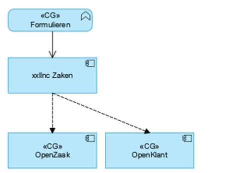

### Patroon B – Hybride implementatie

Patroon B is bedoeld voor situaties waarin bestaande SaaS- of
legacy-oplossingen voorlopig gehandhaafd blijven. De procesuitvoering
vindt daarbij plaats buiten het Platform Dienstverlening, terwijl
gegevens, interactie en integratie zoveel mogelijk volgens de
architectuur worden ingericht. De bestaande applicatie wordt gekoppeld
aan de registraties en platformvoorzieningen, zodat de gegevenslaag al
voldoet aan de uitgangspunten van Common Ground.

Hierdoor ontstaat een hybride architectuur waarin:

- Interactie plaatsvindt via de platformvoorzieningen;

- Gegevens worden beheerd in Common Ground-registraties;

- Processen voorlopig blijven draaien in de bestaande applicatie.

- Voordelen

  - Versnelt de transitie naar de doelarchitectuur.

  - Gemeenten verkrijgen regie over hun gegevens.

  - Gegevens kunnen direct worden gebruikt door andere
    platformvoorzieningen, zoals MijnServices en integrale klantbeelden.

  - Beperkt de impact op bestaande bedrijfsprocessen.

- Aandachtspunten

  - Tijdelijke dubbele inrichting van beheer en configuratie.

  - Extra complexiteit door gegevenssynchronisatie.

  - Hogere beheerlast zolang beide werelden naast elkaar bestaan.

  - Bedoeld als tussenstap; uiteindelijk blijft Patroon A het eindbeeld.

#### Praktische implementatiestappen

- Inrichten van de benodigde registraties binnen het Platform
  Dienstverlening.

- Realiseren van API-koppelingen tussen de bestaande applicatie en de
  platformregistraties.

- Inrichten en testen van de gegevenssynchronisatie.

- Gefaseerd overnemen van functionaliteit totdat de bestaande applicatie
  kan worden uitgefaseerd.

## Registratiestrategie: één bron per informatiedomein

Een belangrijk uitgangspunt binnen het Platform Dienstverlening is dat
iedere organisatie voor ieder generiek informatiedomein één primaire
registratie gebruikt. Voor zaakgegevens betekent dit dat binnen één
gemeente wordt gestreefd naar **één centraal zaakregister**, waarop alle
processervices aansluiten. Hetzelfde uitgangspunt geldt voor andere
generieke registraties, zoals klanten, producten en organisaties.

- Door één registratie als bron te gebruiken ontstaat:

- Een eenduidige bron van waarheid (single source of truth);

- Uniform beheer van gegevens, typen en metadata;

- Eenvoudige ontsluiting naar MijnOmgeving, klantbeelden en andere
  generieke voorzieningen;

- Minder beheer- en integratiecomplexiteit;

- Grotere uitwisselbaarheid van processen en softwarecomponenten.

#### Niet gewenste situaties

De volgende implementatievormen passen niet binnen de architectuur van
het Platform Dienstverlening:

- Applicaties die uitsluitend met hun **eigen registratie** kunnen
  samenwerken en geen gebruikmaken van de gestandaardiseerde
  registraties.

- Oplossingen waarbij dezelfde gegevens gelijktijdig in meerdere
  registraties worden beheerd.

# Technische architectuur

De technische architectuur (ook wel aangeduid als **Laag 0**) vormt de
onderliggende laag van het Platform Dienstverlening . Deze laag voorziet
in de infrastructuur en generieke technische voorzieningen waarop alle
hogere lagen – van dataservices tot procesapplicaties – draaien.

De principes van data-autonomie, open standaarden en Open Source, werken
ook door in deze laag. Dit betekent dat de technische architectuur
gericht is op:

- Het voorkomen van afhankelijkheid van specifieke leveranciers

- Het borgen van verplaatsbaarheid van applicaties en data

- En het realiseren van een reproduceerbare en gestandaardiseerde
  infrastructuur.

Binnen Common Ground zijn hiervoor twee samenhangende standaarden
ontwikkeld: **Haven** en **Haven+**.

## Haven

De Haven-standaard beschrijft hoe een uniforme en overdraagbare
hostingomgeving voor applicaties wordt ingericht. Centraal staat het
gebruik van Kubernetes als generieke uitvoeringslaag, waarmee
applicaties containerized en platformonafhankelijk kunnen worden
uitgerold.

Haven definieert onder andere:

- De inrichting van een Kubernetes-omgeving

- De minimale set aan basisvoorzieningen voor deployment

- Richtlijnen om vendor lock-in te voorkomen door gebruik van open
  standaarden.

Haven vormt daarmee de technische basis waarop applicaties consistent
kunnen draaien, ongeacht de onderliggende infrastructuur of
cloudprovider.

## Haven+

Haven+ bouwt voort op deze basis en levert een voorgeconfigureerde
platformlaag met generieke voorzieningen die nodig zijn in een
productieomgeving. Waar Haven beschrijft *waar* en *hoe* applicaties
draaien, voorziet Haven+ in de vraag *wat er nodig is om ze operationeel
te beheren*.

Haven+ omvat onder andere:

- Voorzieningen voor monitoring, logging en tracing

- Identity- en toegangsvoorzieningen

- Datadiensten zoals databasebeheer

- Certificaat- en secretmanagement.

Deze voorzieningen worden gestandaardiseerd en als samenhangend geheel
aangeboden, zodat ontwikkelteams zich kunnen richten op functionaliteit
in plaats van op het opbouwen en beheren van infrastructuur.

## Positionering in de architectuur

Haven en Haven+ vormen samen de technische fundering onder het Platform
Dienstverlening. Zij leveren generieke capabilities die door alle
services worden gebruikt, maar bevatten zelf geen businesslogica of
domeinspecifieke functionaliteit.

De technische architectuur:

- Faciliteert de uitvoering van services

- Borgt randvoorwaarden zoals beveiliging, beschikbaarheid en
  observability en

- Maakt het mogelijk om applicaties en data onafhankelijk van specifieke
  leveranciers te beheren en te verplaatsen.

Daarmee is deze laag een essentiële voorwaarde voor het realiseren van
de bredere architectuurprincipes van Common Ground, zonder deze
inhoudelijk in te vullen.

#### Nadere uitwerking

De technische architectuur wordt in dit document op hoofdlijnen
beschreven. Voor de concrete inrichting, componenten en implementatie
wordt verwezen naar de documentatie Haven+.

Documentatie: <https://havenplus.commonground.nl/docs/overview>

# Standaarden

In de voorgaande onderdelen zijn de architectuurprincipes van het
Platform Dienstverlening uitgewerkt en vertaald naar richtlijnen voor de
business-, informatie-, applicatie- en technologiearchitectuur. Daarbij
is aangesloten op een groot aantal bestaande standaarden,
referentiearchitecturen en open specificaties.

Dit hoofdstuk bundelt de standaarden die richtinggevend of normatief
zijn in één overzicht. Het vormt daarmee een recapitulatie en naslagwerk
voor architecten, ontwerpers en ontwikkelaars.

| **Domein** | **Standaard** | **Toepassing** |
|----|----|----|
| **Enterprisearchitectuur** | [TOGAF Standard](https://www.opengroup.org/togaf) | Methode voor Enterprisearchitectuur |
|  | [NORA](https://www.noraonline.nl/wiki/Nederlandse_Overheid_Referentie_Architectuur_(NORA)) | Nederlandse Overheid Referentie Architectuur |
|  | [GEMMA](https://www.gemmaonline.nl/wiki/Hoofdpagina) | Gemeentelijke referentiearchitectuur |
| **Businessarchitectuur** | [BPMN 2.0](https://www.omg.org/spec/BPMN) | Procesmodellering |
|  | [DMN 1.5](https://www.omg.org/spec/DMN) | Beslisregels |
|  | [Domain-Driven Design (DDD)](https://www.domainlanguage.com/ddd/) | Afbakening van domeinen en BusinessServices |
| **Informatie-architectuur** | [MIM (Metamodel Informatie Modellering)](https://docs.geostandaarden.nl/mim/mim/) | Modelleren van informatiemodellen |
|  | [RGBZ](https://vng-realisatie.github.io/RGBZ/) | Referentiemodel voor zaken en besluiten |
|  | [ZGW API-standaarden](https://vng-realisatie.github.io/gemma-zaken/) | Objecttypen en API's voor gemeentelijke dienstverlening |
| **API's** | [REST API Design Rules](https://logius-standaarden.github.io/API-Design-Rules/) | Ontwerpregels voor REST API's |
|  | [OpenAPI 3.x](https://spec.openapis.org/oas/latest.html) | Specificeren van REST API's |
|  | [JSON Schema](https://json-schema.org/) | Validatie van berichten |
| **Events & Integratie** | [CloudEvents NL-profiel](https://www.gemmaonline.nl/wiki/De_CloudEvents_standaard) | Nederlandse invulling van CloudEvents |
|  | [FSC (Federatieve Service Connectiviteit)](https://fsc-standaard.nl/) | Federatieve gegevensuitwisseling |
|  | [Domeinarchitectuur Gegevensuitwisseling - NORA](https://www.noraonline.nl/wiki/Domeinarchitectuur_Gegevensuitwisseling) | Domeinarchitectuur Gegevensuitwisseling - NORA |
| **Observability** | [OpenTelemetry](https://opentelemetry.io/docs/what-is-opentelemetry/) | Logging, metrics en tracing |
|  | [W3C Trace Context](https://www.w3.org/TR/trace-context/) | Ketenbrede tracing |
| **Identiteit & Autorisatie** | [OAuth 2.0](https://oauth.net/2/) | Delegatie en autorisatie |
|  | [OpenID Connect](https://openid.net/developers/specs) | Authenticatie |
|  | [AuthZEN](https://openid.github.io/authzen) | Policy Based Access Control |
|  | [OpenFTV](https://vng-realisatie.github.io/ftv/) | Federatieve Toegangsverlening |
| **Registraties** | [Uit Betrouwbare Bron (UBB)](https://uitbetrouwbarebron.rijks.app/handreiking-respec/) | Referentie voor betrouwbare registraties |
|  | [Logboek Dataverwerkingen (LDV)](https://logius-standaarden.github.io/logboek-dataverwerkingen/) | Logging van dataverwerkingen |
| **Front-end** | [NL Design System](https://www.nldesignsystem.nl/) | Componenten en richtlijnen voor gebruikersinterfaces |
| **Open Source** | [EUPL](https://eupl.eu/1.2/en/) | European Union Public Licence |
| **Containerplatform** | [Haven +](https://havenplus.commonground.nl/docs/overview/) | Containerorkestratie |
|  |  |  |
|  |  |  |
|  |  |  |
|  |  |  |
|  |  |  |

# Aansluitvoorwaarden Platform Dienstverlening

| **Compact:** |
|----|
| Wie wil aansluiten op het Platform Dienstverlening krijgt een aantal voorwaarden. Dit hoofdstuk beschrijft wanneer en hoe oplossingen binnen Common Ground passen, welke eisen gelden voor platformservices en Patroon B, hoe softwarekwaliteit wordt geborgd en welke organisatorische voorwaarden gelden. |

## Handleiding bij de aansluitvoorwaarden

Voorafgaand aan een ontwikkeling (een doelarchitectuur, of
aanbesteding/vervanging van software) moet bepaald worden of deze binnen
de scope van Common Ground valt en, zo ja, welke aansluitvoorwaarden van
toepassing zijn. Hiervoor geldt het volgende onderscheid:

- Processen die uitsluitend de interne bedrijfsvoering ondersteunen,
  zoals bij HRM-, ERP- en financiële systemen, vallen in beginsel buiten
  de scope van Common Ground.

- Processen met een directe of indirecte relatie met gemeentelijke
  dienstverlening aan inwoners, ondernemers of organisaties, vallen
  binnen de scope van Common Ground. Het kan dus zowel gaan om een
  oplossing waarmee een inwoner, ondernemer of organisatie rechtstreeks
  contact heeft met de gemeente, als om een oplossing die onderdeel is
  van het achterliggende dienstverleningsproces. Dit gaat niet zuiver
  over het domein Dienstverlening, maar – potentieel – over oplossingen
  in alle domeinen.

Valt de oplossing binnen deze scope? Dan gelden de Common Ground
aansluitvoorwaarden.

## Common Ground en Platform Dienstverlening

Het [Platform
Dienstverlening](https://dienstverleningsplatform.gitbook.io/platform-generieke-dienstverlening-public/introductie/enterprise-architectuur)
is de implementatie van Common Ground binnen de G4-gemeenten. Het vormt
de referentiearchitectuur voor de gemeentelijke informatievoorziening en
biedt een samenhangend geheel van software (generieke registraties,
dataservices, integratievoorzieningen en procesapplicaties) waarmee de
gemeentelijke dienstverlening op een generieke manier kan worden
gerealiseerd. Het volgt een [Enterprise
architectuur](https://dienstverleningsplatform.gitbook.io/platform-generieke-dienstverlening-public/introductie/enterprise-architectuur)
en realiseert een ontkoppeld landschap van (micro)services volgens het
model van Common Ground:

Bij een nieuwe functionele behoefte (of een bestaande die ingevuld
wordt, maar waarvan de software niet langer voldoet of contractueel
eindigt) wordt eerst onderzocht of deze kan worden ingevuld met de
bestaande voorzieningen van het Platform Dienstverlening. Het platform
wordt maximaal benut voordat wordt besloten nieuwe software te
ontwikkelen of een SaaS-oplossing aan te schaffen. Dit proces volgt een
beslisboom waarin twee patronen worden onderscheiden, die hieronder
worden toegelicht.

### Patroon A: Realisatie in Platform Dienstverlening

Er wordt eerst vastgesteld of de gevraagde functionaliteit reeds
beschikbaar is binnen het Platform Dienstverlening of met beperkte
uitbreiding van bestaande platformservices kan worden gerealiseerd.

Wanneer de benodigde functionaliteit nog niet beschikbaar is, wordt
beoordeeld of deze als nieuwe generieke platformservice kan worden
ontwikkeld en opgenomen in het Platform Dienstverlening. Daarbij wordt
onder meer gekeken naar de generieke toepasbaarheid, de bijdrage aan de
referentiearchitectuur, de verwachte herbruikbaarheid door meerdere
gemeenten en de aansluiting op de roadmap van het Platform
Dienstverlening.

Een platformservice wordt onderdeel van het Platform Dienstverlening
zelf. De component:

- Levert generieke functionaliteit;

- Wordt opgenomen in de platformarchitectuur;

- Valt onder de architectuurgovernance van het platform;

- Wordt gezamenlijk beheerd;

- Maakt onderdeel uit van de referentie-implementatie zoals die door G4
  wordt vastgesteld.

Voor platformservices gelden zowel de [(niet-)functionele
aansluitvoorwaarden Common Ground](#aansluitvoorwaarden-patroon-b) als
[aanvullende platformeisen](#aanvullende-eisen-voor-platformservices).

### Patroon B: Aansluiten van een (SaaS-)oplossing

Alleen wanneer ontwikkeling als platformservice niet doelmatig of
haalbaar is, bijvoorbeeld vanwege de complexiteit, beperkte generieke
toepasbaarheid, beschikbare ontwikkelcapaciteit of gewenste
implementatiesnelheid, wordt – tijdelijk – gekozen voor een
SaaS-oplossing. Het is van belang dat deze ontwikkeling wordt
geadresseerd bij de PO’s van het Platform, zodat parallel gewerkt wordt
aan doorontwikkeling en de capabilities beschikbaar komen.

Als gekozen wordt voor een SaaS-oplossing is het vereist dat deze
integreert met het Platform Dienstverlening. Dat betekent voldoen aan de
aansluitvoorwaarden van het Platform Dienstverlening en gebruik maken
van de generieke registraties, API's en integratievoorzieningen.

Een aangesloten applicatie blijft eigendom en verantwoordelijkheid van
de leverancier (of community) en maakt geen onderdeel uit van het
Platform Dienstverlening. De applicatie maakt gebruik van de generieke
voorzieningen van het platform, zoals registraties, dataservices, API's
en integratievoorzieningen. Het Platform biedt hier ruimte voor in de
vorm van generieke aansluitingen (“stekkers”) op de gegevenslaag.

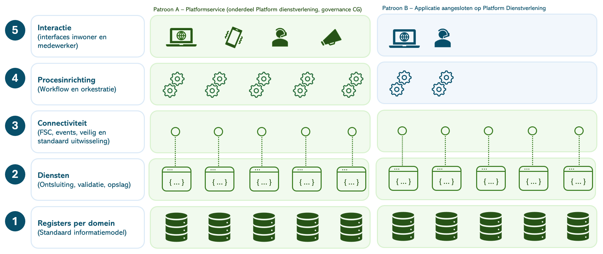

Leveranciers en communities behouden vrijheid in de inrichting en
implementatie van hun software, voor zover de applicatie voldoet aan de
aansluitvoorwaarden van het Platform Dienstverlening.

## 

## Aansluitvoorwaarden Patroon B 

Deze aansluitvoorwaarden zijn van toepassing op oplossingen die als
applicatie aansluiten op het Platform Dienstverlening (Common Ground).
Zij zijn aanvullend op de
[GIBIT](https://vng.nl/sites/default/files/2026-03/gibit-2025-artikelen.pdf).
Voor alle contractuele, juridische, organisatorische en generieke
kwaliteitseisen geldt de GIBIT, tenzij in deze aansluitvoorwaarden
aanvullende of afwijkende platformspecifieke eisen zijn opgenomen.

De aansluitvoorwaarden bevatten de functionele, niet-functionele en
technische eisen die waarborgen dat een oplossing op een uniforme,
veilige en beheerbare wijze samenwerkt met het Platform Dienstverlening.

### Gegevenslaag 

Het Platform Dienstverlening levert de generieke gegevenslaag van de
gemeentelijke informatievoorziening. Deze bestaat uit generieke
registraties, dataservices en de integratielaag voor veilige en
gestandaardiseerde gegevensuitwisseling. Procesapplicaties sluiten
hierop aan en maken voor het vastleggen, muteren en raadplegen van
gemeentelijke gegevens gebruik van deze generieke voorzieningen.

De gegevenslaag wordt gefaseerd uitgebreid. Uiteindelijk wordt het
volledige Gemeentelijk Gegevensmodel (GGM) hierin gerealiseerd.

Op dit moment zijn de volgende generieke registraties beschikbaar:

- Klanten (Partijen – inwoners en organisaties);

- Zaken;

- Documenten;

- Producten;

- Beslisregels;

- Objecten;

- Verzoeken, Taken en Berichten.

In ontwikkeling zijn registraties voor:

- De interne organisatie (teams, functies, rollen en medewerkers);

- Domeinspecifieke gegevensmodellen voor het Sociaal Domein
  (Participatie en Inburgering).

### Algemene eisen

Iedere aangesloten oplossing voldoet aan de volgende uitgangspunten voor
de gegevenslaag:

- **Eis** – Informatieobjecten die binnen het Platform Dienstverlening
  worden **opgevraagd,** **vastgelegd of gemuteerd**, volgen het
  gegevensmodel en de metadatering van de betreffende registratie.
  Hiermee wordt geborgd dat wordt voldaan aan de eisen voor duurzame
  toegankelijkheid, informatiebeheer en interoperabiliteit.

- **Eis** – Wanneer een oplossing verantwoordelijk is voor het
  **opvragen,** **vastleggen of muteren** van gegevens in een
  registratie, draagt zij er zorg voor dat deze registratie actueel,
  volledig en consistent blijft. De betreffende registratie blijft
  daarmee de authentieke bron van deze gegevens.

### Gebruik van generieke registraties

Wanneer een oplossing verantwoordelijk is voor het **opvragen,**
**vastleggen of muteren** van gegevens binnen één van de onderstaande
domeinen, maakt zij gebruik van de daarvoor aangewezen generieke
registratie of voorziening van het Platform Dienstverlening.

Bij de oplossing moet het interne informatiemodel logisch worden gemapt
naar de Common Ground-domeinen. Concreet betekent dit het aansluiten op
de volgende standaarden:

- **Klantgegevens** hebben als bron **OpenKlant** (Klantinteracties- en
  Contactgegevens API) ([OpenKlant
  GitHub](https://github.com/maykinmedia/open-klant)).

- **(Instanties van) Producten en diensten** hebben als bron
  **OpenProduct** ([OpenProduct)
  GitHub](https://github.com/maykinmedia/open-product)).

- **Zaken** hebben als bron **OpenZaak** ([OpenZaak
  GitHub](https://github.com/open-zaak/open-zaak))

  - **Onderdeel** daarvan is ook de **Documenten API**

- **Verzoeken**, **Taken** en **Berichten** hebben als bron **OpenVTB**
  en volgen respectievelijk het Verzoeken-, Taken- en Berichtenpatroon
  ([OpenVTB GitHub](https://github.com/maykinmedia/open-vtb)).

De actuele documentatie en API-specificaties zijn beschikbaar via de
GitHub links.

#### Aansluitpatronen

Iedere aangesloten oplossing past de functionele en technische
aansluitpatronen toe zoals beschreven in de [Enterprisearchitectuur
Platform
Dienstverlening](https://dienstverleningsplatform.gitbook.io/platform-generieke-dienstverlening-public/enterprisearchitectuur).
Deze patronen beschrijven de uniforme wijze waarop applicaties
samenwerken met registraties, API's en andere platformvoorzieningen.

#### Eisen

- **Eis –** Aangesloten oplossingen integreren met Keycloak via OpenID
  Connect (OIDC) zodat gebruikers van het platform zonder aanvullende
  authenticatiestappen toegang krijgen tot de aangesloten oplossing. 

- **Eis –** De oplossing past de functionele en technische
  aansluitpatronen toe zoals beschreven in de Enterprisearchitectuur
  Platform Dienstverlening.

- **Eis –** Gegevensuitwisseling tussen applicaties en registraties
  vindt plaats via de voorgeschreven API-, interactie- en eventpatronen
  van het Platform Dienstverlening.

- **Eis –** Bij het realiseren van nieuwe functionaliteit worden de
  architectuurprincipes en aansluitpatronen van het Platform
  Dienstverlening gevolgd.

#### Nieuwe registraties en versies

Het Platform Dienstverlening wordt continu doorontwikkeld. Leveranciers
worden geacht nieuwe generieke registraties en nieuwe versies van
bestaande registraties tijdig te ondersteunen, zodat aangesloten
applicaties compatibel blijven met de referentiearchitectuur.

- **Eis –** Wanneer binnen het Platform Dienstverlening een voor de
  oplossing relevante nieuwe generieke registratie of een nieuwe versie
  van een bestaande registratie de status **'In gebruik'** bereikt,
  ondersteunt de leverancier deze registratie uiterlijk zes maanden
  nadat deze status is bereikt.

#### Gebruik van brongegevens

Common Ground gaat uit van het principe **data bij de bron**. Gegevens
worden waar mogelijk rechtstreeks geraadpleegd vanuit de authentieke
registratie. Het structureel dupliceren van gegevens wordt zoveel
mogelijk voorkomen.

- **Wens –** Gegevens die via gestandaardiseerde API's realtime
  beschikbaar zijn vanuit een registratie of andere bronvoorziening
  worden niet structureel gekopieerd of structureel lokaal opgeslagen.
  Bij de uitvoering van een handeling in een afhandelcomponent worden de
  gegevens opgehaald uit de gegevenslaag en weer teruggeschreven in de
  gegevenslaag.

### Integratielaag

Naast de gegevenslaag maakt iedere aangesloten oplossing gebruik van de
generieke platformvoorzieningen voor gegevensuitwisseling,
observability, authenticatie en autorisatie.

- **Eis** – Communicatie met andere componenten verloopt via
  [Federatieve Service Connectiviteit
  (FSC).](https://docs.open-fsc.nl/introduction)

- **Eis** – Gebeurtenissen worden geconsumeerd via **Open
  Notificaties**, conform het notificatiepatroon ([Open Notificaties
  GitHub](https://github.com/open-zaak/open-notificaties)).

- **Eis** – Logging en telemetry volgen
  [OpenTelemetry](https://opentelemetry.io/docs/what-is-opentelemetry/).

#### Platformbrede voorzieningen

De onderstaande platformvoorzieningen bevinden zich nog in ontwikkeling.
Vanaf zes maanden nadat een voorziening de status **'In gebruik'** heeft
bereikt, gelden de volgende aanvullende aansluitvoorwaarden:

- [OpenFTV/AuthZEN](https://vng-realisatie.github.io/ftv/) – Autorisatie
  maakt gebruik van de centrale voorziening voor federatieve
  authenticatie en autorisatie

- [Logboek
  Dataverwerkingen](https://github.com/Logius-standaarden/logboek-dataverwerkingen)
  – De oplossing registreert gegevensverwerkingen via het centrale
  Logboek Dataverwerkingen.

## Aanvullende eisen voor platformservices

Een **platformservice (Categorie A)** maakt onderdeel uit van het
Platform Dienstverlening. In tegenstelling tot een aangesloten
applicatie wordt een platformservice opgenomen in de
referentiearchitectuur, valt deze onder de architectuurgovernance van
het platform en wordt zij gezamenlijk beheerd en doorontwikkeld.

Om die reden gelden voor platformservices, naast de (niet-)functionele
aansluitvoorwaarden Common Ground, aanvullende eisen op het gebied van
platformkwaliteit, ontwikkelkwaliteit en organisatorische inbedding.
Deze aanvullende eisen waarborgen dat platformservices op een uniforme,
veilige en beheerbare wijze bijdragen aan de doorontwikkeling van het
Platform Dienstverlening.

### Platformkwaliteit

Platformkwaliteit beschrijft de technische, niet-functionele en
architectonische eisen waaraan software moet voldoen om onderdeel te
kunnen worden van het Platform Dienstverlening. Deze eisen zorgen ervoor
dat platformservices veilig, beheersbaar en uitwisselbaar kunnen worden
ingezet binnen een cloud-native Haven-infrastructuur en bijdragen aan
een uniforme referentiearchitectuur.

Gemeenten willen platformservices van verschillende leveranciers zonder
maatwerk kunnen combineren binnen één samenhangend platform. Daarom
worden eisen gesteld aan onder meer architectuur, hergebruik van
bestaande voorzieningen, releasebeheer, deployment, security,
observability, documentatie, registraties, API's en runtime-gedrag. Door
deze eisen uniform toe te passen ontstaat een toekomstbestendig platform
waarin componenten onafhankelijk kunnen worden ontwikkeld, beheerd en
doorontwikkeld, terwijl de samenhang van de referentiearchitectuur
behouden blijft.

### Eisen aan architectuur

Als platformservice wordt de oplossing onderdeel van het Platform
Dienstverlening. De inrichting en doorontwikkeling van dit platform
worden gestuurd door de [Enterprisearchitectuur Common Ground & Platform
Dienstverlening](https://dienstverleningsplatform.gitbook.io/platform-generieke-dienstverlening-public/enterprisearchitectuur).
Deze architectuur beschrijft de visie, architectuurprincipes,
referentiearchitectuur, standaarden en governance die richting geven aan
de ontwikkeling van het platform. Platformservices sluiten hierop aan en
dragen bij aan een samenhangend, herbruikbaar en toekomstbestendig
platform.

De architectuur vormt daarmee het toetsingskader voor ontwerp- en
implementatiekeuzes. Van leveranciers wordt verwacht dat zij kunnen
aantonen hoe hun oplossing aansluit op de architectuurprincipes, de
referentiearchitectuur en de geldende standaarden van het Platform
Dienstverlening. Afwijkingen zijn uitsluitend toegestaan wanneer deze
vooraf zijn gemotiveerd en door het Platformmanagement zijn
geaccepteerd.

- **Eis** – De platformservice voldoet aan de architectuurprincipes
  zoals beschreven in de *Enterprisearchitectuur Common Ground &
  Platform Dienstverlening*.

- **Eis** – De leverancier toont aan hoe de oplossing past binnen de
  referentiearchitectuur en de toegepaste architectuurpatronen.

- **Eis** – Afwijkingen van de Enterprisearchitectuur worden vooraf
  gemotiveerd, vastgelegd en ter besluitvorming voorgelegd aan het
  Platformmanagement.

  **Businessarchitectuur**

  Platformservices ondersteunen de businessarchitectuur van het Platform
  Dienstverlening. Ontwikkeling vindt plaats vanuit de gewenste
  dienstverlening en de onderliggende businesscapabilities en
  waardestromen, niet vanuit een individuele applicatie of
  organisatorische eenheid. Platformservices sluiten aan op de
  architectuurprincipes en ontwerpuitgangspunten zoals beschreven in de
  Enterprisearchitectuur Common Ground & Platform Dienstverlening.

#### Eisen

- Eis – De leverancier toont aan hoe de platformservice aansluit op de
  businessarchitectuur en de architectuurprincipes van het Platform
  Dienstverlening.

- Eis – De afbakening en verantwoordelijkheid van de platformservice
  sluiten aan op de businessarchitectuur en de daarin beschreven
  service-indeling.

- Eis – Nieuwe functionaliteit wordt ontwikkeld conform het principe
  Generiek vóór specifiek en draagt bij aan een samenhangend en
  herbruikbaar platform.

### Registraties en API's

Registraties en API's vormen de kern van de applicatiearchitectuur van
het Platform Dienstverlening. De inrichting van registraties,
dataservices en API's voldoet aan de referentiearchitectuur,
ontwerpprincipes en standaarden zoals beschreven in de
Enterprisearchitectuur Common Ground & Platform Dienstverlening. Dit
betreft onder meer de architectuur van registraties, de scheiding tussen
registraties, dataservices en processen, de eisen aan betrouwbare
registraties en de architectuur van API's.

**Eisen**

- **Eis** – Nieuwe registraties worden uitsluitend gerealiseerd wanneer
  hiervoor een aantoonbare architectuurnoodzaak bestaat en bestaande
  registraties niet kunnen worden uitgebreid.

- **Eis –** API's voldoen aan de binnen het Platform Dienstverlening
  toegepaste API-architectuur, standaarden en ontwerpprincipes zoals
  beschreven in de [Enterprisearchitectuur Platform
  Dienstverlening.](#architectuur-van-registraties)

- **Eis –** REST API's voldoen aan de [REST API Design
  Rules](https://logius-standaarden.github.io/API-Design-Rules/)

- **Eis –**API's worden gespecificeerd conform de [OpenAPI Specification
  3.x](https://spec.openapis.org/oas/latest.html)

- **Eis –** Eventgedreven integraties implementeren het [CloudEvents
  NL-profiel](https://www.gemmaonline.nl/wiki/De_CloudEvents_standaard)

- Eis – De leverancier toont aan dat registraties en API's aansluiten op
  de referentiearchitectuur van het Platform Dienstverlening.

### Eisen aan releases

De wijze waarop software wordt gebouwd, verpakt en uitgerold is bepalend
voor de betrouwbaarheid en beheerbaarheid van het Platform
Dienstverlening. Daarom worden eisen gesteld aan releasebeheer,
packaging, versiebeheer en testautomatisering.

#### GitOps

- **Eis** – Releasebeheer volgt de **GitOps-methodiek**
  (<https://opengitops.dev>) en is gebaseerd op een gedocumenteerd en
  beproefd proces.

  - De gewenste systeemstatus wordt declaratief vastgelegd in
    **YAML**-bestanden (<https://yaml.org/spec/>), en niet door middel
    van imperatieve scripts.

  - Git vormt de *Single Source of Truth* voor alle configuratie en
    bevat een volledige, versiegecontroleerde historie van wijzigingen,
    zodat iedere wijziging reproduceerbaar is en eenvoudig kan worden
    teruggedraaid.

  - GitOps-agents, zoals **Flux** (<https://fluxcd.io>) of **Argo CD**
    (<https://argo-cd.readthedocs.io>), monitoren de Git-repository
    continu en rollen goedgekeurde wijzigingen automatisch uit naar de
    doelomgeving.

  - GitOps-agents vergelijken continu de werkelijke toestand met de
    gewenste toestand zoals vastgelegd in Git (*continuous
    reconciliation*) en herstellen afwijkingen automatisch.

- **Eis** – Configuratiemanagement is volledig ingericht volgens de
  GitOps-principes.

#### Packaging en versiebeheer

- **Eis** – De applicatie wordt verpakt en uitgerold met **Helm charts**
  (<https://helm.sh>) die voldoen aan de **Helm Chart Best Practices**
  (<https://helm.sh/docs/chart_best_practices/>).

- **Eis** – Voor iedere release worden release notes opgesteld en actief
  beschikbaar gesteld, inclusief wijzigingen aan Helm charts.

- **Eis** – Software, containerimages en Helm charts worden
  versiebeheerd conform **Semantic Versioning 2.0.0 (SemVer)**
  (<https://semver.org>).

- **Eis** – Vanaf versie **1.0.0** (*production ready*) worden minimaal
  maandelijks nieuwe patch-releases van de containerimages beschikbaar
  gesteld, zodat beveiligingsupdates van het onderliggende
  besturingssysteem en gebruikte libraries tijdig kunnen worden
  toegepast.

#### Containerimages

- **Eis** – Containerimages bevatten uitsluitend de functionaliteit die
  noodzakelijk is voor de werking van de applicatie. Hierdoor wordt het
  aanvalsvlak beperkt, de herkomst van softwarecomponenten inzichtelijk
  gehouden en de signaal-ruisverhouding van kwetsbaarheidsscanners,
  zoals **CVE** (<https://www.cve.org>), verbeterd.

- **Eis** – Er wordt gebruikgemaakt van minimale containerimages, bij
  voorkeur **distroless images**
  (<https://edu.chainguard.dev/chainguard/chainguard-images/about/>).
  Indien dit niet mogelijk is, bevatten containerimages geen
  OS-packagemanagers of shells. Wanneer dergelijke componenten tijdens
  het buildproces noodzakelijk zijn, worden zij vóór oplevering uit het
  uiteindelijke containerimage verwijderd.

#### Geautomatiseerde kwaliteitscontroles

- **Eis** – Iedere release doorloopt een geautomatiseerde
  CI/CD-pipeline. De testmethodieken, testresultaten en opvolging zijn
  volledig transparant en reproduceerbaar vanuit de Git-repository.

- **Eis** – Uit de documentatie blijkt:

  - Welke kwaliteitscontroles zijn uitgevoerd;

  - Hoe deze controles zijn ingericht;

  - Wat de resultaten zijn;

  - Welke kwetsbaarheden zijn geconstateerd;

  - Hoe geconstateerde kwetsbaarheden zijn gemitigeerd; of

  - Waarom een geregistreerde uitzondering (*exception*) is
    geaccepteerd.

- **Eis** – De CI/CD-pipeline bevat ten minste de volgende
  geautomatiseerde kwaliteitscontroles:

  - Regressietests op een Haven-omgeving in combinatie met
    veelvoorkomende platformcomponenten;

  - Unit tests (aanbevolen);

  - Performancetests op basis van een vaste resourcetoewijzing;

  - Containerscans op bekende kwetsbaarheden, bijvoorbeeld met **Trivy**
    (<https://trivy.dev>);

  - Statische analyse van de applicatiecode (*Static Application
    Security Testing – SAST*);

- **API fuzz testing** voor het identificeren van fouten en potentiële
  kwetsbaarheden.

### Eisen aan technische documentatie

Platformservices moeten zelfstandig kunnen worden geïnstalleerd,
geconfigureerd, beheerd en doorontwikkeld. Daarom is actuele, volledige
en technisch inhoudelijke documentatie beschikbaar voor implementatie,
beheer, integratie en operationeel gebruik.

- **Eis** – Installatieprocedures, configuratieopties en
  beheermogelijkheden zijn volledig gedocumenteerd.

- **Eis** – De documentatie bevat een **High Level Design (HLD)** en
  **Low Level Design (LLD)** van de applicatie, inclusief de
  architectuur, componenten en integratiemogelijkheden met andere
  platformcomponenten.

- **Eis** – De documentatie beschrijft het gebruikers- en
  autorisatiemodel, waaronder de beschikbare rollen, rechten en de
  mogelijkheden om deze te configureren of uit te breiden.

- **Eis** – De minimale systeemeisen van de applicatie, waaronder CPU-,
  geheugen- en eventuele opslagvereisten, zijn gedocumenteerd.

- **Eis** – De documentatie bevat een schaalbaarheidsadvies waarin is
  beschreven hoe de applicatie horizontaal en/of verticaal kan worden
  opgeschaald, welke randvoorwaarden daarvoor gelden en welk gedrag van
  de applicatie tijdens het schalen mag worden verwacht.

### Technische eisen aan de applicatie

Platformservices worden uitgevoerd binnen een Kubernetes-gebaseerde
Haven-omgeving. Daarom gelden aanvullende eisen aan interoperabiliteit,
runtime-gedrag, security, observability en beheerbaarheid. Deze eisen
waarborgen dat componenten van verschillende leveranciers op een
uniforme wijze kunnen worden geïmplementeerd, beheerd en doorontwikkeld.

#### Authenticatie en autorisatie

- **Eis** – Integratie met een **Identity Provider (IdP)** vindt plaats
  op basis van **OpenID Connect
  [(OIDC)](https://openid.net/developers/how-connect-works/)**. De
  applicatie ondersteunt iedere OIDC-conforme Identity Provider en mag
  geen afhankelijkheid hebben van een specifieke implementatie, zoals
  Keycloak.

#### Integratie

- **Eis** – Verkeer van en naar API's is mogelijk binnen het
  Haven-cluster. Daarnaast is inkomende en uitgaande integratie via
  **Federatieve Service Connectiviteit (FSC)** aantoonbaar werkend en
  gedocumenteerd. Hiervoor worden demonstratievoorzieningen beschikbaar
  gesteld in de demo-directory.

- **Eis** – De applicatie ondersteunt de [**Gateway
  API**](https://gateway-api.sigs.k8s.io), de opvolger van de Kubernetes
  Ingress API, zodat deze onafhankelijk is van de gebruikte
  ingress-implementatie (zoals Istio of Traefik).

#### Runtime

- **Eis** – De applicatie is **stateless** en kan volledig redundant
  worden uitgevoerd. Alle persistente gegevens worden opgeslagen in
  externe voorzieningen, zoals databases, caches, queues of
  objectopslag.

- **Eis** – De applicatie is bestand tegen verstoringen in afhankelijke
  systemen en voorkomt cascade- of domino-effecten wanneer componenten
  binnen de keten tijdelijk niet beschikbaar zijn.

- **Eis** – Monitoring-endpoints voor health, logging en metrics zijn
  beschikbaar zodat de operationele toestand van de applicatie continu
  kan worden bewaakt.

#### Observability

- **Eis** – Logs, traces en metrics worden beschikbaar gesteld via
  [**OpenTelemetry
  (OTel)**](https://opentelemetry.io/docs/what-is-opentelemetry/).

- **Wens** – Bij de applicatie worden standaard
  [**Grafana**](https://grafana.com)-dashboards en bijbehorende
  alert-definities meegeleverd.

#### Security

- **Eis** – De pod-definitie en applicatie voldoen aan de [**Kubernetes
  Pod Security Standards –
  Restricted**](https://kubernetes.io/docs/concepts/security/pod-security-standards/).

- **Eis** – Secrets worden niet in de applicatie of containerimage
  opgeslagen. Secret-referenties zijn configureerbaar via GitOps/Helm,
  zodat integratie met een centraal secretmanagementsysteem mogelijk is.

#### Applicatiearchitectuur

- **Eis** – De beheerinterface is logisch en technisch te scheiden van
  de gebruikersinterface en API, zodat deze op afzonderlijke endpoints
  of load balancers kan worden aangeboden.

- **Eis** – De applicatie voldoet zoveel mogelijk aan de principes van
  de [**Twelve-Factor App**](https://12factor.net). Afwijkingen zijn
  toegestaan, mits deze expliciet zijn gemotiveerd en gedocumenteerd.

## Kwaliteitsborging van de softwareontwikkeling

Dit onderdeel beschrijft de eisen die worden gesteld aan het
ontwikkelproces van platformservices. Deze hebben onder meer betrekking
op softwarekwaliteit, documentatie, testautomatisering, en gebruik van
AI. Niet alleen het eindproduct moet van hoge kwaliteit zijn, ook het
ontwikkelproces moet transparant, overdraagbaar en reproduceerbaar zijn.

De algemene eisen ten aanzien van softwareontwikkeling, kwaliteit,
beveiliging, documentatie, testen, acceptatie en onderhoud zijn
opgenomen in de
[GIBIT](https://vng.nl/sites/default/files/2026-03/gibit-2025-artikelen.pdf).
De onderstaande bepalingen vormen daarop een aanvulling en gelden
specifiek voor software die onderdeel uitmaakt van het Platform
Dienstverlening.

#### Principes

- **Leverancier is verantwoordelijk.** De leverancier is
  eindverantwoordelijk voor de kwaliteit van de opgeleverde software,
  ongeacht de inzet van AI.

- **Menselijke beoordeling is verplicht.** Alle opgeleverde software
  wordt beoordeeld door voldoende gekwalificeerde ontwikkelaars.
  AI-output wordt nooit zonder review geaccepteerd.

- **Kwaliteit boven metrics.** Kwaliteit wordt vastgesteld op basis van
  onderhoudbaarheid, beveiliging, architectuur, testbaarheid en naleving
  van afspraken. Geautomatiseerde analyses ondersteunen dit, maar
  vervangen geen inhoudelijke review.

- **Passende technologie.** De gekozen programmeertaal, frameworks en
  architectuur moeten aantoonbaar passend zijn voor de functionele en
  niet-functionele eisen van de oplossing.

- **Onderhoudbaarheid staat centraal.** Software moet begrijpelijk,
  overdraagbaar en duurzaam onderhoudbaar zijn gedurende de gehele
  levenscyclus.

#### Verplichtingen voor de leverancier

Onverminderd de verplichtingen uit de GIBIT toont de leverancier
aanvullend aan dat:

- De opgeleverde software aantoonbaar is gereviewd door ervaren
  ontwikkelaars; dit kan onderbouwd worden met gedocumenteerde Pull
  Requests gereviewed door ervaren ontwikkelaars;

- De gekozen architectuur, programmeertaal en gebruikte technologie
  passend zijn voor de oplossing;

- Beveiliging, testbaarheid en onderhoudbaarheid onderdeel zijn van het
  ontwikkelproces;

- Eventuele inzet van AI niet afdoet aan de kwaliteit of
  verantwoordelijkheid voor het eindproduct;

- De software zodanig is gedocumenteerd dat beheer en doorontwikkeling
  door een opvolgende partij mogelijk zijn;

- Het is verplicht om AI-gebruik aan te geven; in dat geval wordt
  vastgelegd:

  - Welke AI-middelen zijn gebruikt en waarvoor;

  - Op welke onderdelen AI een wezenlijke bijdrage heeft geleverd;

  - Welke menselijke reviews en controles zijn uitgevoerd, bij
    realisatie van functionaliteit, en routine-/procesmatige checks;

  - Indien gebruik is gemaakt van agentic AI of vergelijkbare autonome
    ontwikkelprocessen: de gebruikte prompts, instructies, guardrails,
    beslisregels en werkwijze, voor zover deze noodzakelijk zijn om de
    software te begrijpen, reproduceren en onderhouden. Deze informatie
    maakt onderdeel uit van de architectuur- en projectdocumentatie en
    wordt samen met de broncode in de repository opgeleverd.

#### Toelatingsvoorwaarde/Borging van compliance

Het voldoen aan deze richtlijn is een voorwaarde voor ingebruikname van
software door gemeenten en voor opname van software in het Platform
Dienstverlening. De leverancier toont voorafgaand aan oplevering aan dat
aan de gestelde eisen is voldaan en levert de hiervoor benodigde
documentatie, reviewresultaten en architectuurartefacten aan.

#### Richtlijn toetsing

De toetsing richt zich niet uitsluitend op de kwaliteit van de broncode,
maar ook op de professionaliteit en beheersbaarheid van het
softwareontwikkelproces. Binnen de governance van het Platformmanagement
is een toetsingscommissie ingericht; deze organiseert deze beoordeling
samen met leveranciers, softwarespecialisten en architecten.

Bij de beoordeling wordt vastgesteld of de leverancier kan aantonen dat:

- Architectuur- en technologiekeuzes navolgbaar zijn onderbouwd;

- Softwareontwikkeling plaatsvindt volgens aantoonbare kwaliteits- en
  reviewprocessen;

- Beheer, doorontwikkeling en overdracht aan een andere partij voldoende
  zijn geborgd;

- Documentatie, deployment-instructies en architectuurartefacten actueel
  beschikbaar zijn;

- De inzet van AI, indien van toepassing, transparant is vastgelegd en
  onder menselijke verantwoordelijkheid plaatsvindt.

De toetsing kan worden ondersteund door steekproeven op pull requests,
architectuurreviews, reproduceerbaarheidstesten, kwaliteitsrapportages
en securityscans. Hierbij staat centraal of de leverancier aantoonbaar
werkt volgens professioneel software-engineering- en beheerproces, en
niet uitsluitend of het eindproduct functioneel voldoet.

Geautomatiseerde kwaliteitsmetingen en securityscans kunnen hierbij
worden gebruikt als ondersteunend bewijs, aangevuld met een inhoudelijke
beoordeling door architecten en/of senior softwareontwikkelaars,
bijvoorbeeld van andere softwarepartners. Bij onvoldoende onderbouwing
of kwaliteit kan de software niet worden geaccepteerd of opgenomen
totdat de geconstateerde tekortkomingen zijn hersteld.

## Organisatorische aansluitvoorwaarden

Organisatorische aansluitvoorwaarden beschrijven de eisen die worden
gesteld aan de wijze waarop een leverancier of ontwikkelorganisatie
participeert binnen het Platform Dienstverlening. Hieronder vallen onder
meer afspraken over Open Source-licenties, samenwerking binnen de
community, governance, bijdrage aan de referentie-implementatie en
naleving van de geldende Code of Conduct.

### Samenwerking

Platformservices maken onderdeel uit van een gezamenlijk ontwikkeld
platform. Nieuwe functionaliteit wordt niet geïsoleerd ontwikkeld, maar
afgestemd op de gezamenlijke architectuur, roadmap en
ontwikkelprioriteiten.

De ontwikkeling van het Platform Dienstverlening wordt aangestuurd door
de gezamenlijke Lead Product Owners (LPO's). Zij zijn verantwoordelijk
voor de prioritering van ontwikkelingen, de gezamenlijke roadmap en de
inrichting van de backlog. Leveranciers stemmen de ontwikkeling van
platformservices af met de verantwoordelijke Lead Product Owner en
houden rekening met de gezamenlijke planning en afhankelijkheden binnen
het platform.

**Eisen**

- **Eis** – Nieuwe functionaliteit wordt afgestemd met de
  verantwoordelijke Lead Product Owner voordat met ontwikkeling wordt
  gestart.

- **Eis** – Functionele uitbreidingen en architectuurwijzigingen worden
  ingebracht via de gezamenlijke backlog van het Platform
  Dienstverlening.

- **Eis** – Ontwikkeling van platformservices sluit aan op de
  gezamenlijke roadmap en de prioriteiten van het Platformmanagement.

- **Eis** – Wijzigingen met impact op de architectuur of op andere
  platformservices worden vooraf afgestemd met de Technische Stuurgroep
  en het Platformmanagement.

- **Eis** – Leveranciers werken transparant samen met gemeenten en
  andere leveranciers en delen relevante ontwerpkeuzes, planning en
  voortgang voor zover deze betrekking hebben op de gezamenlijke
  ontwikkeling van het platform.

### Open Source

#### Uitgangspunt

Alle generieke software die binnen het Platform Dienstverlening wordt
ontwikkeld of waarvan de ontwikkeling geheel of gedeeltelijk uit
publieke middelen wordt gefinancierd, wordt als **Open Source**
beschikbaar gesteld. De algemene bepalingen met betrekking tot Open
Source zijn opgenomen in hoofdstuk 15 van de GIBIT. De onderstaande
bepalingen vormen daarop een aanvulling voor software die onderdeel
uitmaakt van het Platform Dienstverlening.

#### Implicaties

Dit uitgangspunt stelt de volgende eisen:

- **Eis** – De broncode wordt beheerd in een publiek toegankelijk
  versiebeheersysteem op basis van Git.

- **Eis** – De volledige ontwikkelhistorie, inclusief issues,
  wijzigingen en pull requests, is inzichtelijk, tenzij zwaarwegende
  redenen anders vereisen.

- **Eis** – De software wordt gepubliceerd onder de **European Union
  Public Licence (EUPL)**

- **Eis** – Het intellectueel eigendom wordt zodanig georganiseerd dat
  continuïteit, gezamenlijk beheer en overdraagbaarheid van de software
  zijn gewaarborgd.

- **Eis** – De leverancier levert wijzigingen en verbeteringen terug aan
  de oorspronkelijke Open Source-community (*upstream first*)

- **Eis** – De build-, test- en deploymentconfiguratie maken integraal
  onderdeel uit van de broncode, zodat de software reproduceerbaar kan
  worden gebouwd en uitgerold.

### Code of Conduct

Naast de technische en architectonische eisen gelden voor
platformservices ook organisatorische uitgangspunten die bijdragen aan
een duurzame samenwerking binnen het Platform Dienstverlening. Deze
uitgangspunten hebben betrekking op samenwerking, governance,
transparantie, gezamenlijke verantwoordelijkheid en de wijze waarop
gemeenten en leveranciers deelnemen aan het platform.

Ter ondersteuning hiervan wordt momenteel een **Code of Conduct (CoC)**
ontwikkeld voor zowel gemeenten als leveranciers. Deze Code of Conduct
is gebaseerd op de eerder vastgestelde samenwerkingsprincipes en
beschrijft de wederzijdse verwachtingen en afspraken voor deelname aan
het Platform Dienstverlening. De CoC verduidelijkt:

- Het doel van de samenwerking;

- De doelgroep waarvoor de Code of Conduct is bedoeld;

- Wat van deelnemers wordt verwacht;

- Waaraan deelnemers zich committeren;

- De samenhang met het afsprakenstelsel van het Platform
  Dienstverlening.

Na vaststelling maakt de Code of Conduct integraal onderdeel uit van de
organisatorische aansluitvoorwaarden van het Platform Dienstverlening.

# BIJLAGEN

## BIJLAGE – In te vullen gaps in de Enterprisearchitectuur

Formeel kan de hoofdstukindeling en opbouw heroverwogen worden. Sommige
onderdelen zijn te zwaar, anderen te licht.

Inhoudelijk:

- **Informatiebeheer**, Security- en compliance-uitwerking

  - Beveiliging, privacy en compliance (zoals BIO, CBW, AI Act en AVG en
    toekomstige regelgeving) zijn randvoorwaardelijk voor architectuur,
    maar worden in dit document alleen schetsmatig uitgewerkt.

  - Datzelfde geldt voor het principe ‘Duurzame toegankelijkheid by
    design’.

- **Strategie, businessarchitectuur – Capabilities**

  - Het architectuurconcept ‘Capabilities’ is in deze architectuur niet
    uitgewerkt. Dat kan wel een ankerpunt zijn om de architectuur te
    verbinden aan bijv. NDS.

- **Datakwaliteit**

  - Wordt beperkt uitgewerkt. Overweeg [NORA’s Framework voor
    datakwaliteit](https://www.noraonline.nl/wiki/Raamwerk_gegevenskwaliteit)
    te gebruiken.

- **Beheer en gevolgen voor IT-ondersteuning binnen gemeenten**

  - Technisch, infrastructureel en functioneel beheer is momenteel per
    gemeente ingericht. Dit is niet op Enterprisearchitectuurniveau
    uitgewerkt.

- **Relaties met ketenpartners en overheidsbrede dienstverlening**

  - Relaties en patronen met ketenpartners en overheidsbrede
    dienstverlening zijn – buiten de verhandeling over FSC – niet
    uitgewerkt.

## BIJLAGE - Korte geschiedenis van gemeentelijke informatisering

#### Historische ontwikkeling van gemeentelijke automatisering

De gemeentelijke informatievoorziening is historisch opgebouwd rond
afzonderlijke werkprocessen. Lange tijd gold het uitgangspunt: *“elk
proces zijn eigen pakket.”* Deze aanpak sloot aan bij de behoefte om
specifieke processen met gespecialiseerde software te ondersteunen.
Naarmate de onderlinge afhankelijkheid tussen processen toenam, leidde
dit echter tot een groeiend aantal koppelingen tussen systemen, met als
gevolg toenemende complexiteit, beheerslast en kosten.

Deze ontwikkeling past binnen een bredere bestuurlijke logica waarin
processen, afdelingen en verantwoordelijkheden gescheiden zijn
georganiseerd. Precies deze verkokering is kenmerkend voor de
traditionele, postindustriële inrichting van de overheid.

#### Opkomst van suites per domein

Als reactie hierop zijn gemeenten overgegaan op een nieuwe benadering:
het bundelen van functies en koppelingen in zogenaamde suites. Grote
leveranciers introduceerden geïntegreerde softwareoplossingen voor
bijvoorbeeld het sociaal domein of vergunningverlening in de fysieke
leefomgeving. Deze suites boden voordelen zoals vooraf ingerichte
interne koppelingen, een vermindering van het aantal
aanbestedingstrajecten en administratieve lastenverlichting. Gemeenten
hebben deze ontwikkeling actief ondersteund door hun aanbestedingen
hierop aan te passen.

#### Grenzen aan de suite-benadering

Hoewel de suite-aanpak aanvankelijk effectief bleek, staat deze
inmiddels onder druk. Door technologische innovaties is een steeds hoger
tempo van vernieuwing noodzakelijk. Tegelijkertijd stijgt de behoefte
aan onderlinge koppelingen tussen systemen om integraal en kwalitatief
hoogwaardige dienstverlening mogelijk te maken. Suites blijken hierin
steeds vaker een belemmering.

Daarnaast leidt de sterke afhankelijkheid van een enkele leverancier tot
beperkte flexibiliteit. Migratie naar een andere aanbieder is voor
gemeenten complex en kostbaar, waardoor reële keuzevrijheid ontbreekt.
Nieuwe toetreders tot de markt kunnen de concurrentie nauwelijks
aangaan, gezien de hoge investeringsdrempels voor het ontwikkelen van
een concurrerende suite. Dit leidt tot marktconcentratie en afnemende
innovatiekracht. De balans tussen efficiëntie en wendbaarheid is
zoekgeraakt.

Deze situatie weerspiegelt een breder probleem: systemen zijn leidend
geworden, terwijl gegevens en publieke waarden dat zouden moeten zijn.
Hierdoor ontstaat een informatiehuishouding die onvoldoende aansluit op
de behoeften van uitvoering en samenleving.

## BIJLAGE - BusinessServices

De ‘BusinessService’ is een belangrijk concept in architectuur van het
Platform. ‘BusinessService’ is een begrip dat contextgevoelig is en
daardoor in architectuurdiscussies regelmatig langs elkaar heen wordt
gebruikt. (zie onderaan voor ambiguïteit).

In het Platform Dienstverlening is een BusinessService een logisch
geheel dat businessobjecten en -regels encapsuleert in herbruikbare
functionaliteit. Het wordt hier met twee hoofdletters geschreven om het
te onderscheiden van andere concepten.

### BusinessService: een generiek concept

Het Platform Dienstverlening is een (micro)servicearchitectuur en een
BusinessService is **een logisch geheel dat businessobjecten en -regels
encapsuleert met een vastgestelde in - en output en herbruikbare
functionaliteit.**

De service is een *logisch* geheel, maar bestaat binnen het platform
*fysiek* uit verschillende services:

#### BusinessService in het vijflaagsmodel van Common Ground

| **Common Ground-laag** | **Rol van de laag** | **BusinessService (SOA/IT-definitie)** |
|----|----|----|
| **5. Interactie-laag** | Afhandeling van gebruikers- of kanaalinteractie | De BusinessService manifesteert zich hier als één samenhangende functionaliteit voor het kanaal (bijv. “aanvraag indienen”), of het proces (bijv. ‘vastleggen Inkomen) |
| **4. Proces-laag** | Orkestratie van stappen en volgorde | De BusinessService bestaat hier uit BPMN-fragmenten per processtap, die samen het end-to-end gedrag vormen maar zelfstandig uitvoerbaar zijn. |
| De BusinessServices worden aangestuurd door DMN-modellen\* die valideren en orkestreren op basis van beslis- en procesregels. |  |  |
| **3. Integratie-laag** | Uitwisseling data |  |
| **2. Toegang tot data** | Technische ontsluiting en validatie | De BusinessService interacteert met specifieke **API-calls,** verantwoordelijk voor extra validatie, verwerking en het wegschrijven van data. |
| **1. Data / Registratie-laag** | Duurzame vastlegging van gegevens | De BusinessService heeft geen eigen database maar gebruikt een registratie waarin de door de service beheerde gegevens consistent, leidend en deelbaar worden vastgelegd. |

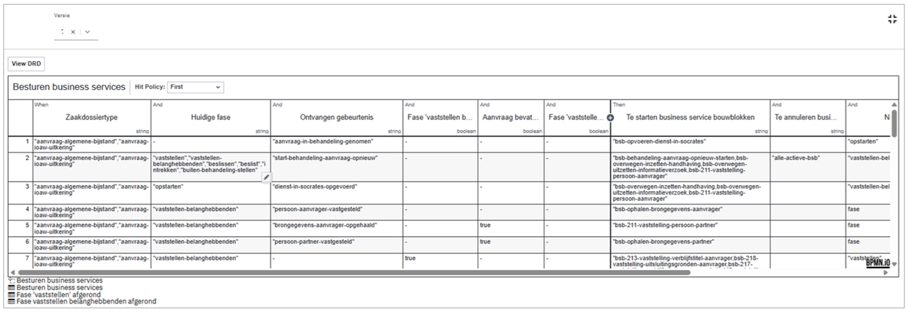

> \* Voorbeeld DMN-tabel: op basis van het type proces, de huidige fase,
> en nieuwe gebeurtenissen en de inhoud van die gebeurtenissen wordt een
> logische vervolgstap bepaald en gestart.

### BusinessService: voorbeeld

**Laag 5**

Een BusinessService ‘vaststellen’ persoon bestaat op de interactie-laag
uit een formulier voor de behandelaar dat met de volgende
functionaliteit:

- Het formulier toont de persoonsgegevens uit de aanvraag (BSN, naam,
  geboortedatum).

- Daarnaast worden de bijbehorende persoonsgegevens uit de BRP getoond,
  indien beschikbaar.

- De gebruiker beoordeelt of de BRP-gegevens overeenkomen met de
  aanvraag.

- Als BRP-gegevens beschikbaar zijn, moet de gebruiker kiezen of deze
  wel of niet gebruikt mogen worden.

- Bij de keuze *nee* moet een ander (gewenst) BSN worden ingevoerd.

- Als BRP-gegevens niet beschikbaar zijn, wordt direct gevraagd om een
  BSN in te voeren.

- De gebruiker moet een toelichting geven op de gemaakte keuze.

- Het formulier kan pas worden ingediend wanneer alle verplichte keuzes
  en invoer zijn gedaan.

**Laag 4**

Op laag 2 vindt het proces plaats waarin bovenstaande (het formulier)
één gebruikerstaak is.

- Het proces start met het ophalen van relevante invoer uit de aanvraag
  en eerdere vastleggingen (persoon, BRP-keuze, toelichting).

- Deze gegevens worden voorbereid en samengebracht als input voor
  vaststelling.

- Vervolgens wordt een subproces “vaststelling persoon” aangeroepen
  waarin de beoordeling plaatsvindt (zie bovenstaand formulier)

- In dit subproces wordt vastgelegd of de persoon is vastgesteld, met
  datum, toelichting en gebruikte BRP-gegevens.

- Het proces onderscheidt expliciet handmatige beoordeling van
  automatische vaststelling.

- Na afronding worden de resultaten weggeschreven:

  - Vastgestelde persoonsgegevens,

  - Aanvullende vastleggingsvelden,

  - En brondata uit de brp.

- De vastlegging gebeurt op vaste locaties voor de gegevens

- Het proces eindigt wanneer de persoon van de aanvrager definitief is
  vastgesteld.

#### Laag 2

Op laag 2 wordt de data consistent vastgelegd met gebruik van een
API-call, die er als volgt uit kan zien:

{

"identificatie": "string",

"bronorganisatie": "string",

"omschrijving": "Vaststelling persoon aanvrager",

"toelichting": "Motivatie van de consulent bij het vaststellen van de
persoon",

"vaststellingstype": "persoon",

"registratiedatum": "2019-08-24",

"datumVastgesteld": "2019-08-24T14:15:22Z",

"handmatigVastgesteld": true,

"vastgesteldePersoon": {

"bsn": "string",

"voornamen": "string",

"voorletters": "string",

"voorvoegsel": "string",

"achternaam": "string",

"geboortedatum": "2019-08-24"

},

"brongegevensPersoon": {

"bron": "BRP",

"bsn": "string",

"voornamen": "string",

"voorletters": "string",

"voorvoegsel": "string",

"achternaam": "string",

"geboortedatum": "string",

"onvolledigeGeboortedatum": true

},

"beoordeling": {

"brpGegevensGebruikt": true,

"toelichtingConsulent": "Korte onderbouwing van de gemaakte keuze"

},

"herkomst": {

"proces": "BSB-211 Vaststelling persoon",

"taak": "Vaststellen persoon aanvrager"

},

"archivering": {

"archiefstatus": "nog_te_archiveren",

"archiefactiedatum": "2019-08-24",

"archiefnominatie": "blijvend_bewaren"

}

}

#### 

#### Laag 1

Op laag 1 worden de door de service beheerde gegevens consistent,
leidend en deelbaar vastgelegd. Op het niveau van businessobjecten zijn
registraties beschikbaar (’Common Ground-registraties’) voor Zaken,
Producten, Klanten.

Voor specifieke (domeingebonden gegevens) zoals bijvoorbeeld Burgerzaken
of processen in het Sociaal Domein worden Domeinregistraties gebruikt.

**Granulariteit van BusinessServices**

Hoe groot of klein een BusinessService moet zijn, wordt bepaald door een
samenhang van functionele en inhoudelijke overwegingen. Daarbij zijn met
name de volgende factoren leidend:

- **Herbruikbaarheid van de service.** Een BusinessService moet logisch
  herbruikbaar zijn over meerdere processen en contexten. In het
  voorbeeld is de service *vaststellen persoon* generiek toepasbaar,
  omdat deze functionaliteit in veel processen terugkomt. Wanneer aan
  deze service ook proces- of domeinspecifieke functionaliteit wordt
  toegevoegd — zoals het toekennen van een paspoort — neemt de
  herbruikbaarheid af. Dergelijke functionaliteit hoort daarom thuis in
  een aparte BusinessService die een ander businessdoel dient.

- **Herhaalbaarheid van de service.** Een BusinessService moet meerdere
  keren op dezelfde wijze kunnen worden uitgevoerd, met vergelijkbare
  invoer en uitkomsten. Als een handeling slechts éénmalig of sterk
  contextafhankelijk is, is deze minder geschikt als zelfstandige
  BusinessService.

- **Niveau en scope van datavalidatie.** De benodigde mate van validatie
  en consistentiebewaking bepaalt mede de omvang van de BusinessService.
  Als een bedrijfsobject groot is en de vereiste consistentie zich
  uitstrekt over alle attributen (bijvoorbeeld identiteit, naam en
  geboortedatum in samenhang), is het logisch om deze validatie binnen
  één BusinessService te concentreren. Hierdoor kan de service als
  consistente eenheid optreden richting afnemers.

- **Cohesie van het businessconcept.** Een BusinessService moet één
  duidelijk businessconcept vertegenwoordigen.

### Blauwdruk gebruik van BusinessServices

Bovenstaand voorbeeld komt uit het proces Aanvraag Leefonderhoud. Dit
proces leent zich goed voor standaardisatie in de vorm van
BusinessServices omdat er een breedgedragen ontologie is geformuleerd
(<https://github.com/VNG-Realisatie/Ontologie-Inkomen/>).

Op basis van wat er ‘bestaat’ in het domein (concepten, relaties,
handelingen) worden BusinessServices geïdentificeerd. Een
**informatiemodel**, waarbij de Ontologie Inkomen een heel gedetailleerd
en gereviseerd voorbeeld betreft, is voorwaardelijk.

#### BusinessService - Ambiguïteit.

| **Context** |  | **Betekenis** | **Definitie** |
|----|----|----|----|
| **Businessarchitectuur** |  | Waarde voor een externe afnemer | Een *businessservice* is een door de organisatie geleverde, extern waarneembare dienst die een specifieke behoefte van een afnemer vervult, onafhankelijk van interne processen en technologie. |
| **ArchiMate (business layer)** |  | Formeel gedefinieerd architectuurconcept | Een *businessservice* is een service die vanuit de businesslaag wordt aangeboden aan een business actor of role, en die wordt gerealiseerd door businessprocessen en/of businessfuncties. |
| **SOA / IT-architectuur (informeel gebruik)** |  | IT-service met businesssemantiek | Een *BusinessService* is een applicatieservice die businessobjecten en -regels encapsuleert en herbruikbare functionaliteit biedt aan andere applicaties of kanalen. - in platformcontext: **een logisch geheel dat businessobjecten en -regels encapsuleert met een vastgestelde in - en output en herbruikbare functionaliteit.** |
| **Capability-gebaseerde architectuur** |  | Concretisering van een capability | Een *businessservice* is een afgebakende levering van waarde die laat zien hoe een capability extern of intern wordt benut door de organisatie. |
| **Product-georiënteerde organisaties** |  | Markt- of productdienst | Een *businessservice* is een door een team of product aangeboden dienst met een duidelijke scope, eigenaar en prestatieafspraken, gericht op continue waardecreatie voor gebruikers of klanten. |
| **Operating-model / service-management** |  | Organisatorische dienst | Een *businessservice* is een stabiel gedefinieerde organisatorische dienst waarvoor afspraken bestaan over kwaliteit, kosten en beschikbaarheid, vaak vastgelegd in SLA’s. |

### Samenwerking en uitwisseling bouwstenen

<https://samendelen.opengem.nl/> - Samen Delen is de plek waar de
inrichting van applicaties gedeeld kan worden met elkaar. Als een
applicatie een exportfunctie heeft, kunnen deze exports hier worden
geüpload. Anderen kunnen deze exports weer downloaden en importeren in
hun applicatie.

Voor **GZAC** is een Exchange.gzac.nl beschikbaar, met daarop:

[App](https://exchange.gzac.nl/)

- **Process Blue Prints** – Startklare basisprocessen; altijd lokaal te
  configureren en soms uit te breiden met maatwerk (bijv. een plugin).

- **Building Blocks** – Herbruikbare onderdelen zoals formulieren,
  zaakdefinities en subprocessen.

- **Plugins** – Uitbreidingen voor extra functionaliteit, vaak voor
  generieke koppelingen met andere systemen.

## BIJLAGE - Overzicht services

Overzicht van services en link naar documentatie binnen Platform
Dienstverlening.

**Laag 1/2 – Registraties & API-laag (Data & Services)**

**OpenZaak**

Moderne open-source implementatie van de ZGW-API’s voor zaak- en
documentbeheer.

<https://github.com/open-zaak/open-zaak>

**OpenKlant**

Registratiecomponent voor opslag en ontsluiting van klantgegevens
volgens de Klantinteracties-API-specificaties.

<https://github.com/maykinmedia/open-klant>

**OpenOrganisatie**

Component voor beheer van medewerkers, teams en organisaties met
API-toegang en o.a. SCIM-integratie.

<https://github.com/maykinmedia/open-organisatie>

**OpenProduct**

Centrale API voor producttypen en producten, bedoeld voor hergebruik in
andere applicaties.

<https://github.com/maykinmedia/open-product>

**Registraties VTB (Verzoeken, taken berichten)**

Componenten voor (resp.) Verzoeken, Taken en Berichten als
gestandaardiseerde informatie-objecten, voor communicatie- en
interactiepatronen over het platform.

[maykinmedia/open-vtb: Open Verzoeken, Taken en
Berichten](https://github.com/maykinmedia/open-vtb)

**Objects API**

API en beheerinterface voor het registreren en beheren van generieke
objecten binnen Common Ground.

<https://github.com/maykinmedia/objects-api>

**Objecttypes API**

API voor het definiëren en beheren van objecttypen die gebruikt worden
door Objects API-implementaties.

<https://github.com/maykinmedia/objecttypes-api>

**Referentielijsten API**

API voor generieke en herbruikbare referentielijsten binnen het Common
Ground-landschap.

<https://github.com/maykinmedia/referentielijsten>

**OpenNotificaties**

API voor het routeren en publiceren van notificaties tussen applicaties
binnen een Common Ground-architectuur.

<https://github.com/open-zaak/open-notificaties>

**OpenArchiefbeheer**

Component voor recordmanagement en vernietigingslijsten conform
archiefwet- en ZGW-principes.

<https://github.com/maykinmedia/open-archiefbeheer>

**Open API Framework**

Gedeeld framework met basisfunctionaliteit en configuratie voor meerdere
Open-componenten.

<https://github.com/maykinmedia/open-api-framework>

**Laag 4/5 – Interactie & Toepassingen (Portalen & UI)**

**GZAC**

Zaakafhandelcomponent gericht op proces- en taakondersteuning bovenop
ZGW-API’s.

<https://github.com/generiekzaakafhandelcomponent>

Het onderliggende framework (Operaton) wordt tevens ingezet voor de
uitvoering van beslislogica via DMN. Op basis van de DMN-engine(s) wordt
regelbeheer voor verschillende services centraal uitgevoerd en afgedekt
via configuratie, zonder dat hiervoor maatwerk per proces nodig is.

**ZAC**

Zaakafhandelcomponent gericht op proces- en taakondersteuning bovenop
ZGW-API’s.

<https://github.com/infonl/dimpact-zaakafhandelcomponent>

**DMN Studio**

Beheercomponent voor inrichting van beslisregels in Operaton
DMN-instances.

<https://github.com/SynTouchNL/dmn-studio-backend>

**NL Portal**

Portaaloplossing voor inwoner- en medewerkersinteractie binnen een
Common Ground-architectuur.

<https://github.com/nl-portal>

**OpenInwonerPortaal**

Gemeentelijk platform voor producten en diensten met integraties naar
Common Ground-componenten.

<https://github.com/maykinmedia/open-inwoner>

**IKO – Integraal Klant- en Objectbeeld**

Integreert klant- en objectgegevens tot één overzicht voor
case-medewerkers

*Doc pagina (functieomschrijving):*
<https://docs.valtimo.nl/features/iko>

**Open Formulieren**

Faciliteert het modelleren, aanbieden en verwerken van digitale
formulieren voor inwoners en organisaties. Het component verzorgt de
gestructureerde uitvraag van gegevens, valideert invoer en legt
inzendingen vast via gestandaardiseerde API’s.

<https://github.com/open-formulieren/open-forms/>

**OpenBeheer**

Biedt een centrale beheerinterface voor het beheren van gegevens uit
meerdere registraties binnen samenhangende processen, zonder dat deze
registraties zelf worden aangepast.

<https://github.com/maykinmedia/open-beheer>

**Faciliterende voorzieningen**

Aanvullend op de bovenstaande kerncomponenten bevat het platform een
aantal ondersteunende voorzieningen die noodzakelijk zijn voor de
volledige inrichting van de dienstverlening:

- **Toegang en beveiliging**: authenticatie- en autorisatievoorzieningen
  (o.a. DigiD, eHerkenning, eIDAS, machtigingen, Keycloak/OpenID
  Connect, met (optionele) koppeling met Azure AD)

- **Communicatie en output**: integratie met e-mailafhandeling (SMTP
  relay, mailbox/outbox), documentgeneratie (templates, PDF) en
  printvoorzieningen

- **Gegevensontsluiting en externe bronnen**: koppelingen met landelijke
  registraties en externe databronnen (zoals BRP, BAG, KvK, Kadaster via
  HaalCentraal)

- **Monitoring en logging**: centrale voorzieningen voor observability
  (o.a. Grafana, Loki) ten behoeve van beheer, auditing en
  betrouwbaarheid (onderdeel van Haven+).

Deze voorzieningen zijn integraal onderdeel van het platform, maar
worden ingezet als generieke capabilities die door meerdere services en
processen worden gebruikt.

## BIJLAGE - ABB’s GEMMA en Platform Dienstverlening

GEMMA biedt een overzicht van
[referentiecomponenten](https://www.gemmaonline.nl/wiki/Overzicht_alle_referentiecomponenten)
en de bijbehorende services die gerealiseerd kunnen worden. Per service
kan worden bepaald in hoeverre het Platform Dienstverlening deze
functionaliteit invult.

Per service (linkt door naar GEMMA-definitie) is aangegeven of die in
scope is, met als onderscheid:

- **Expliciet in scope**: functionaliteit die momenteel wordt
  gerealiseerd in het Platform, of staat op relatief korte termijn (1-2
  jaar) op de roadmap

- **Potentieel in scope**: functionaliteit die niet op de roadmap staat,
  maar inhoudelijk geschikt is om te worden ondergebracht binnen
  generieke services van het Platform.

| **Services** | **Expliciet in Scope** | **Potentieel in scope** |
|----|----|----|
| [Kunstmatige intelligentie](https://www.gemmaonline.nl/wiki/GEMMA/id-fe1dd64a-90d9-4d5c-bc2e-bab3ba42bc76) | x |  |
| [Ondersteunen van gebouw-, ruimte- en locatietoegang.](https://www.gemmaonline.nl/wiki/GEMMA/id-17352034-a310-11e5-11ba-005056a85f9c) |  | x |
| [Beheren van accommodaties](https://www.gemmaonline.nl/wiki/GEMMA/id-b2738bc8-8c74-11e5-1099-005056a83192) |  | x |
| [Beheren van afspraken](https://www.gemmaonline.nl/wiki/GEMMA/id-c7d90e6f-dec6-11e5-11ba-005056a85f9c) | x |  |
| [Aanmaken, raadplegen, bijwerken en verwijderen van afspraken](https://www.gemmaonline.nl/wiki/GEMMA/id-e812b86b-70e9-11e5-1099-005056a83192) | x |  |
| [Genereren van berichten mbt afspraken](https://www.gemmaonline.nl/wiki/GEMMA/id-6e4e6f73-304c-11e5-1099-005056a83192) | x |  |
| [Maken van afspraken](https://www.gemmaonline.nl/wiki/GEMMA/id-857ffb0d-da88-11e1-7023-0050568a1905) | x |  |
| [Ondersteunen van afvalopslag en -verwerking](https://www.gemmaonline.nl/wiki/GEMMA/id-9590eb24-63e5-422e-9775-e95d3c40fd98) |  |  |
| [Ondersteunen afvalinzameling](https://www.gemmaonline.nl/wiki/GEMMA/id-eb8e8447-a6fc-4c92-a14f-17f6433585e0) |  |  |
| [Ondersteunen van registreren agressiegevallen](https://www.gemmaonline.nl/wiki/GEMMA/id-4adc69ea-d707-11e5-11ba-005056a85f9c) | x |  |
| [Netwerkbescherming](https://www.gemmaonline.nl/wiki/GEMMA/id-7388053d-8ce5-4aae-8e7b-7cd8239230b3) |  |  |
| [Beschermen tegen malware](https://www.gemmaonline.nl/wiki/GEMMA/id-e6aab46b-c6f5-4308-a7cc-d7a0e97c9016) | x |  |
| [Gegevensbescherming en onderzoek](https://www.gemmaonline.nl/wiki/GEMMA/id-8e89a47b-3f82-484a-95ba-a747c597d6f8) | x |  |
| [Beheren media](https://www.gemmaonline.nl/wiki/GEMMA/id-185d3047-0d24-4743-82f6-d695766294fc) |  |  |
| [Mobiele apparaten beveiliging](https://www.gemmaonline.nl/wiki/GEMMA/id-ec34138c-a62a-48f4-b36f-f090ee3a10bd) |  |  |
| [Ondersteunen van forensisch onderzoek](https://www.gemmaonline.nl/wiki/GEMMA/id-daa156d3-a752-4419-bc7b-a74e5be61040) |  |  |
| [Spam-filtering](https://www.gemmaonline.nl/wiki/GEMMA/id-266cb309-e977-44bc-a157-6443b7041b30) |  |  |
| [Ondersteunen van archeologie](https://www.gemmaonline.nl/wiki/GEMMA/id-45fdcf8f-4d8b-4b87-bfff-3b5c9a76e74f) | x |  |
| [Archiveren van informatieobjecten](https://www.gemmaonline.nl/wiki/GEMMA/id-2d0f6cb7-16c9-11e3-284c-08002700d457) | x |  |
| [Beheren gearchiveerde informatieobjecten](https://www.gemmaonline.nl/wiki/GEMMA/id-7d7b8604-bf58-11e1-7023-0050568a1905) | x |  |
| [Documenteren van beheer van informatieobjecten](https://www.gemmaonline.nl/wiki/GEMMA/id-36bb3359-70f3-11e5-1099-005056a83192) | x |  |
| [Tonen en zoeken van informatieobjecten](https://www.gemmaonline.nl/wiki/GEMMA/id-36bb333f-70f3-11e5-1099-005056a83192) | x |  |
| [Beschikbaarstellen van informatieobjecten](https://www.gemmaonline.nl/wiki/GEMMA/id-36bb3345-70f3-11e5-1099-005056a83192) | x |  |
| [Aanbieden informatieobjecten als download](https://www.gemmaonline.nl/wiki/GEMMA/id-77f4c2e0-b562-11e5-11ba-005056a85f9c) | x |  |
| [Online beschikbaarstellen informatieobjecten](https://www.gemmaonline.nl/wiki/GEMMA/id-30381010-b55b-11e5-11ba-005056a85f9c) | x |  |
| [Duurzaam opslaan en ontsluiten informatieobjecten](https://www.gemmaonline.nl/wiki/GEMMA/id-36bb333a-70f3-11e5-1099-005056a83192) | x |  |
| [Converteren informatieobject naar duurzaam formaat](https://www.gemmaonline.nl/wiki/GEMMA/id-05f40152-b54b-11e5-11ba-005056a85f9c) | x |  |
| [Opslaan en ontsluiten data informatieobjecten](https://www.gemmaonline.nl/wiki/GEMMA/id-36bb3342-70f3-11e5-1099-005056a83192) | x |  |
| [Opslaan en ontsluiten metagegevens informatieobjecten](https://www.gemmaonline.nl/wiki/GEMMA/id-8a67b6c5-c2da-11e5-11ba-005056a85f9c) | x |  |
| [Valideren van informatieobjecten](https://www.gemmaonline.nl/wiki/GEMMA/id-36bb334d-70f3-11e5-1099-005056a83192) | x |  |
| [Verwijderen/vernietigen van informatieobjecten](https://www.gemmaonline.nl/wiki/GEMMA/id-36bb3356-70f3-11e5-1099-005056a83192) | x |  |
| [Beheren van architectuurmodellen](https://www.gemmaonline.nl/wiki/GEMMA/id-c953c4e0-d71a-11e5-11ba-005056a85f9c) |  |  |
| [Beheren van BAG gegevens](https://www.gemmaonline.nl/wiki/GEMMA/id-3ff4ac94-b730-4d19-96fc-3200db14b507) | x |  |
| [Beheren van BGT gegevens](https://www.gemmaonline.nl/wiki/GEMMA/id-ffa140e7-09a7-490d-91b5-28203cbda688) | x |  |
| [Beheren van managementinformatie](https://www.gemmaonline.nl/wiki/GEMMA/id-8280288e-da88-11e1-7023-0050568a1905) |  |  |
| [Analyseren van gegevens](https://www.gemmaonline.nl/wiki/GEMMA/id-257894d2-2b22-11e5-1099-005056a83192) |  |  |
| [Analyseren van geo-gegevens](https://www.gemmaonline.nl/wiki/GEMMA/id-568b6348-29d8-48aa-92a3-6d10fcdb326b) |  |  |
| [Integreren van gegevens](https://www.gemmaonline.nl/wiki/GEMMA/id-05e0f151-641b-11e4-67ab-0050568a6153) |  |  |
| [Maken en tonen van rapportages](https://www.gemmaonline.nl/wiki/GEMMA/id-48c06f9c-bf77-11e1-7023-0050568a1905) |  |  |
| [Maken en tonen van trendanalyses](https://www.gemmaonline.nl/wiki/GEMMA/id-d4eabc21-dfba-11e1-7023-0050568a1905) |  |  |
| [Tonen van standaard selecties](https://www.gemmaonline.nl/wiki/GEMMA/id-800a829b-db4e-11e1-7023-0050568a1905) |  |  |
| [Verwerven en transformeren van data](https://www.gemmaonline.nl/wiki/GEMMA/id-2eb9a95b-3a91-446e-b862-b6fa5fe9bceb) |  |  |
| [Ondersteunen curatief beheer](https://www.gemmaonline.nl/wiki/GEMMA/id-4285a7ae-17cc-452e-99b2-5249cd742734) |  |  |
| [Ondersteunen preventief beheer](https://www.gemmaonline.nl/wiki/GEMMA/id-10a4ab11-9ec7-46ca-9d5f-d0f832baf29f) |  |  |
| [Aanmaken en geautomatiseerd uitvoeren processen](https://www.gemmaonline.nl/wiki/GEMMA/id-e812b877-70e9-11e5-1099-005056a83192) | x |  |
| [Aanmaken, delen, bijwerken en verwijderen van processen](https://www.gemmaonline.nl/wiki/GEMMA/id-e812b87f-70e9-11e5-1099-005056a83192) | x |  |
| [Monitoren en loggen van procesuitvoering](https://www.gemmaonline.nl/wiki/GEMMA/id-e812b882-70e9-11e5-1099-005056a83192) | x |  |
| [Uitvoeren processen](https://www.gemmaonline.nl/wiki/GEMMA/id-4e099407-da8d-11e1-7023-0050568a1905) | x |  |
| [Beheren en inwinnen BRO-gegevens](https://www.gemmaonline.nl/wiki/GEMMA/id-9dc22a80-fc84-48e1-a5ba-55c754fb4da0) | x |  |
| [Ondersteunen van baliedienstverlening](https://www.gemmaonline.nl/wiki/GEMMA/id-b2738be2-8c74-11e5-1099-005056a83192) | x |  |
| [Bedrijfscontinuïteitsplanning](https://www.gemmaonline.nl/wiki/GEMMA/id-7bc33993-21ee-492a-8632-1c525bc32bee) |  |  |
| [Beheren van processen](https://www.gemmaonline.nl/wiki/GEMMA/id-8280287e-da88-11e1-7023-0050568a1905) | x |  |
| [Analyseren processen](https://www.gemmaonline.nl/wiki/GEMMA/id-eb5cb7da-c5b6-11e5-11ba-005056a85f9c) | x |  |
| [Definiëren processen](https://www.gemmaonline.nl/wiki/GEMMA/id-4e09940f-da8d-11e1-7023-0050568a1905) | x |  |
| [Monitoren processen](https://www.gemmaonline.nl/wiki/GEMMA/id-4e09940b-da8d-11e1-7023-0050568a1905) | x |  |
| [Aanmaken, delen, verwijderen en wijzigen van bedrijven- en instellingengegevens](https://www.gemmaonline.nl/wiki/GEMMA/id-9f1cee85-dc61-11e5-11ba-005056a85f9c) | x |  |
| [Ondersteunen van belasting subject- en objectregistratie](https://www.gemmaonline.nl/wiki/GEMMA/id-7b0e775f-7852-4d2c-b213-f196ad83c2b8) | x |  |
| [Ondersteunen van belastingheffing](https://www.gemmaonline.nl/wiki/GEMMA/id-b2738be0-8c74-11e5-1099-005056a83192) | x |  |
| [Ondersteunen van kwijtschelding](https://www.gemmaonline.nl/wiki/GEMMA/id-a0b50b5f-ab07-4c12-a84d-333d2eb81094) | x |  |
| [Maken van bestekken](https://www.gemmaonline.nl/wiki/GEMMA/id-fd66da7c-94c1-4045-9580-fefe1219219b) |  |  |
| [Besluitvormingsproces transparantie](https://www.gemmaonline.nl/wiki/GEMMA/id-257894e8-2b22-11e5-1099-005056a83192) | x |  |
| [Politieke data-analyse](https://www.gemmaonline.nl/wiki/GEMMA/id-364554c6-8ab0-469d-a66a-46973d1e336b) |  |  |
| [Uitzenden van vergaderingen](https://www.gemmaonline.nl/wiki/GEMMA/id-a13af283-8c52-11e5-1099-005056a83192) |  |  |
| [Bestuurlijk overleg en besluitvorming](https://www.gemmaonline.nl/wiki/GEMMA/id-a13af289-8c52-11e5-1099-005056a83192) |  |  |
| [Archiveren van vergadering en besluiten](https://www.gemmaonline.nl/wiki/GEMMA/id-a13af27f-8c52-11e5-1099-005056a83192) |  |  |
| [Opstellen en distribueren van agenda en stukken](https://www.gemmaonline.nl/wiki/GEMMA/id-a13af281-8c52-11e5-1099-005056a83192) |  |  |
| [Vastleggen van vergaderingen en besluiten](https://www.gemmaonline.nl/wiki/GEMMA/id-a13af287-8c52-11e5-1099-005056a83192) |  |  |
| [Voorbereidingsproces bestuurlijke besluiten](https://www.gemmaonline.nl/wiki/GEMMA/id-76339b62-d7c6-4bd8-bcab-969269044746) |  |  |
| [Ondersteunen bewaking bestuurlijke activiteiten](https://www.gemmaonline.nl/wiki/GEMMA/id-3a047a27-312f-4c25-bf71-4481b50969d9) |  |  |
| [Beheren en implementeren van beveiligingsmaatregelen](https://www.gemmaonline.nl/wiki/GEMMA/id-7ba4b0b2-b37a-4c21-86cc-bfb6f46668fb) | x |  |
| [Ondersteunen van bezwaar- en beroep](https://www.gemmaonline.nl/wiki/GEMMA/id-7c11ebd7-3504-4696-ac1e-2d458ac2895c) | x |  |
| [Beheren van bodemgegevens](https://www.gemmaonline.nl/wiki/GEMMA/id-b42f487d-da8a-4393-9907-dd85cbd774ae) |  | x |
| [Beheren van budgetbeheer](https://www.gemmaonline.nl/wiki/GEMMA/id-62f02946-86e4-11e5-1099-005056a83192) |  | x |
| [Beheren van zaken](https://www.gemmaonline.nl/wiki/GEMMA/id-04e68515-89bc-11e3-67ab-0050568a6153) | x |  |
| [Aanmaken zaak](https://www.gemmaonline.nl/wiki/GEMMA/id-fd760383-6418-11e4-67ab-0050568a6153) | x |  |
| [Agenderen van zaken](https://www.gemmaonline.nl/wiki/GEMMA/id-fd460824-e70a-11e1-7023-0050568a1905) | x |  |
| [Monitoren zaken](https://www.gemmaonline.nl/wiki/GEMMA/id-d2420b9e-2b06-11e5-1099-005056a83192) | x |  |
| [Ondersteunen zaakafhandeling](https://www.gemmaonline.nl/wiki/GEMMA/id-dbace431-754d-11e4-67ab-0050568a6153) | x |  |
| [Plannen van zaken](https://www.gemmaonline.nl/wiki/GEMMA/id-3efd83d6-80d4-4e71-a37d-0c38fd11e03c) | x |  |
| [Relateren van contactmomenten aan zaken](https://www.gemmaonline.nl/wiki/GEMMA/id-56a3ac10-82fa-11e5-1099-005056a83192) | x |  |
| [Tonen en bijwerken zaakdocumenten](https://www.gemmaonline.nl/wiki/GEMMA/id-3d6a02a0-e6f1-11e1-7023-0050568a1905) | x |  |
| [Tonen en bijwerken zaakgegevens](https://www.gemmaonline.nl/wiki/GEMMA/id-9d9db8d1-db0e-11e1-7023-0050568a1905) | x |  |
| [Uitwisselen van berichten met ketenpartners](https://www.gemmaonline.nl/wiki/GEMMA/id-6f9190b3-82f4-11e5-1099-005056a83192) | x |  |
| [Ondersteunen van Nederlanderschap diensten](https://www.gemmaonline.nl/wiki/GEMMA/id-fe815613-17e9-471b-961d-749993122b60) | x |  |
| [Ondersteunen van burgerlijke stand diensten](https://www.gemmaonline.nl/wiki/GEMMA/id-0821fe1a-77e3-44f6-bfaf-dde08b3d4794) | x |  |
| [Ondersteunen van documenten verstrekking](https://www.gemmaonline.nl/wiki/GEMMA/id-2421774a-f228-4bf6-9c2e-77a1db8f4678) | x |  |
| [Matchen van vraag en aanbod](https://www.gemmaonline.nl/wiki/GEMMA/id-4ea3c3f8-89b8-11e3-67ab-0050568a6153) |  | x |
| [Tonen van sociale kaart](https://www.gemmaonline.nl/wiki/GEMMA/id-4ea3c3fc-89b8-11e3-67ab-0050568a6153) |  | x |
| [Ondersteunen slachtoffer registratie](https://www.gemmaonline.nl/wiki/GEMMA/id-fd20af0a-1737-4f26-b079-6a2914e41cfd) |  | x |
| [Ondersteunen van callcenterwerkzaamheden](https://www.gemmaonline.nl/wiki/GEMMA/id-b2738be8-8c74-11e5-1099-005056a83192) | x |  |
| [Ondersteunen van handhaving](https://www.gemmaonline.nl/wiki/GEMMA/id-430023c6-13ee-4a98-aeaa-8305c8e71385) |  | x |
| [Ondersteunen van toezicht](https://www.gemmaonline.nl/wiki/GEMMA/id-798139ea-4554-4166-80c0-ce7521c167f1) |  | x |
| [Ondersteunen van burgerparticipatie](https://www.gemmaonline.nl/wiki/GEMMA/id-af5f8651-7ecf-11e3-67ab-0050568a6153) |  | x |
| [Input vragen voor beleid](https://www.gemmaonline.nl/wiki/GEMMA/id-5f1eb6eb-78aa-11e5-1099-005056a83192) |  | x |
| [Ondersteunen van burgerinitiatieven](https://www.gemmaonline.nl/wiki/GEMMA/id-708b40cf-827f-4d8d-9bb3-38cf07d250cd) |  | x |
| [Peilen van meningen bij inwoners en ondernemers](https://www.gemmaonline.nl/wiki/GEMMA/id-5f1eb6ee-78aa-11e5-1099-005056a83192) |  | x |
| [Beheren contracten](https://www.gemmaonline.nl/wiki/GEMMA/id-2148f40d-0c73-4588-a61a-eb51dbb12807) |  | x |
| [Ondersteunen van contracten- en SLA-beheer](https://www.gemmaonline.nl/wiki/GEMMA/id-1f9b69f7-89bd-11e3-67ab-0050568a6153) |  | x |
| [Ondersteunen coördinatie crises en rampen](https://www.gemmaonline.nl/wiki/GEMMA/id-3d19033c-2c3d-47e5-b1ae-bbae6a2438f7) |  |  |
| [Analyseren van grote hoeveelheden criminaliteitsdata](https://www.gemmaonline.nl/wiki/GEMMA/id-d84592ad-8fbd-4b1b-b0be-58ef895a7633) |  |  |
| [Berekenen van relatienetwerken](https://www.gemmaonline.nl/wiki/GEMMA/id-a51221c4-4e87-4116-962e-970bd67c3d02) |  |  |
| [Machine learning criminaliteitsdata](https://www.gemmaonline.nl/wiki/GEMMA/id-c989f4fd-9d73-430a-99ba-87b890546d49) |  |  |
| [Beheren backup](https://www.gemmaonline.nl/wiki/GEMMA/id-65a4e23a-54e9-49dc-b654-c2947f8ee4ea) | x |  |
| [Risicobeheer en continuïteit](https://www.gemmaonline.nl/wiki/GEMMA/id-11c6f30f-db79-4e66-a79f-e7935baec1c4) |  |  |
| [Beheren risico’s](https://www.gemmaonline.nl/wiki/GEMMA/id-87722827-5910-47c2-8d40-a2a20414f4c3) |  |  |
| [Registreren en delen van gegevenssets](https://www.gemmaonline.nl/wiki/GEMMA/id-bafa0219-44ba-11e4-67ab-0050568a6153) | x |  |
| [Delen van gegevenssets](https://www.gemmaonline.nl/wiki/GEMMA/id-b7b0f990-6779-11e4-67ab-0050568a6153) | x |  |
| [Inzamelen en transformeren van gegevens](https://www.gemmaonline.nl/wiki/GEMMA/id-05e0f14e-641b-11e4-67ab-0050568a6153) |  |  |
| [Opslaan van gegevenssets](https://www.gemmaonline.nl/wiki/GEMMA/id-05e0f15e-641b-11e4-67ab-0050568a6153) | x |  |
| [Ontwikkelen van ruimtelijk ontwerpen](https://www.gemmaonline.nl/wiki/GEMMA/id-1d2f7bf9-64c4-4f23-8383-dac60d7737c5) |  |  |
| [Digitaal ondertekenen documenten](https://www.gemmaonline.nl/wiki/GEMMA/id-b86d3928-e6f4-11e1-7023-0050568a1905) |  | x |
| [Beheren van documenten](https://www.gemmaonline.nl/wiki/GEMMA/id-857ffaf7-da88-11e1-7023-0050568a1905) | x |  |
| [Aanmaken van documenten](https://www.gemmaonline.nl/wiki/GEMMA/id-622a01e0-ca76-11e5-11ba-005056a85f9c) | x |  |
| [Maken en beheren templates](https://www.gemmaonline.nl/wiki/GEMMA/id-1090751d-bf5a-11e1-7023-0050568a1905) | x |  |
| [Metadateren documenten](https://www.gemmaonline.nl/wiki/GEMMA/id-5bc57455-db4c-11e1-7023-0050568a1905) | x |  |
| [Ondersteunen van versiebeheer](https://www.gemmaonline.nl/wiki/GEMMA/id-eb5cb7ca-c5b6-11e5-11ba-005056a85f9c) | x |  |
| [Tonen en bijwerken van documenten](https://www.gemmaonline.nl/wiki/GEMMA/id-7d7b85ec-bf58-11e1-7023-0050568a1905) | x |  |
| [Genereren van documenten](https://www.gemmaonline.nl/wiki/GEMMA/id-b83683b6-70da-11e5-1099-005056a83192) | x |  |
| [Registreren en delen van documenten](https://www.gemmaonline.nl/wiki/GEMMA/id-5108d100-70d7-11e5-1099-005056a83192) | x |  |
| [Aanmaken, delen, verwijderen en wijzigen van documenten](https://www.gemmaonline.nl/wiki/GEMMA/id-b83683bf-70da-11e5-1099-005056a83192) | x |  |
| [Aanmaken, delen, verwijderen en wijzigen van dossiers](https://www.gemmaonline.nl/wiki/GEMMA/id-b83683c2-70da-11e5-1099-005056a83192) | x |  |
| [Versiebeheer van documenten](https://www.gemmaonline.nl/wiki/GEMMA/id-b83683bc-70da-11e5-1099-005056a83192) | x |  |
| [Aanvragen van producten en diensten](https://www.gemmaonline.nl/wiki/GEMMA/id-c80a4c5c-89b9-11e3-67ab-0050568a6153) | x |  |
| [Indienen aanvraag en tonen ontvangstbevestiging](https://www.gemmaonline.nl/wiki/GEMMA/id-1dbdb3d3-2b39-11e5-1099-005056a83192) | x |  |
| [Ondersteunen van vraag-antwoord dialoog](https://www.gemmaonline.nl/wiki/GEMMA/id-1dbdb3d9-2b39-11e5-1099-005056a83192) | x |  |
| [Toetsen van voorwaarden](https://www.gemmaonline.nl/wiki/GEMMA/id-9a9e7398-ce8f-4f6f-8673-968c43ffc8c5) | x |  |
| [Beheren van e-formulieren](https://www.gemmaonline.nl/wiki/GEMMA/id-cf6b78c7-5ff6-4d0e-98ff-60f827d79e55) | x |  |
| [Beheren van erfpachtrechten](https://www.gemmaonline.nl/wiki/GEMMA/id-6b81251d-f958-438c-b5c0-9a1a3bd7b5b9) | x |  |
| [Ondersteunen van uitlenen facilitaire middelen](https://www.gemmaonline.nl/wiki/GEMMA/id-8683ad61-d4af-11e5-11ba-005056a85f9c) |  |  |
| [Beheren van bruto c.q. netto verwerking](https://www.gemmaonline.nl/wiki/GEMMA/id-fd1337ac-2bbb-463f-9bd7-abc73566ce22) |  |  |
| [Ondersteunen van financiële processen](https://www.gemmaonline.nl/wiki/GEMMA/id-9a7ec620-d716-11e5-11ba-005056a85f9c) |  |  |
| [Beheren budgettering](https://www.gemmaonline.nl/wiki/GEMMA/id-20ce6b29-a4db-11e5-11ba-005056a85f9c) |  |  |
| [Beheren crediteuren](https://www.gemmaonline.nl/wiki/GEMMA/id-20ce6b23-a4db-11e5-11ba-005056a85f9c) |  |  |
| [Beheren debiteuren](https://www.gemmaonline.nl/wiki/GEMMA/id-20ce6b25-a4db-11e5-11ba-005056a85f9c) |  |  |
| [Beheren declaraties en facturen](https://www.gemmaonline.nl/wiki/GEMMA/id-1f9b69fb-89bd-11e3-67ab-0050568a6153) |  |  |
| [Beheren grootboek](https://www.gemmaonline.nl/wiki/GEMMA/id-20ce6b21-a4db-11e5-11ba-005056a85f9c) |  |  |
| [Beheren projectboekhouding](https://www.gemmaonline.nl/wiki/GEMMA/id-20ce6b2b-a4db-11e5-11ba-005056a85f9c) |  |  |
| [Beheren uitgavenbeheer](https://www.gemmaonline.nl/wiki/GEMMA/id-20ce6b2d-a4db-11e5-11ba-005056a85f9c) |  |  |
| [Beheren vaste activa](https://www.gemmaonline.nl/wiki/GEMMA/id-20ce6b27-a4db-11e5-11ba-005056a85f9c) |  |  |
| [Ondersteunen budgetbewaking](https://www.gemmaonline.nl/wiki/GEMMA/id-1f9b69ff-89bd-11e3-67ab-0050568a6153) |  |  |
| [Beheren netwerkverkeer](https://www.gemmaonline.nl/wiki/GEMMA/id-7f57ac1c-556c-4afc-bf5a-43052fd299f8) | x |  |
| [Beheren van persoons gerelateerde gegevens (BRP)](https://www.gemmaonline.nl/wiki/GEMMA/id-e2d3c9ca-789c-11e5-1099-005056a83192) | x |  |
| [Ondersteunen van gebouwinstallatiebeheer](https://www.gemmaonline.nl/wiki/GEMMA/id-af7319ff-9b8e-4e2b-9e06-30b9cdd75331) |  |  |
| [ICT Toegangsbeveiliging](https://www.gemmaonline.nl/wiki/GEMMA/id-53c598bd-8af5-4007-80ca-7d4acbd874fa) | x |  |
| [Beheren wachtwoorden](https://www.gemmaonline.nl/wiki/GEMMA/id-0dfb5167-6910-414a-9a18-ae16fd0ee8ae) | x |  |
| [Registreren en delen van identiteiten en autorisaties](https://www.gemmaonline.nl/wiki/GEMMA/id-1f0cf037-89be-11e3-67ab-0050568a6153) | x |  |
| [Beheren gebruikers](https://www.gemmaonline.nl/wiki/GEMMA/id-81efe2f1-70e2-11e5-1099-005056a83192) | x |  |
| [Beheren toegangsrechten](https://www.gemmaonline.nl/wiki/GEMMA/id-81efe2f4-70e2-11e5-1099-005056a83192) | x |  |
| [Distribueren en synchroniseren van gegevens](https://www.gemmaonline.nl/wiki/GEMMA/id-1f0cf02b-89be-11e3-67ab-0050568a6153) | x |  |
| [Configureren distributieregels](https://www.gemmaonline.nl/wiki/GEMMA/id-9345b053-a8ab-11e5-11ba-005056a85f9c) | x |  |
| [Configureren van abonnementen](https://www.gemmaonline.nl/wiki/GEMMA/id-3d6a029c-e6f1-11e1-7023-0050568a1905) | x |  |
| [Configureren van bronnen en afnemers](https://www.gemmaonline.nl/wiki/GEMMA/id-612763bb-da91-11e1-7023-0050568a1905) | x |  |
| [Distribueren van gegevens](https://www.gemmaonline.nl/wiki/GEMMA/id-4e099431-da8d-11e1-7023-0050568a1905) | x |  |
| [Inwinnen van gegevens](https://www.gemmaonline.nl/wiki/GEMMA/id-257894d7-2b22-11e5-1099-005056a83192) | x |  |
| [Synchroniseren van gegevens](https://www.gemmaonline.nl/wiki/GEMMA/id-612763b7-da91-11e1-7023-0050568a1905) | x |  |
| [Registreren en delen van basisgegevens](https://www.gemmaonline.nl/wiki/GEMMA/id-bafa0216-44ba-11e4-67ab-0050568a6153) | x |  |
| [Delen van basisgegevens](https://www.gemmaonline.nl/wiki/GEMMA/id-4887a46e-a8c9-11e5-11ba-005056a85f9c) | x |  |
| [Registreren van basisgegevens](https://www.gemmaonline.nl/wiki/GEMMA/id-4887a468-a8c9-11e5-11ba-005056a85f9c) | x |  |
| [Beheren van gemeentelijke eigendommen](https://www.gemmaonline.nl/wiki/GEMMA/id-8683ad5f-d4af-11e5-11ba-005056a85f9c) |  | x |
| [Aanleveren bericht door bron](https://www.gemmaonline.nl/wiki/GEMMA/id-d143a216-02dc-11e6-11ba-005056a85f9c) | x |  |
| [Routeren en transformeren van berichten](https://www.gemmaonline.nl/wiki/GEMMA/id-5db0cf80-83a1-11e5-1099-005056a83192) | x |  |
| [Beveiligen van berichtenverkeer](https://www.gemmaonline.nl/wiki/GEMMA/id-5db0cf97-83a1-11e5-1099-005056a83192) | x |  |
| [Loggen van berichtenverkeer](https://www.gemmaonline.nl/wiki/GEMMA/id-5db0cf94-83a1-11e5-1099-005056a83192) | x |  |
| [Monitoren van berichtenverkeer](https://www.gemmaonline.nl/wiki/GEMMA/id-5db0cf91-83a1-11e5-1099-005056a83192) | x |  |
| [Ontvangen van berichten](https://www.gemmaonline.nl/wiki/GEMMA/id-5db0cf85-83a1-11e5-1099-005056a83192) | x |  |
| [Orkestreren van berichten](https://www.gemmaonline.nl/wiki/GEMMA/id-5db0cf8e-83a1-11e5-1099-005056a83192) | x |  |
| [Routeren van berichten](https://www.gemmaonline.nl/wiki/GEMMA/id-5db0cf8b-83a1-11e5-1099-005056a83192) | x |  |
| [Transformeren van berichten](https://www.gemmaonline.nl/wiki/GEMMA/id-5db0cf88-83a1-11e5-1099-005056a83192) | x |  |
| [Servicebuscomponentservice](https://www.gemmaonline.nl/wiki/GEMMA/id-5dbdc95a-02f9-11e6-11ba-005056a85f9c) |  |  |
| [Verzenden bericht naar afnemers](https://www.gemmaonline.nl/wiki/GEMMA/id-d143a21c-02dc-11e6-11ba-005056a85f9c) | x |  |
| [Inwinnen en verwerken van geometrische gegevens](https://www.gemmaonline.nl/wiki/GEMMA/id-afd166c9-6dc6-4500-8a56-8811f284bcdc) |  |  |
| [Beheren van aangiften van verloren en gevonden voorwerpen](https://www.gemmaonline.nl/wiki/GEMMA/id-b2738bd8-8c74-11e5-1099-005056a83192) |  | x |
| [Beheren van grafrechten](https://www.gemmaonline.nl/wiki/GEMMA/id-cbd93886-2f12-4008-a825-1e95801f158f) |  |  |
| [Ondersteunen exploiteren van havens](https://www.gemmaonline.nl/wiki/GEMMA/id-1b2a3bbb-a19d-4b0d-8f49-9efa00392180) |  |  |
| [Ondersteunen van helpdeskwerkzaamheden](https://www.gemmaonline.nl/wiki/GEMMA/id-8683ad63-d4af-11e5-11ba-005056a85f9c) |  |  |
| [Inbraakdetectie en signalering](https://www.gemmaonline.nl/wiki/GEMMA/id-1b73db85-e6cc-4e43-9d61-2ca1c6bcf2e2) |  |  |
| [Ondersteunen van IT-objectenbeheer](https://www.gemmaonline.nl/wiki/GEMMA/id-8683ad59-d4af-11e5-11ba-005056a85f9c) |  |  |
| [Beheren van ingediende ideeën](https://www.gemmaonline.nl/wiki/GEMMA/id-18cca752-136b-416e-bad0-f5e6a472bdb2) |  |  |
| [Beheren van levensonderhoud en inkomensondersteuning](https://www.gemmaonline.nl/wiki/GEMMA/id-7b100353-c9bd-43c8-83b5-3978c03e2767) | x |  |
| [Beheren van de besluitvorming levensonderhoud](https://www.gemmaonline.nl/wiki/GEMMA/id-065ff639-8c51-11e5-1099-005056a83192) | x |  |
| [Beheren van inkomensbeslaglegging derden](https://www.gemmaonline.nl/wiki/GEMMA/id-065ff64c-8c51-11e5-1099-005056a83192) | x |  |
| [Beheren van leveren inkomensondersteuning](https://www.gemmaonline.nl/wiki/GEMMA/id-065ff620-8c51-11e5-1099-005056a83192) | x |  |
| [Beheren van signaleringen en taken](https://www.gemmaonline.nl/wiki/GEMMA/id-2a5b634e-4e24-402f-b207-f69807aea4e4) | x |  |
| [Beheren van uitvoering instrumenten](https://www.gemmaonline.nl/wiki/GEMMA/id-550fc0ca-8c56-11e5-1099-005056a83192) | x |  |
| [Collectief beheren van levensonderhoud en inkomensondersteuning](https://www.gemmaonline.nl/wiki/GEMMA/id-54a50676-4354-4edd-9be5-aedba94b99b6) | x |  |
| [Verantwoorden levensonderhoud en inkomensondersteuning](https://www.gemmaonline.nl/wiki/GEMMA/id-1e9dfbb6-e0fb-45b9-8d12-08d30e8c8f5d) | x |  |
| [Beheren van acquisities](https://www.gemmaonline.nl/wiki/GEMMA/id-fa3b15ca-81ec-4a60-9ba8-4e84926ae762) |  |  |
| [Ondersteunen van inkoop en contractmanagement](https://www.gemmaonline.nl/wiki/GEMMA/id-9a7ec600-d716-11e5-11ba-005056a85f9c) |  |  |
| [Ondersteunen van innen van vorderingen](https://www.gemmaonline.nl/wiki/GEMMA/id-102ec127-d716-11e5-11ba-005056a85f9c) |  |  |
| [Ondersteunen van inspectie](https://www.gemmaonline.nl/wiki/GEMMA/id-949039a6-69e4-4086-9eee-8472aa46caba) |  |  |
| [Publiceren van informatie voor medewerkers](https://www.gemmaonline.nl/wiki/GEMMA/id-8683ad53-d4af-11e5-11ba-005056a85f9c) | x |  |
| [Beheren van jeugdzorg](https://www.gemmaonline.nl/wiki/GEMMA/id-c50551d4-dfab-11e5-11ba-005056a85f9c) |  | x |
| [Ontvangen notificaties en zorgsignalen](https://www.gemmaonline.nl/wiki/GEMMA/id-c50551d2-dfab-11e5-11ba-005056a85f9c) |  | x |
| [Opstellen verzoek tot onderzoek (VTO)](https://www.gemmaonline.nl/wiki/GEMMA/id-c50551d0-dfab-11e5-11ba-005056a85f9c) |  | x |
| [Beheren van casusregievoering](https://www.gemmaonline.nl/wiki/GEMMA/id-1e4732b7-8d2f-11e5-1099-005056a83192) | x |  |
| [Beheren van groepstraject](https://www.gemmaonline.nl/wiki/GEMMA/id-04e68525-89bc-11e3-67ab-0050568a6153) |  | x |
| [Beheren van voorzieningenverstrekkingen](https://www.gemmaonline.nl/wiki/GEMMA/id-62f02940-86e4-11e5-1099-005056a83192) | x |  |
| [Bieden van triage- en diagnose-instrumenten](https://www.gemmaonline.nl/wiki/GEMMA/id-04e6851d-89bc-11e3-67ab-0050568a6153) | x |  |
| [Ondersteunen van grondroeren en KLIC-meldingen](https://www.gemmaonline.nl/wiki/GEMMA/id-c7ab7023-0b89-4d65-b02e-9f4529ccac06) |  |  |
| [Ondersteunen van kantoorautomatisering](https://www.gemmaonline.nl/wiki/GEMMA/id-102ec121-d716-11e5-11ba-005056a85f9c) |  |  |
| [Offline betalen van producten en diensten](https://www.gemmaonline.nl/wiki/GEMMA/id-5f1eb6f6-78aa-11e5-1099-005056a83192) |  |  |
| [Ondersteunen van bedrijfsadvies en ondersteuning](https://www.gemmaonline.nl/wiki/GEMMA/id-ccda2fab-1420-4253-b508-f26e27453c62) |  |  |
| [Ondersteunen van kennisbeheer](https://www.gemmaonline.nl/wiki/GEMMA/id-102ec125-d716-11e5-11ba-005056a85f9c) | x |  |
| [Ontsluiten van kennis](https://www.gemmaonline.nl/wiki/GEMMA/id-a50f2e57-0388-4503-8293-95203e1735f1) | x |  |
| [Aanleveren van informatie](https://www.gemmaonline.nl/wiki/GEMMA/id-c7d90e52-dec6-11e5-11ba-005056a85f9c) | x |  |
| [Aanleveren van statistische informatie](https://www.gemmaonline.nl/wiki/GEMMA/id-bafa0200-44ba-11e4-67ab-0050568a6153) | x |  |
| [Aanleveren van verantwoordingsinformatie](https://www.gemmaonline.nl/wiki/GEMMA/id-bafa0203-44ba-11e4-67ab-0050568a6153) | x |  |
| [Aanleveren van zaakinformatie](https://www.gemmaonline.nl/wiki/GEMMA/id-bafa0206-44ba-11e4-67ab-0050568a6153) | x |  |
| [Authenticeren ketenpartner](https://www.gemmaonline.nl/wiki/GEMMA/id-f7f24d72-ecf6-11e5-11ba-005056a85f9c) | x |  |
| [Ondersteunen van factuur en declaratieindiening](https://www.gemmaonline.nl/wiki/GEMMA/id-bafa01fd-44ba-11e4-67ab-0050568a6153) | x |  |
| [Ondersteunen van keuringen](https://www.gemmaonline.nl/wiki/GEMMA/id-a506a89c-8d66-4854-bc65-935638365028) |  |  |
| [Beheren van klachten en meldingen](https://www.gemmaonline.nl/wiki/GEMMA/id-b2738bd0-8c74-11e5-1099-005056a83192) | x |  |
| [Geleiden van klanten](https://www.gemmaonline.nl/wiki/GEMMA/id-b2738bde-8c74-11e5-1099-005056a83192) | x |  |
| [Beantwoorden van zoekvragen](https://www.gemmaonline.nl/wiki/GEMMA/id-51ca21e5-01ae-4582-b9e3-57639401777b) | x |  |
| [Klanttevredenheidsmeting en analyse](https://www.gemmaonline.nl/wiki/GEMMA/id-56823ee5-7e3b-4ac4-9cd4-0e2c1b120d82) | x |  |
| [Beheren van kredietverstrekking](https://www.gemmaonline.nl/wiki/GEMMA/id-62f02943-86e4-11e5-1099-005056a83192) |  |  |
| [Beheren van leerlingenadministratie](https://www.gemmaonline.nl/wiki/GEMMA/id-ab46e407-9e45-11e5-11ba-005056a85f9c) |  | x |
| [Beheren van leerlingenvervoer](https://www.gemmaonline.nl/wiki/GEMMA/id-ab46e40a-9e45-11e5-11ba-005056a85f9c) |  | x |
| [Aanmaken, delen, verwijderen en wijzigen van medewerkergegevens](https://www.gemmaonline.nl/wiki/GEMMA/id-96c48866-c66f-11e5-11ba-005056a85f9c) | x |  |
| [Monitoren, plaatsen en analyseren van social media berichten](https://www.gemmaonline.nl/wiki/GEMMA/id-4adc69e6-d707-11e5-11ba-005056a85f9c) |  | x |
| [Verwerken meldingen openbare ruimte](https://www.gemmaonline.nl/wiki/GEMMA/id-4c121695-31e1-459f-9369-6dd729dfa40b) | x |  |
| [Tonen en bijwerken lopende zaken en mijn gegevens](https://www.gemmaonline.nl/wiki/GEMMA/id-c80a4c5e-89b9-11e3-67ab-0050568a6153) | x |  |
| [Beheren en verwerken van persoonlijke voorkeuren](https://www.gemmaonline.nl/wiki/GEMMA/id-5f1eb6e6-78aa-11e5-1099-005056a83192) | x |  |
| [Tonen berichten](https://www.gemmaonline.nl/wiki/GEMMA/id-6e4e6f70-304c-11e5-1099-005056a83192) | x |  |
| [Tonen en bijwerken mijn gegevens (bedrijf)](https://www.gemmaonline.nl/wiki/GEMMA/id-aa2d675c-dfc1-11e1-7023-0050568a1905) | x |  |
| [Tonen en bijwerken mijn gegevens (burger)](https://www.gemmaonline.nl/wiki/GEMMA/id-aa2d6758-dfc1-11e1-7023-0050568a1905) | x |  |
| [Tonen lopende & afgesloten zaken](https://www.gemmaonline.nl/wiki/GEMMA/id-aa2d6754-dfc1-11e1-7023-0050568a1905) | x |  |
| [Tonen persoonsgegevens gebruik](https://www.gemmaonline.nl/wiki/GEMMA/id-c15615a1-6f84-4c1a-bb28-c6593a9b0e9e) | x |  |
| [Beheren van algoritmen en modellen](https://www.gemmaonline.nl/wiki/GEMMA/id-7aaa6ebb-2b66-45b7-aba3-237f99a26a9d) |  | x |
| [Beheren van monumentgegevens](https://www.gemmaonline.nl/wiki/GEMMA/id-925586b1-83c6-11e5-1099-005056a83192) |  | x |
| [Uitzenden van doelgroep-specifieke informatie](https://www.gemmaonline.nl/wiki/GEMMA/id-cccccc34-b342-4523-97a7-527970151592) | x |  |
| [Beheren netwerk](https://www.gemmaonline.nl/wiki/GEMMA/id-83b9035b-e3a7-4e8d-9236-6969ddecb9cf) |  |  |
| [Inwinnen en routeren van notificaties](https://www.gemmaonline.nl/wiki/GEMMA/id-153dca79-c5bd-11e5-11ba-005056a85f9c) | x |  |
| [Ontvangen van notificaties](https://www.gemmaonline.nl/wiki/GEMMA/id-87c9a685-2f8a-11e5-1099-005056a83192) | x |  |
| [Routeren van notificaties](https://www.gemmaonline.nl/wiki/GEMMA/id-612763b3-da91-11e1-7023-0050568a1905) | x |  |
| [Statusupdate lopende zaken](https://www.gemmaonline.nl/wiki/GEMMA/id-5689f256-8504-4c7a-86c7-a7b909cd1769) | x |  |
| [Ondersteunen omgevingsbeleid](https://www.gemmaonline.nl/wiki/GEMMA/id-b834cddd-ec24-4a35-8d7e-764742fd315f) |  |  |
| [Ondersteunen omgevingsstrategie](https://www.gemmaonline.nl/wiki/GEMMA/id-41b08177-1494-4542-9c56-59db0370430a) |  |  |
| [Ondersteunen besluitvorming omgevingsdocumenten](https://www.gemmaonline.nl/wiki/GEMMA/id-3c793c37-235d-4fd7-bb0a-51d01973e8f6) |  |  |
| [Online betalen van producten en diensten](https://www.gemmaonline.nl/wiki/GEMMA/id-5f1eb6f3-78aa-11e5-1099-005056a83192) | x |  |
| [Verzamelen en ontsluiten van open data](https://www.gemmaonline.nl/wiki/GEMMA/id-1f0cf031-89be-11e3-67ab-0050568a6153) | x |  |
| [Delen van open data](https://www.gemmaonline.nl/wiki/GEMMA/id-81efe2e9-70e2-11e5-1099-005056a83192) | x |  |
| [Inwinnen van open data](https://www.gemmaonline.nl/wiki/GEMMA/id-81efe2e6-70e2-11e5-1099-005056a83192) | x |  |
| [Transformeren van open data](https://www.gemmaonline.nl/wiki/GEMMA/id-03ceb5af-c675-11e5-11ba-005056a85f9c) | x |  |
| [Formatteren en routeren van procesoutput](https://www.gemmaonline.nl/wiki/GEMMA/id-dad70cdc-b44c-4064-861d-3f092086993b) | x |  |
| [Opmaken van procesoutput](https://www.gemmaonline.nl/wiki/GEMMA/id-e5e47ec8-9c6e-4ff7-aabc-be1ca55ab2af) | x |  |
| [Routeren van procesoutput naar berichtenbox (inwoners en ondernemers)](https://www.gemmaonline.nl/wiki/GEMMA/id-03c3ca72-507c-449a-b302-a9b53e14614d) | x |  |
| [Routeren van procesoutput naar e-mail](https://www.gemmaonline.nl/wiki/GEMMA/id-1dd30435-b725-4cb0-9e3b-86f52cada892) | x |  |
| [Routeren van procesoutput naar printer](https://www.gemmaonline.nl/wiki/GEMMA/id-216e034a-c3bb-482d-b471-e912efb49fa0) | x |  |
| [Beheren van parkeerdiensten](https://www.gemmaonline.nl/wiki/GEMMA/id-bc54adec-bd54-4d20-af42-aead1b64eb03) |  | x |
| [Ondersteunen van personeelsmanagement](https://www.gemmaonline.nl/wiki/GEMMA/id-4887a462-a8c9-11e5-11ba-005056a85f9c) |  |  |
| [Ondersteunen van planning en control](https://www.gemmaonline.nl/wiki/GEMMA/id-6ab64fba-5303-4a6e-8efb-92c5e5cd2746) |  |  |
| [Gevoelige data-monitoring](https://www.gemmaonline.nl/wiki/GEMMA/id-2986d05f-35ed-4fff-9287-728a933d7d45) | x |  |
| [Privacy](https://www.gemmaonline.nl/wiki/GEMMA/id-bc879678-2e75-4c2a-aad5-0cd10516904a) | x |  |
| [Bijhouding (AVG) verwerkingenregister](https://www.gemmaonline.nl/wiki/GEMMA/id-6d966b4a-5956-4590-b1de-6d6fcb715431) | x |  |
| [Registreren en delen van AVG logging](https://www.gemmaonline.nl/wiki/GEMMA/id-153dca8b-c5bd-11e5-11ba-005056a85f9c) | x |  |
| [Beheren van producten en diensten](https://www.gemmaonline.nl/wiki/GEMMA/id-c32fd761-da8a-11e1-7023-0050568a1905) | x |  |
| [Publiceren gemeentelijke producten en diensten](https://www.gemmaonline.nl/wiki/GEMMA/id-dbace43d-754d-11e4-67ab-0050568a6153) | x |  |
| [Vertalen behoefte naar productvraag](https://www.gemmaonline.nl/wiki/GEMMA/id-5bc57451-db4c-11e1-7023-0050568a1905) | x |  |
| [Tonen van (web)content](https://www.gemmaonline.nl/wiki/GEMMA/id-82802894-da88-11e1-7023-0050568a1905) | x |  |
| [Publiceren algemene content](https://www.gemmaonline.nl/wiki/GEMMA/id-257894f8-2b22-11e5-1099-005056a83192) | x |  |
| [Publiceren nieuwsberichten en blogs](https://www.gemmaonline.nl/wiki/GEMMA/id-257894f0-2b22-11e5-1099-005056a83192) | x |  |
| [Publiceren van bekendmakingen](https://www.gemmaonline.nl/wiki/GEMMA/id-257894fa-2b22-11e5-1099-005056a83192) | x |  |
| [Publiceren van evenementen](https://www.gemmaonline.nl/wiki/GEMMA/id-257894ec-2b22-11e5-1099-005056a83192) | x |  |
| [Publiceren van regelgeving](https://www.gemmaonline.nl/wiki/GEMMA/id-49c22f47-1847-4f2f-ab58-753aa702c021) | x |  |
| [Publiceren van subsidies](https://www.gemmaonline.nl/wiki/GEMMA/id-97bcd06e-c8d6-4cbb-87e2-903710a8c4b4) | x |  |
| [Publiceren van vraag- antwoordcombinaties](https://www.gemmaonline.nl/wiki/GEMMA/id-b8a08cb8-6830-46c3-8ba9-eedd0c1ef59a) | x |  |
| [Project-, programma-, portfoliobeheer](https://www.gemmaonline.nl/wiki/GEMMA/id-6b0de7d5-1ec4-4f4e-81ca-f61e65dd7dd9) |  |  |
| [Ontvangen van (vroeg)signalen](https://www.gemmaonline.nl/wiki/GEMMA/id-3e90ea0e-939e-4bd2-9d54-53859dddded7) | x |  |
| [Beheren van klantcontacten](https://www.gemmaonline.nl/wiki/GEMMA/id-ae894a91-7ecf-11e3-67ab-0050568a6153) | x |  |
| [Aanmaken, raadplegen, bijwerken en verwijderen van klantcontacten](https://www.gemmaonline.nl/wiki/GEMMA/id-e812b865-70e9-11e5-1099-005056a83192) | x |  |
| [Onderhouden van relaties](https://www.gemmaonline.nl/wiki/GEMMA/id-1f8c18f6-7a22-11e5-1099-005056a83192) | x |  |
| [Toevoegen klantcontacten aan lopende zaken](https://www.gemmaonline.nl/wiki/GEMMA/id-d4eabc1d-dfba-11e1-7023-0050568a1905) | x |  |
| [Uitzetten en opvolgen van terugbelverzoeken](https://www.gemmaonline.nl/wiki/GEMMA/id-6a37b4a5-ff1e-4145-981f-a1357e98388d) | x |  |
| [Ondersteunen van city marketing](https://www.gemmaonline.nl/wiki/GEMMA/id-d0243e29-9a57-48ee-8b3c-a586015235c5) |  |  |
| [Ondersteunen van economische aquisitie en accountmanagement](https://www.gemmaonline.nl/wiki/GEMMA/id-23d843b7-39ad-46c7-9aed-f1f234d8cb9b) |  |  |
| [Beheren van arbeidsbemiddeling](https://www.gemmaonline.nl/wiki/GEMMA/id-550fc0c2-8c56-11e5-1099-005056a83192) |  |  |
| [Ondersteunen van roosterbeheer](https://www.gemmaonline.nl/wiki/GEMMA/id-f07d020c-ffc7-4f59-aa8e-a107bd9205c8) |  |  |
| [Actieve netwerkmonitoring](https://www.gemmaonline.nl/wiki/GEMMA/id-2f7655f4-26cb-4b77-9009-7cacb18f68f0) |  |  |
| [Ondersteunen van salarisadministratie en verwerking](https://www.gemmaonline.nl/wiki/GEMMA/id-63784d61-cad3-440e-b68e-5138089e447e) |  |  |
| [Ondersteunen van digitaal samenwerken](https://www.gemmaonline.nl/wiki/GEMMA/id-988128fa-d686-11e3-67ab-0050568a6153) |  |  |
| [Digitaliseren van documenten](https://www.gemmaonline.nl/wiki/GEMMA/id-985ca49e-bf51-11e1-7023-0050568a1905) |  |  |
| [Afhandelen van schade](https://www.gemmaonline.nl/wiki/GEMMA/id-850fa4f0-8c77-11e5-1099-005056a83192) |  | x |
| [Beheren van schuldhulpverleningen](https://www.gemmaonline.nl/wiki/GEMMA/id-065ff630-8c51-11e5-1099-005056a83192) |  | x |
| [Registreren en delen van servicebeschrijvingen](https://www.gemmaonline.nl/wiki/GEMMA/id-356bc3b3-d3be-11e5-11ba-005056a85f9c) |  |  |
| [Publiceren social media feeds](https://www.gemmaonline.nl/wiki/GEMMA/id-257894f4-2b22-11e5-1099-005056a83192) |  |  |
| [Beheren van sociale werkvoorziening](https://www.gemmaonline.nl/wiki/GEMMA/id-62f0295b-86e4-11e5-1099-005056a83192) |  | x |
| [Beheren softwarelicenties](https://www.gemmaonline.nl/wiki/GEMMA/id-3e1b9937-a92a-4290-9592-1007fdc7d05b) |  |  |
| [Ontwikkelen van applicaties](https://www.gemmaonline.nl/wiki/GEMMA/id-2c4db9d2-3f7a-4f3f-9d11-f82992bcbf54) | x |  |
| [Coördineren van releases](https://www.gemmaonline.nl/wiki/GEMMA/id-67d1ab35-6851-4dca-86af-3cef1b2df051) | x |  |
| [Testen van applicaties](https://www.gemmaonline.nl/wiki/GEMMA/id-572af569-41d8-4c42-8767-2ae053a6c1f1) | x |  |
| [Beheren van subsidies](https://www.gemmaonline.nl/wiki/GEMMA/id-b2738bd6-8c74-11e5-1099-005056a83192) | x |  |
| [Registreren en delen technische logging](https://www.gemmaonline.nl/wiki/GEMMA/id-55a0f5b8-9c0a-44c6-b950-9e87cf82d3fd) | x |  |
| [Ondersteunen exploiteren van terreinen](https://www.gemmaonline.nl/wiki/GEMMA/id-98a19634-1196-498f-9d03-b9614e1cd6d0) |  |  |
| [Registreren en delen van terugmeldingen](https://www.gemmaonline.nl/wiki/GEMMA/id-dbace435-754d-11e4-67ab-0050568a6153) | x |  |
| [Aanmaken, delen, verwijderen en wijzigen terugmelding](https://www.gemmaonline.nl/wiki/GEMMA/id-4887a464-a8c9-11e5-11ba-005056a85f9c) | x |  |
| [Configureren bronhouders](https://www.gemmaonline.nl/wiki/GEMMA/id-9bebb671-c669-11e5-11ba-005056a85f9c) | x |  |
| [Routeren van terugmelding naar bronhouder](https://www.gemmaonline.nl/wiki/GEMMA/id-4887a466-a8c9-11e5-11ba-005056a85f9c) | x |  |
| [Ondersteunen van tijdregistratie](https://www.gemmaonline.nl/wiki/GEMMA/id-102ec11f-d716-11e5-11ba-005056a85f9c) |  |  |
| [Ondersteunen beheer toepasbare regels](https://www.gemmaonline.nl/wiki/GEMMA/id-3e29af1c-be66-4862-823d-73fbd7a13ea9) | x |  |
| [Uitwisselen van berichten met het GBA-netwerk](https://www.gemmaonline.nl/wiki/GEMMA/id-60d4e1bc-cfe6-11e5-11ba-005056a85f9c) | x |  |
| [Beheer van VPN-verbindingen](https://www.gemmaonline.nl/wiki/GEMMA/id-24e5b553-664c-4c41-bc68-7a58f8fb58ff) | x |  |
| [Ondersteunen vastgoedexploitatie](https://www.gemmaonline.nl/wiki/GEMMA/id-a2bc28d4-d044-4e91-a87d-05346cf27417) |  | x |
| [Ondersteunen beheren van veiligheidsrisico's](https://www.gemmaonline.nl/wiki/GEMMA/id-593847d4-d70f-11e5-11ba-005056a85f9c) | x |  |
| [Beheren van BW- en APV-vergunningen](https://www.gemmaonline.nl/wiki/GEMMA/id-f55c7a71-83c6-11e5-1099-005056a83192) |  |  |
| [Beheren van winkels, markt en straathandel](https://www.gemmaonline.nl/wiki/GEMMA/id-428493d1-08c4-4c69-ae32-8bda1e8cdabb) |  |  |
| [Ondersteunen handhaving vergunningen openbare orde en veiligheid](https://www.gemmaonline.nl/wiki/GEMMA/id-0977b286-ff4e-451d-8304-8c6158d0de96) |  | x |
| [Ondersteunen handhaving vergunningen evenementen](https://www.gemmaonline.nl/wiki/GEMMA/id-f88d9226-a2f3-46d9-818e-487566323d1b) |  | x |
| [Ondersteunen handhaving vergunningen horeca](https://www.gemmaonline.nl/wiki/GEMMA/id-5bbaab3d-5977-4db0-8809-2f1ec2f33757) | x |  |
| [Ondersteunen vergunningverlening openbare orde en veiligheid](https://www.gemmaonline.nl/wiki/GEMMA/id-ce7df38b-687a-4c7d-ba86-141cdd7160aa) | x |  |
| [Ondersteunen vergunningverlening evenementen](https://www.gemmaonline.nl/wiki/GEMMA/id-03e1d8a0-f59a-44f9-b6ce-baa5ac078887) | x |  |
| [Ondersteunen vergunningverlening horeca](https://www.gemmaonline.nl/wiki/GEMMA/id-2aefebdf-3ecc-46d4-b6be-88c556e10f61) | x |  |
| [Ondersteunen van vergunningverlening](https://www.gemmaonline.nl/wiki/GEMMA/id-5a754baf-68d8-4daa-b61b-d7415474d420) | x |  |
| [Beheren van verkeersprognoses](https://www.gemmaonline.nl/wiki/GEMMA/id-954b6124-0c64-48fd-a809-4b2a99824561) |  |  |
| [Beheren van verkeersregelinstallaties](https://www.gemmaonline.nl/wiki/GEMMA/id-2f243221-83c7-11e5-1099-005056a83192) |  |  |
| [Ondersteunen van verkiezingen](https://www.gemmaonline.nl/wiki/GEMMA/id-b2738bec-8c74-11e5-1099-005056a83192) |  |  |
| [Logging en ontsluiting van verwerkingen](https://www.gemmaonline.nl/wiki/GEMMA/id-1fa3fabf-0a6d-4354-ad4a-3e0f1bf7878c) | x |  |
| [Loggen verwerkingenlogging](https://www.gemmaonline.nl/wiki/GEMMA/id-545c08db-ccbe-45e5-8b14-001c8368dfda) | x |  |
| [Opvragen verwerkingenlogging](https://www.gemmaonline.nl/wiki/GEMMA/id-9d6934c3-a922-4100-8b23-f5d8e598ae18) | x |  |
| [Verwijderen verwerkingenlogging](https://www.gemmaonline.nl/wiki/GEMMA/id-3c98ecc5-26e9-496e-bca6-daad6b82c6d3) | x |  |
| [Wijzigen verwerkingenlogging](https://www.gemmaonline.nl/wiki/GEMMA/id-705c75e6-4442-4436-ad91-3c5787557e50) | x |  |
| [Configureren van loggingbronnen](https://www.gemmaonline.nl/wiki/GEMMA/id-31688236-c5c5-11e5-11ba-005056a85f9c) | x |  |
| [Delen loggegevens](https://www.gemmaonline.nl/wiki/GEMMA/id-3168823c-c5c5-11e5-11ba-005056a85f9c) | x |  |
| [Registreren loggegevens](https://www.gemmaonline.nl/wiki/GEMMA/id-31688232-c5c5-11e5-11ba-005056a85f9c) | x |  |
| [Ondersteunen van vooraadbeheer](https://www.gemmaonline.nl/wiki/GEMMA/id-f5bccb8c-02d2-4f19-9b69-483e0755b357) |  |  |
| [Netwerkscanning](https://www.gemmaonline.nl/wiki/GEMMA/id-b65de818-97ca-4e38-8b32-3da768f7e318) | x |  |
| [Beheren onroerende zaakgegevens](https://www.gemmaonline.nl/wiki/GEMMA/id-f19ca84e-0037-4322-8cbd-4630769011eb) |  |  |
| [Ondersteunen van waardering](https://www.gemmaonline.nl/wiki/GEMMA/id-b072c274-cf88-40d8-bcf1-c41de38c8b57) |  |  |
| [Tonen WOZ-objectkenmerken met correctiefunctie](https://www.gemmaonline.nl/wiki/GEMMA/id-20ba2795-f4b1-4531-ae57-8c52e416fdd7) |  | x |
| [Beheren van Wro-plannen](https://www.gemmaonline.nl/wiki/GEMMA/id-bbaba779-44fe-43cc-b200-899c442f75d7) |  |  |
| [Publiceren van Wro-plannen](https://www.gemmaonline.nl/wiki/GEMMA/id-5937af2e-0049-4218-aab2-4c632ffdae82) |  |  |
| [Beheren van webcontent](https://www.gemmaonline.nl/wiki/GEMMA/id-868d737f-da88-11e1-7023-0050568a1905) | x |  |
| [Registreren en delen van zaken](https://www.gemmaonline.nl/wiki/GEMMA/id-1f0cf022-89be-11e3-67ab-0050568a6153) | x |  |
| [Aanmaken, delen, verwijderen en wijzigen van zaken](https://www.gemmaonline.nl/wiki/GEMMA/id-98097fd1-db0e-11e1-7023-0050568a1905) | x |  |
| [Automatisch configureren van zaken](https://www.gemmaonline.nl/wiki/GEMMA/id-622a01e5-ca76-11e5-11ba-005056a85f9c) | x |  |
| [Genereren unieke zaakaanduidingen](https://www.gemmaonline.nl/wiki/GEMMA/id-622a01e3-ca76-11e5-11ba-005056a85f9c) | x |  |
| [Registreren en delen van zaaktypen](https://www.gemmaonline.nl/wiki/GEMMA/id-70e22ce7-5be7-11e2-7023-0050568a1905) | x |  |
| [Ondersteunen van zelfdiagnose](https://www.gemmaonline.nl/wiki/GEMMA/id-c80a4c42-89b9-11e3-67ab-0050568a6153) |  | x |
| [Beheren van zelfredzaamheidontwikkeling](https://www.gemmaonline.nl/wiki/GEMMA/id-62f02949-86e4-11e5-1099-005056a83192) |  | x |

## BIJLAGE – Verwijzingen

Voor de totstandkoming van dit document zijn publicaties, documentatie,
websites en GitHub-repositories geraadpleegd. De bronnen zijn opgenomen
in de onderstaande bronnenlijst, waarbij per bron een verwijzing naar de
betreffende URL is opgenomen. Alle bronnen zijn geraadpleegd in oktober
2026.

| **Verwijzing** | **Onderwerp** | **URL** |
|----|----|----|
| \[L001\] | NORA | [<u>\[link\]</u>](https://www.digitaleoverheid.nl/overzicht-van-alle-onderwerpen/nora/) |
| \[L002\] | GDI Domeinarchitectuur | [<u>\[link\]</u>](https://www.digitaleoverheid.nl/overzicht-van-alle-onderwerpen/mido/generieke-digitale-infrastructuur-gdi/) |
| \[L003\] | GEMMA | [<u>\[link\]</u>](https://www.gemmaonline.nl/wiki/Hoofdpagina) |
| \[L004\] | TOGAF Standard | [<u>\[link\]</u>](https://www.opengroup.org/togaf) |
| \[L005\] | Architecture Development Method (ADM) | [<u>\[link\]</u>](http://www.togaf.com/admref/_welcome.html) |
| \[L006\] | backlog van G4 | [<u>\[link\]</u>](https://app.notion.com/p/platformvoordienstverlening/e9375da1960249bba23c49d038d3c888?v=2b078b5f4db4808da728000c21a96e11) |
| \[L007\] | Dwars door de Orde | [<u>\[link\]</u>](https://www.open-overheid.nl/documenten/2025/04/16/dwars-door-de-orde) |
| \[L008\] | onderzoek van de Inspectie Overheidsinformatie | [<u>\[link\]</u>](https://www.inspectie-oe.nl/actueel/nieuws/2021/04/22/rapport-toeslagen) |
| \[L009\] | Gemeenten zetten koers naar collectieve digitalisering   \| VNG | [<u>\[link\]</u>](https://vng.nl/nieuws/gemeenten-zetten-koers-naar-collectieve-digitalisering) |
| \[L010\] | Backlog | [<u>\[link\]</u>](https://www.notion.so/e9375da1960249bba23c49d038d3c888?pvs=21) |
| \[L011\] | Beschrijving Governance & proces | [<u>\[link\]</u>](https://www.notion.so/Proces-backlog-documentatie-21b78b5f4db4804c828fc43bec7b544c?pvs=21) |
| \[L012\] | Introductie \| Platform Dienstverlening - Public | [<u>\[link\]</u>](https://dienstverleningsplatform.gitbook.io/platform-generieke-dienstverlening-public) |
| \[L013\] | Nederlandse Digitaliseringsstrategie | [<u>\[link\]</u>](https://www.digitaleoverheid.nl/wp-content/uploads/sites/8/2025/07/108.201-NDS-publicatie_v19-WEB.pdf) |
| \[L014\] | Architectuur Digitale Overheid 2030 | [<u>\[link\]</u>](https://pgdi.nl/file/download/8e2cdce9-5f23-451d-9537-946d2086c557/20251103-architectuur-digitale-overheid-2030-versie-102.pdf) |
| \[L015\] | Domeinarchitectuur Interactie | [<u>\[link\]</u>](https://file.notion.com/f/f/8b8dc544-81d0-40fc-90e8-ce6ddba9548c/12b9b5ee-d397-4829-9bce-4539a783b1a9/20251110_AR_08_Domeinarchitectuur_Interactie.pdf?table=block&id=3d578b5f-4db4-80f5-b367-fbbb11c3653d&spaceId=8b8dc544-81d0-40fc-90e8-ce6ddba9548c&expirationTimestamp=1790899200000&signature=5bi9pZ0-sM3KZ6VhtHhXNCdSIvFNG_-57KF8tZHh3x8&downloadName=20251110+AR+08+Domeinarchitectuur+Interactie.pdf) |
| \[L016\] | Federatief Datastelsel (FDS) | [<u>\[link\]</u>](https://federatief.datastelsel.nl/) |
| \[L017\] | OpenFTV/AuthZEN | [<u>\[link\]</u>](https://vng-realisatie.github.io/ftv/) |
| \[L018\] | MijnServices | [<u>\[link\]</u>](https://vng.nl/MijnServices) |
| \[L019\] | Website Common Ground | [<u>\[link\]</u>](https://commonground.nl/) |
| \[L020\] | RegelRecht: van wet naar digitale werking | [<u>\[link\]</u>](https://regelrecht.rijks.app/) |
| \[L021\] | (landelijke, authentieke) bronnen | [<u>\[link\]</u>](https://www.noraonline.nl/wiki/Stelsel_van_het_heden_(basisregistraties_als_elementaire_bouwstenen)) |
| \[L022\] | Conway's Law | [<u>\[link\]</u>](https://en.wikipedia.org/wiki/Conway%27s_law) |
| \[L023\] | publieke waarde | [<u>\[link\]</u>](https://vng.nl/sites/default/files/documenten/werken-aan-de-publieke-waarde_20181015.pdf) |
| \[L024\] | waardestroom | [<u>\[link\]</u>](https://begrippen.noraonline.nl/basisbegrippen/nl/page/waardestroom) |
| \[L025\] | generieke klantroutes | [<u>\[link\]</u>](https://vng.nl/sites/default/files/2025-09/klantroutes-dienstverlening-voor-gemeenten.pdf) |
| \[L026\] | voorbeeld | [<u>\[link\]</u>](https://nl-design-system.github.io/mijn-services/?path=/story/mijn-profiel-1--default) |
| \[L027\] | Domain-Driven Design | [<u>\[link\]</u>](https://www.bol.com/nl/nl/f/domain-driven-design/9200000002151217/) |
| \[L028\] | MIM (Metamodel Informatie Modellering) | [<u>\[link\]</u>](https://docs.geostandaarden.nl/mim/mim/) |
| \[L029\] | NL-SBB | [<u>\[link\]</u>](https://docs.geostandaarden.nl/nl-sbb/nl-sbb/) |
| \[L030\] | DICTU | [<u>\[link\]</u>](https://www.dictu.nl/sites/default/files/bestanden/website/DICTU%20Toetsingsinstrument%20Soevereiniteit%20Clouddiensten%20v1.0.1.pdf) |
| \[L031\] | Nederlands recht | [<u>\[link\]</u>](https://uitspraken.rechtspraak.nl/details?id=ECLI:NL:RBAMS:2023:2540&showbutton=true&keyword=ECLI%253aNL%253aRBAMS%253a2023%253a2540&idx=1) |
| \[L032\] | GIBIT | [<u>\[link\]</u>](https://vng.nl/sites/default/files/2026-03/gibit-2025-artikelen.pdf) |
| \[L033\] | Domeinarchitectuur Gegevensuitwisseling - NORA | [<u>\[link\]</u>](https://www.noraonline.nl/wiki/Domeinarchitectuur_Gegevensuitwisseling) |
| \[L034\] | DAMA | [<u>\[link\]</u>](https://dama-nl.org/wp-content/uploads/2022/09/Two-pager-Data-Governance-2-DAMA-NL.pdf) |
| \[L035\] | Bronhouder | [<u>\[link\]</u>](https://www.noraonline.nl/wiki/Rollen_Domeinarchitectuur_Gegevensuitwisseling) |
| \[L036\] | DUTO-raamwerk | [<u>\[link\]</u>](https://www.nationaalarchief.nl/archiveren/kennisbank/duto-raamwerk) |
| \[L037\] | DUTO-functiemodel | [<u>\[link\]</u>](https://www.nationaalarchief.nl/archiveren/kennisbank/duto-functiemodel) |
| \[L038\] | Wet open overheid (Woo) | [<u>\[link\]</u>](https://www.rijksoverheid.nl/themas/overheid-en-democratie/wet-open-overheid-woo/hoofdlijnen-woo) |
| \[L039\] | OpenWoo | [<u>\[link\]</u>](https://www.conduction.nl/solutions/openwoo/) |
| \[L040\] | de Generieke Publicatievoorziening Woo (GPP-Woo) | [<u>\[link\]</u>](https://www.gpp-woo.nl/) |
| \[L041\] | Generieke Woo-voorziening (GWV) | [<u>\[link\]</u>](https://www.koopoverheid.nl/voor-overheden/rijksoverheid/open-overheid) |
| \[L042\] | Baseline Informatiebeveiliging Overheid (BIO) | [<u>\[link\]</u>](https://www.digitaleoverheid.nl/overzicht-van-alle-onderwerpen/cybersecurity/bio-en-ensia/baseline-informatiebeveiliging-overheid/) |
| \[L043\] | Security by default in de Haven+ architectuur | [<u>\[link\]</u>](https://havenplus.commonground.nl/docs/haven-plus-architecture-principles/) |
| \[L044\] | ISO/IEC 25012 | [<u>\[link\]</u>](https://mail.iso25000.com/index.php/en/iso-25000-standards/iso-25012) |
| \[L045\] | Wet Inburgering - CBS | [<u>\[link\]</u>](https://www.cbs.nl/nl-nl/deelnemers-enquetes/decentrale-overheden/overzicht/wet-inburgering) |
| \[L046\] | BIO2 §12.2 | [<u>\[link\]</u>](https://www.bio-overheid.nl/bio2/bio-producten/baseline-informatiebeveiliging-overheid-2-bio2/) |
| \[L047\] | Informatiekundige visie Common Ground | [<u>\[link\]</u>](https://www.gemmaonline.nl/wiki/Thema-architectuur_Common_Ground) |
| \[L048\] | referentiecomponenten | [<u>\[link\]</u>](https://www.gemmaonline.nl/wiki/Overzicht_alle_referentiecomponenten) |
| \[L049\] | Uit Betrouwbare Bron (UBB) | [<u>\[link\]</u>](https://uitbetrouwbarebron.rijks.app/handreiking-respec/) |
| \[L050\] | Logboek Dataverwerkingen (LDV) | [<u>\[link\]</u>](https://logius-standaarden.github.io/logboek-dataverwerkingen/) |
| \[L051\] | Suwinet | [<u>\[link\]</u>](https://bkwi.nl/standaarden/privacy-beveiliging/suwinet-guidance-2025-voor-de-toepassing-van-de-bio) |
| \[L052\] | Bewaartermijn BRP-V van 20 jaar (Wet) | [<u>\[link\]</u>](https://wetten.overheid.nl/BWBR0034327/2026-07-01/0) |
| \[L053\] | Selectielijst \| VNG | [<u>\[link\]</u>](https://vng.nl/artikelen/selectielijst) |
| \[L054\] | Project PBAC | [<u>\[link\]</u>](https://www.notion.so/PBAC-11278b5f4db48015873bd4e4502a5b89?pvs=21) |
| \[L055\] | OpenFTV | [<u>\[link\]</u>](https://vng-realisatie.github.io/ftv/actueel/nieuws/20251014updateopenftv/) |
| \[L056\] | Haven + | [<u>\[link\]</u>](https://havenplus.commonground.nl/docs/overview) |
| \[L057\] | NORA | [<u>\[link\]</u>](https://www.noraonline.nl/wiki/Nederlandse_Overheid_Referentie_Architectuur_(NORA)) |
| \[L058\] | BPMN 2.0 | [<u>\[link\]</u>](https://www.omg.org/spec/BPMN) |
| \[L059\] | DMN 1.5 | [<u>\[link\]</u>](https://www.omg.org/spec/DMN) |
| \[L060\] | Domain-Driven Design (DDD) | [<u>\[link\]</u>](https://www.domainlanguage.com/ddd/) |
| \[L061\] | RGBZ | [<u>\[link\]</u>](https://vng-realisatie.github.io/RGBZ/) |
| \[L062\] | ZGW API-standaarden | [<u>\[link\]</u>](https://vng-realisatie.github.io/gemma-zaken/) |
| \[L063\] | REST API Design Rules | [<u>\[link\]</u>](https://logius-standaarden.github.io/API-Design-Rules/) |
| \[L064\] | OpenAPI Specification 3.x | [<u>\[link\]</u>](https://spec.openapis.org/oas/latest.html) |
| \[L065\] | JSON Schema | [<u>\[link\]</u>](https://json-schema.org/) |
| \[L066\] | CloudEvents NL-profiel | [<u>\[link\]</u>](https://www.gemmaonline.nl/wiki/De_CloudEvents_standaard) |
| \[L067\] | FSC (Federatieve Service Connectiviteit) | [<u>\[link\]</u>](https://fsc-standaard.nl/) |
| \[L068\] | OpenTelemetry (OTel) | [<u>\[link\]</u>](https://opentelemetry.io/docs/what-is-opentelemetry/) |
| \[L069\] | W3C Trace Context | [<u>\[link\]</u>](https://www.w3.org/TR/trace-context/) |
| \[L070\] | OAuth 2.0 | [<u>\[link\]</u>](https://oauth.net/2/) |
| \[L071\] | OpenID Connect | [<u>\[link\]</u>](https://openid.net/developers/specs) |
| \[L072\] | AuthZEN | [<u>\[link\]</u>](https://openid.github.io/authzen) |
| \[L073\] | NL Design System | [<u>\[link\]</u>](https://www.nldesignsystem.nl/) |
| \[L074\] | EUPL | [<u>\[link\]</u>](https://eupl.eu/1.2/en/) |
| \[L075\] | Haven + | [<u>\[link\]</u>](https://havenplus.commonground.nl/docs/overview/) |
| \[L078\] | Federatieve Service Connectiviteit (FSC). | [<u>\[link\]</u>](https://docs.open-fsc.nl/introduction) |
| \[L079\] | github.com/open-zaak/open-notificaties | [<u>\[link\]</u>](https://github.com/open-zaak/open-notificaties) |
| \[L080\] | Logboek Dataverwerkingen | [<u>\[link\]</u>](https://github.com/Logius-standaarden/logboek-dataverwerkingen) |
| \[L081\] | Enterprisearchitectuur Platform Dienstverlening. | [<u>\[link\]</u>](https://dienstverleningsplatform.gitbook.io/platform-generieke-dienstverlening-public/introductie/enterprise-architectuur/applicatiearchitectuur/architectuur-van-registraties-en-api-laag-1-2) |
| \[L082\] | opengitops.dev | [<u>\[link\]</u>](https://opengitops.dev/) |
| \[L083\] | yaml.org/spec/ | [<u>\[link\]</u>](https://yaml.org/spec/) |
| \[L084\] | fluxcd.io | [<u>\[link\]</u>](https://fluxcd.io/) |
| \[L085\] | argo-cd.readthedocs.io | [<u>\[link\]</u>](https://argo-cd.readthedocs.io/) |
| \[L086\] | helm.sh | [<u>\[link\]</u>](https://helm.sh/) |
| \[L087\] | helm.sh/docs/chart_best_practices/ | [<u>\[link\]</u>](https://helm.sh/docs/chart_best_practices/) |
| \[L088\] | semver.org | [<u>\[link\]</u>](https://semver.org/) |
| \[L089\] | www.cve.org | [<u>\[link\]</u>](https://www.cve.org/) |
| \[L090\] | edu.chainguard.dev/chainguard/chainguard-images/about/ | [<u>\[link\]</u>](https://edu.chainguard.dev/chainguard/chainguard-images/about/) |
| \[L091\] | trivy.dev | [<u>\[link\]</u>](https://trivy.dev/) |
| \[L092\] | (OIDC) | [<u>\[link\]</u>](https://openid.net/developers/how-connect-works/) |
| \[L093\] | Gateway API | [<u>\[link\]</u>](https://gateway-api.sigs.k8s.io/) |
| \[L094\] | Grafana | [<u>\[link\]</u>](https://grafana.com/) |
| \[L095\] | Kubernetes Pod Security Standards – Restricted | [<u>\[link\]</u>](https://kubernetes.io/docs/concepts/security/pod-security-standards/) |
| \[L096\] | Twelve-Factor App | [<u>\[link\]</u>](https://12factor.net/) |
| \[L097\] | NORA’s Framework voor datakwaliteit | [<u>\[link\]</u>](https://www.noraonline.nl/wiki/Raamwerk_gegevenskwaliteit) |
| \[L098\] | Domeinregistraties | [<u>\[link\]</u>](https://www.notion.so/Samenvatting-Domeinregisters-23a78b5f4db4808893e9c0d54d319fbd?pvs=21) |
| \[L099\] | github.com/VNG-Realisatie/Ontologie-Inkomen/ | [<u>\[link\]</u>](https://github.com/VNG-Realisatie/Ontologie-Inkomen/) |
| \[L100\] | samendelen.opengem.nl/ | [<u>\[link\]</u>](https://samendelen.opengem.nl/) |
| \[L101\] | GZAC | [<u>\[link\]</u>](https://exchange.gzac.nl/) |
| \[L102\] | github.com/open-zaak/open-zaak | [<u>\[link\]</u>](https://github.com/open-zaak/open-zaak) |
| \[L103\] | github.com/maykinmedia/open-klant | [<u>\[link\]</u>](https://github.com/maykinmedia/open-klant) |
| \[L104\] | github.com/maykinmedia/open-organisatie | [<u>\[link\]</u>](https://github.com/maykinmedia/open-organisatie) |
| \[L105\] | github.com/maykinmedia/open-product | [<u>\[link\]</u>](https://github.com/maykinmedia/open-product) |
| \[L106\] | maykinmedia/open-vtb: Open Verzoeken, Taken en Berichten | [<u>\[link\]</u>](https://github.com/maykinmedia/open-vtb) |
| \[L107\] | github.com/maykinmedia/objects-api | [<u>\[link\]</u>](https://github.com/maykinmedia/objects-api) |
| \[L108\] | github.com/maykinmedia/objecttypes-api | [<u>\[link\]</u>](https://github.com/maykinmedia/objecttypes-api) |
| \[L109\] | github.com/maykinmedia/referentielijsten | [<u>\[link\]</u>](https://github.com/maykinmedia/referentielijsten) |
| \[L110\] | github.com/maykinmedia/open-archiefbeheer | [<u>\[link\]</u>](https://github.com/maykinmedia/open-archiefbeheer) |
| \[L111\] | github.com/maykinmedia/open-api-framework | [<u>\[link\]</u>](https://github.com/maykinmedia/open-api-framework) |
| \[L112\] | github.com/generiekzaakafhandelcomponent | [<u>\[link\]</u>](https://github.com/generiekzaakafhandelcomponent) |
| \[L113\] | github.com/infonl/dimpact-zaakafhandelcomponent | [<u>\[link\]</u>](https://github.com/infonl/dimpact-zaakafhandelcomponent) |
| \[L114\] | github.com/SynTouchNL/dmn-studio-backend | [<u>\[link\]</u>](https://github.com/SynTouchNL/dmn-studio-backend) |
| \[L115\] | github.com/nl-portal | [<u>\[link\]</u>](https://github.com/nl-portal) |
| \[L116\] | github.com/maykinmedia/open-inwoner | [<u>\[link\]</u>](https://github.com/maykinmedia/open-inwoner) |
| \[L117\] | docs.valtimo.nl/features/iko | [<u>\[link\]</u>](https://docs.valtimo.nl/features/iko) |
| \[L118\] | github.com/open-formulieren/open-forms/ | [<u>\[link\]</u>](https://github.com/open-formulieren/open-forms/) |
| \[L119\] | github.com/maykinmedia/open-beheer | [<u>\[link\]</u>](https://github.com/maykinmedia/open-beheer) |
